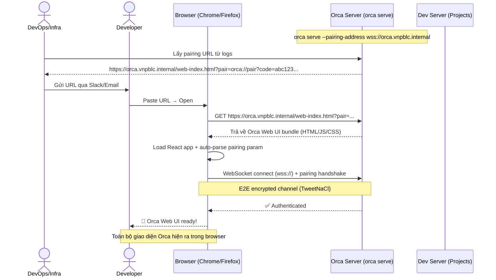
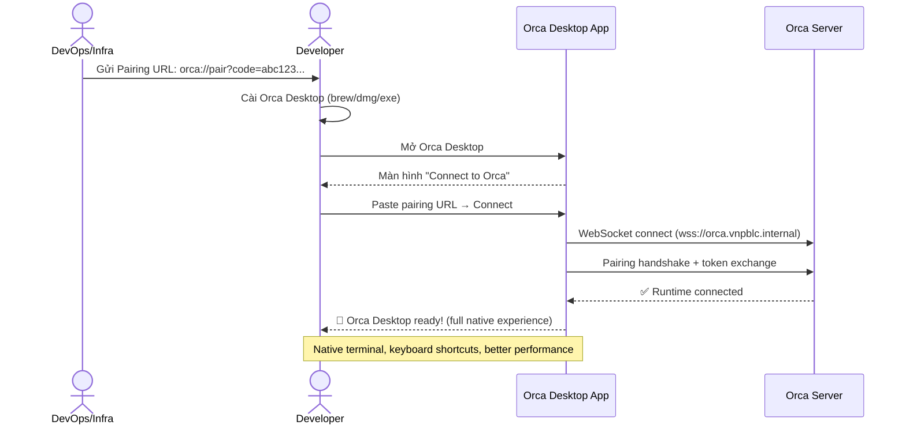
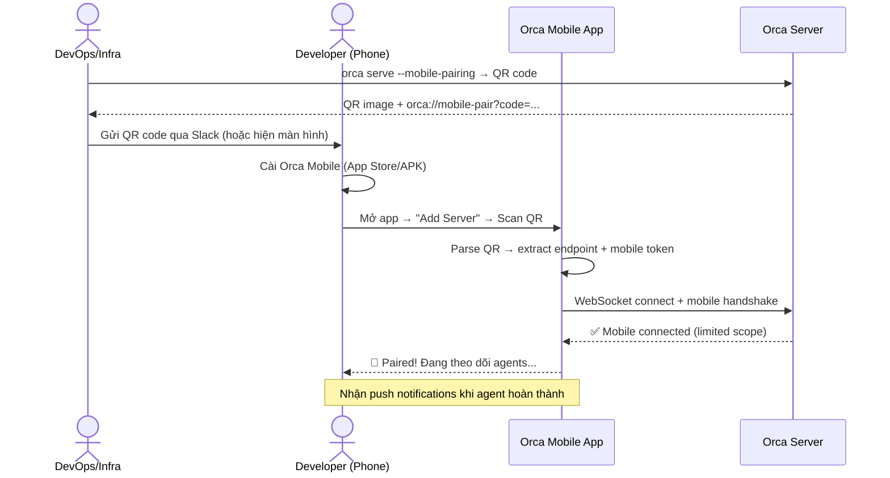
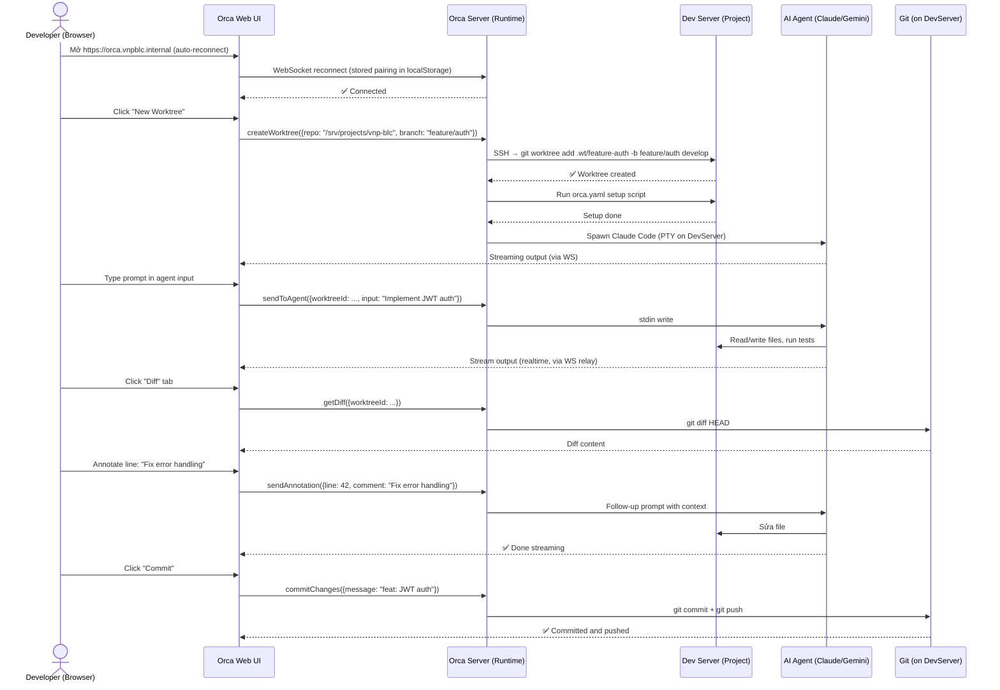
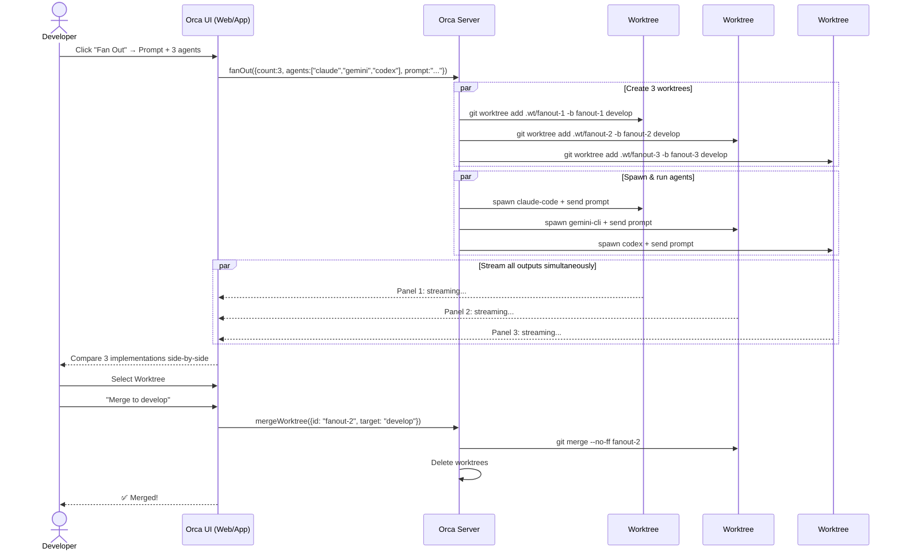
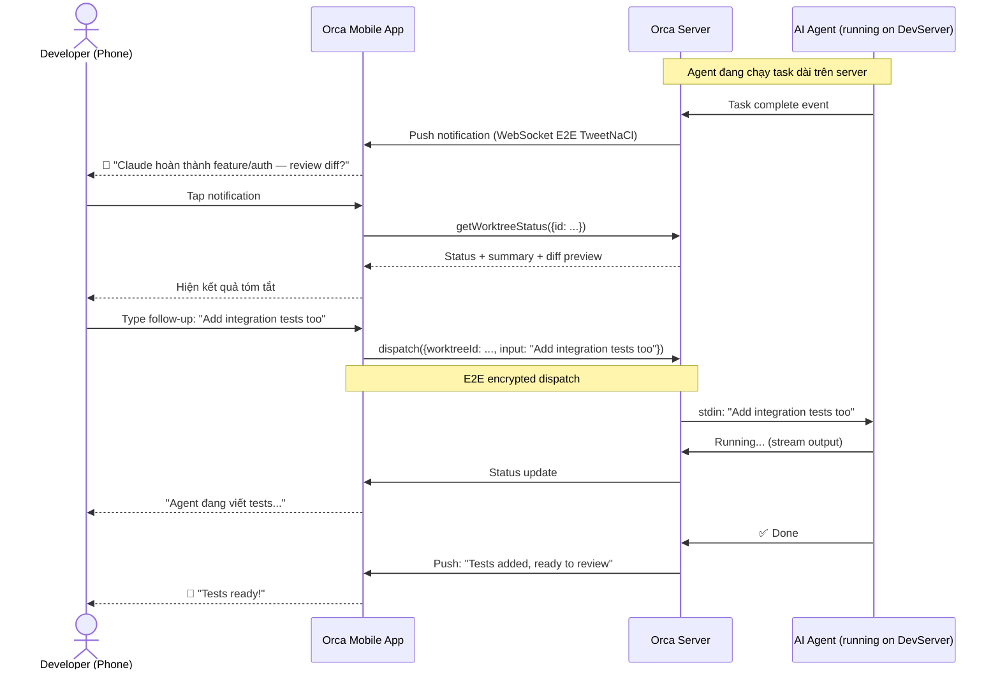
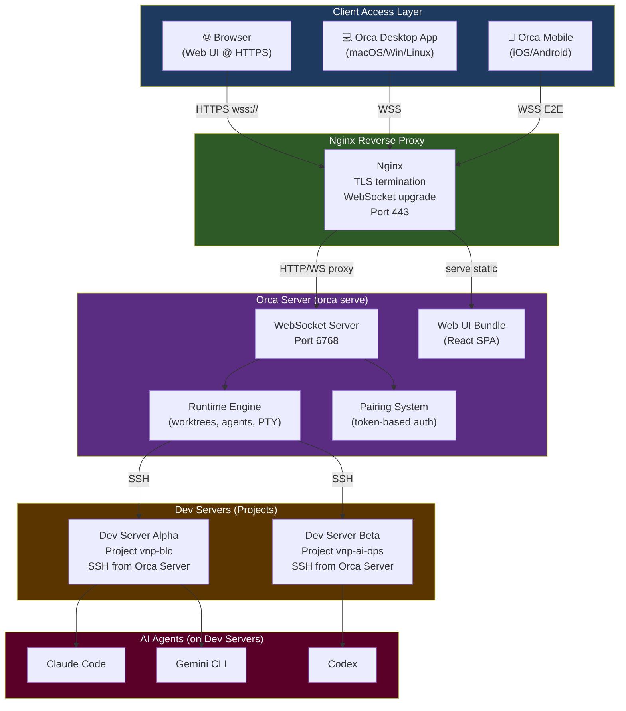
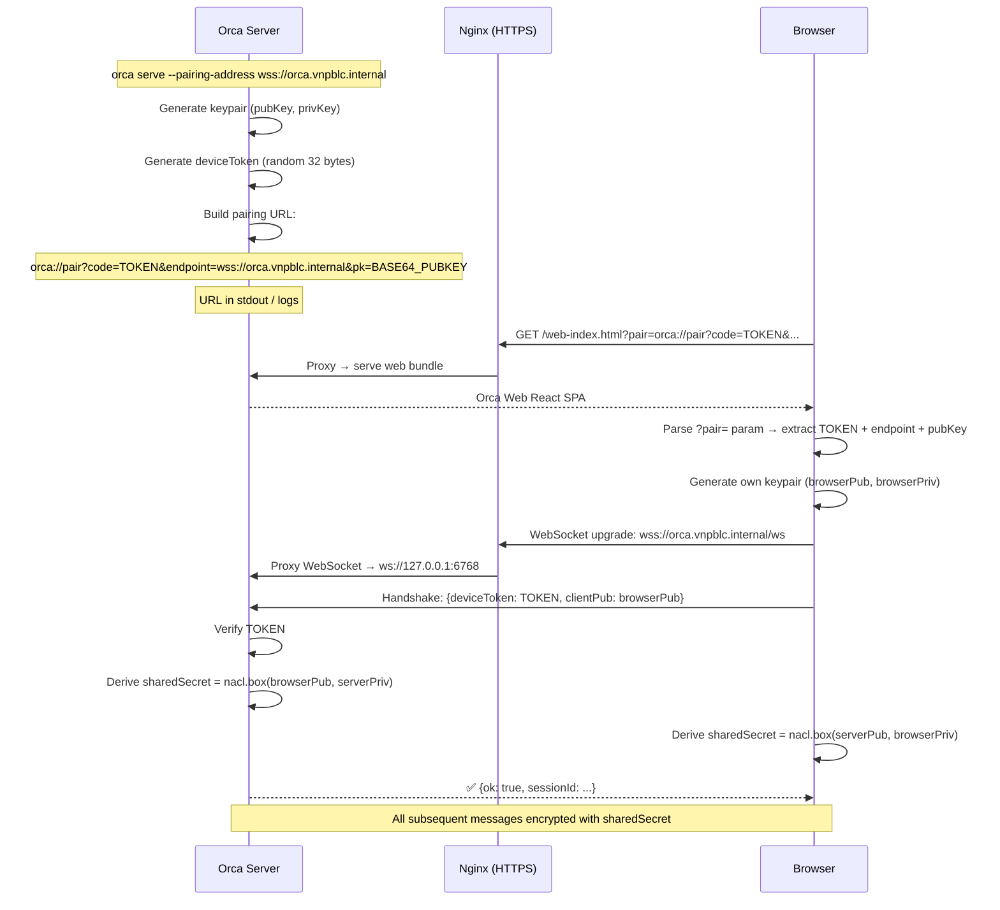

# Flow Diagrams — Sơ đồ Luồng Chi tiết (v2 — Web-First)

---

## Flow 1: Onboarding Developer — Dùng Browser (Đơn giản nhất)

---

## Flow 2: Onboarding Developer — Dùng Orca Desktop App

---

## Flow 3: Onboarding Developer — Dùng Orca Mobile (QR)

---

## Flow 4: Developer làm việc hàng ngày — Web UI

---

## Flow 5: Fan-out — 1 Prompt → N Agents Song Song

---

## Flow 6: Mobile Monitoring và Remote Dispatch

---

## Flow 7: Orca Architecture Tổng thể (Web-First)

---

## Flow 8: Pairing — Cách token hoạt động

