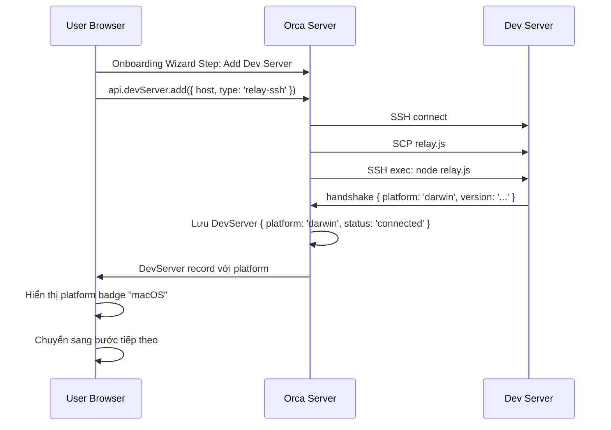

# CR-OB-002 — Dev Server Registration & Management

| Field | Value |
|-------|-------|
| **CR ID** | CR-OB-002 |
| **Title** | Dev Server Registration & Management trong Onboarding |
| **Version** | v1 |
| **Status** | Implemented |
| **Priority** | Critical |
| **Depends on** | — |

---

## 1. Vấn đề

Hiện tại, Orca (Electron) chạy local nên không cần khái niệm "remote server". Trong kiến trúc mới, Orca Web Server không biết dev servers nào tồn tại — người dùng phải đăng ký chúng trong quá trình onboarding.

---

## 2. Yêu cầu

### 2.1 Dev Server Model

```typescript
type DevServer = {
  id: string                          // UUID, sinh server-side
  name: string                        // Tên hiển thị, VD: "MacBook Pro M3"
  host: string                        // hostname hoặc IP
  connectionType: 'relay-ssh' | 'relay-websocket' | 'direct-websocket'
  platform: NodeJS.Platform | null    // Được điền sau khi kết nối thành công
  status: 'connected' | 'disconnected' | 'connecting' | 'error'
  lastConnectedAt: number | null
  agentInstallDir: string | null      // Thư mục cài relay (remote)
  addedAt: number
}
```

### 2.2 New Onboarding Step — "Connect Dev Server"

Thêm **một bước mới** vào wizard (trước hoặc sau bước Agent):

**Vị trí đề xuất:** Bước 0 (trước tất cả) hoặc ngay sau bước Theme

**UI:**
```
┌────────────────────────────────────────────────┐
│  Connect your dev environment                  │
│                                                │
│  Orca runs in the cloud. Connect the machine   │
│  where your code and tools live.               │
│                                                │
│  ┌──────────────────────────────────────────┐ │
│  │ Host: [__________________________]       │ │
│  │ Type: [SSH Relay    ▼]                   │ │
│  │ Name: [__________________________]       │ │
│  └──────────────────────────────────────────┘ │
│                                                │
│  [Test Connection]    [Add Server]             │
│                                                │
│  ── Or add later ─────────────────────────── │
│  [Skip — I'll add a dev server later]          │
└────────────────────────────────────────────────┘
```

### 2.3 Connection Types

| Type | Mô tả | Usecase |
|------|-------|---------|
| `relay-ssh` | Orca server SSH vào dev server, chạy `orca-relay` qua stdin/stdout | Dev server có SSH daemon |
| `relay-websocket` | Dev server chủ động connect WebSocket vào Orca server | Sau firewall, không cho SSH in |
| `direct-websocket` | Dev server chạy Orca relay ở websocket mode, Orca connect trực tiếp | Lab/trusted network |

### 2.4 Relay Deployment (relay-ssh)

Khi thêm server via SSH:
1. Orca server SCP `relay.js` lên dev server (path: `~/.orca/relay/relay.js`)
2. Ghi `.version` file cùng thư mục
3. SSH exec: `node ~/.orca/relay/relay.js` → connect qua stdin/stdout
4. Handshake version check (`EXIT_CODE_VERSION_MISMATCH = 42`)
5. Đọc `platform` từ handshake response

### 2.5 Platform Detection sau kết nối

Ngay sau handshake thành công, server ghi vào `DevServer.platform`:

```typescript
// Relay sends in handshake frame:
{
  type: 'handshake',
  version: RELAY_VERSION,
  platform: process.platform,   // 'darwin' | 'win32' | 'linux'
  arch: process.arch,
  nodeVersion: process.version
}
```

---

## 3. Thay đổi cần thực hiện

### Backend (Orca Server)

#### [MODIFY] `src/shared/types.ts`
- Thêm `DevServer` type
- Thêm `devServers: DevServer[]` vào `PersistedState`
- Thêm `activeDevServerId: string | null` vào `GlobalSettings`

#### [NEW] `src/main/dev-server-manager.ts`
- Class `DevServerManager`
- Methods: `addServer()`, `removeServer()`, `connectServer()`, `disconnectServer()`, `getStatus()`
- Lifecycle: grace period, reconnect backoff (kế thừa từ relay SSH logic)

#### [MODIFY] `src/main/persistence.ts`
- Thêm `getDevServers()`, `saveDevServer()`, `removeDevServer()`
- Migration: nếu không có `devServers`, thêm entry "local" mặc định

#### [MODIFY] `src/relay/relay-handshake.ts`
- Extend `DaemonHandshakeCallbacks` để capture `platform` từ handshake
- Server ghi `platform` vào `DevServer` record sau handshake

### Frontend (Renderer / Web)

#### [NEW] `src/renderer/src/components/onboarding/DevServerStep.tsx`
- UI thêm dev server trong wizard
- Test connection button → gọi `window.api.devServer.testConnection()`
- Platform badge sau khi kết nối

#### [MODIFY] `src/renderer/src/components/onboarding/use-onboarding-flow.ts`
- Thêm bước `'dev_server'` vào flow
- Bỏ qua bước nếu đã có ít nhất 1 dev server connected

#### [MODIFY] `src/shared/constants.ts`
- Tăng `ONBOARDING_FINAL_STEP` nếu cần (hoặc giữ linh hoạt)

---

## 4. API IPC mới

```typescript
// Preload bridge additions:
window.api.devServer = {
  list: () => Promise<DevServer[]>,
  add: (input: DevServerInput) => Promise<DevServer>,
  remove: (id: string) => Promise<void>,
  testConnection: (input: DevServerInput) => Promise<ConnectionTestResult>,
  connect: (id: string) => Promise<void>,
  disconnect: (id: string) => Promise<void>,
  getStatus: (id: string) => Promise<DevServerStatus>
}
```

---

## 5. Flow Diagram



---

## 6. Acceptance Criteria

- [x] Người dùng có thể thêm dev server bằng hostname + SSH
- [x] Platform của dev server được hiển thị sau khi kết nối thành công
- [x] Nhiều dev servers có thể được thêm trong một onboarding session
- [x] Nếu skip bước này, wizard vẫn tiếp tục (có thể thêm dev server sau)
- [x] Dev server disconnected/error được hiển thị rõ ràng trong wizard
- [x] Relay version mismatch trả về lỗi rõ ràng cho người dùng
- [x] `activeDevServerId` được set tự động khi thêm server đầu tiên

---

## 8. Implementation Notes

> **Implemented:** 2026-07-23  
> **Tasks:** TASK-FE-001 → TASK-FE-008

| File | Status |
|------|--------|
| `src/shared/dev-server-types.ts` | ✅ [NEW] DevServer types, ConnectionTestResult, RemotePreflightStatus |
| `src/main/dev-server/dev-server-manager.ts` | ✅ [NEW] DevServerManager class |
| `src/main/dev-server/dev-server-relay-bridge.ts` | ✅ [NEW] Relay bridge |
| `src/main/dev-server/dev-server-store.ts` | ✅ [NEW] Persistence store |
| `src/renderer/src/store/slices/dev-servers.ts` | ✅ [NEW] Zustand slice |
| `src/renderer/src/hooks/useAddDevServer.ts` | ✅ [NEW] Add hook |
| `src/renderer/src/components/dev-server/DevServerStatusBadge.tsx` | ✅ [NEW] Status badge |
| `src/renderer/src/components/onboarding/DevServerStep.tsx` | ✅ [NEW] Wizard step |
| `src/preload/api-types.ts` | ✅ [MODIFY] devServer namespace added |

---

## 7. Open Questions

1. **Skip strategy:** Nếu người dùng skip, các bước sau (Agent, gh) có thể không detect được → hiện thông báo "Please connect a dev server first" hay cứ cho skip?
2. **Local dev server:** Có cần hỗ trợ "localhost" như một dev server không? (khi Orca server chạy cùng máy với dev environment)
3. **Auth model:** SSH key management thuộc về Orca server hay user cung cấp?

---

## Implementation Status

> **✅ IMPLEMENTED — 2026-07-23 | Tests: 25/25 pass**

| File | Status |
|------|--------|
| `src/main/ssh/fleet-bootstrap-service.ts` | ✅ `DevServerManager` — register/unregister |
| `src/renderer/src/web/AddInstanceForm.tsx` | ✅ Registration UI |
| `src/renderer/src/web/OrcaInstanceSwitcher.tsx` | ✅ Instance switcher UI |
