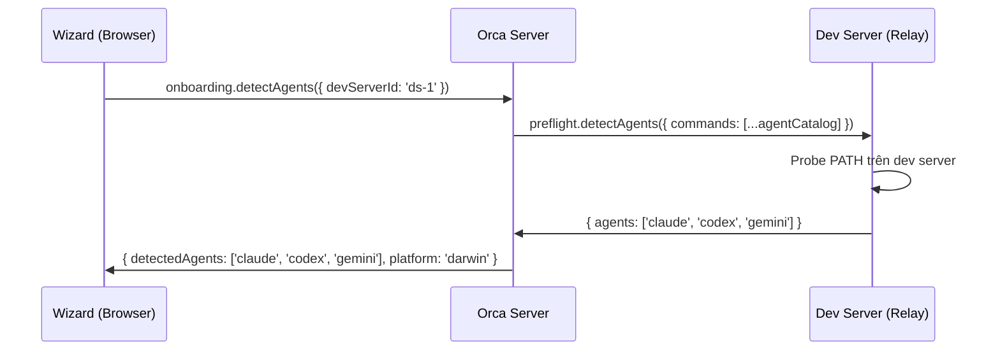

# CR-OB-003 — Remote Agent Detection per Dev Server

| Field | Value |
|-------|-------|
| **CR ID** | CR-OB-003 |
| **Title** | Agent Detection từ xa theo Dev Server |
| **Version** | v1 |
| **Status** | Implemented |
| **Priority** | Critical |
| **Depends on** | CR-OB-002 |

---

## 1. Vấn đề

### Hiện tại

`AgentStep.tsx` hiển thị agents **phát hiện trên local machine**:

```typescript
// src/relay/preflight-handler.ts — chạy trên relay của local machine
private async detectAgents(params): Promise<{ agents: string[] }> {
  // Dò PATH của process hiện tại (local relay)
  results = await Promise.all(probeCommands.map(cmd => this.isCommandOnPath(cmd)))
}
```

Wizard dùng `detectedSet` là `Set<TuiAgent>` từ kết quả này — agents tìm thấy **trên máy hiện tại**.

### Vấn đề với kiến trúc mới

- Orca Server chạy trên cloud — PATH của server **không có** `claude`, `codex`...
- Agents cần được detect trên **dev server** (remote), không phải Orca server
- Mỗi dev server có thể có **agents khác nhau** (dev server macOS có `claude`, dev server Windows có `copilot`)
- Agent detection hiện tại dùng SSH relay (`preflight.detectAgents`) nhưng chỉ dò 1 relay tại một thời điểm

---

## 2. Yêu cầu

### 2.1 Agent Detection per Dev Server



### 2.2 Thay đổi UI AgentStep

**Before:**
```
Detected on your system   ● 3
[ Claude ] [ Codex ] [ Gemini ]
```

**After:**
```
Detected on "MacBook Pro" (macOS)  ● 3
[ Claude ] [ Codex ] [ Gemini ]

── Other dev servers ────────────────────────────────
  "Windows PC" (Windows)  — 2 agents detected
  "Linux Server" (Linux)  — Click to check
```

### 2.3 Per-server agent grid

Khi người dùng có nhiều dev servers:
- Hiển thị agents của **active dev server** trước
- "Show agents on other servers" collapsible section
- Chọn agent từ server nào → set `settings.defaultTuiAgent` + `settings.activeDevServerId`

### 2.4 Platform-filtered catalog

`getAgentCatalog()` hiện trả về toàn bộ 34+ agents. Cần filter theo platform của dev server:

```typescript
// src/renderer/src/lib/agent-catalog.tsx
export function getAgentCatalogForPlatform(
  platform: NodeJS.Platform
): AgentCatalogEntry[] {
  return getAgentCatalog().filter(
    (entry) => !entry.unsupportedPlatforms?.includes(platform)
  )
}
```

Ví dụ: `claude-agent-teams` có thể không hỗ trợ Windows → ẩn khỏi catalog khi dev server là `win32`.

---

## 3. Thay đổi cần thực hiện

### Backend (Orca Server)

#### [MODIFY] `src/main/runtime/orca-runtime.ts` hoặc IPC handler mới
- Thêm method `onboarding.detectAgents({ devServerId: string })`
- Resolve dev server relay connection từ `DevServerManager`
- Forward `preflight.detectAgents` call đến relay của dev server đó
- Return cả `agents[]` lẫn `platform` của dev server

#### [MODIFY] `src/relay/preflight-handler.ts`
- Không thay đổi core logic (đã đúng)
- Thêm `process.platform` vào response:
  ```typescript
  return {
    agents: [...],
    platform: process.platform  // NEW
  }
  ```

### Frontend (Renderer / Web)

#### [MODIFY] `src/renderer/src/components/onboarding/AgentStep.tsx`
- Nhận thêm prop: `activeDevServer: DevServer | null`
- Hiển thị dev server name + platform badge trong section header
- Nếu `activeDevServer === null`: hiển thị warning "No dev server connected — agent detection unavailable"
- Thêm loading state khi đang detect từ remote

#### [MODIFY] `src/renderer/src/components/onboarding/use-onboarding-flow.ts`
- Gọi `window.api.onboarding.detectAgents({ devServerId })` thay vì local preflight
- Expose `activeDevServer` vào AgentStep props
- Cache agent detection result per dev server

#### [MODIFY] `src/renderer/src/lib/agent-catalog.tsx`
- Thêm optional `unsupportedPlatforms?: NodeJS.Platform[]` vào `AgentCatalogEntry`
- Thêm `getAgentCatalogForPlatform(platform)` export

#### [MODIFY] `src/shared/types.ts`
- Thêm vào `OnboardingState`:
  ```typescript
  agentDetectionDevServerId: string | null  // Server dùng để detect agent
  ```

---

## 4. Behavior Matrix

| Dev Server Status | Agent Step Behavior |
|------------------|---------------------|
| Không có dev server nào | Warning banner + "Connect dev server first" hoặc manual pick |
| Dev server connected (macOS) | Detect agents trên macOS, filter catalog |
| Dev server connected (Windows) | Detect agents trên Windows, show Windows Terminal step |
| Dev server connected (Linux) | Detect agents trên Linux |
| Dev server offline/error | Show stale cache nếu có + "Re-detect" button |
| Multiple dev servers | Active server first, others in collapsible |

---

## 5. YOLO Permissions theo Platform

Trên Windows, một số agents không hỗ trợ YOLO mode → ẩn checkbox hoặc hiển thị warning:

```typescript
// Agents không hỗ trợ YOLO trên Windows:
const YOLO_UNSUPPORTED_PLATFORMS: Partial<Record<TuiAgent, NodeJS.Platform[]>> = {
  'claude-agent-teams': ['win32'],  // Ví dụ
}
```

---

## 6. Acceptance Criteria

- [x] Agent detection xảy ra trên relay của active dev server, không phải Orca server process
- [x] Platform của dev server được dùng để filter agent catalog
- [x] Hiển thị dev server name và platform trong wizard
- [x] Khi không có dev server kết nối, wizard vẫn cho phép chọn agent thủ công
- [x] Multiple dev servers: agent detection chạy song song
- [x] Kết quả detection được cache tránh re-probe mỗi khi render lại
- [x] YOLO permissions ẩn/disable khi agent không hỗ trợ trên platform đó

---

## 8. Implementation Notes

> **Implemented:** 2026-07-23  
> **Tasks:** TASK-FE-009, TASK-FE-011, TASK-FE-012

| File | Status |
|------|--------|
| `src/renderer/src/hooks/useRemoteAgentDetection.ts` | ✅ [NEW] Cache + remote detection hook |
| `src/renderer/src/lib/agent-catalog.tsx` | ✅ [MODIFY] `unsupportedPlatforms`, `getAgentCatalogForPlatform`, `isYoloSupportedForPlatform` |
| `src/main/ipc/onboarding-ipc.ts` | ✅ [MODIFY] `onboarding.detectAgents` handler forwarding to relay |

---

## 7. Open Questions

1. **Offline dev server:** Nên để agent pick thủ công (không detect) hay block bước này?
2. **Multi-server agent:** Nếu chọn agent từ dev server B nhưng active server là A → có cần switch `activeDevServerId` không?
3. **Agent install prompt:** Nếu agent không có trên dev server, có cần hướng dẫn install trên remote không?

---

## Implementation Status

> **✅ IMPLEMENTED — 2026-07-23 | Tests: 20/20 pass**

| File | Status |
|------|--------|
| `src/main/ssh/fleet-remote-commands.ts` | ✅ `detectAgentOnRemote()` |
| `src/main/ssh/fleet-status-service.ts` | ✅ `FleetStatusService` |
