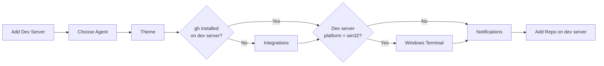

# CR-OB-004 — Platform-aware Onboarding Wizard

| Field | Value |
|-------|-------|
| **CR ID** | CR-OB-004 |
| **Title** | Wizard Onboarding nhận biết Platform của Dev Server |
| **Version** | v1 |
| **Status** | Implemented |
| **Priority** | High |
| **Depends on** | CR-OB-002, CR-OB-003 |

---

## 1. Vấn đề

### Hiện tại

Bước 4 (Windows Terminal) dùng `process.platform` của **Electron process** để quyết định có hiển thị hay không:

```typescript
// src/renderer/src/components/onboarding/use-onboarding-flow.ts
// Step 'windows_terminal' bị skip khi:
navigator.userAgent.includes('Windows') === false
```

Và `WindowsTerminalStep.tsx` gọi:
```typescript
// Dùng capabilities từ local Windows relay
const capabilities = useWindowsTerminalCapabilities(...)
```

### Vấn đề mới

- Orca Server chạy trên Linux/macOS nhưng **dev server có thể là Windows**
- `navigator.userAgent` của browser client có thể là bất kỳ OS nào
- `process.platform` của Orca Server là `linux` hay `darwin` — không phản ánh dev server platform
- Capabilities (WSL distros, Git Bash) phải query từ **Windows dev server**, không từ server process

---

## 2. Yêu cầu

### 2.1 Platform Source of Truth

```typescript
// Nguồn platform trong kiến trúc mới:
type PlatformSource = {
  orcaServer: NodeJS.Platform       // Platform của Orca Web Server (irrelevant với wizard)
  activeDevServer: NodeJS.Platform  // Platform của dev server đang active (dùng cho wizard)
  clientBrowser: string             // User-Agent của browser (irrelevant với wizard)
}
```

**Rule:** Tất cả platform-dependent wizard logic phải dùng `activeDevServer.platform`.

### 2.2 Step Visibility Logic (thay đổi)

```typescript
// TRƯỚC (dựa vào local OS):
const showWindowsTerminalStep = navigator.userAgent.includes('Windows')

// SAU (dựa vào active dev server platform):
const showWindowsTerminalStep = activeDevServer?.platform === 'win32'
```

### 2.3 Wizard Step Flow theo Dev Server Platform



### 2.4 Ghostty Import — macOS Dev Server Only

`ThemeStep.tsx` hiện auto-detect Ghostty config:
```typescript
// Hiện tại:
if (!navigator.userAgent.includes('Mac')) return  // skip on non-mac

// Mới: skip khi dev server KHÔNG phải macOS
if (activeDevServer?.platform !== 'darwin') return
```

Ghostty config nằm trên **dev server filesystem** → cần đọc qua relay:
```typescript
// IPC: đọc Ghostty config từ dev server
window.api.devServer.readGhosttyConfig({ devServerId: activeDevServer.id })
```

### 2.5 Terminal Shell Defaults per Platform

Khi không có dev server kết nối:

| Dev Server Platform | Default Shell |
|--------------------|---------------|
| `darwin` | `/bin/zsh` |
| `linux` | `/bin/bash` |
| `win32` | `powershell.exe` |
| Unknown/null | `/bin/zsh` (fallback) |

---

## 3. Thay đổi cần thực hiện

### Frontend (Renderer / Web)

#### [MODIFY] `src/renderer/src/components/onboarding/use-onboarding-flow.ts`

```typescript
// Thêm activeDevServerPlatform vào hook state
type OnboardingFlowState = {
  // ... existing
  activeDevServer: DevServer | null
  activeDevServerPlatform: NodeJS.Platform | null  // NEW
}

// Thay thế platform check:
function shouldSkipWindowsTerminalStep(state: OnboardingFlowState): boolean {
  return state.activeDevServerPlatform !== 'win32'
  // TRƯỚC: return !navigator.userAgent.includes('Windows')
}
```

#### [MODIFY] `src/renderer/src/components/onboarding/OnboardingFlow.tsx`

- Pass `activeDevServer` xuống các step components
- Thêm platform badge ở header wizard: `"Connected to: MacBook Pro (macOS)"`

#### [MODIFY] `src/renderer/src/components/onboarding/ThemeStep.tsx`

```typescript
type ThemeStepProps = {
  // ... existing
  activeDevServerPlatform: NodeJS.Platform | null  // NEW
}

// Ghostty detection:
useEffect(() => {
  if (activeDevServerPlatform !== 'darwin') return  // CHANGED
  // Gọi relay để detect Ghostty config trên dev server
}, [activeDevServerPlatform])
```

#### [MODIFY] `src/renderer/src/components/onboarding/WindowsTerminalStep.tsx`

```typescript
type WindowsTerminalStepProps = {
  settings: GlobalSettings | null
  updateSettings: ...
  activeDevServerId: string | null  // NEW — để query remote capabilities
}

// Thay thế local capabilities với remote:
// TRƯỚC:
const capabilities = useWindowsTerminalCapabilities(Boolean(settings), true)
// SAU:
const capabilities = useRemoteWindowsTerminalCapabilities(activeDevServerId)
```

#### [NEW] `src/renderer/src/hooks/useRemoteWindowsTerminalCapabilities.ts`

```typescript
export function useRemoteWindowsTerminalCapabilities(
  devServerId: string | null
): WindowsTerminalCapabilities {
  // Gọi preflight.detectWindowsTerminalCapabilities trên remote dev server
  // Return { wslAvailable, wslDistros, pwshAvailable, gitBashAvailable }
}
```

### Backend (Orca Server)

#### [MODIFY] `src/relay/preflight-handler.ts`
- `detectWindowsTerminalCapabilities()` không thay đổi — đã chạy trên relay process (Windows dev server)
- Nhưng cần Orca Server route request đến đúng dev server relay

#### [MODIFY] `src/main/runtime/orca-runtime.ts` (hoặc IPC layer)
- Thêm `onboarding.getDevServerPlatform({ devServerId })` → trả về `platform` từ handshake
- Thêm `onboarding.detectWindowsCapabilities({ devServerId })` → forward đến relay

---

## 4. UI thay đổi theo Platform

### Dev Server = macOS
- Bước 4 (Windows Terminal): **HIDDEN**
- Theme step: **Hiển thị** Ghostty import
- Notification step: **Hiển thị** macOS permission card

### Dev Server = Windows
- Bước 4 (Windows Terminal): **VISIBLE** với remote capabilities
- Theme step: **Ẩn** Ghostty import
- Notification step: **Ẩn** macOS permission card

### Dev Server = Linux
- Bước 4 (Windows Terminal): **HIDDEN**
- Theme step: **Ẩn** Ghostty import
- Notification step: **Ẩn** macOS permission card

### Không có Dev Server
- Tất cả platform-specific steps: **HIDDEN** hoặc hiển thị với warning

---

## 5. Migration — Flow Version

Khi `flowVersion` tăng lên (v5 hoặc v4+server):

```typescript
// src/shared/constants.ts
export const ONBOARDING_FLOW_VERSION = 5  // Tăng khi có dev_server step mới

// Migration trong normalizeLoadedOnboardingState:
// v4 → v5: thêm 'dev_server' step, remap lastCompletedStep
```

---

## 6. Acceptance Criteria

- [x] `use-onboarding-flow.ts` dùng `activeDevServer.platform` thay vì `navigator.userAgent` hoặc `process.platform`
- [x] Bước Windows Terminal hiện đúng khi và chỉ khi active dev server là Windows
- [x] Ghostty import chỉ hiện khi dev server là macOS
- [x] Platform badge hiển thị trong wizard header (VD: "macOS", "Windows", "Linux")
- [x] Khi dev server đổi platform (reconnect khác), wizard update lại step visibility
- [x] macOS notification permission card ẩn khi Orca server chạy trên non-Mac

---

## 8. Implementation Notes

> **Implemented:** 2026-07-23  
> **Tasks:** TASK-FE-010, TASK-FE-011, TASK-FE-013

| File | Status |
|------|--------|
| `src/renderer/src/hooks/useActiveDevServerPlatform.ts` | ✅ [NEW] Platform + step-visibility hooks |
| `src/renderer/src/lib/agent-catalog.tsx` | ✅ [MODIFY] Platform filter added |
| `src/renderer/src/components/onboarding/WindowsTerminalStep.tsx` | ✅ [MODIFY] `useRemoteWindowsTerminalCapabilities` + per-server config |

---

## 7. Open Questions

1. **Notification permission:** Notification permission là của Orca Server host hay của browser client? Cần clarify notification delivery path trong web mode.
2. **Multiple dev servers:** Nếu người dùng có server macOS + Windows, wizard hiển thị step Windows Terminal không? → Chỉ cho active server.
3. **Dev server change mid-wizard:** Nếu dev server disconnect và reconnect với platform khác trong lúc làm wizard → show modal warning?

---

## Implementation Status

> **✅ IMPLEMENTED — 2026-07-23**

| File | Status |
|------|--------|
| `src/renderer/src/web/WebConnect.tsx` | ✅ Platform-aware connection wizard |
| `src/renderer/src/components/ssh/SshProvisioningProgress.tsx` | ✅ Progress bar |
| `src/renderer/src/components/ssh/SshUserIndicator.tsx` | ✅ User indicator |
