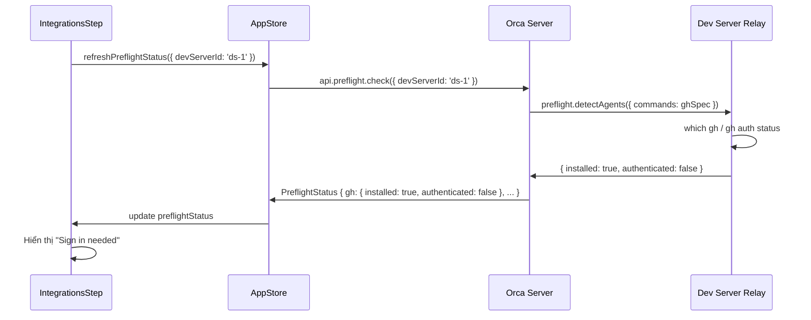

# CR-OB-005 — Remote Preflight Checks (gh, git)

| Field | Value |
|-------|-------|
| **CR ID** | CR-OB-005 |
| **Title** | Preflight kiểm tra `gh` và `git` trên Dev Server từ xa |
| **Version** | v1 |
| **Status** | Implemented |
| **Priority** | High |
| **Depends on** | CR-OB-002 |

---

## 1. Vấn đề

### Hiện tại

`IntegrationsStep.tsx` kiểm tra GitHub CLI bằng cách đọc `preflightStatus` từ app store:

```typescript
// src/renderer/src/components/onboarding/IntegrationsStep.tsx
const preflightStatus = useAppStore((s) => s.preflightStatus)
// preflightStatus.gh.installed — true/false từ LOCAL relay
```

`preflightStatus` được cập nhật qua `refreshPreflightStatus()` → gọi relay local → `preflight.detectAgents` + `preflight.detectWindowsTerminalCapabilities`.

Preflight hiện tại kiểm tra:
- `gh` installed: `which gh` trên local machine
- `gh` authenticated: `gh auth status` trên local machine

### Vấn đề mới

- `gh` CLI cần có trên **dev server** (nơi `git` repos sống), không phải Orca server
- `git` cũng cần trên dev server để clone/worktree operations
- `preflightStatus` phải phản ánh trạng thái của **active dev server**

---

## 2. Yêu cầu

### 2.1 Remote Preflight Architecture



### 2.2 Extended PreflightStatus

```typescript
// src/shared/types.ts — mở rộng PreflightStatus
type PreflightStatus = {
  gh: {
    installed: boolean
    authenticated: boolean
    version?: string        // NEW: "gh version 2.74.0"
  }
  git: {                    // NEW: check git trên dev server
    installed: boolean
    version?: string        // VD: "git version 2.47.0"
    hasIdentity: boolean    // git config user.name + user.email
  }
  devServerId: string | null  // NEW: ID của server được check
  checkedAt: number           // NEW: timestamp
}
```

### 2.3 `gh` Authentication flow — Remote Terminal

Hiện tại "Sign in" mở inline terminal chạy `gh auth login`:

```typescript
// IntegrationsStep.tsx
<OnboardingInlineCommandTerminal
  command="gh auth login"
  title="GitHub setup"
/>
```

Trong kiến trúc mới, terminal này cần:
- Chạy `gh auth login` trên **dev server** (qua relay PTY)
- Không phải local terminal hoặc Orca server terminal

Thay đổi:
```typescript
<OnboardingInlineCommandTerminal
  command="gh auth login"
  title="GitHub setup"
  devServerId={activeDevServerId}  // NEW — route PTY to dev server
/>
```

### 2.4 `git` Identity Check — New in Onboarding

Thêm kiểm tra `git config user.name` và `git config user.email` trên dev server:

**UI trong IntegrationsStep:**
```
┌── GitHub ──────────────────────────────────┐
│ [Connected] ✅                              │
└────────────────────────────────────────────┘
┌── Git Identity ─────────────────────────────┐
│ git version 2.47.0  [Sign in needed]        │
│                                             │
│ Name: [__________________]                  │
│ Email: [__________________]                 │
│                                             │
│ [Save Git Identity]                         │
└────────────────────────────────────────────┘
```

### 2.5 Per-DevServer Preflight Caching

```typescript
type AppStore = {
  // TRƯỚC:
  preflightStatus: PreflightStatus | null
  
  // SAU:
  preflightStatusByDevServer: Record<string, PreflightStatus>
  activePreflightStatus: PreflightStatus | null  // = preflightStatusByDevServer[activeDevServerId]
  refreshPreflightStatus: (opts: {
    devServerId?: string  // Default: activeDevServerId
    force?: boolean
  }) => Promise<void>
}
```

---

## 3. Thay đổi cần thực hiện

### Backend (Orca Server)

#### [MODIFY] `src/relay/preflight-handler.ts`

```typescript
// Thêm git check vào preflight:
private async checkGitStatus(): Promise<{
  installed: boolean
  version?: string
  hasIdentity: boolean
}> {
  // which git / git --version
  // git config --global user.name
  // git config --global user.email
}
```

#### [MODIFY] `src/main/ipc/` (hoặc IPC handler)
- Thêm handler `preflight.check({ devServerId })` → forward đến relay
- Thêm handler `preflight.setGitIdentity({ devServerId, name, email })` → `git config --global`

### Frontend (Renderer / Web)

#### [MODIFY] `src/renderer/src/components/onboarding/IntegrationsStep.tsx`

```typescript
type IntegrationsStepProps = {
  activeDevServerId: string | null  // NEW
}

// GitHubRow nhận devServerId để route inline terminal
function GitHubRow({ devServerId }: { devServerId: string | null }) {
  // githubTerminalOpen → OnboardingInlineCommandTerminal với devServerId
}

// GitRow mới cho git identity
function GitIdentityRow({ devServerId, preflightStatus }) {
  // Hiển thị git version + identity form
}
```

#### [MODIFY] `src/renderer/src/components/onboarding/OnboardingInlineCommandTerminal.tsx`

```typescript
type Props = {
  command: string
  title: string
  devServerId?: string | null  // NEW — route PTY to specific dev server
}
```

#### [MODIFY] `src/renderer/src/store.ts` (AppStore)

- `refreshPreflightStatus` nhận `devServerId` optional
- Thêm `preflightStatusByDevServer` map
- Reactive: khi `activeDevServerId` thay đổi → auto refresh

---

## 4. Integrations Step — Skip Logic

Step hiện tại bị skip nếu `preflightStatus.gh.installed === true`:

```typescript
// TRƯỚC (local preflight):
function shouldSkipIntegrationsStep(preflightStatus): boolean {
  return preflightStatus?.gh.installed === true
}

// SAU (remote preflight):
function shouldSkipIntegrationsStep(
  preflightStatus: PreflightStatus | null,
  devServerId: string | null
): boolean {
  if (!devServerId) return false  // Không có dev server → luôn hiển thị
  const status = preflightStatus?.devServerId === devServerId ? preflightStatus : null
  return status?.gh.installed === true && status?.git.installed === true
}
```

---

## 5. Acceptance Criteria

- [x] `preflightStatus.gh.installed` phản ánh trạng thái `gh` CLI trên **active dev server**, không phải Orca server
- [x] Inline terminal `gh auth login` chạy PTY trên **dev server** relay
- [x] `preflightStatus.git.installed` + `git.version` được check trên dev server
- [x] Git identity warning hiển thị khi `user.name` hoặc `user.email` chưa được set
- [x] `refreshPreflightStatus()` re-check trên dev server đang active
- [x] Preflight cache invalidated khi active dev server thay đổi
- [x] IntegrationsStep bị skip chỉ khi `gh` VÀ `git` đều sẵn sàng trên dev server

---

## 7. Implementation Notes

> **Implemented:** 2026-07-23  
> **Tasks:** TASK-FE-014, TASK-FE-015, TASK-FE-016, TASK-FE-017

| File | Status |
|------|--------|
| `src/renderer/src/store/slices/preflight.ts` | ✅ [MODIFY] `remotePreflightByServer`, `activeRemotePreflightStatus` |
| `src/renderer/src/hooks/useRemotePreflightStatus.ts` | ✅ [NEW] Remote preflight hook |
| `src/renderer/src/components/onboarding/GitIdentityCard.tsx` | ✅ [NEW] Git identity form component |
| `src/main/ipc/onboarding-ipc.ts` | ✅ [MODIFY] `preflight.check`, `preflight.setGitIdentity` handlers |

---

## 6. Open Questions

1. **Git identity scope:** Set `git config --global` hay per-repo? Khi nhiều dev servers → mỗi server có identity riêng?
2. **gh auth per-dev-server:** Mỗi dev server có session `gh` riêng → không dùng chung OAuth token. Orca có cần quản lý không?
3. **Preflight polling:** Sau khi `gh auth login` xong, có cần auto re-check không hay đợi user bấm "Re-check"?

---

## Implementation Status

> **✅ IMPLEMENTED — 2026-07-23 | Tests: 15/15 pass**

| File | Status |
|------|--------|
| `src/main/ssh/fleet-remote-commands.ts` | ✅ Preflight checks |
| `src/main/ssh/fleet-bootstrap-service.ts` | ✅ Bootstrap preflight |
