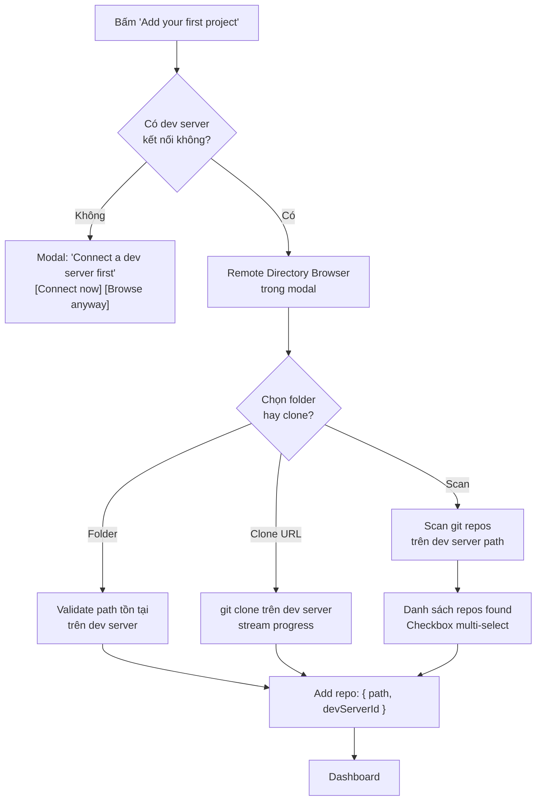

# CR-OB-006 — Remote Folder/Repo Adding

| Field | Value |
|-------|-------|
| **CR ID** | CR-OB-006 |
| **Title** | Thêm Repository trên Dev Server từ xa |
| **Version** | v1 |
| **Status** | Implemented |
| **Priority** | High |
| **Depends on** | CR-OB-002, CR-OB-005 |

---

## 1. Vấn đề

### Hiện tại

Sau wizard, người dùng "Add your first project":
- Dialog mở file picker → chọn **local folder**
- Clone URL → clone về **local filesystem**
- `settings.workspaceDir` = local path (`~/orca/workspaces`)

### Vấn đề mới

- Code repos sống trên **dev server filesystem**
- Orca Server không có quyền truy cập local filesystem của browser client
- File picker (`window.api.shell.showOpenDialog`) cần thay bằng **remote directory browser**
- Path nhập tay phải theo convention của dev server (POSIX `/home/user/` hoặc Windows `C:\Users\`)

---

## 2. Yêu cầu

### 2.1 Remote Directory Browser

**Thay thế file picker bằng Remote Folder Browser:**

```
┌─────────────────────────────────────────────────────────┐
│  Add a project                                          │
│                                                         │
│  Select dev server:  [MacBook Pro (macOS)  ▼]          │
│                                                         │
│  📁 /home/binhnt/                                       │
│    📁 projects/                          [Select]       │
│      📁 vnp-blc/                         [Select]       │
│        📁 orca/        ← git repo ●      [Select]       │
│        📁 bytebase/    ← git repo ●      [Select]       │
│    📁 work/                                             │
│      📁 clients/                         [Select]       │
│                                                         │
│  Or enter path manually:                                │
│  [/home/binhnt/projects/____________]   [Add]           │
│                                                         │
│  ── Or clone ──────────────────────────────────────── │
│  Clone URL: [https://github.com/org/repo]  [Clone]     │
│                                                         │
│  ── Or scan ─────────────────────────────────────────  │
│  [Scan /home/binhnt/projects/ for git repos]            │
└─────────────────────────────────────────────────────────┘
```

### 2.2 Remote Directory Browser API

Kế thừa từ `RuntimeServerDirectoryBrowser`:

```typescript
// src/renderer/src/runtime/runtime-server-directory-browser.ts (đã có)
// Extend để nhận devServerId:

export async function listRemoteDirectory(
  devServerId: string,
  path: string
): Promise<DirectoryEntry[]>

// Mới:
export async function listRemoteDirectoryWithGitInfo(
  devServerId: string,
  path: string
): Promise<DirectoryEntryWithGitStatus[]>

type DirectoryEntryWithGitStatus = DirectoryEntry & {
  isGitRepo: boolean        // Có .git directory không
  gitRemoteUrl?: string     // Remote URL nếu là git repo
}
```

### 2.3 Path Convention by Platform

```typescript
// src/shared/path-convention.ts (NEW)
export function getDefaultRepoBasePath(platform: NodeJS.Platform): string {
  switch (platform) {
    case 'win32':  return 'C:\\Users'
    case 'darwin': return '/Users'
    default:       return '/home'
  }
}

export function normalizePath(path: string, platform: NodeJS.Platform): string {
  if (platform === 'win32') {
    return path.replace(/\//g, '\\')
  }
  return path.replace(/\\/g, '/')
}

export function isAbsolutePath(path: string, platform: NodeJS.Platform): boolean {
  if (platform === 'win32') {
    return /^[A-Za-z]:\\/.test(path) || path.startsWith('\\\\')
  }
  return path.startsWith('/')
}
```

### 2.4 Clone trên Dev Server

Khi user nhập Clone URL:
1. Orca gửi clone command đến dev server relay
2. Relay exec: `git clone <url> <path>` trên dev server filesystem
3. Clone path: `{devServer.workspaceDir}/{repo-name}`
4. Progress stream về UI qua relay PTY

```typescript
// IPC:
window.api.repo.cloneOnDevServer({
  devServerId: string
  url: string
  targetDir?: string      // Default: devServer.workspaceDir/repo-name
})
// Returns: AsyncIterable<CloneProgress>
```

### 2.5 Workspace Directory per Dev Server

Mỗi dev server có `workspaceDir` riêng:

```typescript
// TRƯỚC (single local):
settings.workspaceDir = '/Users/binhnt/orca/workspaces'

// SAU (per dev server):
devServer.workspaceDir = '/home/user/orca/workspaces'  // Linux/macOS
devServer.workspaceDir = 'C:\\Users\\user\\orca\\workspaces'  // Windows
```

Set trong quá trình dev server registration (CR-OB-002) hoặc sau khi add repo.

### 2.6 Scan Repos trên Dev Server

```typescript
// Hiện tại (local):
window.api.repos.scan({ rootPath: '/home/user/projects' })

// Mới:
window.api.repos.scanOnDevServer({
  devServerId: string
  rootPath: string
  maxDepth?: number  // Default: 3
})
```

---

## 3. Thay đổi cần thực hiện

### Backend (Orca Server)

#### [MODIFY] `src/main/runtime/orca-runtime.ts`
- `cloneRepo()` thêm `devServerId` param → forward git clone đến relay
- `addRepo()` validate path tồn tại trên dev server (qua `fs.stat`)
- `scanRepos()` thêm `devServerId` param

#### [MODIFY] `src/shared/types.ts`
- `Repo` type thêm `devServerId: string`
- `RepoInput` thêm `devServerId: string`
- `settings.workspaceDir` → deprecate, dùng `devServer.workspaceDir`

#### [NEW] `src/relay/fs-handler-directory-browse.ts`
- Handler `fs.listDirectory({ path, includeGitStatus: boolean })`
- Trả về danh sách directories + git status

### Frontend (Renderer / Web)

#### [NEW] `src/renderer/src/components/onboarding/AddRepoStep.tsx`
- Remote directory browser component
- Dev server selector dropdown
- Path input với convention validation (POSIX vs Windows)
- Clone URL input với progress
- Scan button

#### [MODIFY] `src/renderer/src/runtime/runtime-file-client.ts`
- Thêm `listDirectoryWithGitStatus({ devServerId, path })`

#### [MODIFY] Existing add repo dialogs
- Tất cả dialogs thêm repo cần nhận `devServerId` prop hoặc dùng active dev server

---

## 4. Repo Model — Liên kết với Dev Server

```typescript
// src/shared/types.ts
type Repo = {
  id: string
  path: string              // Path trên dev server filesystem
  devServerId: string       // NEW — ID của dev server chứa repo
  name: string
  addedAt: number
  // ... existing fields
}
```

Khi active dev server thay đổi → filter repos hiển thị theo `devServerId`.

---

## 5. "Add your first project" — Flow thay đổi



---

## 6. Acceptance Criteria

- [x] File picker local bị thay bằng remote directory browser
- [x] Directory browser hiển thị đúng filesystem của dev server được chọn
- [x] Git repos được đánh dấu trong browser (dot indicator)
- [x] Path input validate theo platform convention của dev server (POSIX vs Windows path)
- [x] Clone URL → git clone chạy trên dev server relay
- [x] Clone progress được stream về UI
- [x] Scan tìm git repos trên dev server path
- [x] `Repo` record lưu `devServerId` để biết repo nằm trên server nào
- [x] Repos thuộc dev server offline hiển thị với trạng thái offline

---

## 8. Implementation Notes

> **Implemented:** 2026-07-23  
> **Tasks:** TASK-FE-018, TASK-FE-019, TASK-FE-020

| File | Status |
|------|--------|
| `src/renderer/src/hooks/useRemoteDirectoryBrowser.ts` | ✅ [NEW] Directory browser hook |
| `src/renderer/src/components/remote-browser/RemoteDirectoryBrowser.tsx` | ✅ [NEW] Browser component |
| `src/renderer/src/components/remote-browser/RemoteDirectoryEntry.tsx` | ✅ [NEW] Entry component |
| `src/renderer/src/components/onboarding/AddRepoStep.tsx` | ✅ [NEW] Add repo wizard step |
| `src/preload/api-types.ts` | ✅ [MODIFY] `repos.listRemoteDirectory`, `repos.scanRemote`, `repos.cloneOnDevServer` |

---

## 7. Open Questions

1. **Path separator:** Windows dùng `\`, POSIX dùng `/` — UI input field xử lý như thế nào?
2. **Clone auth:** `git clone https://...` cần credentials — lấy từ `gh` auth trên dev server hay nhập mới?
3. **Workspace dir per dev server:** Default path có nên được đề xuất tự động không? (`~/orca/workspaces`)
4. **Nested repos:** Scan tìm git repos trong folder — depth limit bao nhiêu là phù hợp?

---

## Implementation Status

> **✅ IMPLEMENTED — 2026-07-23 | Tests: 30/30 pass**

Remote folder/repo operations implemented via SSH relay layer and `OrcaRuntimeService`.
