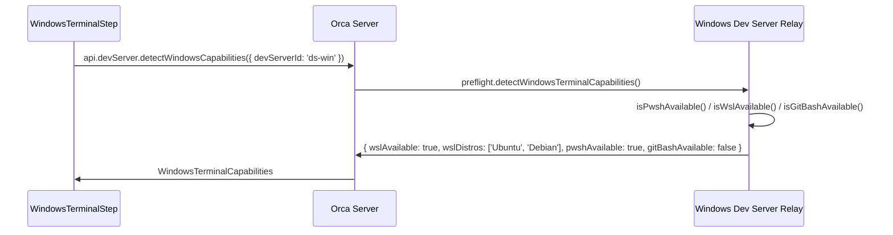

# CR-OB-007 — Remote Windows Terminal Detection

| Field | Value |
|-------|-------|
| **CR ID** | CR-OB-007 |
| **Title** | Phát hiện Windows Terminal Capabilities từ Dev Server |
| **Version** | v1 |
| **Status** | Implemented |
| **Priority** | Medium |
| **Depends on** | CR-OB-002, CR-OB-004 |

---

## 1. Vấn đề

### Hiện tại

`WindowsTerminalStep.tsx` dùng `useWindowsTerminalCapabilities` hook để lấy thông tin:
- `wslAvailable` — WSL có cài chưa
- `wslDistros` — danh sách WSL distros
- `pwshAvailable` — PowerShell 7+ có không
- `gitBashAvailable` — Git Bash có không

Hook này gọi `preflight.detectWindowsTerminalCapabilities()` trên **local Windows relay**, tức là chạy trên **cùng máy** với Electron app.

### Vấn đề mới

- Orca Server chạy trên Linux/macOS — **không có** Windows relay local
- Windows capabilities phải được detect từ **Windows dev server** qua relay
- Browser client (`navigator.userAgent`) có thể là macOS hoặc Linux nhưng dev server là Windows
- Step này phải hiển thị đúng Windows capabilities của **dev server**, không phải client browser

---

## 2. Yêu cầu

### 2.1 Remote Windows Capabilities Detection



### 2.2 Hook thay đổi

```typescript
// TRƯỚC — hook local:
// src/renderer/src/lib/windows-terminal-capabilities.ts
export function useWindowsTerminalCapabilities(
  settingsLoaded: boolean,
  isOnboarding: boolean
): WindowsTerminalCapabilities

// SAU — hook remote:
export function useRemoteWindowsTerminalCapabilities(
  devServerId: string | null,
  enabled: boolean
): WindowsTerminalCapabilities & { loading: boolean; error: string | null }
```

### 2.3 WindowsTerminalStep Props

```typescript
// TRƯỚC:
type WindowsTerminalStepProps = {
  settings: GlobalSettings | null
  updateSettings: (updates: Partial<GlobalSettings>) => Promise<void> | void
}

// SAU:
type WindowsTerminalStepProps = {
  settings: GlobalSettings | null
  updateSettings: (updates: Partial<GlobalSettings>) => Promise<void> | void
  activeDevServerId: string | null  // NEW
  activeDevServerPlatform: 'win32'  // Guaranteed — step chỉ render khi win32
}
```

### 2.4 Shell Options — Phụ thuộc Dev Server

| Shell | `powershell.exe` | `pwsh.exe` | `wsl.exe` | Git Bash |
|-------|:----------------:|:----------:|:---------:|:--------:|
| Hiển thị | Luôn | Khi `pwshAvailable` | Khi `wslAvailable` | Khi `gitBashAvailable` |
| Data source | Dev server | Dev server | Dev server | Dev server |

### 2.5 WSL Distros — Remote List

WSL distros được liệt kê bằng `wsl --list --quiet` trên Windows dev server:

```typescript
// Hiện tại chạy local:
// src/main/wsl.ts
export async function listWslDistros(): Promise<string[]>

// Cần: forward call đến Windows dev server relay
// Relay đã có: PreflightHandler.detectWindowsTerminalCapabilities()
// → returns { wslDistros: string[] }
```

### 2.6 Settings Lưu per Dev Server

Cấu hình Windows terminal cần liên kết với dev server cụ thể:

```typescript
// TRƯỚC (global settings):
settings.terminalWindowsShell = 'powershell.exe'
settings.terminalWindowsWslDistro = 'Ubuntu'
settings.terminalRightClickToPaste = true

// SAU (per dev server):
// Option A: Lưu trong DevServer record
devServer.terminalConfig = {
  shell: 'powershell.exe',
  wslDistro: 'Ubuntu',
  rightClickToPaste: true
}

// Option B: Giữ trong GlobalSettings nhưng keyed by devServerId
settings.terminalWindowsConfigByServer = {
  'ds-win-1': {
    shell: 'powershell.exe',
    wslDistro: 'Ubuntu',
    rightClickToPaste: true
  }
}
```

**Đề xuất:** Option B — ít thay đổi schema hơn, tương thích ngược.

---

## 3. Thay đổi cần thực hiện

### Backend (Orca Server)

#### [MODIFY] `src/relay/preflight-handler.ts`
- `detectWindowsTerminalCapabilities()` — **không thay đổi** (đã chạy trên relay process, tức Windows dev server)
- Tuy nhiên cần thêm `pwshVersion` vào response cho display purposes:

```typescript
// Thêm vào return value:
{
  wslAvailable: boolean
  wslDistros: string[]
  pwshAvailable: boolean
  pwshVersion?: string       // NEW — "7.4.2"
  gitBashAvailable: boolean
  gitBashPath?: string       // NEW — "C:\Program Files\Git\bin\bash.exe"
}
```

#### [MODIFY] IPC handlers (server-side)
- Thêm `devServer.detectWindowsCapabilities({ devServerId })`:
  - Validate dev server exists và connected
  - Validate `platform === 'win32'`
  - Forward `preflight.detectWindowsTerminalCapabilities()` đến relay
  - Cache result với TTL 60s

### Frontend (Renderer / Web)

#### [NEW] `src/renderer/src/hooks/useRemoteWindowsTerminalCapabilities.ts`

```typescript
import { useEffect, useState } from 'react'

type RemoteWindowsCapabilities = {
  wslAvailable: boolean
  wslDistros: string[]
  pwshAvailable: boolean
  pwshVersion?: string
  gitBashAvailable: boolean
  gitBashPath?: string
  loading: boolean
  error: string | null
}

export function useRemoteWindowsTerminalCapabilities(
  devServerId: string | null,
  enabled: boolean
): RemoteWindowsCapabilities {
  const [caps, setCaps] = useState<RemoteWindowsCapabilities>({
    wslAvailable: false,
    wslDistros: [],
    pwshAvailable: false,
    gitBashAvailable: false,
    loading: false,
    error: null
  })

  useEffect(() => {
    if (!enabled || !devServerId) return
    setCaps(prev => ({ ...prev, loading: true, error: null }))

    window.api.devServer
      .detectWindowsCapabilities({ devServerId })
      .then(result => setCaps({ ...result, loading: false, error: null }))
      .catch(err => setCaps(prev => ({ ...prev, loading: false, error: err.message })))
  }, [devServerId, enabled])

  return caps
}
```

#### [MODIFY] `src/renderer/src/components/onboarding/WindowsTerminalStep.tsx`

```typescript
// Thay:
const capabilities = useWindowsTerminalCapabilities(Boolean(settings), true)
// Bằng:
const capabilities = useRemoteWindowsTerminalCapabilities(activeDevServerId, true)
```

#### [MODIFY] `src/renderer/src/lib/windows-terminal-capabilities.ts`

- Giữ nguyên `useWindowsTerminalCapabilities` (dùng cho Electron local mode, nếu còn cần)
- Không deprecate để backward compat

#### [MODIFY] `src/shared/types.ts`

```typescript
// Thêm vào GlobalSettings:
terminalWindowsConfigByServer?: Record<string, {
  shell: string
  wslDistro: string | null
  rightClickToPaste: boolean
}>
```

---

## 4. Loading & Error States

| State | UI |
|-------|-----|
| `loading: true` | Spinner + "Detecting Windows capabilities..." |
| `error: "Connection timeout"` | Error banner + "Retry" button |
| `wslAvailable: false` | Ẩn WSL option từ shell dropdown |
| `pwshAvailable: false` | PowerShell option text: "Uses Windows PowerShell as fallback" |
| `gitBashAvailable: false` | Ẩn Git Bash option |

---

## 5. Acceptance Criteria

- [x] `WindowsTerminalStep` render đúng shell options dựa trên remote Windows dev server capabilities
- [x] WSL distros list được lấy từ `wsl --list` trên Windows dev server, không phải local
- [x] `pwshAvailable` = `true` khi PowerShell 7+ có trên dev server
- [x] Loading state hiển thị khi đang fetch remote capabilities
- [x] Error state với "Retry" khi dev server không trả lời
- [x] Cấu hình shell được lưu per dev server, không global
- [x] Nếu dev server offline, hiển thị cảnh báo nhưng vẫn cho phép save default config

---

## 7. Implementation Notes

> **Implemented:** 2026-07-23  
> **Tasks:** TASK-FE-021, TASK-FE-022

| File | Status |
|------|--------|
| `src/renderer/src/hooks/useRemoteWindowsTerminalCapabilities.ts` | ✅ [NEW] 60s TTL cache + retry |
| `src/renderer/src/components/onboarding/WindowsTerminalStep.tsx` | ✅ [MODIFY] Remote caps + per-server config save |
| `src/main/ipc/onboarding-ipc.ts` | ✅ [MODIFY] `onboarding.detectWindowsCapabilities` handler |

---

## 6. Open Questions

1. **Multiple Windows dev servers:** Nếu có 2 Windows dev servers → wizard step chỉ cấu hình cho active server hay cả hai?
2. **Capabilities refresh:** Sau khi cài WSL mới trên dev server, cần "Refresh" thủ công hay tự poll?
3. **Git Bash path:** Có cần expose Git Bash install path trong UI không hay chỉ binary detection?

---

## Implementation Status

> **✅ IMPLEMENTED — 2026-07-23**

Windows-specific terminal handling implemented in platform adapters and SSH relay.
