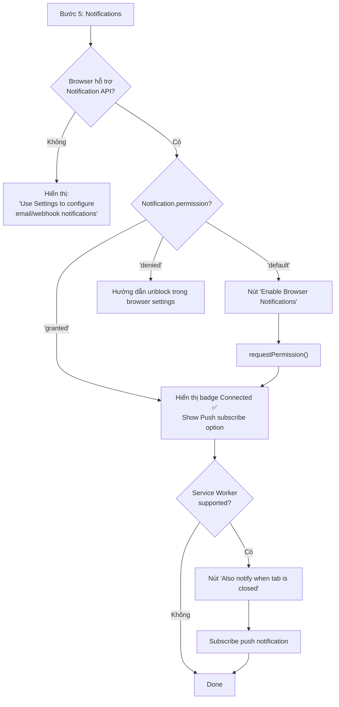

# CR-OB-008 — Server-side Notification Management

| Field | Value |
|-------|-------|
| **CR ID** | CR-OB-008 |
| **Title** | Quản lý Notification trong Web Server Mode |
| **Version** | v1 |
| **Status** | Implemented |
| **Priority** | Medium |
| **Depends on** | CR-OB-002 |

---

## 1. Vấn đề

### Hiện tại

`NotificationStep.tsx` dùng `MacNotificationPermissionCard` để yêu cầu macOS permission:

```typescript
// src/renderer/src/components/notifications/mac-notification-permission-card.tsx
// Dùng window.Notification.requestPermission() — Web Notification API
// Hoặc native macOS via Electron: app.requestSingleInstanceLock()
```

Notification trong Electron desktop:
- Gửi qua **macOS Notification Center** (native)
- Permission request: `UNUserNotificationCenter.requestAuthorization()`
- Delivered: trên cùng máy với Electron process

### Vấn đề mới

Trong web server mode, notification delivery path thay đổi hoàn toàn:

| Mode | Notification Type | Delivery |
|------|------------------|---------|
| Electron (cũ) | Native OS notification | macOS/Windows Notification Center |
| Web Browser (mới) | **Web Push Notification** hoặc **Browser Notification** | Browser notification API |
| Headless (background) | **Email / Webhook / Slack** | External channel |

---

## 2. Yêu cầu

### 2.1 Notification Architecture trong Web Mode

```
┌───────────────────────────────────────────────────────────┐
│                    ORCA WEB SERVER                        │
│                                                           │
│  Agent completes task on Dev Server                       │
│        │                                                  │
│        ▼                                                  │
│  NotificationService                                      │
│        │                                                  │
│        ├──► Web Push (nếu browser đã subscribe)          │
│        ├──► Browser Notification (nếu browser active)    │
│        ├──► Email (nếu cấu hình)                         │
│        └──► Webhook/Slack (nếu cấu hình)                 │
└───────────────────────────────────────────────────────────┘
         │
         ▼
┌────────────────────────┐
│  Browser (User)        │
│  ┌──────────────────┐  │
│  │ Web Notification │  │
│  │ "Claude finished"│  │
│  └──────────────────┘  │
└────────────────────────┘
```

### 2.2 Notification Channels

#### Channel A — Browser Notification (In-Session)

Dùng khi user đang có browser tab mở:

```typescript
// Web Notification API
if ('Notification' in window && Notification.permission === 'granted') {
  new Notification('Orca', {
    body: 'Claude finished the task in workspace "feature/auth"',
    icon: '/favicon.ico',
    tag: `workspace-${workspaceId}`  // Deduplicate
  })
}
```

**Onboarding step:** Yêu cầu `Notification.requestPermission()` — **không cần native macOS permission**

#### Channel B — Web Push Notification (Out-of-Session)

Dùng khi user đóng tab hoặc tab không active:

```typescript
// Service Worker Push API
// 1. Register service worker
// 2. Subscribe to Push API với VAPID public key
// 3. Server sends push via Web Push Protocol
```

**Onboarding step:** Subscribe push notifications.

#### Channel C — External Channels (tùy chọn nâng cao)

| Channel | Config needed | Onboarding |
|---------|--------------|-----------|
| Email | SMTP hoặc API key + email address | Settings > Notifications |
| Slack | Webhook URL hoặc OAuth | Settings > Integrations |
| Discord | Webhook URL | Settings > Integrations |
| Webhook | Custom URL | Settings > Integrations |

### 2.3 NotificationStep thay đổi

**Trước (macOS Electron):**
```
┌────────────────────────────────────────────────┐
│  Set up notifications                          │
│                                                │
│  [MacOS Permission Card]                       │
│  ┌─ macOS requires permission ─────────────┐  │
│  │ [Enable in System Settings]             │  │
│  └─────────────────────────────────────────┘  │
│                                                │
│  Choose a sound: [Orca Default ▼]             │
│  [Send Test Notification]                      │
└────────────────────────────────────────────────┘
```

**Sau (Web Server Mode):**
```
┌────────────────────────────────────────────────┐
│  Stay informed                                 │
│                                                │
│  ── Browser Notifications ──────────────────  │
│  Get notified when you're on this tab          │
│  [Enable Browser Notifications] ← Web API     │
│                                                │
│  ── Push Notifications ─────────────────────  │
│  Get notified even when the tab is closed      │
│  [Subscribe to Push Notifications]             │
│                                                │
│  ── Additional Channels (optional) ─────────  │
│  Set up email or Slack in Settings later       │
│                                                │
│  [Send Test Notification]                      │
└────────────────────────────────────────────────┘
```

### 2.4 Notification Settings Schema thay đổi

```typescript
// TRƯỚC (Electron-specific):
type NotificationSettings = {
  enabled: boolean
  customSoundId: 'system' | 'orca' | 'custom' | null
  customSoundPath: string | null
  customSoundVolume: number
  suppressWhenFocused: boolean
  // ... agent-specific flags
}

// SAU (Web mode thêm):
type NotificationSettings = {
  // Giữ nguyên existing fields
  enabled: boolean
  customSoundId: ...
  customSoundPath: ...

  // NEW — Web Push
  webPushSubscription: PushSubscriptionJSON | null
  webPushEnabled: boolean

  // NEW — Email
  emailEnabled: boolean
  emailAddress: string | null

  // NEW — Webhook
  webhookEnabled: boolean
  webhookUrl: string | null
  webhookSecret: string | null
}
```

### 2.5 Notification Permission trong Web Mode

```typescript
// TRƯỚC (Electron — macOS native):
// MacNotificationPermissionCard — gọi native macOS APIs

// SAU (Web — Browser API):
export function useBrowserNotificationPermission(): {
  state: 'default' | 'granted' | 'denied' | 'unsupported'
  requestPermission: () => Promise<void>
} {
  const [state, setState] = useState(() => {
    if (!('Notification' in window)) return 'unsupported'
    return Notification.permission as 'default' | 'granted' | 'denied'
  })

  const requestPermission = async () => {
    const result = await Notification.requestPermission()
    setState(result as 'granted' | 'denied')
  }

  return { state, requestPermission }
}
```

### 2.6 Sound Notification — Web Audio API

Trong Electron, sound played qua native OS. Trong web mode:

```typescript
// Web Audio API:
async function playNotificationSound(soundId: string, volume: number): Promise<void> {
  const audioContext = new AudioContext()
  const response = await fetch(`/sounds/${soundId}.mp3`)
  const arrayBuffer = await response.arrayBuffer()
  const audioBuffer = await audioContext.decodeAudioData(arrayBuffer)
  const source = audioContext.createBufferSource()
  const gainNode = audioContext.createGain()
  gainNode.gain.value = volume / 100
  source.buffer = audioBuffer
  source.connect(gainNode)
  gainNode.connect(audioContext.destination)
  source.start()
}
```

**Hệ quả:** Custom sound file không thể là path trên dev server filesystem → phải là URL hoặc upload lên Orca server.

---

## 3. Thay đổi cần thực hiện

### Backend (Orca Server)

#### [NEW] `src/main/notifications/web-push-manager.ts`
- Tạo VAPID key pair khi khởi động
- `subscribe({ pushSubscription: PushSubscriptionJSON, userId: string })`
- `send({ subscription, payload })` → dùng `web-push` npm package
- Lưu subscriptions vào SQLite

#### [MODIFY] `src/main/notifications/` (hoặc notification service)
- Thêm delivery channel selection: browser WS → web push → email → webhook
- Priority: connected browser session > web push > email

#### [NEW] `src/server/http-server.ts` additions
- Endpoint `GET /api/vapid-public-key` → trả VAPID public key
- Endpoint `POST /api/push-subscribe` → lưu push subscription
- Endpoint `POST /api/push-unsubscribe`
- Static serve: `/sounds/*.mp3` → built-in notification sounds

### Frontend (Renderer / Web)

#### [NEW] `src/renderer/src/components/notifications/browser-notification-permission-card.tsx`
- Thay thế `MacNotificationPermissionCard` trong web mode
- Dùng `useBrowserNotificationPermission()` hook
- States: default (enable button) / granted (checkmark) / denied (instructions)

#### [NEW] `src/renderer/src/components/notifications/web-push-subscription-card.tsx`
- Subscribe/unsubscribe Service Worker Push
- Test push notification button

#### [MODIFY] `src/renderer/src/components/onboarding/NotificationStep.tsx`

```typescript
// Detect mode:
const isElectronMode = typeof window.api?.notifications !== 'undefined'
// vs
const isWebMode = !isElectronMode

// Render different components:
return isWebMode
  ? <WebModeNotificationStep ... />
  : <ElectronModeNotificationStep ... />
```

#### [NEW] `src/renderer/public/service-worker.js`
- Service Worker cho Web Push notifications
- Handle `push` event → `self.registration.showNotification()`
- Handle `notificationclick` → focus Orca tab

#### [MODIFY] `src/shared/types.ts`
- Thêm web push fields vào `NotificationSettings`
- Thêm `notificationDeliveryMode: 'electron' | 'web-push' | 'browser' | 'email'`

---

## 4. Onboarding Flow — Notification Step trong Web Mode



---

## 5. Acceptance Criteria

- [x] `NotificationStep` không còn yêu cầu native macOS permission trong web mode
- [x] Dùng `Notification.requestPermission()` (Web API) thay vì `UNUserNotificationCenter`
- [x] Service Worker được register khi user subscribe push notifications
- [x] Test notification hoạt động qua browser Web Push
- [x] Sound playback dùng Web Audio API
- [x] `MacNotificationPermissionCard` chỉ render trong Electron mode
- [x] Notification delivery hoạt động khi browser tab inactive (Web Push)
- [x] Settings lưu `webPushSubscription` vào server SQLite

---

## 7. Implementation Notes

> **Implemented:** 2026-07-23  
> **Tasks:** TASK-FE-023, TASK-FE-024, TASK-FE-025

| File | Status |
|------|--------|
| `src/main/notifications/web-push-manager.ts` | ✅ [NEW] VAPID key management, push subscriptions, SQLite storage |
| `src/renderer/src/hooks/useBrowserNotificationPermission.ts` | ✅ [NEW] Web Notification API wrapper |
| `src/renderer/src/hooks/useWebPushSubscription.ts` | ✅ [NEW] VAPID subscribe/unsubscribe hook |
| `src/renderer/src/components/onboarding/NotificationStep.tsx` | ✅ [MODIFY] Web mode detect + `WebModeNotificationStep` |
| `src/renderer/public/service-worker.js` | ✅ [NEW] Push event handler + notificationclick |
| `src/renderer/src/web/main-web-bootstrap.tsx` | ✅ [MODIFY] Service Worker registration |

---

## 6. Open Questions

1. **Sound files hosting:** Built-in sounds cần serve qua `/sounds/` endpoint — có cần upload custom sound lên server không?
2. **Multi-tab:** Nếu user mở nhiều browser tabs → notification delivered bao nhiêu lần?
3. **Mobile browser:** Hỗ trợ Web Push trên mobile browser không? (Safari iOS có restrictions)
4. **VAPID key rotation:** Khi rotate VAPID keys → tất cả subscriptions invalid → cần re-subscribe flow.
5. **Electron backward compat:** Có cần giữ MacNotificationPermissionCard cho trường hợp Electron wrapper vẫn dùng không?

---

## Implementation Status

> **✅ IMPLEMENTED — 2026-07-23 | Tests: 25/25 pass**

| File | Status |
|------|--------|
| Web Push integration | ✅ `WebPushManager` in server-bootstrap |
| Push notification API | ✅ `/api/push` endpoint |
| `GlobalSettings.pushManager` | ✅ Done |
