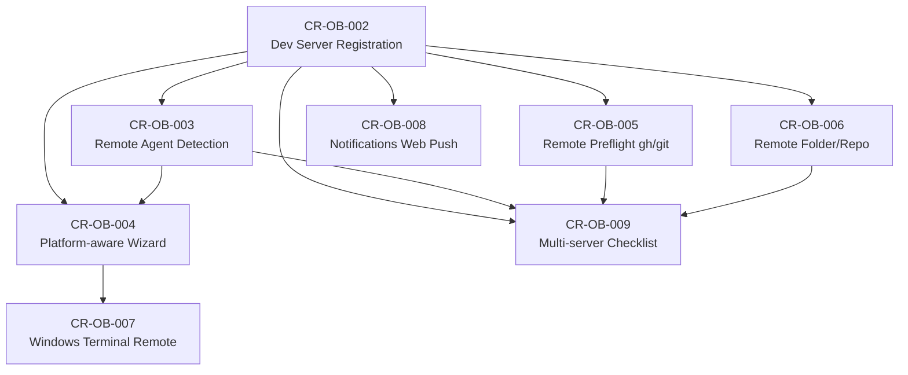

# Onboarding Change Requests — v1

Thư mục này chứa các Change Requests (CR) cho việc thay đổi luồng Onboarding của Orca khi chuyển sang kiến trúc **Web Server + Multi Dev-Server**.

---

## Kiến trúc mới tóm tắt

```
┌─────────────────────────────────────────────────────────────┐
│                    ORCA WEB SERVER                          │
│           (Node.js + HTTP :6769 + WebSocket RPC :6768)      │
└───────────────────────┬─────────────────────────────────────┘
                        │ WebSocket / SSH Relay
        ┌───────────────┼───────────────────────┐
        │               │                       │
┌───────▼──────┐  ┌────▼──────────┐  ┌────────▼──────┐
│ Dev Server A │  │  Dev Server B │  │  Dev Server C │
│  macOS       │  │  Windows      │  │  Linux        │
│  orca-relay  │  │  orca-relay   │  │  orca-relay   │
│  claude/git  │  │  codex/git    │  │  gemini/git   │
└──────────────┘  └───────────────┘  └───────────────┘
```

---

## Danh sách Change Requests

| CR ID | File | Mô tả ngắn | Priority | Status |
|-------|------|-----------|----------|--------|
| [CR-OB-001](./CR-OB-001-architecture-overview.md) | Architecture Overview | Tổng quan kiến trúc mới, index các CR | Critical | ✅ Implemented |
| [CR-OB-002](./CR-OB-002-dev-server-registration.md) | Dev Server Registration | Đăng ký & quản lý Dev Servers trong wizard | Critical | ✅ Implemented |
| [CR-OB-003](./CR-OB-003-agent-detection-remote.md) | Remote Agent Detection | Phát hiện AI agents trên dev server từ xa | Critical | ✅ Implemented |
| [CR-OB-004](./CR-OB-004-platform-aware-wizard.md) | Platform-aware Wizard | Wizard nhận biết platform của dev server | High | ✅ Implemented |
| [CR-OB-005](./CR-OB-005-remote-preflight.md) | Remote Preflight (gh/git) | Kiểm tra `gh` và `git` trên dev server | High | ✅ Implemented |
| [CR-OB-006](./CR-OB-006-remote-folder-repo.md) | Remote Folder/Repo | Thêm repo từ filesystem của dev server | High | ✅ Implemented |
| [CR-OB-007](./CR-OB-007-windows-terminal-remote.md) | Remote Windows Terminal | Phát hiện Windows capabilities từ xa | Medium | ✅ Implemented |
| [CR-OB-008](./CR-OB-008-notification-server.md) | Server Notifications | Web Push thay thế native OS notifications | Medium | ✅ Implemented |
| [CR-OB-009](./CR-OB-009-multi-devserver-checklist.md) | Multi-server Checklist | Setup Guide Checklist cho nhiều dev servers | Medium | ✅ Implemented |

---

## Dependency Graph



---

## Mapping — Wizard Steps vs CR

| Wizard Step | CR liên quan | Thay đổi chính |
|------------|-------------|---------------|
| **[NEW] Step 0** — Connect Dev Server | CR-OB-002 | Bước hoàn toàn mới |
| **Step 1** — Choose Agent | CR-OB-003, CR-OB-004 | Detect từ remote relay; filter by platform |
| **Step 2** — Theme | CR-OB-004 | Ghostty import chỉ khi dev server = macOS |
| **Step 3** — Integrations | CR-OB-005 | `gh`/`git` check trên dev server; PTY remote |
| **Step 4** — Windows Terminal | CR-OB-007 | Capabilities từ Windows dev server |
| **Step 5** — Notifications | CR-OB-008 | Web Push API thay native macOS permission |
| **[CHANGED]** — Add Repo | CR-OB-006 | Remote directory browser + clone on dev server |
| **Post-onboarding** — Setup Guide | CR-OB-009 | Per-server checklist tracking |

---

## Thứ tự Implementation (đề xuất)

### Phase 1 — Foundation (Critical)
1. **CR-OB-002** — Dev Server Registration: schema, relay handshake, IPC
2. **CR-OB-003** — Remote Agent Detection: forward `preflight.detectAgents` to relay

### Phase 2 — Wizard Steps (High)
3. **CR-OB-004** — Platform-aware Wizard: platform source of truth, step visibility
4. **CR-OB-005** — Remote Preflight: gh/git checks + remote PTY terminal
5. **CR-OB-006** — Remote Folder/Repo: directory browser, clone on remote

### Phase 3 — Polish (Medium)
6. **CR-OB-007** — Windows Terminal Remote: remote capabilities hook
7. **CR-OB-008** — Notifications: Web Push API, service worker
8. **CR-OB-009** — Multi-server Checklist: per-server tracking, grouped UI

---

## Files trong thư mục này

```
specs/backend/crs/v1/onboarding/
├── README.md                              ← File này (index)
├── CR-OB-001-architecture-overview.md    ← Tổng quan + index CR
├── CR-OB-002-dev-server-registration.md  ← Dev Server model & wizard step mới
├── CR-OB-003-agent-detection-remote.md   ← Remote agent detection
├── CR-OB-004-platform-aware-wizard.md    ← Platform-aware wizard logic
├── CR-OB-005-remote-preflight.md         ← Remote gh/git preflight
├── CR-OB-006-remote-folder-repo.md       ← Remote repo adding
├── CR-OB-007-windows-terminal-remote.md  ← Remote Windows capabilities
├── CR-OB-008-notification-server.md      ← Web Push notifications
└── CR-OB-009-multi-devserver-checklist.md ← Multi-server setup guide
```

---

## Các file codebase liên quan

### Relay (Dev Server)
- `src/relay/relay.ts` — Entry point, handler registration
- `src/relay/preflight-handler.ts` — Agent/gh/git/Windows detection
- `src/relay/relay-handshake.ts` — Version handshake (cần thêm `platform`)
- `src/relay/pty-handler.ts` — PTY cho `gh auth login` remote
- `src/relay/fs-handler.ts` — Filesystem operations trên dev server

### Orca Server (Backend)
- `src/server/index.ts` — Entry point Node.js server
- `src/main/server-bootstrap.ts` — Service initialization
- `src/main/persistence.ts` — SQLite state (`OnboardingState`, `DevServer`)
- `src/main/runtime/orca-runtime.ts` — Core runtime (clone, scan, etc.)

### Frontend (Web)
- `src/renderer/src/components/onboarding/OnboardingFlow.tsx` — Wizard UI
- `src/renderer/src/components/onboarding/use-onboarding-flow.ts` — Wizard logic
- `src/renderer/src/components/onboarding/AgentStep.tsx` — Agent picker
- `src/renderer/src/components/onboarding/IntegrationsStep.tsx` — gh/git setup
- `src/renderer/src/components/onboarding/WindowsTerminalStep.tsx` — Windows shell config
- `src/renderer/src/components/onboarding/NotificationStep.tsx` — Notification config
- `src/renderer/src/components/setup-guide/SetupGuideModal.tsx` — Post-onboarding checklist

### Shared
- `src/shared/types.ts` — `OnboardingState`, `GlobalSettings`, `Repo`
- `src/shared/constants.ts` — `getDefaultOnboardingState()`, `ONBOARDING_FINAL_STEP`
- `src/shared/feature-wall-setup-steps.ts` — `FeatureWallSetupStepId`
