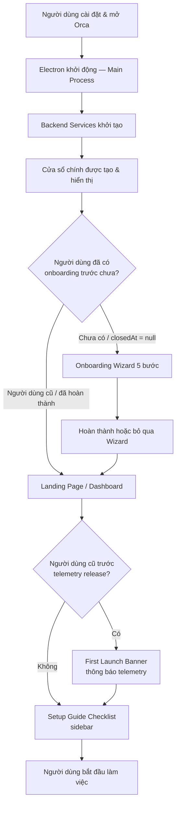
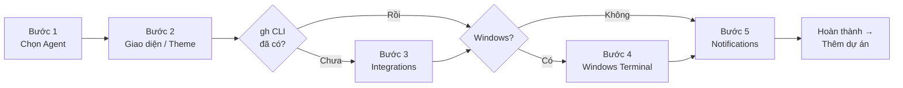

# Onboarding — First-Time User Flow

Tài liệu này mô tả toàn bộ hành trình của người dùng từ khi cài đặt và mở Orca lần đầu tiên đến khi bắt đầu làm việc thực sự.

---

## Tổng quan



---

## Giai đoạn 1 — Khởi động Main Process (Electron)

**File:** `src/main/index.ts`

Khi người dùng mở Orca lần đầu tiên, Electron main process khởi tạo theo thứ tự sau:

| Thứ tự | Bước | Ghi chú |
|--------|------|---------|
| 1 | `configureProcess()` | Cấu hình process, GPU, network |
| 2 | `initDataPath()` | Xác định đường dẫn lưu trữ userData |
| 3 | `new Store()` | Khởi tạo SQLite persistence |
| 4 | `new StatsCollector()` | Khởi tạo bộ đếm thống kê |
| 5 | `initOrcaProfilePaths()` | Khởi tạo Orca profile paths |
| 6 | Acquire single instance lock | Đảm bảo chỉ một instance chạy |
| 7 | `createMainWindow()` | Tạo cửa sổ chính Electron |
| 8 | `startFirstWindowStartupServices()` | Khởi động PTY daemon + Agent Hook Server song song |
| 9 | `OrcaRuntimeService` + `OrcaRuntimeRpcServer` | Backend agent runtime sẵn sàng |

### First Window Startup Services

**File:** `src/main/startup/first-window-startup-services.ts`

- **PTY Daemon** và **Agent Hook Server** được khởi động **song song** để giảm cold-start latency.
- Cửa sổ hiển thị sau **12 giây** tối đa (`FIRST_WINDOW_STARTUP_SERVICE_TIMEOUT_MS = 12_000`).
- Terminal sẵn sàng sau **60 giây** (`LOCAL_PTY_STARTUP_FAIL_OPEN_TIMEOUT_MS = 60_000`) — fail-open sau đó.

---

## Giai đoạn 2 — Renderer Process khởi tạo

**File:** `src/renderer/src/main.tsx`

1. Kết nối với Main qua IPC (preload bridge)
2. Gọi `window.api.onboarding.get()` → đọc `PersistedState.onboarding`
3. Gọi `window.api.settings.get()` → load global settings
4. Kiểm tra trạng thái onboarding

### Logic hiển thị Onboarding

**File:** `src/renderer/src/components/onboarding/should-show-onboarding.ts`

```typescript
function shouldShowOnboarding(onboarding: OnboardingState | null): boolean {
  return onboarding !== null && onboarding.closedAt === null
}
```

> Người dùng **mới** → `onboarding.closedAt = null` → **Onboarding Wizard hiện ra**.  
> Người dùng cũ → `closedAt` có giá trị → **vào thẳng Dashboard**.

---

## Giai đoạn 3 — Onboarding Wizard (5 bước)

**File:** `src/renderer/src/components/onboarding/OnboardingFlow.tsx`  
**Hook điều khiển:** `src/renderer/src/components/onboarding/use-onboarding-flow.ts`

Wizard hiển thị toàn màn hình (modal, `z-index: 100`) và gồm tối đa 5 bước:



### Bước 1 — Pick your default agent

- Tự phát hiện agents trên PATH
- Chọn agent mặc định + YOLO permissions
- Lưu: `settings.defaultTuiAgent`

### Bước 2 — Make it feel like home (Theme)

- Chọn `dark` / `light` / `system`
- Preview trực tiếp ngay lập tức
- macOS: tự phát hiện Ghostty config và đề nghị import
- Lưu: `settings.theme`

### Bước 3 — Set up GitHub tasks *(có thể bỏ qua)*

- **Bỏ qua khi:** `preflightStatus.gh.installed === true`
- GitHub CLI: `not-installed` → cài | `not-authenticated` → `gh auth login`
- Linear: Personal API Key (tùy chọn)

### Bước 4 — Windows terminal defaults *(chỉ Windows)*

- **Bỏ qua hoàn toàn** trên macOS / Linux
- Shell: PowerShell / CMD / WSL / Git Bash
- Right-click: paste hoặc context menu

### Bước 5 — Set up notifications

- macOS: yêu cầu `UNUserNotificationCenter` permission
- Chọn âm thanh thông báo
- Nút footer: **"Add your first project"**

### Điều hướng trong Wizard

| Hành động | Kết quả |
|----------|---------|
| `Continue` / `⌘↵` | Tiến bước tiếp theo |
| `Back` | Quay lại bước trước |
| `Escape` / click ngoài | Dialog xác nhận bỏ qua |
| "Skip to project setup" | Nhảy thẳng đến thêm repo |

### Persistence mỗi bước

- `onboarding.lastCompletedStep` — bước cao nhất đã hoàn thành
- `onboarding.flowVersion = 4` — phiên bản flow hiện tại
- `onboarding.outcome` — `'completed'` hoặc `'dismissed'`
- `onboarding.closedAt` — timestamp khi wizard đóng

---

## Giai đoạn 4 — Thêm Repository đầu tiên

Sau bước 5 → người dùng thêm repo:
- Mở thư mục local (`Open Folder`)
- Clone từ URL git
- Kết nối server path
- Scan nested repos

---

## Giai đoạn 5 — First Launch Banner *(người dùng cũ trước telemetry)*

**File:** `src/renderer/src/components/FirstLaunchBanner.tsx`

Chỉ hiện với `existedBeforeTelemetryRelease === true` và `optedIn === null`:

| Hành động | Kết quả |
|----------|---------|
| "Got it" / ✕ | Silent opt-in telemetry |
| "Opt out" | Tắt telemetry, fire `telemetry_opted_out` |
| "Privacy policy" | Mở link, không thay đổi state |

---

## Giai đoạn 6 — Setup Guide Checklist

**File:** `src/renderer/src/components/setup-guide/SetupGuideModal.tsx`

Checklist sau onboarding gồm 11 mục (xem `OnboardingChecklistState` trong `src/shared/types.ts`):

| Mục | Mô tả |
|-----|-------|
| `addedRepo` | Đã thêm repository |
| `choseAgent` | Đã chọn AI agent |
| `ranFirstAgent` | Chạy agent lần đầu |
| `ranSecondAgentOnSameTask` | Chạy agent thứ hai trên cùng task |
| `triedCmdJ` | Thử phím tắt Cmd+J |
| `shapedSidebar` | Tùy chỉnh sidebar |
| `reviewedDiff` | Xem git diff |
| `openedPr` | Mở Pull Request |
| `addedFolder` | Thêm folder |
| `openedFile` | Mở file trong editor |
| `ranAgentOnFile` | Chạy agent trên file |

---

## Timeline tổng hợp

```
[T+0s]    Orca mở, Electron khởi động
[T+0→2s]  Backend init: SQLite, Stats, Profiles
[T+2→12s] PTY Daemon + Hook Server (song song, max 12s)
[T+2s]    Cửa sổ hiển thị (không chờ daemon)
[T+2→5s]  Renderer load, kiểm tra onboarding state
           ↓ Nếu người dùng mới:
[T+5s]    Onboarding Wizard (modal toàn màn hình)
           Bước 1: Chọn Agent
           Bước 2: Theme
           Bước 3: GitHub CLI (skip nếu đã có)
           Bước 4: Windows Terminal (chỉ Windows)
           Bước 5: Notifications
           ↓ "Add your first project"
[T+Nphút] Thêm repository → Dashboard + Setup Guide
```

---

## File quan trọng

| File | Vai trò |
|------|---------|
| `src/main/index.ts` | Entry point, lifecycle Electron |
| `src/main/server-bootstrap.ts` | Bootstrap headless server mode |
| `src/main/startup/first-window-startup-services.ts` | PTY daemon + hook server startup |
| `src/shared/types.ts` | `OnboardingState`, `OnboardingChecklistState` |
| `src/shared/constants.ts` | `getDefaultOnboardingState()`, `ONBOARDING_FINAL_STEP = 5` |
| `src/renderer/src/components/onboarding/OnboardingFlow.tsx` | UI wizard chính |
| `src/renderer/src/components/onboarding/use-onboarding-flow.ts` | Logic điều khiển wizard |
| `src/renderer/src/components/FirstLaunchBanner.tsx` | Banner telemetry người dùng cũ |
| `src/renderer/src/components/setup-guide/SetupGuideModal.tsx` | Checklist sau onboarding |
