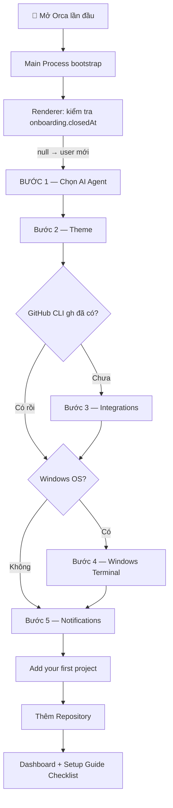
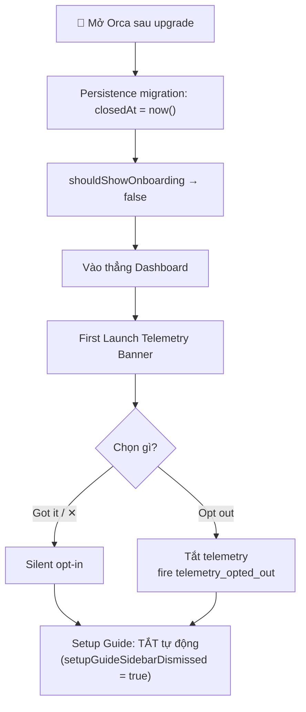
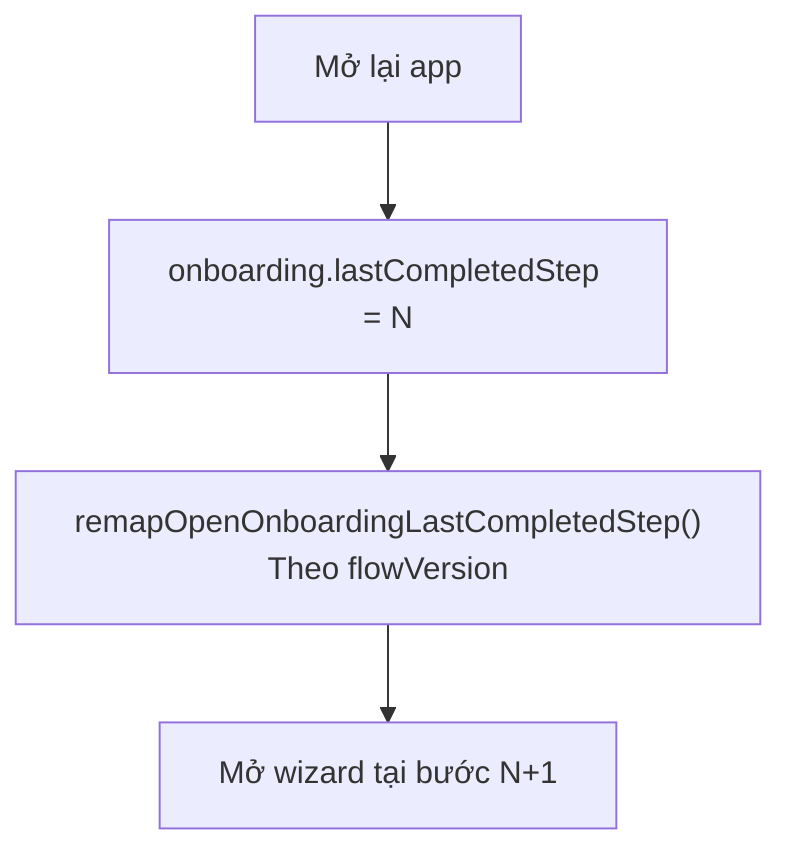

# Onboarding — Luồng theo từng đối tượng & Cấu hình cần thiết

---

## Phân loại đối tượng người dùng (Cohort)

Orca phân biệt **3 nhóm người dùng** dựa trên flag `existedBeforeTelemetryRelease` trong SQLite:

| Cohort | Điều kiện | Luồng nhận được |
|--------|-----------|-----------------|
| **`fresh_install`** | Cài Orca sau khi telemetry ra mắt (`existedBeforeTelemetryRelease === false`) | Onboarding Wizard 5 bước đầy đủ |
| **`upgrade_backfill`** | Đã dùng Orca trước telemetry, onboarding tự động được đánh dấu completed | Bỏ qua wizard, vào thẳng Dashboard + Banner telemetry |
| **Pre-existing (dismissed)** | `closedAt` có giá trị, outcome là `dismissed` | Dashboard + Setup Guide Checklist có thể còn active |

**Source:** `src/main/telemetry/onboarding-cohort-classifier.ts`

---

## LUỒNG A — Fresh Install (Người dùng mới)

> **Cohort:** `fresh_install` | **Trigger:** `onboarding.closedAt === null`



### Bước 1 — Chọn AI Agent

**File:** `src/renderer/src/components/onboarding/AgentStep.tsx`

**Danh sách agents được hỗ trợ (phát hiện tự động trên PATH):**

| Agent | Command | Install URL |
|-------|---------|------------|
| Claude | `claude` | https://docs.anthropic.com/claude/docs/claude-code |
| Claude Agent Teams | `claude-agent-teams` | https://code.claude.com/docs/agent-teams |
| OpenClaude | `openclaude` | https://openclaude.gitlawb.com/ |
| Codex | `codex` | https://github.com/openai/codex |
| Grok | `grok` | https://x.ai/cli |
| GitHub Copilot | `copilot` | https://docs.github.com/en/copilot |
| OpenCode | `opencode` | https://opencode.ai/docs/cli/ |
| MiMo Code | `mimo` | https://mimo.xiaomi.com/coder |
| Ante | `ante` | https://github.com/AntigmaLabs/ante-preview |
| Pi | `pi` | https://pi.dev |
| OMP | `omp` | https://omp.sh |
| Gemini | `gemini` | https://github.com/google-gemini/gemini-cli |
| Antigravity | `agy` | https://antigravity.google/docs/cli-overview |
| Aider | `aider` | https://aider.chat/docs/ |
| Goose | `goose` | https://block.github.io/goose/docs/quickstart/ |
| Amp | `amp` | https://ampcode.com/manual#install |
| Kilocode | `kilo` | https://kilo.ai/docs/cli |
| Kiro | `kiro-cli` | https://kiro.dev/docs/cli/ |
| Charm (crush) | `crush` | https://github.com/charmbracelet/crush |
| Auggie | `auggie` | https://docs.augmentcode.com/cli/overview |
| Autohand Code | `autohand` | https://github.com/autohandai/code-cli |
| Cline | `cline` | https://docs.cline.bot/cline-cli/overview |
| Codebuff | `codebuff` | https://www.codebuff.com/docs/help/quick-start |
| Command Code | `command-code` | https://commandcode.ai/docs/quickstart |
| Continue | `cn` | https://docs.continue.dev/guides/cli |
| Cursor | `cursor-agent` | https://cursor.com/cli |
| Droid | `droid` | https://docs.factory.ai/cli/getting-started/quickstart |
| Kimi | `kimi` | https://www.kimi.com/code/docs |
| Mistral Vibe | `vibe` | https://github.com/mistralai/mistral-vibe |
| Qwen Code | `qwen` | https://github.com/QwenLM/qwen-code |
| Rovo Dev | `rovo` | https://support.atlassian.com/rovo |
| Hermes | `hermes` | https://hermes-agent.nousresearch.com/docs/ |
| Devin | `devin` | https://devin.ai/cli |
| OpenClaw | `openclaw` | https://github.com/openclaw/openclaw |

**YOLO Permissions:** Bật mặc định (`true`) — skip permission checks cho agent.

**Lưu vào:** `settings.defaultTuiAgent`, `settings.agentDefaultArgs`, `settings.agentDefaultEnv`

---

### Bước 2 — Theme / Giao diện

**File:** `src/renderer/src/components/onboarding/ThemeStep.tsx`

| Lựa chọn | Giá trị | Mô tả |
|----------|---------|-------|
| Dark | `'dark'` | Giao diện tối (mặc định) |
| Light | `'light'` | Giao diện sáng |
| System | `'system'` | Theo hệ điều hành |

**macOS only:** Tự phát hiện Ghostty config, đề nghị import theme/font.

**Lưu vào:** `settings.theme`

---

### Bước 3 — Integrations *(bỏ qua nếu gh đã cài)*

**File:** `src/renderer/src/components/onboarding/IntegrationsStep.tsx`

**Bỏ qua tự động khi:** `preflightStatus.gh.installed === true`

#### GitHub CLI

| Trạng thái | Hiển thị | Hành động |
|-----------|---------|-----------|
| `not-installed` | Badge "CLI not installed" | Nút → https://cli.github.com |
| `not-authenticated` | Badge "Sign in needed" | Inline terminal: `gh auth login` |
| `connected` | Badge "Connected" ✅ | — |

**Capabilities sau khi kết nối:**
- Start workspace từ GitHub issue/PR
- Browse Issues & PRs trong Tasks view
- Xem CI status trên worktrees
- Read/comment/merge PR trong Orca

#### Linear (tùy chọn)
- Nhập Personal API Key → dialog `LinearApiKeyDialog`

**Các tích hợp khác (Settings > Integrations):** GitLab, Bitbucket, Azure DevOps, Gitea, Jira

---

### Bước 4 — Windows Terminal *(chỉ Windows)*

**File:** `src/renderer/src/components/onboarding/WindowsTerminalStep.tsx`

**Bỏ qua hoàn toàn** trên macOS / Linux.

| Shell | Value | Điều kiện hiển thị |
|-------|-------|-------------------|
| PowerShell | `powershell.exe` | Luôn có |
| CMD | `cmd.exe` | Luôn có |
| WSL | `wsl.exe` | Khi WSL cài |
| Git Bash | git-bash path | Khi Git Bash cài |

**Right-click:**
- `paste` — paste clipboard
- `menu` — context menu

**Lưu vào:** `settings.terminalWindowsShell`, `settings.terminalWindowsWslDistro`, `settings.terminalRightClickToPaste`

---

### Bước 5 — Notifications

**File:** `src/renderer/src/components/onboarding/NotificationStep.tsx`

**macOS:** Yêu cầu `UNUserNotificationCenter` authorization.

**Cấu hình:**
- `settings.notifications.enabled` — bật/tắt
- `settings.notifications.customSoundId` — `'system'` hoặc `'custom'`
- `settings.notifications.customSoundPath` — đường dẫn file âm thanh
- `settings.notifications.suppressWhenFocused` — `true` (mặc định)

---

### Agent Feature Setup (trong bước Agent)

**File:** `src/renderer/src/components/onboarding/FeatureSetupChecklist.tsx`

| Feature ID | Tên | Mặc định | Mô tả |
|-----------|-----|---------|-------|
| `browserUse` | Agent Browser Use | ✅ bật | Agent điều khiển browser |
| `computerUse` | Computer Use | ✅ bật | Agent điều khiển ứng dụng local |
| `orchestration` | Agent Orchestration | ✅ bật | Agents giao tiếp với nhau |
| `linearTickets` | Linear Agent Skill | ❌ tắt | Agent dùng Linear tickets |

**Nhấn "Install CLI & Skills":**
1. Cài `orca-cli` (đăng ký shell command)
2. Copy install command cho skills vào clipboard
3. Mở macOS Accessibility/Screen Recording permissions (nếu cần)

---

## LUỒNG B — Upgrade Backfill (Người dùng cũ trước telemetry)

> **Cohort:** `upgrade_backfill` | `existedBeforeTelemetryRelease = true`

**Persistence migration** (chạy tự động khi load):
```
closedAt  = Date.now()
outcome   = 'completed'
lastCompletedStep = 5 (ONBOARDING_FINAL_STEP)
```



**Không thấy:** Wizard 5 bước, Setup Guide Checklist

---

## LUỒNG C — Resume Wizard (Bỏ dở giữa chừng)

> **Khi:** App bị đóng trong lúc làm wizard | `closedAt = null`



**Migration flowVersion:**
| Version | Số bước | Ghi chú |
|---------|---------|---------|
| v4 (hiện tại) | 5 | agent, theme, integrations, windows_terminal, notifications |
| v3 | 4 | Chưa có windows_terminal |
| v2 | 5 | Bố cục khác |
| v1 trở xuống | 7 | Cũ |

---

## LUỒNG D — Post-Onboarding Setup Guide

**File:** `src/renderer/src/components/setup-guide/SetupGuideModal.tsx`

Chỉ dành cho fresh install users. Tự động dismissed khi `closedAt !== null`.

### Section "Setup" (ưu tiên):

| Step ID | Tên | Điều kiện hoàn thành |
|---------|-----|---------------------|
| `default-agent` | Choose your default agent | `settings.defaultTuiAgent` được set |
| `agent-capabilities` | Enable Orca CLI | `orca-cli` registered + skills installed |
| `task-sources` | Connect integrations | GitHub/Linear connected |
| `setup-script` | Automate workspace setup | Setup script cấu hình cho ≥1 repo |
| `add-two-repos` | Start work in multiple repos | ≥2 repos được thêm |
| `notifications` | Turn on notifications | Enabled + macOS permission granted |

### Section "Parallel Work":

| Step ID | Tên | Điều kiện hoàn thành |
|---------|-----|---------------------|
| `two-worktrees` | Multi-task | Mở ≥2 worktrees cùng lúc |
| `browser` | Use Orca's browser | Dùng integrated browser ≥1 lần |

---

## CẤU HÌNH CẦN THIẾT ĐỂ SỬ DỤNG ORCA

### Tier 1 — Yêu cầu tối thiểu (BẮT BUỘC)

| Cấu hình | Mô tả | Ghi chú |
|----------|-------|---------|
| **AI Agent trên PATH** | `claude`, `codex`, `gemini`... | Ít nhất 1 binary phải có trong `$PATH` |
| **Git binary** | `git` | Quản lý repos và worktrees |
| **Repository** | Local folder hoặc clone URL | Ít nhất 1 repo/folder phải được thêm |
| **`settings.defaultTuiAgent`** | TuiAgent ID | Chọn agent mặc định trong wizard |
| **`settings.workspaceDir`** | Đường dẫn | Mặc định: `~/orca/workspaces` |

### Tier 2 — Cấu hình cơ bản (NÊN CÓ)

| Key | Mặc định | Mô tả |
|-----|---------|-------|
| `settings.theme` | `'dark'` | Giao diện |
| `settings.notifications.enabled` | `true` | Nhận thông báo agent |
| `settings.notifications.agentTaskComplete` | `true` | Thông báo khi task xong |
| `settings.terminalFontFamily` | SF Mono (macOS) | Font terminal |
| `settings.terminalFontSize` | `14` | Cỡ chữ terminal |
| `settings.nestWorkspaces` | `true` | Nest worktrees trong workspace dir |
| `settings.autoRenameBranchFromWork` | `true` | Tự đặt tên branch từ task |
| `settings.branchPrefix` | `'git-username'` | Prefix branch |

### Tier 3 — GitHub Integration

| Yêu cầu | Cách thiết lập |
|---------|---------------|
| `gh` CLI binary | Cài từ https://cli.github.com |
| GitHub authentication | `gh auth login` trong terminal |
| SSH key hoặc HTTPS credentials | Để clone private repos |
| `settings.enableGitHubAttribution` | Tùy chọn attribution cho commits |

### Tier 4 — Orca CLI & Agent Skills

| Cấu hình | Cách cài | Mô tả |
|----------|---------|-------|
| **Orca CLI** | `window.api.cli.install()` | Command `orca` trong shell |
| **Browser Use skill** | Skill install command (clipboard) | Agent dùng browser |
| **Computer Use skill** | Skill install command + macOS perm | Agent điều khiển apps |
| **Orchestration skill** | Skill install command | Agent-to-agent comms |
| **Linear Skill** | Skill install command | Ticket-aware handoffs |

**macOS permissions cần thiết cho Computer Use:**
- Privacy > Accessibility
- Privacy > Screen Recording

### Tier 5 — Platform-specific

**macOS:**
| Cấu hình | Mô tả |
|----------|-------|
| Notification permission | `UNUserNotificationCenter` authorization |
| Ghostty import (optional) | Tự phát hiện nếu Ghostty cài |
| `settings.appIcon` | App icon tùy chọn |

**Windows:**
| Key | Mặc định | Mô tả |
|-----|---------|-------|
| `settings.terminalWindowsShell` | `'powershell.exe'` | Default shell |
| `settings.terminalRightClickToPaste` | `true` | Right-click paste |
| `settings.terminalWindowsWslDistro` | `null` | WSL distro ưa thích |

**Linux:**
| Cấu hình | Mô tả |
|----------|-------|
| Virtual display | Cần `DISPLAY` env khi headless serve |
| `settings.primarySelectionMiddleClickPaste` | `true` (mặc định Linux) |

### Tier 6 — Third-party Integrations (Settings > Integrations)

| Integration | Xác thực | Ghi chú |
|------------|---------|---------|
| GitHub | `gh auth login` | Cài GitHub CLI trước |
| Linear | Personal API Key | Full-access key |
| GitLab | Personal Access Token | — |
| Bitbucket | App Password | — |
| Azure DevOps | Personal Access Token | — |
| Gitea | Personal Access Token | Self-hosted |
| Jira | API Token + email | Atlassian account |

---

## Tóm tắt theo đối tượng

```
FRESH INSTALL (người dùng mới)
├── [BẮT BUỘC] Cài ≥1 AI agent trên PATH
├── Wizard Bước 1: Chọn Agent + YOLO permissions
├── Wizard Bước 2: Theme (tùy chọn)
├── Wizard Bước 3: GitHub CLI (bỏ qua nếu đã có)
├── Wizard Bước 4: Windows Terminal (chỉ Windows)
├── Wizard Bước 5: Notifications (grant macOS permission)
├── [BẮT BUỘC] Thêm repo đầu tiên
└── Setup Guide Checklist (8 mục hướng dẫn)

UPGRADE BACKFILL (người dùng cũ trước telemetry)
├── Vào thẳng Dashboard
├── First Launch Banner (telemetry consent 1 lần)
└── [Không có] Setup Guide Checklist

RESUME (bỏ dở wizard)
└── Tiếp tục từ bước đã dừng (theo lastCompletedStep)
```
