# C1 — System Context Diagram

**Level:** 1 — System Context  
**Mô tả:** Orca trong môi trường sử dụng — users và external systems mà Orca tương tác  
**Cập nhật:** 2026-07-28

---

## Sơ đồ Context

```mermaid
C4Context
  title System Context — Orca AI Orchestrator IDE

  Person(alex, "Senior Developer", "Dùng multi-agent workflow để code song song")
  Person(maya, "Tech Lead", "Review code AI và quản lý team")
  Person(carlos, "Remote Developer", "Chạy agent trên remote server qua SSH")
  Person(sam, "Mobile User / CTO", "Monitor và dispatch agent từ điện thoại")
  Person(qa, "QA Engineer", "Test UI và annotate bugs cho agent")
  Person(devops, "DevOps Engineer", "Integrate agent vào CI/CD pipeline")
  Person(admin, "Admin", "Quản lý users, sessions, audit log trên Orca Server")
  Person(agentdev, "Agent Developer", "Viết AI agent tích hợp qua WebSocket")

  System(orca, "Orca Desktop", "AI Orchestrator IDE — Electron app\nQuản lý multi-agent, worktree, terminal")
  System(orca_web, "Orca Web Server", "Node.js server mode\nHTTP :6769 + WebSocket :6768\nMulti-user, Admin SPA, Agent WS")
  System(orca_mobile, "Orca Mobile", "Companion app iOS/Android\nMonitor và dispatch từ mobile")
  System(orca_cli, "Orca CLI", "Command-line interface\nAutomation và CI/CD integration")

  System_Ext(claude, "Claude Code", "AI agent CLI\n(Anthropic)")
  System_Ext(codex, "OpenAI Codex", "AI agent CLI\n(OpenAI)")
  System_Ext(opencode, "OpenCode", "AI agent CLI\n(open source)")
  System_Ext(gemini, "Gemini CLI", "AI agent CLI\n(Google)")
  System_Ext(github, "GitHub / GitLab", "Source control, PR, Issues, CI/CD")
  System_Ext(linear, "Linear / Jira", "Project management, Issues, Tasks")
  System_Ext(remote_host, "Remote SSH Host", "Cloud server, EC2, VPS\nchạy agent và build tools")
  System_Ext(apns_fcm, "APNs / FCM", "Apple/Google Push\nNotification Service")
  System_Ext(custom_agent, "Custom AI Agent", "Agent tự viết (Python/Go/TypeScript)\nkết nối qua WebSocket")

  Rel(alex, orca, "Dùng hằng ngày", "Desktop UI")
  Rel(alex, orca_web, "Dùng qua browser", "HTTP / WebSocket")
  Rel(maya, orca, "Dùng hằng ngày", "Desktop UI")
  Rel(carlos, orca, "Dùng hằng ngày", "Desktop UI + SSH")
  Rel(sam, orca_mobile, "Monitor + Dispatch", "Mobile UI")
  Rel(sam, orca, "Setup + Config", "Desktop UI")
  Rel(qa, orca, "Test + Annotate", "Desktop UI")
  Rel(devops, orca_cli, "Automate + CI/CD", "CLI")
  Rel(admin, orca_web, "Quản lý users/sessions", "HTTP /admin")
  Rel(agentdev, custom_agent, "Phát triển và déploy", "Code")
  Rel(custom_agent, orca_web, "Kết nối WebSocket", "ws://orca:6768/agent")

  Rel(orca, claude, "Spawn + communicate", "PTY / stdin-stdout")
  Rel(orca, codex, "Spawn + communicate", "PTY / stdin-stdout")
  Rel(orca, opencode, "Spawn + communicate", "PTY / stdin-stdout")
  Rel(orca, gemini, "Spawn + communicate", "PTY / stdin-stdout")
  Rel(orca, github, "Issues, PR, Commits", "REST / GraphQL API")
  Rel(orca, linear, "Tasks, Status", "REST API")
  Rel(orca, remote_host, "SSH + WebSocket", "TCP / SSH protocol")
  Rel(orca, orca_mobile, "Status + Dispatch", "WebSocket (TweetNaCl E2E)")
  Rel(orca, apns_fcm, "Push Notifications", "HTTPS")
  Rel(orca_web, remote_host, "Fleet management, SSH", "SSH protocol")
  Rel(orca_web, github, "Preflight proxy", "REST API")
  Rel(orca_cli, orca, "Commands", "Unix Socket / HTTP")
```



---

## Mô tả chi tiết

### Người dùng (Actors)

| Actor | Role | Interactions |
|-------|------|-------------|
| Senior Developer (Alex) | Developer chạy multi-agent | Desktop app hằng ngày — tạo worktrees, fan-out, review diff |
| Tech Lead (Maya) | Review code AI, quản lý team | Desktop app — review PR, annotate, GitHub integration |
| Remote Developer (Carlos) | Phát triển từ xa | Desktop app + SSH remote host |
| Mobile User (Sam) | Monitor + dispatch từ mobile | Mobile app + Desktop (setup) |
| QA Engineer | Test UI và bug reporting | Desktop app — Design mode, annotate |
| DevOps Engineer | Automation + CI/CD | CLI + headless daemon |
| **Admin** | Quản lý Orca Server users/sessions | Orca Web Server `/admin` SPA |
| **Agent Developer** | Viết AI agent WebSocket | Custom agent code → `ws://orca:6768/agent` |

### External Systems

| System | Vai trò | Protocol |
|--------|---------|---------|
| Claude Code | AI agent chạy trong PTY | stdin/stdout qua PTY |
| OpenAI Codex | AI agent chạy trong PTY | stdin/stdout qua PTY |
| OpenCode | AI agent chạy trong PTY | stdin/stdout qua PTY |
| Gemini CLI | AI agent chạy trong PTY | stdin/stdout qua PTY |
| GitHub | Source control + PR + Issues | REST/GraphQL HTTPS |
| GitLab | Source control + PR + Issues | REST HTTPS |
| Linear | Project management | REST HTTPS |
| Jira | Issue tracking | REST HTTPS |
| Remote SSH Host | Execution environment cho Carlos | SSH + WebSocket |
| APNs/FCM | Push notification delivery | HTTPS |
| **Custom AI Agent** | Agent tự viết kết nối WebSocket | WS binary frames |

### Ranh giới hệ thống

**Trong scope Orca:**
- Desktop application (Electron)
- Mobile companion app (React Native)
- Orca CLI tool
- Orca Relay binary (deploy trên remote host)
- Orca Daemon (background service)

**Ngoài scope Orca:**
- AI agent implementations (Claude, Codex — external products)
- Git VCS engine
- SSH server
- Push notification infrastructure (APNs, FCM)
- Source control platforms (GitHub, GitLab)

---

## Flows chính ở L1

### Flow 1: Local Multi-Agent Development
```
Developer → Orca Desktop → [Claude Code PTY] × N worktrees
                        → [Diff Viewer] → [GitHub PR]
```

### Flow 2: Remote SSH Development
```
Carlos → Orca Desktop → SSH Connection → Remote Host
                                        → Orca Relay
                                        → [AI Agent PTY]
                                        → [Port Forwarding]
```

### Flow 3: Mobile Monitoring
```
Sam → Orca Mobile → [WebSocket E2E] → Orca Desktop
                                    → Agent Status
                                    → Dispatch Prompt
```

### Flow 4: CI/CD Automation
```
DevOps → Orca CLI → Orca Daemon → [Worktree] → [AI Agent]
                                → [Result] → CI/CD Pipeline
```

### Flow 5: Web Server Multi-User
```
User → Browser /login → POST /auth/local → orca_session cookie
     → WebSocket :6768 → AuthMiddleware → WsSessionRouter
     → Fork (userId) process → Unix Socket → User Workspace

Admin → Browser /admin → requireAdmin guard
      → Users CRUD, Sessions, Audit Log
```

### Flow 6: Agent WebSocket Connection
```
# relay-websocket mode (Orca → Agent)
Orca → ws://agent:6799/orca-relay (Bearer token)
     → SshChannelMultiplexer ⇔ WsTransport ⇔ JSON-RPC

# direct-websocket mode (Agent → Orca)
Custom Agent → ws://orca:6768/agent
             → agent.handshake { agentToken }
             → handshake-ok { sessionId }
             → Full JSON-RPC over binary frames
```

---

## v5.0 — Actors và External Systems bổ sung

### Actors mới

| Actor | Mô tả | Tương tác chính |
|-------|-------|----------------|
| **Company Admin** | Quản trị profile công ty, AI provider accounts, fleet | Orca Web `/admin`, AI Provider config |
| **Team Lead** | Quản lý team profile, workflow templates, task assignment | Orca Web, Task Graph, Workflows |

### External Systems mới (v5.0)

| System | Loại | Mô tả |
|--------|------|-------|
| **AI Provider APIs** | External | Anthropic, OpenAI, Google Gemini, Azure OpenAI, AWS Bedrock, Ollama, vLLM |
| **Dev Server FS** | Internal on Dev | File system, git repos, AI credential files (`~/.orca/ai-providers/`) |

### Key Flows mới (v5.0)

#### Flow 7: Profile Resolution (Company → Dept → User)
```
User đăng nhập
    → ProfileResolver.resolve(userId)
    → load Company profile + Dept profile + User profile
    → deepMerge(company ← dept ← user)
    → ResolvedProfile (cached 60s)
    → inject vào AgentSpawner env khi spawn agent
```

#### Flow 8: AI Provider Credential Write (Relay-Only)
```
Admin nhập API key
    → Browser: SubtleCrypto.encrypt(sessionKey, apiKey)
    → POST /rpc (encrypted blob)
    → Orca Server: relay.call('ai.provider.writeCredential')
    → SSH relay → Dev Server
    → Decrypt với ORCA_AI_CREDENTIAL_KEY
    → Write ~/.orca/ai-providers/<accountId>.enc
    [Orca Server KHÔNG thấy plaintext key]
```

#### Flow 9: Project Workspace Switch
```
User chọn Project
    → WorkspaceContext.switchProject(projectId)
    → ProjectService.get() → { devServerId, repoPath }
    → RelayConnectionPool.getOrConnect(devServerId) [reuse nếu có]
    → Promise.all [git.status, worktree.list, fs.readDir, workflow.getActive]
    → WorkspaceContext ready
    → ExplorerPanel, GitPanel, AgentPanel render
```

#### Flow 10: Task → Agent → Git → PR (End-to-end)
```
Lead tạo Task → AI decompose → subtasks
Developer mở Task → [Run Agent]
    → TaskAgentExecutor: build preamble + inject env
    → relay: spawn agent on dev server
    → Agent completes → WorkspaceEvent 'agent.complete'
        → GitPanel auto-refresh (git status)
        → ExplorerPanel refresh decorations
    → Developer: [Stage All] → [AI: Generate commit message]
        → relay: git.diff --staged → LLM → message
    → [Commit & Push]
        → relay: git.push (stream progress)
    → [Create PR]
        → relay: github.pr.create (gh CLI on dev server)
    → PR URL → Task.prUrl = PR.url
    → Task status → 'review'
```

---

## Feature → Container Mapping (v5.0)

| Feature | Container chính | Container phụ |
|---------|----------------|--------------|
| F22 Web Server Mode | Orca Web Server | – |
| F23 Multi-User Auth | Orca Web Server | – |
| F24 Per-User Sandbox | Orca Web Server | Dev Servers |
| F25 Admin Panel | Orca Web Server | Server DB |
| F26 Multi-Database | Server DB | – |
| F27 Fleet Health | Orca Main/Web | Dev Servers |
| F28 Dev Server Onboarding | Orca Web Server | Dev Servers |
| F29 Agent WebSocket | Orca Web Server | Dev Servers |
| F30 Remote Integrations | Orca Web Server | Dev Servers |
| F31 Fleet Provisioning | Orca Web Server | Dev Servers |
| F32 Team RBAC | Orca Web Server | Server DB |
| **F33 Profile Hierarchy** | **Profile/Project Svc** | **Server DB** |
| **F34 Project Binding** | **Profile/Project Svc** | **Dev Servers** |
| **F35 AI Provider Mgmt** | **AI Provider Svc** | **Dev Servers** |
| **F36 Workflow Orchestration** | **Workflow Orchestrator** | **Dev Servers, AI Provider** |
| **F37 Task Graph** | **Task Graph Svc** | **Dev Servers, AI Provider** |
| **F38 Project Workspace** | **Profile/Project Svc** | **Dev Servers, Task Graph** |
| **F39 Remote Git UI** | **Dev Servers (relay)** | **Profile/Project Svc** |
