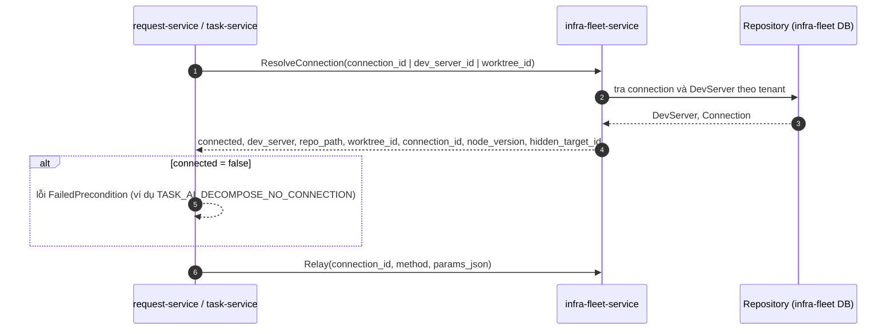
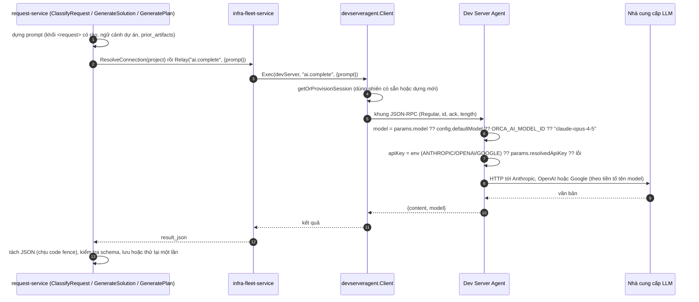
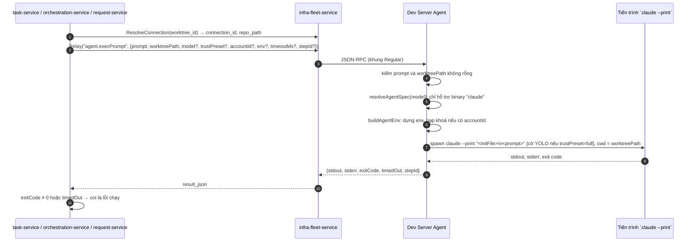
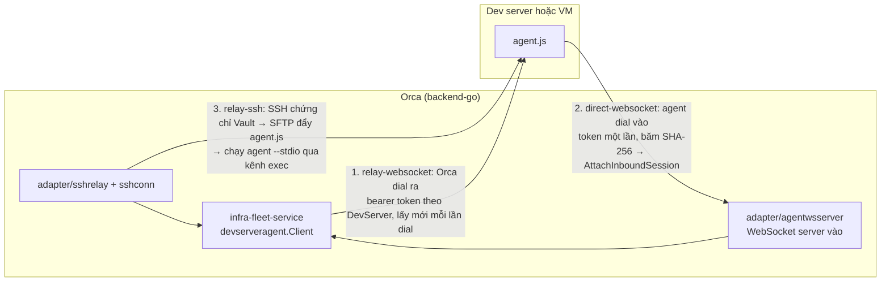
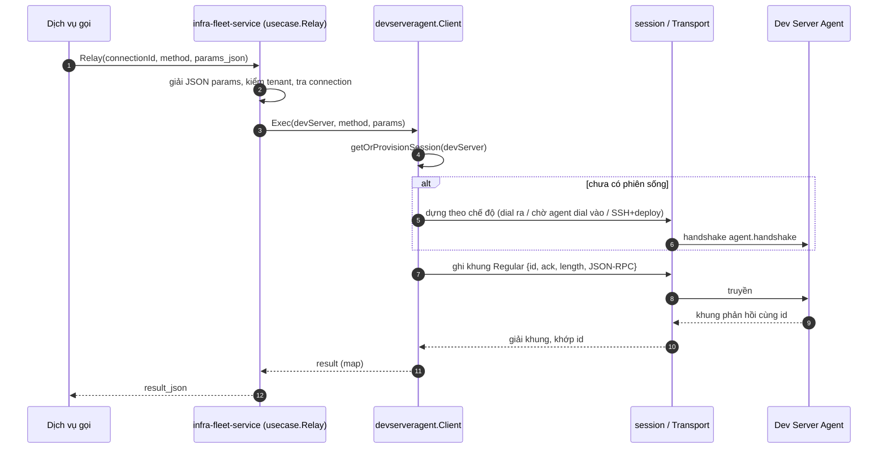

# Các bước dùng AI và luồng kết nối dev server qua agent

| Trường | Giá trị |
|---|---|
| **Ngày** | 2026-10-06 |
| **Loại** | Nghiên cứu (đọc code, chưa chạy hệ thống) |
| **Căn cứ code** | `agent/src/relay/` (`ai-complete-handler.ts`, `agent-rpc-dispatch-ai.ts`, `agent-rpc-dispatch-agent-exec.ts`, `agent-print-mode-exec.ts`, `agent-spawner.ts`, `agent-binary-specs.ts`), `backend-go/services/infra-fleet-service/internal/adapter/{grpc/server.go,devserveragent/}`, `task-service/internal/adapter/grpcclient/{aidecompose_relay.go,simple_executor.go}`, `orchestration-service/internal/adapter/infrafleetclient/worker_dispatcher.go`, `git-gateway-service/internal/adapter/grpcclient/relay_executor.go` |
| **Liên quan** | [solution-plan-execution-walkthrough.md](./solution-plan-execution-walkthrough.md), [CR v6](../../crs/v6/README.md) |

> Các bước AI của Request flow (mục 1) là thiết kế đề xuất trong CR v6. Đường kết nối (mục 2 trở đi) là code hiện có. Mô tả hành vi của agent và infra-fleet đến từ đọc code, chưa chạy thử.

## 1. Các bước dùng AI trong luồng Request

Mọi bước đều đi qua cùng một cổng: `infra-fleet-service` → Dev Server Agent. Backend không có đường gọi LLM trực tiếp: `ai-provider-service` chỉ quản account, không có RPC completion.

| # | Bước | CR | Kiểu gọi | Method Relay | Handler ở agent | Cần worktree |
|---|---|---|---|---|---|---|
| 1 | Phân loại Request (đề xuất loại, size, urgency, confidence) | 005 | Một lượt văn bản → JSON | `ai.complete` | `handleAIComplete` | Không |
| 2 | Sinh Solution nhiều phương án | 007 | Một lượt văn bản → JSON | `ai.complete` | `handleAIComplete` | Không |
| 3 | Chẩn đoán, Findings, Answer (cần đọc repo) | 008 | Chạy CLI agent một lần, chỉ đọc | `agent.execPrompt` | `handleAgentExecPrompt` | Cần `worktreePath` (CR-008 dùng `repo_path`) |
| 4 | Sinh Plan, Phase, task | 012 | Một lượt văn bản → JSON | `ai.complete` | `handleAIComplete` | Không |
| 5 | Thực thi task, Engine 1 (task đơn) | 013 | Chạy CLI agent một lần | `agent.execPrompt` | `handleAgentExecPrompt` | Có, worktree của task |
| 6 | Thực thi task, Engine 2 (có phụ thuộc hoặc con) | 013 | Điều phối từng task con | `agent.execPrompt` mỗi task | `handleAgentExecPrompt` | Có |
| 7 | Thực thi task, Engine 3 (gắn workflow) | 013 | Step `agent` của workflow | `agent.execPrompt` | `handleAgentExecPrompt` | Có |
| 8 | Kiểm tra theo loại (test, đo baseline) | 014 | Task nhãn `check:*` chạy như bước 5, hoặc lệnh trực tiếp | `agent.execPrompt` hoặc `agent.exec` | xem 6.2 | Có |

Ba bước 1, 2, 4 dùng `ai.complete` (văn bản, không đọc repo). Ba bước 3, 5, 6, 7 dùng `agent.execPrompt` (CLI agent đọc và sửa file). Bước 8 chưa được thiết kế chi tiết về đường gọi; xem mục 6.

## 2. Kiến trúc tổng thể

```
request-service ──┐
task-service ─────┤  gRPC: Relay / RelayStream / RelayByDevServer / ResolveConnection
orchestration-svc ┤  (metadata: tenant)
git-gateway-svc ──┘
        │
        ▼
infra-fleet-service
  usecase.Relay → devserveragent.Client.Exec / ExecStream
        │            └ getOrProvisionSession(devServer)  → *session (1 phiên bền mỗi DevServer)
        │
        │  JSON-RPC trên khung nhị phân 13 byte, một trong ba chế độ:
        ├─ relay-websocket : Orca dial ra WebSocket của agent (bearer token theo DevServer)
        ├─ direct-websocket: agent dial vào WebSocket server của Orca (token một lần, băm SHA-256)
        └─ relay-ssh       : SSH (chứng chỉ Vault) → SFTP đẩy agent.js → chạy `--stdio`
        │
        ▼
Dev Server Agent (agent/out/agent.js, trên máy dev server hoặc VM)
  agent-rpc-dispatch → dispatchAiRpc | dispatchAgentExecRpc | ...
        │
        ├─ ai.complete        → gọi HTTP trực tiếp tới Anthropic / OpenAI / Google
        ├─ agent.execPrompt   → spawn `claude --print <prompt>` trong worktree, thu stdout
        ├─ agent.exec         → spawn binary tuỳ ý, thu stdout/stderr
        └─ agent.spawn        → PTY tương tác (node-pty), phát khung stream
```

Hai điểm chốt:
- Dịch vụ nghiệp vụ không bao giờ nói chuyện trực tiếp với dev server. Chỉ `infra-fleet-service` và `git-gateway-service` được nói với mặt phẳng thực thi (ghi chú ở `simple_executor.go`).
- `Relay` là phép chuyển tiếp chung `{connectionId, method, params}`, không dịch method. Tên method do nơi gọi quyết định.

## 3. Chọn connection trước khi gọi



- `task-service` (AIDecompose) gọi `resolver.ResolveConnection(tenant, task.ProjectID)`, tức chọn theo **project**. Project chưa có dev server kết nối thì trả `TASK_AI_DECOMPOSE_NO_CONNECTION`, không trả danh sách rỗng.
- Với `request-service`, CR-007 và CR-012 sao chép đúng mẫu này: chọn connection theo project của Request, lỗi `REQUEST_SOLUTION_NO_CONNECTION` hoặc `REQUEST_PLAN_AI_UNAVAILABLE`.
- Tra theo `worktree_id` cho biết dev server nào đang giữ worktree đó, dùng cho bước thực thi task.

## 4. Luồng `ai.complete` (bước 1, 2, 4)



Hành vi thật của `handleAIComplete` đã đọc:
- Nhận `{prompt, format?: "json"|"text", taskId?, model?, accountId?, resolvedApiKey?}`, trả `{content, model?}`.
- Chọn model theo thứ tự: tham số, cấu hình agent, biến `ORCA_AI_MODEL_ID`, mặc định cứng `claude-opus-4-5`. Client Go hiện chỉ gửi `prompt`, nên model do agent quyết định.
- Khoá API lấy theo thứ tự: biến môi trường của tiến trình agent (`ANTHROPIC_API_KEY`, `OPENAI_API_KEY`, `GOOGLE_API_KEY`), rồi `resolvedApiKey` trong tham số. Nếu chỉ có `accountId` mà thiếu `resolvedApiKey` thì lỗi rõ ràng ("server wiring gap"). Agent không tự giải mã kho credential.
- Không có khoá thì lỗi `No API key found for model ...`.
- Log chỉ ghi độ dài prompt, không ghi nội dung (tránh lộ code và dữ liệu nghiệp vụ).
- Tiền tố model hỗ trợ: `claude`, `gpt`, `o1`, `o3`, `o4`, `gemini`.

## 5. Luồng `agent.execPrompt` (bước 3, 5, 6, 7)



Hành vi thật đã đọc:
- Tham số bắt buộc: `prompt`, `worktreePath`. Thiếu một trong hai thì `InvalidParams`.
- Chỉ model `claude` được hỗ trợ cho chạy một lần (`UNSUPPORTED_MODEL_FOR_ONE_SHOT_EXEC` với model khác). Cờ `--print` của codex, gemini, opencode chưa được kiểm chứng trong code nên bị chặn.
- `trustPreset=full` thêm cờ bỏ qua hỏi quyền (YOLO) của claude; giá trị khác không thêm gì.
- Thời gian chờ: mặc định 5 phút, tối thiểu 1 giây, tối đa 15 phút.
- Xác thực: `resolvedApiKey` luôn rỗng ở đường này vì không có caller backend nào chuyển khoá thô. Nếu có `accountId` mà không có khoá thì `buildAgentEnv` báo lỗi; nếu không có `accountId` thì chạy dựa vào trạng thái đã đăng nhập sẵn của CLI trên dev server.
- Có biến thể streaming `agent.execPromptStream` (khung `stream.chunk`/`stream.end`) cho task cần xem tiến trình, đi qua `RelayStream`.
- Không có tham số chỉ đọc. Muốn chẩn đoán chỉ đọc (CR-008) phải dựa vào prompt, che bí mật và so sánh trạng thái repo trước và sau.

## 6. Các biến thể khác ở agent (không nằm trong luồng chính, nhưng nên biết)

| Method | Mục đích | Ghi chú |
|---|---|---|
| `agent.spawn` | Phiên agent tương tác trong PTY (`claude --output-format stream-json --verbose`, codex, gemini, opencode) | Trả `spawn.accepted` ngay rồi phát khung bất đồng bộ; có `agent.kill`, `agent.sendInput`. Hỗ trợ `resumeId` |
| `agent.exec` | Chạy binary tuỳ ý, thu stdout/stderr | Thời gian chờ tối đa 5 phút. Không có khái niệm prompt hay model |
| `ai.provider.*` | Ghi, đọc, xoá, kiểm tra credential | Dùng cho trang cài đặt AI provider |
| `ai.testProviderConnection` | Kiểm tra account | `ai-provider-service` gọi qua Relay |

### 6.1 Mô hình gọi AI của các dịch vụ hiện có

| Dịch vụ | Method | Dùng cho |
|---|---|---|
| `task-service` (AIDecompose) | `ai.complete` | Chia task |
| `git-gateway-service` | `ai.complete` | Sinh commit message, nội dung PR |
| `task-service` (SimpleExecutor) | `agent.execPrompt` | Engine 1 |
| `orchestration-service` (worker dispatcher) | `agent.execPrompt` | Engine 2, từng task con |
| `workflow-service` | `agent.execPrompt` | Step `agent` của workflow |

### 6.2 Bước 8 (kiểm tra theo loại) chưa rõ đường gọi

CR-REQ-014 chưa được đọc lại trong tài liệu này. Hai khả năng: (a) coi kiểm tra là task nhãn `check:*` và chạy như bước 5 (cần AI), hoặc (b) chạy lệnh test/đo trực tiếp bằng `agent.exec`. Cần xác nhận trong CR-014 trước khi triển khai.

## 7. Ba chế độ kết nối chi tiết



| Chế độ | Ai mở kết nối | Xác thực | Transport | Khi dùng |
|---|---|---|---|---|
| `relay-websocket` | Orca dial ra WebSocket của agent | Bearer token theo từng DevServer, lấy lại mỗi lần dial | WebSocket (`wsTransport`) | Dev server có cổng truy cập được từ Orca |
| `direct-websocket` | Agent dial vào WebSocket server của Orca | Token một lần, băm SHA-256, thành công thì `AttachInboundSession` | WebSocket | Dev server sau NAT hoặc tường lửa, chỉ cho đi ra |
| `relay-ssh` | Orca mở SSH tới `SSHTargetID` | Chứng chỉ SSH cấp bởi Vault; chính kết nối SSH là ranh giới tin cậy, không kiểm token | Stdio của kênh exec SSH, có bộ giải khung tăng dần (stdio không có ranh giới thông điệp) | Máy chỉ có SSH, chưa cài agent (Orca tự đẩy `agent.js`) |

Cả ba chế độ cùng đi đến một `*session` giữ một `Transport` sống. Phần `Exec` và `Health` không phân biệt chế độ.

### 7.1 Khung truyền

Mỗi khung có header 13 byte: `[TYPE u8][ID u32BE][ACK u32BE][LENGTH u32BE]` rồi payload JSON-RPC.
- `TYPE`: `1` = Regular (JSON-RPC), `9` = KeepAlive.
- Mỗi bên đánh số `ID` tăng dần và gửi `ACK` là số lớn nhất của đối phương đã nhận.
- Kích thước thông điệp tối đa 16 MiB; khung quá lớn bị từ chối hoặc bỏ.
- Bắt tay: Orca (bên khởi tạo) và agent trao đổi `agent.handshake` như một cặp JSON-RPC thường (relay-websocket), không dùng loại khung riêng. Riêng relay-ssh có biến thể bắt tay phía nhận.
- Vòng đọc (`readLoop`) định tuyến thông báo từ agent: PTY, hook agent, screencast, theo dõi file, đến đúng người đăng ký; phản hồi JSON-RPC thường trả về lời gọi đang chờ.
- Kết nối lại tự động với độ trễ tối đa 60 giây.

### 7.2 Vòng đời một lời gọi `Relay`



`RelayStream` giống trên nhưng trả nhiều khung (`stream.started`, `stream.chunk`, `stream.end`) qua một stream gRPC; `RelayByDevServer` bỏ bước tra connection mà chọn thẳng theo `dev_server_id`.

## 8. Hệ quả cho thiết kế Request flow

| Ràng buộc | Hệ quả |
|---|---|
| Mọi bước AI cần dev server **đang kết nối** | Request chưa có project hoặc project chưa có dev server thì không phân loại, sinh Solution, lập Plan được. UI nên báo rõ và cho thử lại |
| `ai.complete` lấy khoá từ **môi trường của tiến trình agent** (hoặc `resolvedApiKey` mà backend hiện không gửi) | Mỗi dev server phải có `ANTHROPIC_API_KEY` (hoặc khoá của nhà cung cấp tương ứng) trong môi trường agent. Cấu hình qua trang AI provider chưa chắc đã đến được `ai.complete` |
| Client Go không gửi `model` | Model là mặc định `claude-opus-4-5` hoặc theo cấu hình agent. Muốn chọn model theo bước thì phải thêm tham số ở cả `request-service` và kiểm tra khoá tương ứng |
| `agent.execPrompt` chỉ chạy `claude`, bắt buộc có `worktreePath` | `spike` và `question` không có worktree riêng: CR-008 phải dùng `repo_path` của project, hoặc chờ thay đổi phía agent. Model khác claude không chạy được ở đường này |
| `agent.execPrompt` dựa vào đăng nhập sẵn của CLI | Dev server mới chưa đăng nhập `claude` sẽ lỗi ở bước thực thi dù `ai.complete` vẫn chạy được (hoặc ngược lại) |
| Thời gian chờ: execPrompt 5 phút mặc định, tối đa 15 phút | Task dài hơn 15 phút bị cắt. Các giá trị timeout của CR (`REQUEST_AI_COMPLETE_TIMEOUT` 120 giây) chưa đối chiếu với timeout của gRPC và của agent |
| Không có cờ chỉ đọc | Chẩn đoán chỉ đọc là thoả thuận bằng prompt, không phải kỹ thuật ép buộc |
| Phiên bền theo từng DevServer, kết nối lại tự động | Lời gọi trong lúc mất kết nối có thể lỗi; đối soát và retry của CR-013 là cần thiết |
| Hỗ trợ SSH/remote sẵn có (ba chế độ) | Không cần đường mới cho Request flow; nhưng `relay-ssh` đẩy `agent.js` mỗi lần dựng phiên, ảnh hưởng độ trễ lần gọi đầu |

## 9. Chưa kiểm chứng

- Thời gian chờ của lời gọi `Relay` ở `usecase.Relay` và của `ai.complete` phía agent: không tìm thấy hằng số timeout trong các file đã đọc.
- `ResolveConnection` theo `project_id` ở `task-service` đi qua cổng `resolver` nào và có chọn dev server nào khi project có nhiều: chỉ thấy lời gọi, chưa đọc cài đặt.
- `ai.complete` đối với Anthropic có truyền `format=json` thành chế độ JSON của API hay chỉ dặn trong prompt: chưa đọc `callAnthropic`.
- Hành vi `buildAgentEnv` khi `accountId` rỗng và dev server chưa đăng nhập `claude`.
- Tách bạch đường khoá giữa trang AI provider (credential store, mã hoá lớp 1 ở trình duyệt) và `ai.complete` (cần khoá thô): code nói rõ agent không giải mã được, và không thấy caller backend nào chuyển `resolvedApiKey`. Cần xác nhận trên môi trường thật khoá đến agent bằng đường nào.
- Số dev server, độ trễ, tỉ lệ lỗi thực tế: chưa đo.
