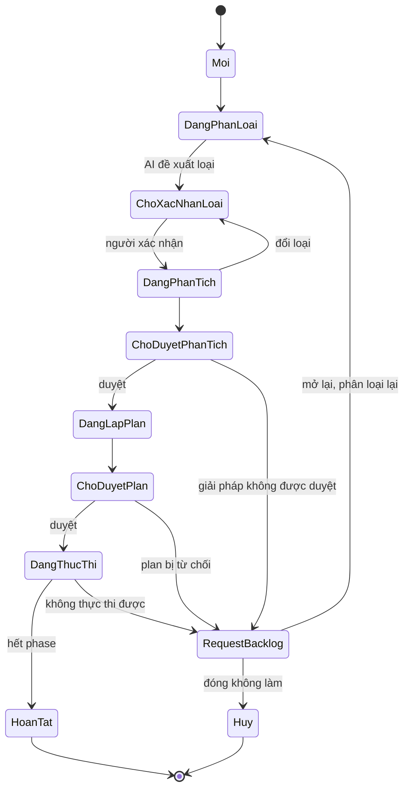

# Phân loại Request và luồng xử lý theo loại

| Trường | Giá trị |
|---|---|
| **Ngày** | 2026-10-05 |
| **Loại** | Đề xuất thiết kế (chưa phải CR, chưa có code) |
| **Đã chốt với người yêu cầu** | Phân loại bằng AI đề xuất + người xác nhận; chỉ Change Request bắt buộc đi đủ Solution → Plan → Phase; đổi loại giữa chừng được phép và giữ phần đã làm |
| **Liên quan** | [request-to-task-pipeline-gap-analysis.md](./request-to-task-pipeline-gap-analysis.md) |

Nguyên tắc: phân loại theo **độ không chắc chắn của giải pháp**, không theo tên loại. Việc đã rõ cách làm thì không cần so sánh phương án; việc chưa rõ nguyên nhân thì cần chẩn đoán trước khi lập kế hoạch.

## 1. Phân loại

**Trục chính, 11 loại.**

Sáu loại lõi:

| Loại | Câu hỏi quyết định | Kết quả cuối |
|---|---|---|
| `change_request` | Hành vi mới hoặc đổi, có nhiều cách làm? | Code đã merge |
| `bug` | Hành vi hiện tại sai so với kỳ vọng? | Fix kèm test hồi quy |
| `hotfix` | Bug đang ảnh hưởng production, cần sửa ngay? | Fix đã lên, review sau |
| `task` | Việc đã rõ cách làm, không cần chọn giải pháp? | Việc hoàn tất |
| `spike` | Cần tìm hiểu, chưa biết làm gì? | Báo cáo Findings, không có code |
| `question` | Chỉ cần câu trả lời? | Câu trả lời, không đổi code |

Năm loại bổ sung:

| Loại | Khác biệt so với loại gần nhất |
|---|---|
| `refactor` | Như `change_request` nhưng không đổi hành vi. Đóng khi test cũ vẫn xanh. |
| `security` | Như `bug`. Bắt buộc người xác nhận mức độ, có cổng trước deploy. |
| `performance` | Bắt đầu bằng đo baseline, đóng bằng đo lại so với baseline. |
| `docs` | Như `task`: chỉ duyệt danh sách task rồi chạy. |
| `ops_request` | Release, cấu hình, sửa dữ liệu. Cần runbook kèm rollback và cổng trước bước không đảo ngược được. |

**Hai thuộc tính phụ**, AI đề xuất cùng lúc, quyết định độ nặng của luồng:

- `size`: S / M / L (số repo, số module, có đổi schema hay API hay không).
- `urgency`: normal / urgent. `hotfix` thực chất là `bug` + `urgent` + ảnh hưởng production, nên người xác nhận phải thấy rõ lý do.

**Cách phân loại.** Agent đọc nội dung Request và đề xuất `{type, size, urgency, confidence, lý do}`. Issue type của Jira và label của GitHub chỉ là gợi ý đầu vào. Người dùng xác nhận hoặc sửa; bước này bắt buộc cho `hotfix` và `security`. Ở phiên bản đầu không cho bỏ bước xác nhận, kể cả với `question` và `task` size S.

## 2. Luồng theo loại

`▣` = cổng người duyệt.

```
change_request: Phân loại▣ → Solution (≥2 phương án)▣ → Plan▣ → Phase+Task▣ (mỗi phase) → Thực thi → cập nhật Plan/Solution/Request
bug:            Phân loại▣ → Chẩn đoán (nguyên nhân gốc, cách tái hiện)▣ → Fix plan (fix + test hồi quy)▣ → [Phase nếu size L] → Task → Thực thi → Verify
hotfix:         Phân loại▣ (bắt buộc người) → Chẩn đoán nhanh → Task fix → ▣ trước deploy → Thực thi → Review sau → sinh Bug/Chore theo dõi
task:           Phân loại▣ → Task list▣ → Thực thi → Đóng
spike:          Phân loại▣ → Tìm hiểu → Findings▣ → Đóng (có thể sinh Request con, không sinh Task)
question:       Phân loại▣ → Trả lời → người dùng chấp nhận▣ → Đóng (không worktree, không Task)
refactor:       Phân loại▣ → Solution (hướng tái cấu trúc)▣ → Plan▣ → [Phase nếu size L] → Task → Thực thi → Đóng khi test cũ xanh
security:       Phân loại▣ (xác nhận mức độ) → Chẩn đoán (phạm vi ảnh hưởng)▣ → Fix plan▣ → Task → ▣ trước deploy → Thực thi → Kiểm lại, ghi nhận
performance:    Phân loại▣ → Chẩn đoán (đo baseline)▣ → Plan tối ưu▣ → Task → Thực thi → Đo lại so với baseline
docs:           Phân loại▣ → Task list▣ → Thực thi → Đóng
ops_request:    Phân loại▣ → Plan (runbook + rollback)▣ → Task (các bước) → ▣ trước bước không đảo ngược → Thực thi → Ghi kết quả
```

Sơ đồ trực quan: artifact "Orca Request Flow" (https://claude.ai/artifact/BA4VLSbcLp25YSK9LQFiBx, riêng tư).

## 3. Máy trạng thái của Request

Mọi loại dùng chung một máy trạng thái. Loại chỉ quyết định trạng thái nào được bỏ qua.



Trạng thái duyệt (`ChoXacNhanLoai`, `ChoDuyetPhanTich`, `ChoDuyetPlan`) là cổng người dùng. Đổi loại có thể xảy ra ở mọi trạng thái đang xử lý và quay về `ChoXacNhanLoai` (sơ đồ chỉ vẽ một mũi tên cho gọn).

Cách mỗi loại đi qua máy trạng thái:

| Loại | Đang phân tích | Chờ duyệt phân tích | Đang lập plan | Chờ duyệt plan | Đang thực thi |
|---|---|---|---|---|---|
| `change_request` | Solution (≥2 phương án) | duyệt Solution | Plan, Phase, Task | duyệt Plan, rồi từng phase | chạy từng phase |
| `bug` | Chẩn đoán | duyệt Chẩn đoán | Fix plan (Phase chỉ khi L) | duyệt Fix plan | chạy task, verify |
| `hotfix` | Chẩn đoán nhanh | bỏ qua | bỏ qua (1 task) | cổng trước deploy | chạy; sau đó review, sinh Bug/Chore |
| `task` | bỏ qua | bỏ qua | danh sách task | duyệt danh sách task | chạy |
| `spike` | Tìm hiểu | duyệt Findings | bỏ qua | bỏ qua | không có; đóng, có thể sinh Request con |
| `question` | Trả lời | người dùng chấp nhận | bỏ qua | bỏ qua | không có |
| `refactor` | Solution (hướng) | duyệt Solution | Plan (Phase chỉ khi L) | duyệt Plan | chạy; đóng khi test cũ xanh |
| `security` | Chẩn đoán phạm vi ảnh hưởng | duyệt Chẩn đoán | Fix plan | cổng trước deploy | chạy, kiểm lại |
| `performance` | Chẩn đoán, đo baseline | duyệt Chẩn đoán | Plan tối ưu | duyệt Plan | chạy; đo lại so với baseline |
| `docs` | bỏ qua | bỏ qua | danh sách task | duyệt danh sách task | chạy |
| `ops_request` | bỏ qua | bỏ qua | Plan: runbook + rollback | duyệt Plan | chạy; cổng trước bước không đảo ngược |

## 4. Đổi loại giữa chừng

Đổi loại ghi vào lịch sử `type_history`: loại cũ, loại mới, người đổi, lý do, thời điểm. Solution, Plan, Task đã sinh không bị xoá, chuyển thành tham chiếu.

| Từ | Sang | Khi nào | Phần mang theo |
|---|---|---|---|
| `bug` | `change_request` | Chẩn đoán cho thấy phải đổi thiết kế, hoặc size L | Chẩn đoán thành đầu vào của Solution |
| `task` | `change_request` | Size L hoặc đụng nhiều repo | Danh sách task đã soạn làm tham chiếu |
| `spike`, `question` | `change_request`, `task` | Kết quả lộ ra việc cần làm | Sinh Request con, liên kết ngược Request gốc |
| `refactor`, `performance` | `change_request` | Đổi hành vi hay kiến trúc | Chẩn đoán, số đo baseline thành đầu vào của Solution |
| `security` | `hotfix` | Đang bị khai thác trên production | Chẩn đoán phạm vi ảnh hưởng, đi tiếp luồng hotfix |
| `docs` | `task`, `change_request` | Việc hoá ra kèm đổi code | Danh sách task đã soạn |
| `hotfix` | `bug`, `task` | Luôn có, sau khi bản fix đã lên | Request theo dõi mới, liên kết với hotfix |

## 5. Trả về Request backlog

Mỗi lần trả về ghi: `returned_from_stage` (solution, plan, phase, task), `reason`, `actor`, và liên kết Request gốc. Request backlog nhóm theo lý do: thiếu thông tin, không khả thi, bị chặn bởi phụ thuộc, bị từ chối. Từ backlog có thể mở lại (quay về phân loại) hoặc hủy.

## 6. Hiện trạng Orca cho các loại này

Theo docs, chưa kiểm tra code.

- **Phân loại loại Request:** chưa có.
- **Luồng đủ cho `change_request`:** một phần, chỉ vòng spec → duyệt → code theo task ([BL-TG-05](../../logic/task-graph/BL-TG-05-spec-approve-build-loop.md)).
- **`task`, `docs`:** gần nhất với `task.execute` hiện có, nhưng chưa qua bước Request.
- **Cổng duyệt tổng quát:** `DecisionGate` có bảng và event, chưa có UI. Step `approval` của workflow không có backend ([BACKLOG-027](../../backlog/BACKLOG-027-workflow-approval-step-type-removal-decision.md)).
- **`bug`, `hotfix`, `security`:** có đồng bộ trạng thái Jira (In Progress, In Review, Done). Chưa có luồng Chẩn đoán.
- **`spike`, `question`:** chưa thấy trong docs. Cần xác nhận agent chạy được khi không có worktree.
- **`performance`, `ops_request`:** chưa thấy trong docs, kể cả cơ chế đo baseline hay chạy runbook có rollback.

## 7. Cần chốt trước khi viết CR

1. **Bug size L:** AI đề xuất nâng lên `change_request`, người dùng quyết định.
2. **Hotfix:** vẫn có một cổng trước deploy, không merge trước khi duyệt.
3. **Ngưỡng confidence** để cho phép bỏ bước xác nhận phân loại với loại rủi ro thấp. Đề xuất phiên bản đầu: chưa bỏ.
4. **Loại bổ sung:** người yêu cầu còn có thể thêm loại khác (cấp quyền, dọn dữ liệu, tích hợp mới).
5. **Mô hình dữ liệu (đã chốt 2026-10-05):** `request-service` riêng sở hữu Request, Solution, `RequestTypeHistory`, Approval; Plan và Phase là Task với `type` mới. Chi tiết và việc còn mở: [request-pipeline-existing-capabilities-and-build-scope.md](./request-pipeline-existing-capabilities-and-build-scope.md) mục 4 và 6.
