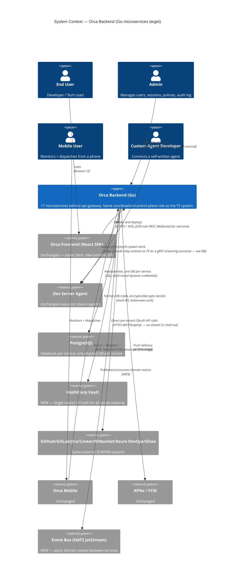
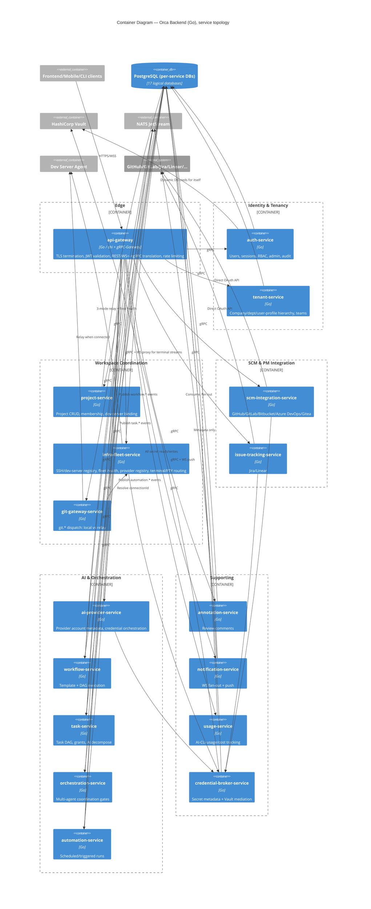

# C4 HLD — Target Go Microservices System

**Model:** C4 Architecture (Simon Brown). Companion to
[`specs/backend/api/backend-hld-c4.md`](../../backend/api/backend-hld-c4.md)
(the TS system this replaces) — read that first if you haven't; this
document assumes the same actor/external-system set and only changes what's
inside the `backend` system boundary.

## C1 — System Context

Unchanged from the TS system at the context level: same actors (end user,
admin, mobile user, custom agent developer), same external systems (Dev
Server Agent, GitHub/GitLab/Jira/Linear/Bitbucket/Azure DevOps/Gitea, mobile
push, database). Two additions:

**What changed vs. the TS context:** Vault and the event bus are new
first-class external dependencies. GitHub/GitLab move from
"self-executed CLI in-process" to "direct API calls" (closing TS Gap 1 by
construction — there's no CLI shell-out option in the Go design at all).

## C2 — Container (service topology)

## C3 — Component

Component-level breakdowns live in each service's own doc under
[`services/`](../services/) — every service doc includes a Clean
Architecture package diagram (domain/usecase/adapter layers) per the
convention in
[`03-clean-architecture-guidelines.md`](./03-clean-architecture-guidelines.md).
This document doesn't duplicate 17 component diagrams; it stops at the
container level, matching how `backend-hld-c4.md` scoped its own C3 section
to the two richest containers rather than every one.
