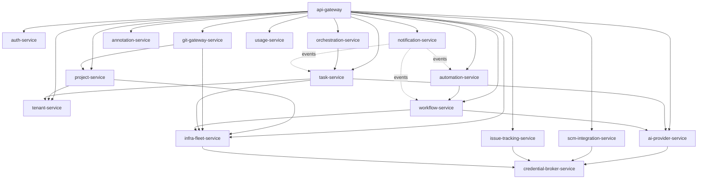

# Microservices Decomposition

**Inputs treated as binding:** [ADR-021](../../../docs/adrs/v2/ADR-021-unified-postgres-microservices-platform.md)'s
13-schema service map, [`business-capabilities.md`](../../backend/api/business-capabilities.md)'s
domain catalog, and [`backend-agent-target-architecture.md`](../../backend/api/backend-agent-target-architecture.md)'s
coordination/execution split. This document does not re-derive service
boundaries from scratch where those already exist — it adopts ADR-021's 13
data-owning services and adds the execution/gateway-facing services ADR-021
didn't cover (it scoped itself to Postgres-backed data only).

## Design principles

1. **One service, one bounded context, one database.** No service reads
   another service's tables directly — cross-service references are
   "logical FKs" (an ID value, validated by calling the owning service's
   API), exactly the pattern ADR-021 already established for
   `orca_project_source_projects.project_id` and
   `orca_tasks.active_execution_task_id`.
2. **Physical database-per-service**, not schema-per-service-in-one-instance.
   ADR-021 chose schema-per-service as a *pragmatic intermediate step* for
   the existing TS system (Phase 3 of that ADR explicitly defers real
   separation). Since this is a ground-up Go build with no existing shared
   instance to migrate incrementally, there's no reason to inherit that
   compromise — each service gets its own PostgreSQL database (own
   connection pool, own Vault-issued dynamic credentials, own migration
   history, own backup/restore policy, independently scalable). See
   [`05-data-architecture.md`](./05-data-architecture.md).
3. **A service owns exactly the data it's the system of record for.** Where
   the TS system historically let one class (`Store`, the ~3900-line
   `persistence.ts`) own many unrelated domains in one JSON blob, this
   redesign draws the boundary at the business-capability level, matching
   `business-capabilities.md`'s own grouping.
4. **No service is a thin CRUD wrapper with no logic.** Where a TS RPC
   namespace is purely a metadata table with no business rules of its own
   (rare), it's folded into the closest service that owns related workflow
   logic rather than shipped as its own deployable.

## Service catalog

### Data-owning services (from ADR-021, Go-idiomatic naming)

| # | Go service | ADR-021 schema | Owns | TS equivalent |
|---|------------|-----------------|------|----------------|
| 1 | `auth-service` | `auth` | Users, sessions, audit log, access policies, **admin console** (folded in — admin operations are auth/RBAC operations on the same data) | `AuthManager`, `backend/src/main/admin/` |
| 2 | `tenant-service` | `tenant` | Companies, departments, user profiles (3-layer resolution), teams, team membership | `ProfileResolver`, `TeamService` |
| 3 | `project-service` | `project` | Projects, project membership, project↔dev-server binding, source-project sharing | `ProjectService` |
| 4 | `infra-fleet-service` | `infra` | SSH targets, dev server registry, connection lifecycle, port-forwards, fleet health/bootstrap, **provider registry + terminal/PTY session routing** (folded in — both are "which host owns this `connectionId`" logic) | `ssh/`, `providers/`, `terminal.*` coordination, `FleetHealthMonitor` |
| 5 | `ai-provider-service` | `ai_provider` | Provider account metadata, usage/quota tracking, credential-write orchestration (delegates actual secret storage to Vault via `credential-broker-service`) | `AIProviderService`, `ProviderResolver`, `ProviderHealthChecker` |
| 6 | `workflow-service` | `workflow` | Templates, executions, step executions, DAG build/dispatch | `WorkflowOrchestrator`, `DAGBuilder`, `StepExecutors` |
| 7 | `task-service` | `task` | Task DAG, edges, grants, comments, AI decomposition | `TaskService`, `TaskDAGValidator`, `TaskGrantService`, `TaskAIPlanner` |
| 8 | `orchestration-service` | `orchestration` | Multi-agent coordination: messages, dispatch contexts, decision gates, coordinator runs | `PgOrchestrationDb`, `runtime/orchestration/` |
| 9 | `automation-service` | `automation` | Scheduled/triggered automation definitions + run history | `AutomationService` — **and**, unlike the TS system, execution actually works: automation runs dispatch through the same step-execution path `workflow-service` uses (closes TS Gap 3, see [`backend-agent-target-architecture.md`](../../backend/api/backend-agent-target-architecture.md)) |
| 10 | `annotation-service` | `annotation` | Inline code-review comments | `annotation-store.ts` |
| 11 | `notification-service` | `notification` | In-app event fan-out, push subscriptions, VAPID public metadata (private key held in Vault, never this DB) | `WebPushManager`, `PgWebPushStore` |
| 12 | `usage-service` | `usage` | AI-CLI usage/cost tracking (Claude/Codex/OpenCode sessions + daily rollups) | `ClaudeUsageStore`, `CodexUsageStore` |
| 13 | `credential-broker-service` | `credential` | Secret **metadata only** (rotation state, scope, Vault path references, audit trail) — mediates every read/write of actual secret material through Vault; never itself persists plaintext or ciphertext. See [`06-secrets-vault-architecture.md`](./06-secrets-vault-architecture.md) | The 5 fragmented mechanisms in [`05-credential-secret-stores.md`](../../backend/models/05-credential-secret-stores.md) |

### Execution/gateway-facing services (new — not covered by ADR-021)

ADR-021 scoped itself to "server-mode data plane" — Postgres-backed
business data. It has nothing to say about the RPC namespaces that are
mostly dispatch logic with little or no owned data (`git.*`, `github.*`,
`terminal.*`) or about the client-facing edge. Those need service homes too:

| # | Go service | Responsibility | TS equivalent | Design note |
|---|------------|-----------------|----------------|-------------|
| 14 | `api-gateway` | Edge: terminates HTTPS/WSS from browser/mobile/CLI, JWT validation, request routing to internal gRPC services, response aggregation, WebSocket session management | `runtime/rpc/dispatcher.ts`, `WsSessionRouter`, `http-server.ts` | Replaces the RPC method-namespace dispatch; owns no business data itself |
| 15 | `git-gateway-service` | `git.*` — resolves a worktree's owning host, executes locally or relays to the target's Dev Server Agent | `git.ts` RPC methods, dynamic dispatch pattern | Stateless dispatcher; calls `project-service`/`infra-fleet-service` to resolve `connectionId` |
| 16 | `scm-integration-service` | GitHub/GitLab/Bitbucket/Azure DevOps/Gitea — issue/PR/MR CRUD, hosted review | `github/`, `gitlab/`, `bitbucket/`, `azure-devops/`, `gitea/`, `hosted-review/` | **Closes TS Gap 1**: direct per-tenant OAuth HTTP clients from day one, no shared-keychain CLI shell-out (see [`backend-agent-target-architecture.md`](../../backend/api/backend-agent-target-architecture.md)) |
| 17 | `issue-tracking-service` | Jira/Linear | `jira/`, `linear/` | Already the correct shape in TS (direct API, per-user creds) — carried forward as-is, just in Go |

**Total: 17 services.** Every domain in `business-capabilities.md` maps to
exactly one of these — see
[`migration/domain-capability-service-mapping.md`](../migration/domain-capability-service-mapping.md)
for the exhaustive mapping.

## What's deliberately *not* a separate service

- **The Dev Server Agent's role** (PTY execution, filesystem, git exec,
  AI-CLI spawn on the target host) stays out of this decomposition — it's
  the execution plane, a different system (`agent/` today), not part of
  `backend/`'s Go rewrite. `infra-fleet-service` and `git-gateway-service`
  are the Go backend's *client* of that plane, using the same relay
  contract the TS system uses today (see
  [`08-inter-service-communication.md`](./08-inter-service-communication.md)).
- **A standalone "credential store" holding secret values** — Vault itself
  is that store (an external system, not one of the 17). `credential-broker-service`
  is a thin metadata/mediation layer in front of it, not a duplicate vault.
  Collapsing all secrets into one more application-tier service would
  recreate the single-point-of-compromise problem Vault is meant to solve.
- **Browser/computer/emulator automation** — per
  [`backend-agent-target-architecture.md`](../../backend/api/backend-agent-target-architecture.md)
  Gap 6, this automates the backend host's own machine (Electron
  `webContents`, macOS accessibility, ADB/`simctl`). It has no sensible home
  in a stateless, horizontally-scaled Go microservice fleet — this is a
  **product decision to make before porting**, not a mechanical translation.
  Default recommendation: **out of scope for the Go server deployment**
  entirely (same conclusion the TS gap analysis reached for the multi-user
  case).
- **`ai-vault.*` (local AI-CLI session-transcript scanning)** — this reads
  the *backend host's own filesystem* for locally-installed CLI session
  history, which doesn't make sense in a stateless multi-replica Go service.
  Not carried forward; flag to product if this capability is still needed
  and figure out where transcripts would need to live for a server
  deployment to expose it at all.
- **`workspacePorts.*`** — folded into `infra-fleet-service` (it's a fleet
  connectivity concern), fixing the TS gap where it silently dropped
  connectionId-bound worktrees instead of relaying (Gap 7).

## Dependency graph (who calls whom)

Solid arrows: synchronous gRPC calls. Dotted: async, via the event bus (see
[`08-inter-service-communication.md`](./08-inter-service-communication.md)).
`auth-service` and `tenant-service` are called by nearly everything for
identity/tenant resolution — per ADR-021 §"Phase 3" ordering, these are the
**highest-risk, do-last** services if this is ever rolled out incrementally
against a live system, since correctness of every other service depends on
them.
