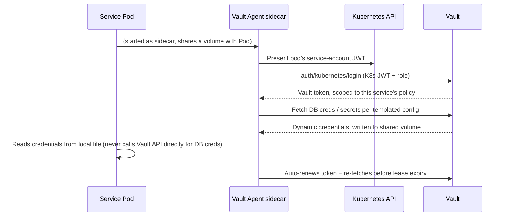

# Secrets — HashiCorp Vault

## What this replaces

The TS system has **5 independent, inconsistent secret mechanisms**
([`specs/backend/models/05-credential-secret-stores.md`](../../backend/models/05-credential-secret-stores.md)):
per-user AES-256-GCM files (`WebCredentialStore`), Electron `safeStorage`,
direct OS Keychain calls, an encrypted-blob-over-relay scheme for AI
provider keys, and in-memory-only SSH passphrases — each with its own key
management, its own blast radius, and (per that survey) **no SQL table
anywhere contains a secret value**, meaning there's also no single place to
audit "who read which secret when." The user's requirement to use Vault for
"dữ liệu nhạy cảm" (sensitive data) is this redesign's chance to collapse
all five into one audited, centrally-managed mechanism instead of carrying
the fragmentation forward.

## What goes in Vault vs. Postgres

| Data | Where | Why |
|------|-------|-----|
| User passwords | Never stored at all — `auth-service` stores only a bcrypt hash in its own Postgres (hashes are not secrets in the Vault sense; they're one-way and the whole point is they don't need to be *retrieved*) | Standard practice |
| Session tokens / JWT signing keys | Vault Transit engine (signing key never leaves Vault) | `auth-service` calls Vault to sign, never holds the private key in memory long-term |
| Dynamic PostgreSQL credentials (every service's DB connection) | Vault's Database secrets engine | Short-lived, auto-rotated, auditable per-service credential issuance — replaces static passwords in config entirely |
| Integration OAuth tokens (GitHub/GitLab/Bitbucket/Azure DevOps/Gitea/Jira/Linear) | Vault KV v2, one path per `(tenant, service, user)` | Direct replacement for `WebCredentialStore`'s per-user encrypted files — same access granularity, centrally managed instead of scattered files |
| AI provider API keys (Anthropic/OpenAI/etc.) | Vault Transit engine for encrypt/decrypt-as-a-service, ciphertext reference stored in `ai-provider-service`'s Postgres, plaintext never touches application memory longer than the single call that needs it | Closes TS Gap 2 (`backend-agent-target-architecture.md`) by construction — no service ever holds a plaintext key at rest, and unlike the TS relay-based scheme, decrypt is always mediated by Vault policy, not implicit trust in whichever process holds a local `.enc` file |
| SSH credentials for dev servers | Vault SSH secrets engine (signed short-lived SSH certificates) where the target supports certificate auth; static per-target key material otherwise, stored in KV v2 | Removes long-lived SSH private keys from `infra-fleet-service`'s filesystem/database entirely |
| VAPID private key (Web Push signing) | Vault Transit engine | Same reasoning as JWT signing above — `notification-service` asks Vault to sign push payloads, the private key material never leaves Vault at all, not even into that service's memory |
| Webhook signing secrets, service-to-service shared secrets | Vault KV v2 | Consistent with everything else — no more "3 field-level `safeStorage` calls scattered across modules" |
| Non-secret metadata (rotation timestamp, credential status, scope, which Vault path a credential lives at) | `credential-broker-service`'s Postgres | Never the secret value itself — a pointer + bookkeeping, matching ADR-021 §4's "metadata only" principle for the `credential` schema |

## `credential-broker-service`'s role

No other service talks to Vault directly for **tenant/user secret
material** (integration tokens, AI provider keys) — they all go through
`credential-broker-service`'s gRPC API (`WriteCredential`, `ResolveCredential`,
`RotateCredential`, `RevokeCredential`). Reasons:

1. **Single audit point.** Every secret access in the system goes through
   one service's logs, not 6 services each independently calling Vault.
2. **Consistent policy enforcement.** Rate limiting, anomaly detection
   ("this credential is being resolved 100x more than usual"), and
   revocation-on-suspicion logic live in one place.
3. **Vault policy simplicity.** Vault's own ACL policies grant
   `credential-broker-service`'s Vault identity access to the relevant KV/
   Transit paths; every other service's Vault identity is scoped *only* to
   its own dynamic-DB-credential lease, not to any tenant secret path at
   all. A compromised `workflow-service` pod cannot read GitHub tokens even
   if it wanted to — it has no Vault policy granting that path.

**Exception — dynamic DB credentials**: every service (not just
`credential-broker-service`) talks to Vault directly for *its own* Postgres
credentials via the Database secrets engine. This is infrastructure
bootstrapping (a service getting its own DB password), not tenant secret
material, and routing it through another service would create a bootstrap
circular dependency (credential-broker-service needs its own DB credential
too — from whom?).

## Vault engines used

| Engine | Purpose |
|--------|---------|
| **Database secrets engine** | Issues short-lived Postgres roles/passwords per service, per lease. Vault rotates the underlying Postgres role's password on schedule; a service's `pgxpool` is configured to re-fetch credentials before lease expiry (via Vault Agent sidecar, not hand-rolled polling) |
| **Transit engine** | Encrypt-as-a-service for AI provider keys, JWT signing, and VAPID push-payload signing — plaintext key material sent to Vault for a single encrypt/decrypt/sign operation, never persisted by the calling service |
| **KV v2** | Static secret storage for OAuth tokens, SSH static keys, service-to-service shared secrets — versioned, so a bad credential write can be rolled back to the prior version |
| **SSH secrets engine** | Signs short-lived SSH certificates for `infra-fleet-service` to authenticate to dev servers that support certificate-based auth, instead of holding a long-lived private key |
| **Kubernetes auth method** | How every service authenticates *to* Vault in the first place — a pod's Kubernetes service-account token is exchanged for a Vault token scoped by that service's Vault policy. No static Vault tokens in config/images/secrets-manifests |

## Auth flow (service → Vault)

Using the Vault Agent sidecar (rather than each service embedding its own
token-refresh logic) keeps token lifecycle management out of application
code entirely — a service's `adapter/postgres/` layer just reads a
credentials file that's always current, which also means the same code path
works identically in local dev (against a `vault dev` instance) and
production.

## Rotation & revocation

- **Dynamic DB credentials**: rotated automatically by Vault's lease
  mechanism — no manual process, default lease TTL 1h with auto-renewal, max
  TTL 24h forcing periodic re-auth even if a pod somehow never restarts.
- **AI provider keys / OAuth tokens**: rotation initiated by the user
  (`aiProvider.rotateKey` equivalent) or by `credential-broker-service`
  detecting an expiry/failure signal from a health check. Old version stays
  valid for the grace period the TS system already implements
  (`rotation_grace_until`, `orca_ai_provider_accounts` migration 0015) —
  same design carried forward, backed by KV v2's version history instead of
  a single mutable column.
- **Compromise response**: revoking a Vault policy or a specific KV path
  version immediately cuts off access without needing to touch the
  requesting service at all — a meaningful operational improvement over the
  TS system, where revoking a leaked `WebCredentialStore` file requires
  deploying a code/data change.

## What does NOT change at the edge

The user-facing credential-write flow (browser encrypts before sending,
server never sees plaintext in transit) is preserved: the browser still
encrypts a new AI provider key client-side before it reaches
`api-gateway`; `credential-broker-service` decrypts that transport-layer
envelope only in the single request handling that write, then immediately
re-encrypts via Vault Transit for at-rest storage — plaintext exists in
memory for the duration of one request, never logged, never on disk.
