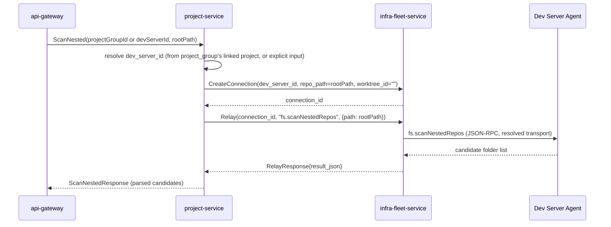

# SOL-021: Wire `projectGroup.*`'s 4 working RPCs; add `moveProject`/`scanNested`/`importNested` relayed through the dev server, not the backend host

**Resolves:** [BUG-021](../BUG-021-projectgroup-channels-not-implemented.md)
**Service:** `project-service` (3 new RPCs, 1 proto field addition) + `api-gateway` (`wscompat` wiring for all 7)
**Affected files (proposed):**
- `backend-go/proto/orca/project/v1/project.proto`
- `backend-go/services/project-service/internal/domain/project_group.go`
- `backend-go/services/project-service/internal/usecase/ports.go` (extend `ProjectRepository`; new `InfraFleetClient`/`DevServerRelay` port)
- `backend-go/services/project-service/internal/usecase/move_project.go` (new)
- `backend-go/services/project-service/internal/usecase/scan_nested.go` (new)
- `backend-go/services/project-service/internal/usecase/import_nested.go` (new)
- `backend-go/services/project-service/internal/adapter/grpcclient/infrafleet.go` (new outbound client)
- `backend-go/services/project-service/internal/adapter/postgres/*.go`
- `backend-go/services/api-gateway/internal/adapter/wscompat/channels.go` (new `registerProjectGroupChannels`)
**Status:** 📋 Proposed — not yet implemented

---

## Two independent pieces: 4 pure-wiring channels, 3 that need new RPCs

### The 4 wiring-only channels

BUG-021 confirmed `create`/`update`/`delete`/`list` are fully built
end-to-end (usecase, REST proxy at `/v1/project-groups`) and only missing a
`wscompat` registration — identical shape to SOL-020's 4 `project.*`
wiring-only channels. No proto/usecase/repository change needed.

### The 3 new channels — no RPC exists anywhere, and `moveProject` needs a proto field too

Unlike SOL-019/SOL-020, `project-service.md` does **not** pre-specify
`MoveProject`/`ScanNested`/`ImportNested` in its §3 RPC sketch — these are
genuinely new, not a "design already exists" gap. But the *data model* they
need already exists, partially: `project-service.md` §5's `project_groups`
table has a nullable `project_id UUID REFERENCES projects (id) ON DELETE
SET NULL` column ("a group can pre-date any linked project during
nested-repo import", §4). The **shipped** proto's `ProjectGroup` message
does not have this field yet — its own doc comment says so explicitly:

> `domain/project_group.go`: *"This is the slice of that fuller model (the
> nullable `project_id` linking a group to a specific project) the current
> proto surface actually exercises — `ProjectGroup` here is a pure
> organizational tree, not yet tied to individual projects."*

So `MoveProject` needs both a new RPC **and** the `project_id` field this
solution adds to `ProjectGroup`/`domain.ProjectGroup` — it's the RPC that
first exercises that column.

---

## Design decision: `scanNested`/`importNested` relay through the *dev server*, not project-service's own host

BUG-021 flagged this explicitly as needing a decision, not a default port
of TS's local-filesystem-scan behavior. Two services were compared as the
relay path:

- `git-gateway-service` — BUG-021's own reference note points here (via
  `project-service.md` §2's boundary table: "Nested-repo filesystem scan:
  Dev Server Agent via `git-gateway-service`"). But `git-gateway-service.md`
  §3's actual RPC surface is git-operation-only (`GetStatus` through
  `GeneratePRDescription`, all `orca.git.v1`) — there is no filesystem-scan
  RPC, and §2's own scope statement is explicit: *"No git business rules...
  Its only owned logic is: resolve host → dispatch → translate response"*
  for **git** operations specifically. Treating `project-service.md`'s
  boundary-table cell as literal would mean adding a non-git RPC to a
  service whose own doc defines it as git-only — worth flagging as an
  inconsistency between the two docs rather than silently resolving it by
  picking the cell's wording.
- **`infra-fleet-service`** already has the right-shaped primitive:
  `Relay(RelayRequest{connection_id, method, params_json}) returns
  (RelayResponse{result_json})` (`infrafleet.proto:31`), whose own doc
  comment states its entire purpose is being *the one* generic
  connectionId+method+params passthrough "rather than one purpose-built RPC
  per caller" — and `ScanWorkspacePorts` (`infrafleet.proto:15`) is the
  exact precedent for "coordination service resolves/creates a connection,
  then relays a non-git filesystem-adjacent scan to the Dev Server Agent,"
  closing the identical TS Gap 7 bug class BUG-021 is worried about
  reproducing (`infra-fleet-service.md` §10).

**Proposal: `project-service` calls `infra-fleet-service`'s existing
`CreateConnection`/`Relay` RPCs directly** — no new RPC needed on
`infra-fleet-service` at all, since `Relay` is already generic. This also
means `project-service` gains a new outbound dependency
(`infra-fleet-service`), which is consistent with `project-service.md` §7's
existing dependency table already listing `infra-fleet-service` for
`devServerId` validation — this is the same dependency, one more call
pattern against it, not a new coupling.



**Open dependency, called out explicitly**: the JSON-RPC method name
`fs.scanNestedRepos` above is this solution's proposal, not a method
confirmed to exist on the Dev Server Agent today — `Relay` only forwards
whatever method name is given; the Agent-side handler for it is out of
scope for `backend-go` and needs its own check/implementation (mirrors
`ScanWorkspacePorts`'s own dependency on the Agent's `ports.*` handler
already existing). Flag this as a cross-repo dependency to confirm before
implementation, not assume.

`ImportNested` needs **no relay at all** — once the user has selected which
scanned candidates to import, materializing them into `project_groups`
(and, per group, an associated `Project`/`Repo` row) is pure metadata
writes against `project-service`'s own Postgres, reusing the same
`CreateProjectGroup`/`AddRepo` usecases internally, wrapped in one
transaction.

---

## Design — Proto additions (`project.proto`)

```protobuf
message ProjectGroup {
  string id = 1;
  string tenant_id = 2;
  string name = 3;
  string parent_group_id = 4; // empty = root of its tree
  string project_id = 5;      // NEW — empty = pure folder node, not yet linked to a project
}

rpc MoveProject(MoveProjectRequest) returns (MoveProjectResponse);
rpc ScanNested(ScanNestedRequest) returns (ScanNestedResponse);
rpc ImportNested(ImportNestedRequest) returns (ImportNestedResponse);

message MoveProjectRequest {
  string project_id = 1;
  string target_parent_group_id = 2; // empty = move to tree root
}

message MoveProjectResponse {
  ProjectGroup group = 1; // the project's (possibly newly-created) leaf group node, relocated
}

message ScanNestedRequest {
  string dev_server_id = 1;
  string root_path = 2; // absolute path on that dev server to scan under
}

message NestedRepoCandidate {
  string path = 1;
  string suggested_name = 2;
  bool is_git_repo = 3;
}

message ScanNestedResponse {
  repeated NestedRepoCandidate candidates = 1;
}

message ImportNestedRequest {
  string dev_server_id = 1;
  string parent_group_id = 2; // where the imported tree attaches; empty = root
  repeated NestedRepoCandidate selected = 3; // subset of a prior ScanNested's candidates the caller chose
}

message ImportNestedResponse {
  repeated ProjectGroup created_groups = 1;
  repeated Project created_projects = 2;
}
```

Additive only — no `buf breaking` risk.

---

## Design — `usecase/` layer

```go
// internal/usecase/ports.go — new port, deliberately separate from
// ProjectRepository per 03-clean-architecture-guidelines.md's port-per-
// concern convention (mirrors project-service.md §6's separate
// WorkflowExecutionChecker/TaskExecutionChecker precedent).
type DevServerRelay interface {
    CreateConnection(ctx context.Context, devServerID, repoPath, worktreeID string) (connectionID string, err error)
    Relay(ctx context.Context, connectionID, method string, paramsJSON json.RawMessage) (resultJSON json.RawMessage, err error)
}
```

```go
// internal/usecase/move_project.go
func (uc *ProjectGroupUseCase) MoveProject(ctx context.Context, tenantID, actorID, projectID, targetParentGroupID string) (domain.ProjectGroup, error) {
    if err := uc.requireProjectAccess(ctx, tenantID, projectID, actorID, actionMoveProject); err != nil {
        return domain.ProjectGroup{}, err // owner role or global admin — same tier as UpdateProject, project-service.md §9
    }
    if targetParentGroupID != "" {
        if _, err := uc.repo.GetProjectGroup(ctx, tenantID, targetParentGroupID); err != nil {
            return domain.ProjectGroup{}, err // NOT_FOUND if the target group doesn't exist / isn't this tenant's
        }
    }
    // UpsertLeafGroupForProject: find-or-create the project's own leaf
    // group row (project_id = projectID), then set its parent_group_id.
    // A leaf group has no children by construction (it's created here
    // specifically to hold one project_id), so no cycle check is needed —
    // same reasoning domain.ErrGroupSelfParent's doc comment already
    // documents for the general parent-assignment case.
    return uc.repo.UpsertLeafGroupForProject(ctx, tenantID, projectID, targetParentGroupID)
}
```

```go
// internal/usecase/scan_nested.go
func (uc *ProjectGroupUseCase) ScanNested(ctx context.Context, tenantID, actorID, devServerID, rootPath string) ([]domain.NestedRepoCandidate, error) {
    if err := uc.devServers.Validate(ctx, tenantID, devServerID); err != nil {
        return nil, err // saga step, same pattern as CreateProject's devServerId validation, project-service.md §7
    }
    connID, err := uc.relay.CreateConnection(ctx, devServerID, rootPath, "")
    if err != nil {
        return nil, err
    }
    params, _ := json.Marshal(map[string]string{"path": rootPath})
    resultJSON, err := uc.relay.Relay(ctx, connID, "fs.scanNestedRepos", params)
    if err != nil {
        return nil, apperrors.Wrap(err, "scan nested repos on dev server") // fails closed, no local-disk fallback
    }
    return domain.ParseNestedRepoCandidates(resultJSON) // pure domain-layer JSON->struct mapping, no I/O
}
```

`ImportNested` is a plain transactional usecase: for each selected
candidate, call the same repository methods `CreateProjectGroup`/`AddRepo`
already use internally, inside one DB transaction so a partial import never
leaves half-created groups — no relay call.

---

## Design — `wscompat` wiring (all 7 channels)

```go
// ── projectGroup.* ─────────────────────────────────────────────────────
// create/update/delete/list: RPC + REST already exist, wiring-only.
// moveProject/scanNested/importNested: call the 3 new RPCs above.

func registerProjectGroupChannels(r *Registry, client projectv1.ProjectServiceClient) {
    r.Register("projectGroup.create", func(ctx context.Context, id Identity, args []json.RawMessage) (any, error) {
        type createArgs struct {
            Name          string `json:"name"`
            ParentGroupID string `json:"parentGroupId"`
        }
        in, err := decodeArg[createArgs](args, 0)
        if err != nil {
            return nil, err
        }
        ctx = gatewaygrpc.AttachIdentity(ctx, usecase.Identity{TenantID: id.TenantID, UserID: id.UserID})
        rpcCtx, cancel := context.WithTimeout(ctx, rpcTimeout)
        defer cancel()
        resp, err := client.CreateProjectGroup(rpcCtx, &projectv1.CreateProjectGroupRequest{
            Name: in.Name, ParentGroupId: in.ParentGroupID,
        })
        if err != nil {
            return nil, err
        }
        return resp.GetGroup(), nil
    })

    r.Register("projectGroup.update", func(ctx context.Context, id Identity, args []json.RawMessage) (any, error) {
        type updateArgs struct {
            GroupID string `json:"groupId"`
            Name    string `json:"name"`
        }
        in, err := decodeArg[updateArgs](args, 0)
        if err != nil {
            return nil, err
        }
        ctx = gatewaygrpc.AttachIdentity(ctx, usecase.Identity{TenantID: id.TenantID, UserID: id.UserID})
        rpcCtx, cancel := context.WithTimeout(ctx, rpcTimeout)
        defer cancel()
        resp, err := client.UpdateProjectGroup(rpcCtx, &projectv1.UpdateProjectGroupRequest{
            GroupId: in.GroupID, Name: in.Name,
        })
        if err != nil {
            return nil, err
        }
        return resp.GetGroup(), nil
    })

    r.Register("projectGroup.delete", func(ctx context.Context, id Identity, args []json.RawMessage) (any, error) {
        type deleteArgs struct {
            GroupID string `json:"groupId"`
        }
        in, err := decodeArg[deleteArgs](args, 0)
        if err != nil {
            return nil, err
        }
        ctx = gatewaygrpc.AttachIdentity(ctx, usecase.Identity{TenantID: id.TenantID, UserID: id.UserID})
        rpcCtx, cancel := context.WithTimeout(ctx, rpcTimeout)
        defer cancel()
        if _, err := client.DeleteProjectGroup(rpcCtx, &projectv1.DeleteProjectGroupRequest{GroupId: in.GroupID}); err != nil {
            return nil, err
        }
        return map[string]bool{"ok": true}, nil
    })

    r.Register("projectGroup.list", func(ctx context.Context, id Identity, _ []json.RawMessage) (any, error) {
        ctx = gatewaygrpc.AttachIdentity(ctx, usecase.Identity{TenantID: id.TenantID, UserID: id.UserID})
        rpcCtx, cancel := context.WithTimeout(ctx, rpcTimeout)
        defer cancel()
        resp, err := client.ListProjectGroups(rpcCtx, &projectv1.ListProjectGroupsRequest{})
        if err != nil {
            return nil, err
        }
        return resp.GetGroups(), nil
    })

    r.Register("projectGroup.moveProject", func(ctx context.Context, id Identity, args []json.RawMessage) (any, error) {
        type moveArgs struct {
            ProjectID           string `json:"projectId"`
            TargetParentGroupID string `json:"targetParentGroupId"`
        }
        in, err := decodeArg[moveArgs](args, 0)
        if err != nil {
            return nil, err
        }
        ctx = gatewaygrpc.AttachIdentity(ctx, usecase.Identity{TenantID: id.TenantID, UserID: id.UserID})
        rpcCtx, cancel := context.WithTimeout(ctx, rpcTimeout)
        defer cancel()
        resp, err := client.MoveProject(rpcCtx, &projectv1.MoveProjectRequest{
            ProjectId: in.ProjectID, TargetParentGroupId: in.TargetParentGroupID,
        })
        if err != nil {
            return nil, err
        }
        return resp.GetGroup(), nil
    })

    r.Register("projectGroup.scanNested", func(ctx context.Context, id Identity, args []json.RawMessage) (any, error) {
        type scanArgs struct {
            DevServerID string `json:"devServerId"`
            RootPath    string `json:"rootPath"`
        }
        in, err := decodeArg[scanArgs](args, 0)
        if err != nil {
            return nil, err
        }
        ctx = gatewaygrpc.AttachIdentity(ctx, usecase.Identity{TenantID: id.TenantID, UserID: id.UserID})
        // Filesystem scans over a possibly-deep tree on a remote host can
        // legitimately exceed the standard rpcTimeout — a longer, explicit
        // deadline, same reasoning as infra-fleet-service.md §8's
        // "Deadlines" note for Agent-bound calls.
        rpcCtx, cancel := context.WithTimeout(ctx, 30*time.Second)
        defer cancel()
        resp, err := client.ScanNested(rpcCtx, &projectv1.ScanNestedRequest{
            DevServerId: in.DevServerID, RootPath: in.RootPath,
        })
        if err != nil {
            return nil, err
        }
        return resp.GetCandidates(), nil
    })

    r.Register("projectGroup.importNested", func(ctx context.Context, id Identity, args []json.RawMessage) (any, error) {
        type importArgs struct {
            DevServerID   string                        `json:"devServerId"`
            ParentGroupID string                        `json:"parentGroupId"`
            Selected      []nestedRepoCandidateArg       `json:"selected"`
        }
        in, err := decodeArg[importArgs](args, 0)
        if err != nil {
            return nil, err
        }
        ctx = gatewaygrpc.AttachIdentity(ctx, usecase.Identity{TenantID: id.TenantID, UserID: id.UserID})
        rpcCtx, cancel := context.WithTimeout(ctx, rpcTimeout)
        defer cancel()
        resp, err := client.ImportNested(rpcCtx, &projectv1.ImportNestedRequest{
            DevServerId: in.DevServerID, ParentGroupId: in.ParentGroupID,
            Selected: toCandidateProtos(in.Selected),
        })
        if err != nil {
            return nil, err
        }
        return resp, nil
    })
}
```

`RegisterRealChannels` gains a `projectClient projectv1.ProjectServiceClient`
parameter (shared with SOL-020's `registerProjectChannels`, same client) and
a `registerProjectGroupChannels(r, projectClient)` call.

---

## Test plan

- `services/project-service/internal/domain/project_group_test.go` — new
  `project_id` field round-trips; a leaf group (`project_id` set) still
  rejects `ErrGroupSelfParent` the same as before.
- `services/project-service/internal/usecase/move_project_test.go` —
  moving into a nonexistent/other-tenant's `target_parent_group_id` is
  rejected; moving a project with no prior leaf group creates one.
- `services/project-service/internal/usecase/scan_nested_test.go` — fake
  `DevServerRelay`: asserts `CreateConnection` then `Relay` are called with
  the right method name/params, and a `Relay` error fails closed (no local
  fallback, matching the "no `if (connectionId) return []` shortcut"
  correctness bar `infra-fleet-service.md` §10 sets for `ScanWorkspacePorts`).
- `services/project-service/internal/usecase/import_nested_test.go` — a
  failure partway through a multi-candidate import rolls back every group
  created so far (transactional guarantee).
- `services/api-gateway/internal/adapter/wscompat/channels_test.go` — 7
  tests; `scanNested`'s longer timeout is asserted via a fake client that
  checks the incoming context's deadline is > `rpcTimeout`.

## References

- `specs/backend-go/tdd/services/project-service.md §2,§4,§5` — boundary table's "Nested-repo filesystem scan" cell, `ProjectGroup`/`project_groups.project_id` data model
- `specs/backend-go/tdd/services/infra-fleet-service.md:15,25-31,134-137` — `ScanWorkspacePorts`/`Relay` RPCs, the reused relay pattern and precedent for closing "TS Gap 7"'s bug class
- `specs/backend-go/tdd/services/git-gateway-service.md §2,§3` — checked and ruled out as the relay owner (git-operation-only RPC surface, no filesystem-scan concept)
- `backend-go/proto/orca/infrafleet/v1/infrafleet.proto:25-31,93-116` — `Relay`/`CreateConnection`'s actual (already-generic) message shapes reused directly, no new infra-fleet-service RPC needed
- `backend-go/services/project-service/internal/domain/project_group.go` — "not yet tied to individual projects" doc comment confirming the `project_id` field gap
- `backend-go/services/api-gateway/internal/adapter/wscompat/channels.go:454-519` — `registerFleetChannels`, precedent for a longer non-default per-call timeout
- `specs/backend-go/bugs/missing-v1/BUG-021-projectgroup-channels-not-implemented.md` — the bug this resolves
