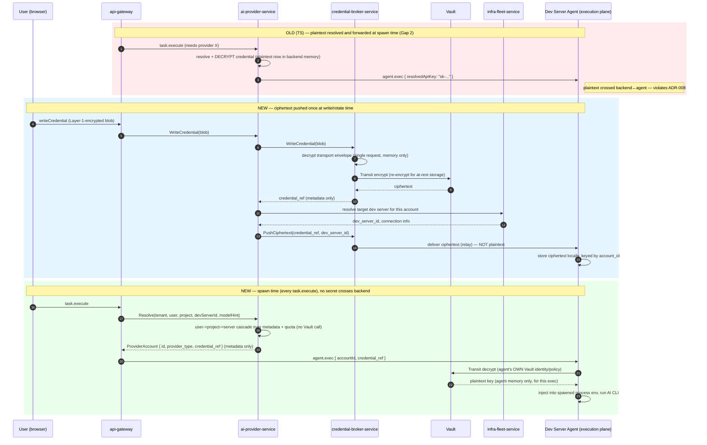

# `ai-provider-service`

**Category:** AI & Orchestration
**ADR-021 schema:** `ai_provider`
**Replaces (TS):** `AIProviderService`, `ProviderResolver`, `ProviderHealthChecker`
**Migration phase:** 2 — built and cut over together with `credential-broker-service`
(interdependent; neither is useful alone, see [Migration notes](#10-migration-notes))

## 1. Overview & responsibility

`ai-provider-service` is the system of record for **which AI provider
accounts exist** — Anthropic, OpenAI, Google, Azure, AWS, Ollama, vLLM
accounts a tenant has configured, at what scope, with what quota — and for
**aggregate quota/spend state** used to enforce those limits before an agent
spawn. It answers two questions the rest of the system asks constantly:
"does this tenant have a usable provider account for this request"
(`Resolve`) and "how much of today's quota has this account used"
(`GetUsageToday`).

It does **not** answer "what happened in this AI-CLI session" — that is
`usage-service`'s job (§2). It does **not** hold, decrypt, or transmit
credential material in any form — that is `credential-broker-service`'s job,
mediated through Vault (§9). This service's database has zero secret
columns, by construction, not convention.

## 2. Bounded context

### Metadata and orchestration only

This service owns: provider account metadata (provider type, scope, label,
model hint, status, `rotation_grace_until`-equivalent state); daily
quota/usage **rollups** used for enforcement (not raw usage events); the
user→project→server resolution cascade (§4); and scheduling of the periodic
health-check reconciliation job (§8).

It never owns API keys, OAuth tokens, encrypted blobs, or Vault path
contents — a database dump of this service must never yield a usable
credential.

### Distinction from `usage-service`

These two services track usage on **different axes that happen to look
similar** — a point of confusion the TS naming invited and the Go design
must not repeat:

| | `ai-provider-service` | `usage-service` |
|---|---|---|
| Tracks usage of | A **provider account** (an Anthropic/OpenAI/etc. API key) | A **CLI session** (Claude Code, Codex CLI, OpenCode) |
| Granularity | Daily rollup per account | Per-session record + daily rollup, per CLI tool |
| Purpose | Quota **enforcement** — can this account call again today | Cost **observability** — what did this user/project spend on CLI tools |
| Consulted at | Spawn time, synchronously, hot path (`Resolve`) | Reporting/dashboards, off the hot path |
| ADR-021 schema | `ai_provider` | `usage` |

A single agent spawn using an Anthropic account increments *both*
independently: this service's `ai_provider.usage_daily` rollup (quota
bookkeeping for the API key) and `usage-service`'s Claude Code session
record (cost reporting for the CLI session). They must never be merged into
one table or service — that would couple fast, simple quota enforcement to
richer, slower usage reporting for no benefit.

## 3. API surface (gRPC sketch)

```protobuf
service AIProviderService {
  // Account CRUD — metadata only, no secret fields in any of these messages.
  rpc CreateAccount(CreateAccountRequest) returns (ProviderAccount);
  rpc GetAccount(GetAccountRequest) returns (ProviderAccount);
  rpc ListAccounts(ListAccountsRequest) returns (ListAccountsResponse);
  rpc UpdateAccount(UpdateAccountRequest) returns (ProviderAccount);
  rpc DeleteAccount(DeleteAccountRequest) returns (google.protobuf.Empty);

  // Credential ops — this service never sees the secret value; each of
  // these delegates to credential-broker-service's port (§6).
  rpc WriteCredential(WriteCredentialRequest) returns (WriteCredentialResponse);
  rpc RotateKey(RotateKeyRequest) returns (RotateKeyResponse);
  rpc TestConnection(TestConnectionRequest) returns (TestConnectionResponse);

  rpc GetUsageToday(GetUsageTodayRequest) returns (QuotaState);

  // Spawn-time resolution — the hot-path call (§4, §8).
  rpc Resolve(ResolveRequest) returns (ProviderAccount);
}

message ResolveRequest {
  string tenant_id     = 1;
  string user_id       = 2;
  string project_id    = 3;
  string dev_server_id = 4;   // target execution host — used for the ciphertext-push check (§9)
  optional string model_hint = 5;
}
```

`WriteCredentialRequest` carries the transport-layer-encrypted blob the
browser already produces (unchanged at the edge — see
[`06-secrets-vault-architecture.md`](../architecture/06-secrets-vault-architecture.md)
§"What does NOT change at the edge"); this service forwards it unopened to
`credential-broker-service` and stores only the returned metadata.

## 4. Domain model

- **`ProviderAccount`** — `ID`, `TenantID`, `Scope` (`ResolutionScope`),
  `ScopeRefID` (user or project ID; empty for server scope), `ProviderType`,
  `Label`, `ModelHint`, `BaseURL`, `Status`
  (`pending`/`active`/`rotating`/`revoked`/`error`), `QuotaLimitDay`,
  `RotationGraceUntil *time.Time`, `LastHealthCheckAt *time.Time`,
  `CredentialRefID`, `CreatedBy`, `CreatedAt`, `UpdatedAt`. Invariant:
  `ScopeRefID` set iff `Scope != ScopeServer`, enforced in the constructor.
- **`ProviderType`** — enum: `Anthropic`, `OpenAI`, `Google`, `Azure`,
  `AWS`, `Ollama`, `vLLM`.
- **`ResolutionScope`** — enum `ScopeUser`, `ScopeProject`, `ScopeServer`.
  Order is fixed at `[User, Project, Server]` — narrowest wins first. Some
  prior TS documentation stated this cascade backwards; the actual
  `ProviderResolver.resolve()` implementation
  (`backend/src/main/ai-providers/ProviderResolver.ts`) is ground truth, and
  this ordering matches that code, two-pass: model-hint-filtered first,
  then unfiltered.
- **`QuotaState`** — `AccountID`, `Date`, `TokensUsed`, `Requests`,
  `CostUSD`; `WithinQuota(limit)` is a pure method (`limit == 0` = unlimited).
- **Domain errors** — `ErrNoProviderAvailable{Reason}` where `Reason` is
  `quota_or_inactive` or `no_scope_match` (mirrors the TS resolver's
  distinction, useful when debugging a failed spawn), `ErrAccountNotFound`,
  `ErrInvalidScopeRef`.

## 5. Data model (Postgres — `ai_provider` schema)

No secret columns, ever — the load-bearing constraint of this schema, not a
stylistic preference.

```sql
CREATE TABLE ai_provider.accounts (
    id                   UUID PRIMARY KEY DEFAULT gen_random_uuid(),
    tenant_id            UUID NOT NULL,
    dev_server_id        UUID NOT NULL,          -- logical FK -> infra-fleet-service
    provider_type        TEXT NOT NULL CHECK (provider_type IN
                             ('anthropic','openai','google','azure','aws','ollama','vllm')),
    scope                TEXT NOT NULL CHECK (scope IN ('user','project','server')),
    scope_ref_id         UUID,                   -- NULL iff scope='server'
    label                TEXT NOT NULL,
    model_hint           TEXT,
    base_url             TEXT,
    status               TEXT NOT NULL DEFAULT 'pending' CHECK (status IN
                             ('pending','active','rotating','revoked','error')),
    quota_limit_day      INTEGER NOT NULL DEFAULT 0,   -- 0 = unlimited
    rotation_grace_until TIMESTAMPTZ,             -- carried forward from TS migration
                                                   -- 0015's rotation_grace_until column
    last_health_check_at TIMESTAMPTZ,
    credential_ref_id    UUID NOT NULL,           -- pointer only; credential-broker-service
                                                   -- owns the Vault path this refers to —
                                                   -- resolved via API, never a DB join
    created_by           UUID NOT NULL,
    created_at           TIMESTAMPTZ NOT NULL DEFAULT now(),
    updated_at           TIMESTAMPTZ NOT NULL DEFAULT now(),
    CONSTRAINT scope_ref_matches_scope CHECK (
        (scope = 'server' AND scope_ref_id IS NULL) OR
        (scope <> 'server' AND scope_ref_id IS NOT NULL)
    )
);
CREATE INDEX idx_accounts_dev_server_status ON ai_provider.accounts(dev_server_id, status);
CREATE INDEX idx_accounts_rotating ON ai_provider.accounts(status, rotation_grace_until)
    WHERE rotation_grace_until IS NOT NULL;
CREATE INDEX idx_accounts_scope_lookup ON ai_provider.accounts(dev_server_id, scope, scope_ref_id);

-- Aggregate quota/spend rollup — NOT raw usage sessions (usage-service owns
-- those, in a wholly separate `usage` database).
CREATE TABLE ai_provider.usage_daily (
    account_id   UUID NOT NULL REFERENCES ai_provider.accounts(id) ON DELETE CASCADE,
    usage_date   DATE NOT NULL,
    tokens_used  BIGINT NOT NULL DEFAULT 0,
    requests     BIGINT NOT NULL DEFAULT 0,
    cost_usd     NUMERIC(12,4) NOT NULL DEFAULT 0,
    PRIMARY KEY (account_id, usage_date)
);
CREATE INDEX idx_usage_daily_recent ON ai_provider.usage_daily(account_id, usage_date DESC);

-- Transactional outbox for lifecycle events (create/rotate/revoke) consumed
-- by infra-fleet-service / credential-broker-service — see 04-tech-stack.md.
CREATE TABLE ai_provider.outbox (
    id           UUID PRIMARY KEY DEFAULT gen_random_uuid(),
    event_type   TEXT NOT NULL,
    payload      JSONB NOT NULL,
    created_at   TIMESTAMPTZ NOT NULL DEFAULT now(),
    published_at TIMESTAMPTZ
);
```

## 6. Package layout notes

Follows the standard layout in
[`03-clean-architecture-guidelines.md`](../architecture/03-clean-architecture-guidelines.md).
One point specific to this service: `resolve_provider.go`,
`write_credential.go`, `rotate_key.go`, and `test_connection.go` in
`usecase/` all depend on a single port defined in `usecase/ports.go`:

```go
// CredentialBrokerPort is the ONLY way this service's usecase layer ever
// touches secret material — satisfied by adapter/grpc-client/credentialbroker/
// calling credential-broker-service's gRPC API. This service has no
// adapter/vault/ package at all.
type CredentialBrokerPort interface {
    WriteCredential(ctx context.Context, req WriteCredentialInput) (CredentialRef, error)
    RotateCredential(ctx context.Context, credentialRef string) (CredentialRef, error)
    TestConnection(ctx context.Context, credentialRef string) (ConnectionTestResult, error)
    PushCiphertext(ctx context.Context, credentialRef, targetDevServerID string) error
}
```

Per [`06-secrets-vault-architecture.md`](../architecture/06-secrets-vault-architecture.md),
only `credential-broker-service` (and each service's own bootstrap
DB-credential flow) talks to Vault directly. This is enforced structurally —
no Vault SDK import anywhere in this service's `go.mod` graph — not just by
convention.

## 7. Dependencies

| Direction | Service | Why |
|---|---|---|
| Calls | `credential-broker-service` | All secret ops: write, rotate, test-connection, ciphertext push (§9) |
| Calls | `tenant-service` | Validate a `scope_ref_id` (user/project membership) on account create |
| Calls | `infra-fleet-service` | Resolve the target dev server's identity/reachability when pushing ciphertext on rotation (§9) |
| Called by | `task-service` | Resolve a provider account before AI-assisted decomposition |
| Called by | `workflow-service` | Resolve a provider account before dispatching an `agent`-type step |
| Called by | `api-gateway` | Account CRUD, usage display, from browser/mobile |

`Resolve` itself does **not** call `infra-fleet-service` or
`credential-broker-service` synchronously — only the account-create/rotate
path does, to push ciphertext (§9). `Resolve` reads only this service's own
`accounts`/`usage_daily` tables.

## 8. Non-functional requirements

- **Resolution latency**: `Resolve` sits directly on the agent-spawn hot
  path — every `task.execute`/workflow agent-step blocks on it. Target: p99
  < 20ms, achievable because `Resolve` makes no cross-service call (§7) and
  reads indexed local tables only. A future need for a cross-service call
  inside `Resolve` is a design smell to escalate, not a cost to accept.
- **Health-check job reliability**: a scheduled reconciliation job runs
  every 15 minutes (carried forward from TS `ProviderHealthChecker`'s cron
  interval), calling `TestConnection` per active account and updating
  `status`/`last_health_check_at`. Must be safe under multiple replicas
  (leader election, or `SELECT ... FOR UPDATE SKIP LOCKED` over due
  accounts) — correctness (never double-firing a check against a rate
  limited provider) matters more than latency here.
- **Quota writes are off the `Resolve` path**: `usage_daily` upserts happen
  when the agent execution reports token counts back, not synchronously
  inside `Resolve`, which only reads the rollup.
- **Availability**: this service being down blocks all agent spawns
  system-wide — same criticality class as `auth-service`/`tenant-service`
  for that reason, despite not being an identity service.

## 9. Security notes

The centerpiece of this design is closing **TS Gap 2**
(`backend-agent-target-architecture.md` §"Gap 2 — Credential handling
doesn't fully satisfy 'backend never sees plaintext'"): TS's
`writeCredential`/`rotateKey`/`testConnection` correctly relay
ciphertext-only, but the **use path** — spawning an AI CLI — required
backend to forward a plaintext `resolvedApiKey` to the agent, because the
agent couldn't decrypt the browser's Layer-1-encrypted blob itself. A real
violation of ADR-008's "backend never sees plaintext" promise.

**The Go fix**: push ciphertext ahead of time; resolve plaintext only on the
execution plane. `ai-provider-service`/`credential-broker-service`
proactively push ciphertext to the target dev server at account-creation
and rotation time, not lazily at spawn time. The Dev Server Agent holds its
own Vault-issued decryption capability (Transit engine), authenticated to
Vault via its own identity/policy — separate from any policy granted to
`ai-provider-service` or `credential-broker-service`. At spawn time the
agent decrypts locally from ciphertext it already has; no secret-bearing
network hop touches backend.



Key properties:

- **Backend never decrypts.** `Resolve` passes a `credential_ref`, not a
  key.
- **The agent's Vault identity is scoped narrowly** — Transit decrypt only,
  only for ciphertext already pushed to it, under Kubernetes-auth policy
  like every other service — not a blanket grant to tenant secrets.
- **Sync-timing is solved explicitly.** The old "resolve plaintext lazily
  because the target might not have it yet" problem becomes a push
  obligation: account creation/rotation isn't complete until
  `PushCiphertext` succeeds against every dev server the account is scoped
  to reach. A failed push leaves the account in `pending`/`rotating`
  status — there is no fallback to plaintext resolution in this design.
- **Rotation grace** (`rotation_grace_until`) governs how long the previous
  ciphertext version stays valid on the agent side while the new one
  propagates — mirrors Vault KV v2 version history and the TS column's
  original intent (§5).

## 10. Migration notes

- **Phase 2, paired with `credential-broker-service`.** Neither is
  independently useful: `ai-provider-service` has nothing to write without
  `credential-broker-service`'s Vault mediation, and `credential-broker-service`
  has no tenant-facing caller without this service's account-metadata layer.
  Both must reach production readiness together before either cuts over.
- **Closes Gap 2 as a structural property**, not a follow-up fix — the
  ciphertext-push flow (§9) is how this service is built from day one, not
  a plaintext-forwarding v1 patched later.
- **Backfill scope**: this migration covers **account metadata only** —
  `orca_ai_provider_accounts` maps 1:1 into `ai_provider.accounts` per §5's
  schema; `orca_provider_usage` maps into `ai_provider.usage_daily` the same
  way.
- **Secret re-encryption is out of scope here** — every credential value
  currently held in the TS system's agent-local `.enc` files is
  re-encrypted into Vault via `credential-broker-service`'s own migration
  path (see that service's doc), not repeated here. This service's
  migration produces `credential_ref_id` pointers only, never a secret
  value.
- **Cutover ordering**: metadata backfill may run ahead of ciphertext
  migration (accounts exist, `pending`/`error`, before usable) — but
  `Resolve` must not return an account whose ciphertext isn't yet confirmed
  pushed to its target dev server, to avoid recreating Gap 2 transiently
  mid-migration. Tracked via the existing `status` state machine
  (`pending` until push-confirmed, then `active`), not a separate flag.
