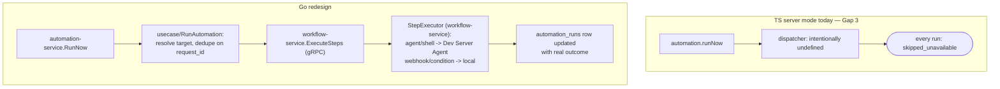

# automation-service

Category: AI & Orchestration · ADR-021 schema: `automation` · Migration
phase: 2 · Replaces (TS): `AutomationService` (`automations/`,
`automation-store-dependency.ts`, `nextAutomationOccurrenceAfter`/
`latestAutomationOccurrenceAtOrBefore`).

## 1. Overview & responsibility

`automation-service` is the system of record for **scheduled/triggered
automation definitions and their run history**: what an automation is (an
agent prompt bound to a schedule and a workspace target), when it last ran,
when it's due next, and the outcome of every run it dispatched. It owns two
tables in the `automation` schema — `automations`, `automation_runs` — per
ADR-021's migration `0021`, which replaced the dormant, never-populated
`automations` table from migration `0002` with a shape matched to the real
TS `Automation`/`AutomationRun` types (`specs/backend/models/
06-shared-domain-types.md` §6).

It does **not** execute steps itself — see §2. This is the service's whole
reason for existing as a distinct design rather than a mechanical TS port:
TS's `AutomationService` receives a `Store` reference (JSON-blob-backed,
even in "server mode") rather than a SQL `pool`, and its dispatcher is left
intentionally unwired server-side — every triggered run in production TS
today resolves `skipped_unavailable`. See §10 and
[`backend-agent-target-architecture.md`](../../backend/api/backend-agent-target-architecture.md)
Gap 3, which this design closes.

## 2. Bounded context — definitions and bookkeeping here, execution never here

| Concern | Owned here | Delegated |
|---|---|---|
| Definition (schedule, trigger config, prompt, target) | Yes — Postgres row | — |
| Recurrence calculation (next/latest RRULE occurrence) | Yes — pure domain function, §4 | — |
| Run bookkeeping (status, timestamps, outcome, usage) | Yes — Postgres row | — |
| **Step execution** (agent spawn, shell, notification) | **Never** — no local execution engine | `workflow-service`'s step-execution path |

TS's own gap analysis notes automations and workflows already share a
step-type vocabulary (agent/shell/notification-style actions) and that
`StepExecutors.ts` already relays `agent`/`shell` steps to the Dev Server
Agent correctly while keeping `webhook`/`condition` local. Its prescribed
fix — wire `automation.runNow` through that same executor instead of
building a second, parallel one — is the design here, not an
optimization: an automation run is structurally a one-step (or few-step)
workflow execution, not a different kind of thing, so `workflow-service` is
a first-class dependency from line one, not bolted on later.



## 3. API surface (gRPC service sketch)

```protobuf
service AutomationService {
  rpc CreateAutomation(CreateAutomationRequest) returns (Automation);
  rpc GetAutomation(GetAutomationRequest) returns (Automation);
  rpc UpdateAutomation(UpdateAutomationRequest) returns (Automation);
  rpc DeleteAutomation(DeleteAutomationRequest) returns (google.protobuf.Empty);
  rpc ListAutomations(ListAutomationsRequest) returns (ListAutomationsResponse);

  rpc RunNow(RunNowRequest) returns (AutomationRun);       // Gap 3 fix — see §2
  rpc GetRun(GetRunRequest) returns (AutomationRun);
  rpc ListRuns(ListRunsRequest) returns (ListRunsResponse); // by automation_id, cursor-paginated

  rpc HandleExternalTrigger(HandleExternalTriggerRequest) returns (AutomationRun); // §7
}

message RunNowRequest {
  string automation_id = 1;
  string request_id = 2;   // idempotency key, §8
  string triggered_by = 3; // user_id, or "scheduler" for the tick loop
}
```

`RunNow` and the scheduler tick (§7) both funnel through the same
`usecase/RunAutomation` interactor — one code path calls `workflow-service`
regardless of trigger source. `HandleExternalTrigger` is a distinct RPC
(own correlation id/payload shape) that maps its payload to a
`RunNowRequest`-equivalent and resolves to the same interactor.

## 4. Domain model

- **`Automation`** — id, tenant_id, project_id (logical FK →
  `project-service`), name, prompt, precheck, agent_id, execution_target
  (`local`/`ssh` + target id, logical FK → `infra-fleet-service`),
  workspace_mode (`existing`/`new_per_run`), workspace_id, base_branch,
  reuse_session, timezone, `RecurrenceRule` (below), enabled, next_run_at,
  last_run_at, missed_run_policy (`skip`/`run_once`), timestamps. Carried
  forward from TS's `Automation` (`automations-types.ts:90`); TS's
  already-deprecated `projectId` field is kept only as a migration mapping
  note, not promoted to a first-class column (§10).
- **`AutomationRun`** — id, automation_id, tenant_id, title, scheduled_for,
  status (`pending`/`running`/`succeeded`/`failed`/`skipped_unavailable`/
  `skipped_missed`), trigger (`scheduled`/`manual`/`external`),
  workspace_id, `workflow_execution_id` (logical FK →
  `workflow-service`'s execution — **new, absent from TS**, §6),
  output_snapshot, precheck_result, usage, error, started_at,
  dispatched_at, created_at. `skipped_unavailable` stays valid for
  historical-run reporting, but no *new* run should land there under
  normal operation after this redesign — §10.
- **`RecurrenceRule`** — value object wrapping an RFC 5545 RRULE string
  plus `dtstart`/`timezone`, with two pure functions:
  `NextOccurrenceAfter(t time.Time) (time.Time, bool)` and
  `LatestOccurrenceAtOrBefore(t time.Time) (time.Time, bool)`. Mirrors TS's
  `nextAutomationOccurrenceAfter`/`latestAutomationOccurrenceAtOrBefore`,
  already pure functions separated from `Store` per ADR-021's migration
  notes — the recurrence math doesn't change just because the language
  did. **Library choice deferred to implementation time**:
  `teambition/rrule-go` is the leading candidate (RFC 5545-compliant, no
  cgo, maintained) but must be checked against every recurrence feature TS
  actually uses (frequency, interval, byweekday, count/until, timezone)
  before it's locked in.

`RecurrenceRule` lives in `internal/domain/` with zero imports beyond the
RRULE library and stdlib `time` — unit-testable with no database, per
[`03-clean-architecture-guidelines.md`](../architecture/03-clean-architecture-guidelines.md).

## 5. Data model (Postgres, schema `automation`)

Starting point is ADR-021's migration `0021` DDL, already shaped around the
real `Automation`/`AutomationRun` types rather than the dormant
migration-`0002` table (see [`08-postgres-microservices-target-
architecture.md`](../../backend/models/08-postgres-microservices-target-architecture.md)).

```sql
CREATE TABLE automations (
  id                     UUID PRIMARY KEY DEFAULT gen_random_uuid(),
  tenant_id              UUID NOT NULL,
  project_id             UUID,                 -- logical FK -> project-service.projects; nullable
  name                   TEXT NOT NULL,
  prompt                 TEXT NOT NULL,
  precheck               TEXT,
  agent_id               TEXT NOT NULL,
  execution_target_type  TEXT NOT NULL CHECK (execution_target_type IN ('local','ssh')),
  execution_target_id    TEXT,                 -- logical FK -> infra-fleet-service; null for 'local'
  workspace_mode         TEXT NOT NULL CHECK (workspace_mode IN ('existing','new_per_run')),
  workspace_id           TEXT,
  base_branch            TEXT,
  reuse_session          BOOLEAN NOT NULL DEFAULT false,
  timezone               TEXT NOT NULL DEFAULT 'UTC',
  rrule                  TEXT NOT NULL,         -- RFC 5545 recurrence string
  dtstart                TIMESTAMPTZ NOT NULL,
  enabled                BOOLEAN NOT NULL DEFAULT true,
  next_run_at            TIMESTAMPTZ,
  last_run_at            TIMESTAMPTZ,
  missed_run_policy      TEXT NOT NULL DEFAULT 'skip' CHECK (missed_run_policy IN ('skip','run_once')),
  created_at             TIMESTAMPTZ NOT NULL DEFAULT now(),
  updated_at             TIMESTAMPTZ NOT NULL DEFAULT now()
);
CREATE INDEX idx_automations_tenant ON automations (tenant_id);
CREATE INDEX idx_automations_due ON automations (next_run_at) WHERE enabled;

CREATE TABLE automation_runs (
  id                     UUID PRIMARY KEY DEFAULT gen_random_uuid(),
  automation_id          UUID NOT NULL REFERENCES automations (id) ON DELETE CASCADE,
  tenant_id              UUID NOT NULL,
  title                  TEXT,
  scheduled_for          TIMESTAMPTZ,
  status                 TEXT NOT NULL CHECK (status IN
                           ('pending','running','succeeded','failed','skipped_unavailable','skipped_missed')),
  trigger                TEXT NOT NULL CHECK (trigger IN ('scheduled','manual','external')),
  workspace_id           TEXT,
  workflow_execution_id  UUID,                 -- logical FK -> workflow-service.executions; set once dispatched
  request_id             TEXT NOT NULL,         -- idempotency key, §8
  output_snapshot        TEXT,
  precheck_result        TEXT,
  usage                  JSONB,
  error                  TEXT,
  started_at             TIMESTAMPTZ,
  dispatched_at          TIMESTAMPTZ,
  created_at             TIMESTAMPTZ NOT NULL DEFAULT now()
);
CREATE INDEX idx_automation_runs_automation ON automation_runs (automation_id, created_at DESC);
CREATE UNIQUE INDEX idx_automation_runs_request_id ON automation_runs (automation_id, request_id);
```

RLS is enabled on both tables (`tenant_id`-scoped policy), per
[`05-data-architecture.md`](../architecture/05-data-architecture.md);
application-layer scoping in `adapter/postgres/` remains primary.
`workflow_execution_id` and the `request_id` unique index are both new
relative to TS's JSON-blob shape — §8/§10.

## 6. Package layout notes

Standard layout from
[`03-clean-architecture-guidelines.md`](../architecture/03-clean-architecture-guidelines.md).
One point called out explicitly, since it's the whole point of this
service's design:

```
internal/
├── domain/
│   ├── automation.go          # Automation entity, invariants
│   ├── automation_run.go      # AutomationRun entity, status transitions
│   ├── recurrence_rule.go     # pure NextOccurrenceAfter/LatestOccurrenceAtOrBefore
│   └── recurrence_rule_test.go
├── usecase/
│   ├── run_automation.go      # THE core interactor — calls out to workflow-service, see below
│   ├── ports.go                # AutomationRepository, RunRepository, WorkflowExecutor, Clock, IdempotencyStore
│   ├── create_automation.go, update_automation.go, list_runs.go, ...
│   └── run_automation_test.go # tested against a fake WorkflowExecutor — no real workflow-service needed
├── adapter/
│   ├── grpc/                  # AutomationService server impl
│   ├── postgres/               # sqlc-generated repository implementations
│   ├── grpcclient/
│   │   ├── workflow_client.go  # implements usecase.WorkflowExecutor against workflow-service's gRPC API
│   │   └── project_client.go   # implements usecase.ProjectContextResolver against project-service
│   ├── scheduler/               # in-process ticker loop, §7 — calls usecase.RunAutomation, never workflow-service directly
│   └── eventbus/                # outbox publisher: automation.run.completed, ...
```

`run_automation.go`'s `WorkflowExecutor` port is a real cross-service gRPC
call (`grpcclient/workflow_client.go` → `workflow-service`'s
step-execution RPC), not a local reimplementation of step dispatch —
named explicitly here because "don't build a second execution engine" is a
constraint easy to silently violate if a future contributor adds a
convenience helper that spawns an agent directly instead of going through
this port.

## 7. Dependencies

**Calls (outbound):**

| Service | Why | Pattern |
|---|---|---|
| `workflow-service` | Execute the step(s) — the Gap 3 fix. `RunAutomation` builds a step-execution request from prompt/agent/target and calls the execution RPC | Synchronous gRPC, per run |
| `project-service` | Resolve repo/project-host-setup context (workspace path, execution target) before dispatch | Synchronous gRPC, per run |

**Called by (inbound):**

| Caller | Why |
|---|---|
| `api-gateway` | CRUD, `RunNow`, `ListRuns` — edge-facing |
| External-manager webhook (via `api-gateway` → `HandleExternalTrigger`) | TS's capability list documents an "external-manager" integration for automation triggers, but the source docs available for this design don't include TS `external-automations-handler.ts`'s concrete wire contract — **flagged for the Go implementer**: read that file before finalizing `HandleExternalTriggerRequest`'s shape; kept high-level here pending that review |

**Scheduler/cron mechanism**: an **in-process ticker loop**
(`adapter/scheduler/`), not a separate scheduler service or external cron
caller. Every replica runs a ticker (~1 minute interval) that queries
`automations` for rows where `enabled AND next_run_at <= now()`, and for
each due row calls the same `usecase.RunAutomation` interactor `RunNow`
uses, with `trigger=scheduled` and a deterministic `request_id` derived
from `(automation_id, next_run_at)`. Simplest option at this system's
scale (17 services total; automation volume nowhere near justifying a
dedicated scheduler tier) and avoids an 18th service whose only job is
"call `RunNow` on a timer." Running on every replica requires a claim step
(`SELECT ... FOR UPDATE SKIP LOCKED`, or an advisory lock keyed by
`automation_id`) so two replicas ticking in the same window don't both
dispatch the same occurrence — §8 covers how this combines with idempotent
`RunNow`.

## 8. Non-functional requirements

- **Schedule-check loop reliability**: a missed tick must not silently
  drop a run. "Due" is `next_run_at <= now()`, not "did a tick fire at
  exactly this minute" — a loop that skips a cycle (deploy rollout, GC
  pause) still catches the missed occurrence next tick (subject to
  `missed_run_policy`) instead of losing it. Requires **at-least-once
  semantics with idempotent `RunNow` calls**: every dispatch carries a
  `request_id` (the convention from
  [`standards/api-design-guidelines.md`](../standards/api-design-guidelines.md)),
  and `RunAutomation` deduplicates on `(automation_id, request_id)` via
  the unique index in §5 before calling `workflow-service` — a retried or
  duplicate-ticked dispatch for the same occurrence returns the existing
  `AutomationRun` instead of triggering a second execution.
- **At-least-once, not exactly-once, by design**: two replicas racing on
  the same due automation is expected occasionally (`SKIP LOCKED` narrows
  but doesn't eliminate the window under a network partition); the
  idempotency key is what makes a duplicate claim harmless, not the claim
  mechanism alone.
- **Latency**: `RunNow`'s budget is one call to `project-service` plus one
  to `workflow-service` — p99 target < 500ms for the dispatch call itself;
  actual step execution happens asynchronously on `workflow-service`'s
  side and is tracked via `workflow_execution_id`, not awaited inline.
- **Availability**: CRUD/list on `automations`/`automation_runs` stays
  available even if `workflow-service` is unreachable — `RunNow` fails
  closed with `UNAVAILABLE` and the run row records `failed` (or is left
  `pending` for the next scheduler pass), never silently swallowed the way
  TS's `skipped_unavailable` was.

## 9. Security notes

- Runs execute **with the permissions of whichever user/context owns the
  automation**, not an elevated "scheduler" identity. A scheduled run goes
  through the same authorization a live user-triggered call would —
  `RunAutomation` resolves the owning user/tenant and passes that identity
  into the `workflow-service` call, which enforces its own OPA policy
  exactly as for a direct `api-gateway` call. The scheduler loop is never a
  trust boundary that bypasses per-request authorization.
- Real risk once `RunNow` actually executes work (unlike TS's no-op
  today): an automation whose owning user has since lost access to the
  target project/repo must not keep running with stale permissions.
  `RunAutomation` re-validates the owner's current access (via
  `project-service`) at dispatch time, not only at creation time.
- `HandleExternalTrigger` is an **untrusted caller boundary** despite
  mapping to the same internal interactor — it must authenticate the
  webhook (shared secret / signature, mechanism TBD pending the TS
  `external-automations-handler.ts` review in §7) before resolving to a
  `RunNow`-shaped dispatch, so a forged trigger can't run an automation
  the caller doesn't otherwise have access to invoke.
- Tenant isolation: every query is tenant-scoped per
  [`05-data-architecture.md`](../architecture/05-data-architecture.md); RLS
  is the backstop, application-layer `tenant_id` binding is primary.

## 10. Migration notes

- **Phase 2**, alongside `workflow-service`/`task-service`/
  `orchestration-service` — after `workflow-service` exists and its
  step-execution RPC is callable, since `RunNow`'s core path hard-depends
  on it (§2). Standing this service up before `workflow-service` would
  leave `RunNow` with nothing to call, recreating the exact gap this
  redesign closes.
- **This migration closes Gap 3.** The headline change is not a schema
  rename — TS's `runNow`/scheduled dispatch has no working execution path
  today; every triggered run resolves `skipped_unavailable`. After this
  migration `RunNow` actually executes via `workflow-service`. Treat this
  as shipping a previously-broken feature for the first time, not porting
  a working one; the cutover plan should account for automations that
  have been silently no-op-ing in production and may start producing real
  side effects (agent runs, workspace changes) the moment they're enabled.
- **Data migration is nontrivial, not a schema rename.** TS's
  `Automation`/`AutomationRun` data lives in `PersistedState.automations` /
  `PersistedState.automationRuns` — a JSON blob inside `Store`
  (`persistence.ts`), **not** a real table, even in "server mode" today
  (`AutomationService` receives a `Store`, not a SQL `pool`; see
  `specs/backend/models/06-shared-domain-types.md` §6 and ADR-021's Phase
  1 notes, which record `PgAutomationStore` — the real Postgres
  implementation — as still unwritten as of that audit). Backfill is a
  genuine ETL from a nested JSON document per user/tenant into normalized
  rows, not an `ALTER TABLE`: walk each user's persisted state, extract
  `automations`/`automationRuns`, map fields per §4 (field shapes match
  closely — not a schema redesign at the field level — but the *storage
  mechanism* changes completely), and insert. A dry-run reconciliation
  pass (row/run counts vs. the JSON source) is required before cutover —
  same discipline as other JSON-blob-backed domains in this set (compare
  `project-service.md` §10's repo/worktree backfill, the identical "no
  single TS source table" problem).
- **RRULE logic is not part of the nontrivial migration** — the
  recurrence calculation is already a pure function separated from
  `Store` in TS per ADR-021's notes, so the Go port (§4) is a
  reimplementation against a library, not a data-migration concern.
- **External-manager integration** (`HandleExternalTrigger`, §7/§9) needs
  its wire contract finalized from TS's `external-automations-handler.ts`
  before shipping — out of scope for this document to fully specify
  without that source review.
