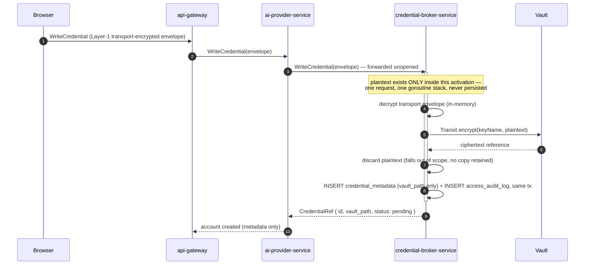
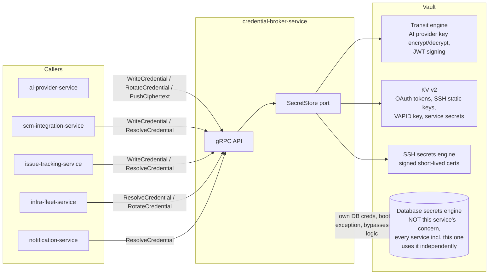

# `credential-broker-service`

**Category:** Supporting (functionally one of the highest-trust-boundary
services in the system — see §9)
**ADR-021 schema:** `credential`
**Replaces (TS):** The 5 fragmented mechanisms surveyed in
[`05-credential-secret-stores.md`](../../backend/models/05-credential-secret-stores.md) —
`WebCredentialStore` (AES-256-GCM per-user files), Electron `safeStorage`
(scattered call sites), direct OS Keychain calls (Claude/Codex CLI OAuth),
the AI-provider encrypted-blob-over-relay scheme, and in-memory-only SSH
passphrases.
**Migration phase:** 2 — built and cut over together with
`ai-provider-service` (see [`ai-provider-service.md`](./ai-provider-service.md)
§10; neither service is independently useful, see §10 below).

## 1. Overview & responsibility

`credential-broker-service` is the mediation layer for **all tenant/user
secret material in the system** — it is not, itself, a secret store. Every
integration OAuth token, AI provider API key, SSH credential, VAPID private
key, and service-to-service shared secret that any other service needs to
read, write, rotate, or revoke passes through this service's gRPC API. The
secret bytes themselves live in HashiCorp Vault; this service holds
**pointers, state, and an audit trail**, and enforces policy at the one
chokepoint where every access is observable.

This distinction is load-bearing, not semantic: this service's own
PostgreSQL database contains **zero secret columns**, by construction (§5).
If this service's database were dumped in full, an attacker would learn
*which* credentials exist, their scope and rotation state, and who accessed
them when — never a usable secret value.

## 2. Bounded context

### Vault holds the secrets; this service holds pointers + audit + policy

| | Vault | `credential-broker-service` |
|---|---|---|
| Holds | Secret bytes (plaintext, transiently; ciphertext, at rest under Transit/KV v2) | `vault_path` reference, rotation/lifecycle state, scope, category, access audit log |
| Is the system of record for | The secret value | "This credential exists, here is where it lives, here is its current status, here is who touched it and when" |
| Enforces | Its own ACL policy per calling identity (§9) | Which *callers* are allowed to request which *category* of credential operation, rate limiting, anomaly detection, revocation-on-suspicion |
| Called by | `credential-broker-service` only (for tenant secrets) — see the broker rule below | `ai-provider-service`, `scm-integration-service`, `issue-tracking-service`, `infra-fleet-service` (§7) |

### Why a broker in front of Vault, not every service calling Vault directly

The obvious alternative design — let `ai-provider-service`,
`scm-integration-service`, `issue-tracking-service`, and `infra-fleet-service`
each hold their own Vault policy and call Vault directly for the tenant
secrets they need — was considered and rejected for three concrete reasons:

1. **Single audit point.** Every tenant-secret access goes through one
   service's logs and one `access_audit_log` table, not N services each
   independently calling Vault with no shared record of who asked for what.
   Reconstructing "who read this GitHub token, and when" across 4+
   independent Vault-calling services during an incident is a forensic
   exercise; through one broker, it is a single indexed query (§5).
2. **Consistent policy enforcement.** Rate limiting, anomaly detection
   ("this credential is being resolved 100x more than its historical
   baseline"), and revocation-on-suspicion logic live in exactly one place,
   implemented once, tested once — not reimplemented N times inconsistently
   (or, more likely, implemented in some services and skipped in others).
3. **Vault policy simplicity — the core security argument.** Vault's own
   ACL policies grant `credential-broker-service`'s Vault identity access to
   the tenant-secret KV/Transit/SSH paths. **Every other service's Vault
   identity is scoped *only* to its own dynamic-DB-credential lease** (the
   Database secrets engine, §3 of
   [`06-secrets-vault-architecture.md`](../architecture/06-secrets-vault-architecture.md)),
   never to any tenant secret path. A compromised `workflow-service` pod —
   even with full control of that pod's Vault Agent sidecar and Kubernetes
   service-account token — cannot read a GitHub token, an Anthropic API key,
   or an SSH certificate, because its Vault policy simply does not name
   those paths. It has no path to escalate into reading them: "call Vault
   directly for path X" isn't a code-level restriction a bug could bypass —
   it's the absence of a grant in Vault's own policy engine, a materially
   stronger guarantee than "the code doesn't currently call that path,"
   which a future PR could silently violate.

Contrast with the TS system: there was no equivalent narrowing —
`safeStorage` calls and `WebCredentialStore` file reads were reachable from
any code path in the same process that held the OS/user encryption key,
with no separate identity or policy boundary between "code that needs a
secret" and "code that can decrypt one."

### Not a duplicate vault

A tempting simplification is "just make one more service that holds
everything" — collapse Vault and this service into a single application-tier
secret store. This design explicitly rejects that, for the reason
[`02-microservices-decomposition.md`](../architecture/02-microservices-decomposition.md)
calls out under "What's deliberately not a separate service": a standalone
application service holding actual secret values recreates the exact
single-point-of-compromise problem Vault exists to solve — one more
general-purpose process (its own dependency tree, its own attack surface,
its own potential memory-dump or logging-leak bug) becomes the thing that,
if breached, yields every tenant's secrets. Vault is purpose-built for this:
hardware-backed unsealing, per-engine access control, versioned KV with
rollback, transit-only encrypt/decrypt that never returns key material,
audit logging as a first-class feature. `credential-broker-service`
mediates access to those guarantees; its own database is Vault-agnostic
bookkeeping, safe to dump, replicate, and back up with ordinary Postgres
tooling.

### Exception — every service's own dynamic DB credentials

The one case where a service (including `credential-broker-service` itself)
talks to Vault **directly**, bypassing the broker, is fetching its own
Postgres role credentials from Vault's Database secrets engine. This is
infrastructure bootstrapping, not tenant secret material — a service
authenticating to its own database is a prerequisite for the service to run
at all, not a "read someone else's secret" operation. Routing it through
`credential-broker-service` would create a circular bootstrap dependency:
`credential-broker-service` needs its own DB credential to start up, and if
that had to come from itself, nothing could ever start. Every service gets
this via the Vault Agent sidecar pattern
([`06-secrets-vault-architecture.md`](../architecture/06-secrets-vault-architecture.md)
§"Auth flow"), identically, with no special case for this service.

## 3. API surface (gRPC sketch)

```protobuf
service CredentialBrokerService {
  // Generic lifecycle — category-agnostic where the operation genuinely is
  // (write, resolve, rotate, revoke all share the same shape regardless of
  // whether the underlying secret lives in KV v2, Transit, or SSH engine).
  rpc WriteCredential(WriteCredentialRequest) returns (CredentialRef);
  rpc ResolveCredential(ResolveCredentialRequest) returns (ResolveCredentialResponse);
  rpc RotateCredential(RotateCredentialRequest) returns (CredentialRef);
  rpc RevokeCredential(RevokeCredentialRequest) returns (google.protobuf.Empty);
  rpc GetCredentialStatus(GetCredentialStatusRequest) returns (CredentialMetadata);
  rpc GetCredentialMetadata(GetCredentialMetadataRequest) returns (CredentialMetadata);

  // Execution-plane support — see ai-provider-service.md §9's ciphertext-push
  // design; this service is the one that actually performs the push.
  rpc PushCiphertext(PushCiphertextRequest) returns (google.protobuf.Empty);

  // Audit surface, read-only, scoped to admin/compliance callers via OPA.
  rpc ListAccessAudit(ListAccessAuditRequest) returns (ListAccessAuditResponse);
}

enum CredentialCategory {
  CATEGORY_UNSPECIFIED    = 0;
  INTEGRATION_OAUTH_TOKEN = 1;  // GitHub/GitLab/Bitbucket/Azure DevOps/Gitea/Jira/Linear
  AI_PROVIDER_KEY         = 2;  // Anthropic/OpenAI/Google/Azure/AWS/Ollama/vLLM
  SSH_CREDENTIAL          = 3;  // signed cert or static key material
  VAPID_KEY               = 4;  // web-push private key
  SERVICE_SECRET          = 5;  // service-to-service shared secret, webhook signing secret
}

message WriteCredentialRequest {
  string tenant_id                = 1;
  CredentialCategory category     = 2;
  CredentialScope scope           = 3;   // tenant / user / service — see §4
  string scope_ref_id             = 4;
  // Category-specific payload. For AI_PROVIDER_KEY this is the
  // transport-layer-encrypted envelope the browser already produces
  // (unchanged at the edge) — see §9's request-time flow. For
  // SERVICE_SECRET / VAPID_KEY this is plaintext over the mTLS-secured
  // internal mesh, since there is no browser-facing transport leg to begin
  // with.
  bytes payload                   = 5;
  string payload_encoding         = 6;   // "transit-envelope-v1" | "plaintext"
}

message ResolveCredentialRequest {
  string credential_ref_id  = 1;
  string requesting_service = 2;  // populated from mTLS/JWT identity, not client-supplied
}

message ResolveCredentialResponse {
  CredentialMetadata metadata = 1;
  // Present only for categories where a *decrypted* value is ever
  // legitimately returned over the internal mesh (SERVICE_SECRET). For
  // AI_PROVIDER_KEY, ResolveCredential returns metadata + vault_path only —
  // decrypt happens on the execution plane, not here (§9).
  optional bytes plaintext_value = 2;
}
```

Per category, `ResolveCredential`'s behavior differs deliberately:

| Category | Returns | Notes |
|---|---|---|
| `INTEGRATION_OAUTH_TOKEN` | Plaintext, over internal mTLS mesh | Consumed directly in outbound HTTP calls by `scm-integration-service`/`issue-tracking-service` |
| `AI_PROVIDER_KEY` | Metadata only (`vault_path`/`credential_ref`) — **never plaintext** | Execution plane (Dev Server Agent) decrypts locally via its own Vault Transit access, per `ai-provider-service.md` §9 |
| `SSH_CREDENTIAL` | Freshly Vault-signed short-lived certificate (generated per request, not stored) or, for non-cert targets, a decrypted static key from KV v2 | Delivered only to `infra-fleet-service` over mTLS |
| `VAPID_KEY` / `SERVICE_SECRET` | Plaintext, to the single authorized internal caller | `notification-service` for VAPID; the specific service pair for a shared secret |

## 4. Domain model

- **`CredentialMetadata`** — `ID`, `TenantID`, `Category`
  (`CredentialCategory`), `Scope` (`ScopeTenant`/`ScopeUser`/`ScopeService`),
  `ScopeRefID`, `VaultPath` (the Vault reference — engine + mount + path,
  never a value), `VaultEngine` (`transit`/`kv2`/`ssh`), `Status`
  (`pending`/`active`/`rotating`/`revoked`/`error`), `RotationState`
  (`CurrentVersion int`, `PreviousVersion *int`, `RotationGraceUntil
  *time.Time` — the KV v2-version-history-backed successor to the TS
  `rotation_grace_until` column, see
  [`06-secrets-vault-architecture.md`](../architecture/06-secrets-vault-architecture.md)
  §"Rotation & revocation"), `CreatedBy`, `CreatedAt`, `UpdatedAt`.
  Invariant: `VaultEngine` is derived from `Category` in the constructor
  (e.g. `AI_PROVIDER_KEY` → `transit`), never independently settable —
  prevents a caller from requesting a category/engine mismatch that would
  make `ResolveCredential`'s branching logic (§3) incoherent.
- **`AccessAuditEntry`** — `ID`, `CredentialRefID`, `RequestingService`,
  `RequestingIdentity` (resolved JWT/mTLS subject, not client-asserted),
  `Operation` (`write`/`resolve`/`rotate`/`revoke`/`push`), `Outcome`
  (`success`/`denied`/`error`), `Timestamp`, `RequestID` (for tracing
  correlation). Append-only value object — never updated or deleted after
  insert (§5, §8).
- **Domain errors**: `ErrCredentialNotFound`, `ErrCredentialRevoked`,
  `ErrCategoryEngineMismatch`, `ErrUnauthorizedCategory` (a service asking
  to resolve a category it has no policy grant for — enforced both at the
  domain layer, as a fast-fail, and redundantly by Vault's own ACL, per
  defense-in-depth), `ErrRotationInProgress`.

## 5. Data model (Postgres — `credential` schema)

**No secret columns, ever — this is stated here, in the schema itself, not
only in the prose above it.** Every column in `credential_metadata` is a
pointer, a status enum, a timestamp, or a scope reference. If a future
migration ever adds a column that could hold a secret value (a raw token, a
key, ciphertext, even a hash of a secret used for anything beyond
non-reversible integrity checking), that is a design violation of this
service's entire reason for existing, not a normal schema evolution.

```sql
CREATE TABLE credential.credential_metadata (
    id                    UUID PRIMARY KEY DEFAULT gen_random_uuid(),
    tenant_id             UUID NOT NULL,
    category              TEXT NOT NULL CHECK (category IN
                              ('integration_oauth_token','ai_provider_key',
                               'ssh_credential','vapid_key','service_secret')),
    scope                 TEXT NOT NULL CHECK (scope IN ('tenant','user','service')),
    scope_ref_id          UUID,                  -- user_id, service name-hash, etc.; NULL iff scope='tenant'
    -- Pointer only: Vault mount + engine + path. NEVER a secret value,
    -- NEVER ciphertext, NEVER a decryption key.
    vault_engine          TEXT NOT NULL CHECK (vault_engine IN ('transit','kv2','ssh')),
    vault_mount           TEXT NOT NULL,
    vault_path            TEXT NOT NULL,
    status                TEXT NOT NULL DEFAULT 'pending' CHECK (status IN
                              ('pending','active','rotating','revoked','error')),
    current_version       INTEGER NOT NULL DEFAULT 1,   -- KV v2 version number, or Transit key version
    previous_version      INTEGER,
    rotation_grace_until  TIMESTAMPTZ,           -- NULL = not mid-rotation
    -- Which dev-server(s) this credential's ciphertext has been confirmed
    -- pushed to, for categories using the execution-plane decrypt pattern
    -- (ai-provider-service.md §9). Empty array = not yet pushed anywhere.
    pushed_dev_server_ids UUID[] NOT NULL DEFAULT '{}',
    created_by            UUID NOT NULL,
    created_at            TIMESTAMPTZ NOT NULL DEFAULT now(),
    updated_at            TIMESTAMPTZ NOT NULL DEFAULT now(),

    CONSTRAINT scope_ref_matches_scope CHECK (
        (scope = 'tenant' AND scope_ref_id IS NULL) OR
        (scope <> 'tenant' AND scope_ref_id IS NOT NULL)
    ),
    -- Each Vault path must map to exactly one metadata row — prevents two
    -- rows silently pointing at the same secret with divergent status.
    CONSTRAINT unique_vault_path UNIQUE (vault_mount, vault_path)
);
CREATE INDEX idx_credential_metadata_tenant_category
    ON credential.credential_metadata(tenant_id, category, status);
CREATE INDEX idx_credential_metadata_scope
    ON credential.credential_metadata(tenant_id, scope, scope_ref_id);
CREATE INDEX idx_credential_metadata_rotating
    ON credential.credential_metadata(status, rotation_grace_until)
    WHERE rotation_grace_until IS NOT NULL;

-- Append-only. No secret values here either — an audit row records THAT an
-- access happened, by whom, and the outcome, never the value accessed.
CREATE TABLE credential.access_audit_log (
    id                    BIGINT GENERATED ALWAYS AS IDENTITY PRIMARY KEY,
    credential_ref_id     UUID NOT NULL REFERENCES credential.credential_metadata(id),
    requesting_service    TEXT NOT NULL,     -- resolved from mTLS/JWT identity, never client-asserted
    requesting_identity   TEXT NOT NULL,
    operation             TEXT NOT NULL CHECK (operation IN
                              ('write','resolve','rotate','revoke','push')),
    outcome               TEXT NOT NULL CHECK (outcome IN ('success','denied','error')),
    request_id            TEXT NOT NULL,     -- trace correlation id
    occurred_at           TIMESTAMPTZ NOT NULL DEFAULT now()
);
CREATE INDEX idx_access_audit_credential ON credential.access_audit_log(credential_ref_id, occurred_at DESC);
CREATE INDEX idx_access_audit_service ON credential.access_audit_log(requesting_service, occurred_at DESC);
-- No UPDATE/DELETE grants on this table for the service's own DB role beyond
-- INSERT/SELECT — enforced at the Postgres role level, not just by app code
-- discipline (§8, §9).

-- Transactional outbox for credential lifecycle events (rotation completed,
-- revoked, push confirmed) that ai-provider-service and infra-fleet-service
-- consume — see 04-tech-stack.md's outbox pattern.
CREATE TABLE credential.outbox (
    id            UUID PRIMARY KEY DEFAULT gen_random_uuid(),
    event_type    TEXT NOT NULL,
    payload       JSONB NOT NULL,
    created_at    TIMESTAMPTZ NOT NULL DEFAULT now(),
    published_at  TIMESTAMPTZ
);
```

## 6. Package layout notes

Follows the standard layout in
[`03-clean-architecture-guidelines.md`](../architecture/03-clean-architecture-guidelines.md),
with one significant departure from every other service's `adapter/vault/`:

```
internal/
├── domain/
│   ├── credential_metadata.go
│   ├── access_audit_entry.go
│   └── ...
├── usecase/
│   ├── write_credential.go
│   ├── resolve_credential.go
│   ├── rotate_credential.go
│   ├── revoke_credential.go
│   ├── push_ciphertext.go
│   ├── ports.go            # SecretStore, MetadataRepository, AuditLogger, EventPublisher
│   └── ...
└── adapter/
    ├── grpc/                # inbound: CredentialBrokerService implementation
    ├── postgres/            # outbound: credential_metadata + access_audit_log + outbox
    ├── vault/                # outbound: THIS service's richest adapter — see below
    │   ├── transit_client.go   # Transit engine sub-client: encrypt/decrypt/sign
    │   ├── kv2_client.go        # KV v2 sub-client: read/write/list versions
    │   ├── ssh_client.go        # SSH secrets engine sub-client: sign certificate
    │   └── secret_store.go      # unifies the three sub-clients behind one SecretStore port
    └── eventbus/             # outbound: credential lifecycle events
```

`adapter/vault/` is this service's most important adapter, and it is
structured differently from every other service's. Per
[`06-secrets-vault-architecture.md`](../architecture/06-secrets-vault-architecture.md)
and `ai-provider-service.md` §6, every *other* service's `adapter/vault/`
package (where one exists at all) is thin — typically nothing more than
reading a credentials file the Vault Agent sidecar already wrote to a shared
volume for that service's own dynamic DB credential (the bootstrap
exception, §2). Most services (`ai-provider-service` is the documented
example) have **no `adapter/vault/` package at all**, because they satisfy
`usecase/ports.go`'s secret-related interfaces via a gRPC client to this
service instead.

`credential-broker-service` is the opposite case: it implements one
sub-client per Vault engine it uses (Transit, KV v2, SSH secrets engine — it
does not implement a Database-secrets-engine client beyond the same
bootstrap-only Vault Agent pattern every service uses for its own DB creds),
unified behind a single `usecase`-level port:

```go
// SecretStore is the ONLY interface usecase/ talks to for secret material.
// Implemented once, in adapter/vault/secret_store.go, dispatching to the
// correct engine sub-client based on CredentialMetadata.VaultEngine.
type SecretStore interface {
    TransitEncrypt(ctx context.Context, keyName string, plaintext []byte) (ciphertext string, err error)
    TransitDecrypt(ctx context.Context, keyName string, ciphertext string) (plaintext []byte, err error)
    KV2Write(ctx context.Context, path string, data map[string]any) (version int, err error)
    KV2Read(ctx context.Context, path string, version int) (data map[string]any, err error)
    KV2DeleteVersion(ctx context.Context, path string, version int) error
    SSHSignCertificate(ctx context.Context, role string, publicKey []byte, ttl time.Duration) (cert []byte, err error)
}
```

Every usecase (`write_credential.go`, `resolve_credential.go`, …) depends
only on this port, never on the Vault SDK directly — the same Dependency
Inversion rule every service follows, just with a richer concrete
implementation behind it here because this is the one service whose entire
job is being that implementation.

## 7. Dependencies

| Direction | Service | Why |
|---|---|---|
| Called by | `ai-provider-service` | `WriteCredential`/`RotateCredential`/`PushCiphertext` for AI provider keys (§3, and `ai-provider-service.md` §9's ciphertext-push flow) |
| Called by | `scm-integration-service` | `WriteCredential`/`ResolveCredential`/`RotateCredential` for GitHub/GitLab/Bitbucket/Azure DevOps/Gitea OAuth tokens |
| Called by | `issue-tracking-service` | Same, for Jira/Linear OAuth tokens |
| Called by | `infra-fleet-service` | `ResolveCredential`/`RotateCredential` for SSH credentials (signed certs or static keys) targeting dev servers |
| Called by | `notification-service` | `ResolveCredential` for the VAPID private key (public metadata stays in `notification-service`'s own DB per `02-microservices-decomposition.md`) |
| Called by | `api-gateway` (indirectly, via the above) | No direct calls — the gateway never talks to this service for tenant secrets; it always goes through the owning domain service |
| Calls | Vault — Transit engine | AI provider key encrypt/decrypt-as-a-service, JWT signing key operations on `auth-service`'s behalf where applicable |
| Calls | Vault — KV v2 | OAuth tokens, SSH static keys, VAPID private key, service-to-service shared secrets |
| Calls | Vault — SSH secrets engine | Sign short-lived SSH certificates for `infra-fleet-service` targets |
| Calls | Vault — Database secrets engine | **Only** for this service's own Postgres credentials — the bootstrap exception (§2), same pattern every service uses, not a tenant-secret operation |

All secret writes, reads, and rotations for tenant/user secret material in
the entire system funnel through this one service's gRPC API — no other
service holds a Vault policy granting access to a tenant secret path (§2).

## 8. Non-functional requirements

- **Availability gates every credential-dependent operation system-wide.**
  This service being down blocks: AI agent spawns needing a provider key
  push/rotate, SCM/issue-tracker API calls needing a fresh OAuth token, SSH
  connections to dev servers needing a signed certificate, and any
  service-to-service call needing a shared secret resolved fresh. Same
  criticality class `ai-provider-service.md` §8 claims for itself
  (comparable to `auth-service`/`tenant-service`), and for credential
  *writes/rotations* this service is the only path, with no fallback.
  Target the same high-availability SLO tier as `auth-service`:
  multi-replica, no single point of failure in front of Vault, health
  checks that fail fast rather than hang when Vault itself is degraded.
- **`ResolveCredential` latency**: sits on hot paths for
  `scm-integration-service`/`issue-tracking-service` API calls. Target p99 <
  50ms for KV v2 reads — higher than `ai-provider-service`'s 20ms `Resolve`
  target because this call involves a live Vault round-trip (unlike
  `ai-provider-service.Resolve`, which never touches Vault, per that doc's
  §8).
- **Audit log write must never be best-effort or droppable.** A credential
  access without a corresponding `access_audit_log` row is a compliance
  gap, not a degraded-but-acceptable outcome. Every write/resolve/rotate/
  revoke usecase writes its audit row in the **same Postgres transaction**
  as the metadata mutation (or, for pure-read `ResolveCredential` with no
  mutation, synchronously before returning success) — never queued, never
  fire-and-forget. If the audit write fails, the operation fails.
- **Vault availability degradation**: if Vault is unreachable, this service
  fails closed (deny resolve/write/rotate) rather than serving from a cache
  of previously-resolved plaintext — no plaintext caching exists anywhere in
  this service by design (§9), so there is nothing to fall back to, which is
  intentional.

## 9. Security notes

This service *is* the security architecture for secrets in this system —
every other document's secrets-related claim (`06-secrets-vault-architecture.md`,
`07-security-architecture.md` §"Secrets", `ai-provider-service.md` §9)
ultimately routes through the guarantees described here.

### Least-privilege Vault policy per calling service

Every service's Vault identity, obtained via the Kubernetes auth method
(§"Vault engines used" and "Auth flow" in
[`06-secrets-vault-architecture.md`](../architecture/06-secrets-vault-architecture.md)),
is scoped to exactly what that service needs and nothing else:

| Service | Vault policy grants |
|---|---|
| `credential-broker-service` | Transit encrypt/decrypt/sign on the categories it mediates, KV v2 read/write on tenant-secret paths, SSH secrets engine sign; **plus** its own Database secrets engine lease (bootstrap exception) |
| Dev Server Agent (execution plane) | Transit decrypt **only**, scoped to ciphertext it has already received via the push path — no KV v2, no SSH signing, no write access anywhere |
| Every other service (`ai-provider-service`, `workflow-service`, `task-service`, …) | Database secrets engine lease for its own DB credentials **only** — zero grants to any tenant-secret KV/Transit/SSH path |

A compromised pod in any of the third row's services has a Vault token that
simply cannot authorize a call against a tenant-secret path — enforced by
Vault's own policy engine, not by application code choosing not to make
that call. This is the concrete form of the "single point of compromise"
argument in §2: the blast radius of any one non-broker service being
compromised is that service's own DB credential lease, nothing more.

### Plaintext-in-memory-only-for-request-duration guarantee

For every credential category, plaintext secret material exists in this
service's process memory for, at most, the duration of the single gRPC call
handling that operation — never persisted to a variable outside that call's
stack, never logged (structured logging fields for credential operations
are populated from `CredentialMetadata`, which has no plaintext field to
accidentally serialize — see §4's invariant), never written to disk, never
cached across requests. This is enforced by the domain model itself
(`CredentialMetadata` and `AccessAuditEntry` — the only types that persist —
have no field capable of holding a secret value), not a runtime discipline
maintained per call site.

### Request-time flow: transport-layer decrypt, then Vault re-encrypt

The browser-side transport encryption for AI provider keys (client encrypts
before sending, per ADR-008) is unchanged at the edge. What changes is what
happens to that envelope once it reaches this service:



The plaintext value is never written to a struct field that outlives the
handler, never passed to a logger, never returned in any response —
`WriteCredential`'s response type (§3) carries only `CredentialRef`. This is
the same guarantee `06-secrets-vault-architecture.md` §"What does NOT change
at the edge" describes, made concrete at the handler level.

### Immediate revocation without a deploy

Compromise response is near-instant and requires no code or data deploy:
revoking a Vault policy, or deleting a specific KV v2 version, cuts off
access immediately — `RevokeCredential` calls Vault to invalidate the
underlying material and flips `status` to `revoked` in the same
transaction, so any in-flight `ResolveCredential` call for that credential
fails from that point forward. Contrast explicitly with the TS system: a
leaked `WebCredentialStore` `.enc` file could only be invalidated by
rotating the `ORCA_SERVER_SECRET`-derived key (invalidating *every* other
credential in that file too) or by shipping a code/data change to force
re-encryption — there was no scoped, single-credential revocation primitive
at all. This service's revocation is scoped to exactly one credential, takes
effect on the next resolve attempt, and needs no deploy.

### Vault engine mapping



## 10. Migration notes

- **Phase 2, paired with `ai-provider-service`.** Neither service is
  independently useful before the other reaches production readiness —
  see `ai-provider-service.md` §10 for the full pairing rationale.
- **This is the highest-care migration step in the entire plan.** Unlike a
  typical service migration (copy rows from an old table to a new one),
  every existing TS secret is currently encrypted under **one of 5
  different mechanisms**, each with its own key derivation and storage
  location (§"Replaces (TS)" above). None of that data can be copied — it
  must be **decrypted with its original mechanism's key, then re-encrypted
  and re-stored via Vault** under this service's new metadata scheme. This
  is real, sensitive, one-time cryptographic migration work, not a table
  copy, and must be planned and executed with a dedicated runbook, not
  folded into the general data-migration playbook other services use.
- **Per-mechanism migration scripts**, one each — each source mechanism has
  a distinct decrypt path, so one unified script covering all 5 is not
  attempted:
  1. `WebCredentialStore` files (`<userDataPath>/users/<userId>/credentials/<service>.enc`)
     — decrypt with `scryptSync(ORCA_SERVER_SECRET, salt, 32)` per the V1/V2
     wire format in the TS survey, handling both formats since V1 legacy
     files may still exist.
  2. Electron `safeStorage`-encrypted fields (`integration-credential-file.ts`,
     `persistence.ts`'s 3 inline fields, other scattered call sites) —
     decrypt via the OS-level `safeStorage` API, which requires running the
     migration tool against the same OS-keychain context that originally
     encrypted each value — a server-side batch job cannot decrypt these;
     likely a per-desktop-install migration pass, not one central batch
     run. Flag this during runbook planning, not discovered late.
  3. OS Keychain direct entries (Claude/Codex CLI OAuth,
     `desktop/src/main/claude-accounts/keychain.ts`) — same per-install
     constraint as (2), via the platform keychain CLI.
  4. AI-provider `.enc` blobs on the Dev Server (`${accountId}.enc`) —
     decrypt using the relay scheme's existing key material on that Dev
     Server, before migrating into the ciphertext-push model
     (`ai-provider-service.md` §9).
  5. SSH passphrases — **not migrated at all**, by design: never persisted
     in the TS system (in-memory-only, request/response per connection) and
     stay that way; only static SSH *keys* persisted per items 2/3's
     patterns go through migration.
- **Runbook requirements** (do not shortcut any of these):
  - **Dry run first**, against a copy of production data in an isolated
    environment, for every mechanism — never touch production secrets on a
    first attempt.
  - **Verify a decrypt → re-encrypt round-trip** on a copy of each migrated
    value before production cutover: decrypt with the old mechanism,
    re-encrypt via Vault, decrypt *that* via Vault Transit again, and
    byte-compare against the original plaintext. A metadata row pointing at
    silently-corrupted ciphertext is worse than a visible migration
    failure — the corruption would only surface the next time something
    tries to use that credential.
  - **No plaintext at rest during migration**: the tooling follows the same
    in-memory-only discipline this service's steady-state code follows
    (§9) — decrypted values live only in the migration process's memory
    for the decrypt-then-Vault-encrypt operation per record, never written
    to a scratch file, never logged, even during a one-time run.
  - **Cutover ordering**: metadata rows are created in `pending` status
    until their Vault write is confirmed — mirrors `ai-provider-service.md`
    §10's cutover-ordering guidance, so a partially-migrated tenant never
    has a `credential_metadata` row pointing at a Vault path without valid
    ciphertext.
