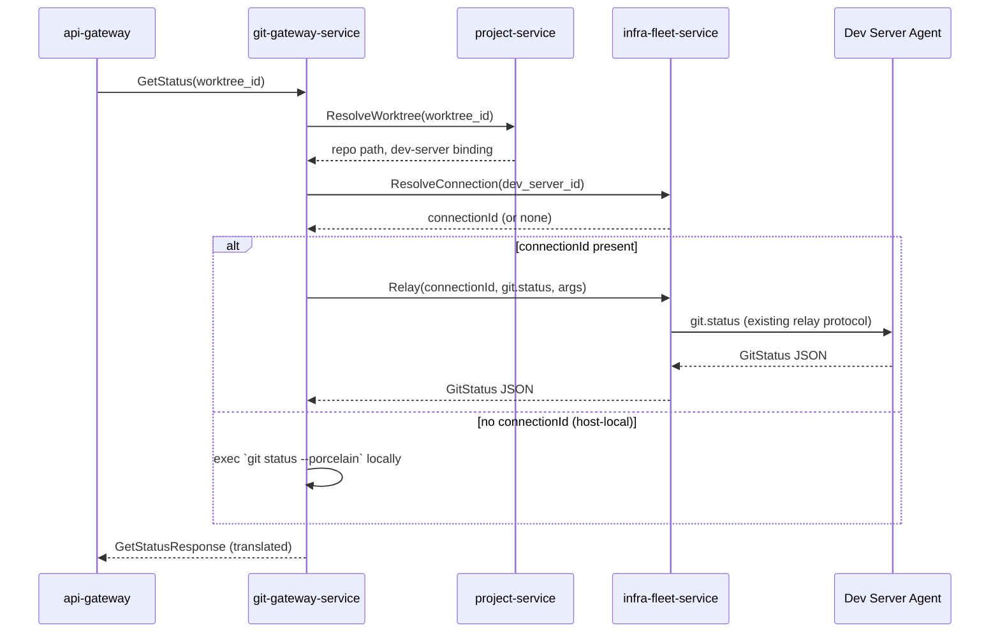

# git-gateway-service

Category: Workspace Coordination · Owns: nothing persistent · Migration
phase: 3 · Replaces: `git.ts` RPC methods (~35) and the dynamic
local-exec-vs-relay dispatch logic (per
[`00-service-catalog.md`](./00-service-catalog.md),
[`02-microservices-decomposition.md`](../architecture/02-microservices-decomposition.md)).

## 1. Overview & responsibility

`git-gateway-service` is a stateless dispatcher for every git operation a
worktree can perform: status, diff, stage/unstage, commit, push, pull,
branch management, history, conflict resolution, and AI-assisted commit
message / PR description generation. It does not execute git itself except
in the host-local case (see §2); its job is to resolve **which host owns
the worktree**, send the operation there, and translate the response back
into the service's own wire format.

This is, per
[`backend-agent-target-architecture.md`](../../backend/api/backend-agent-target-architecture.md)'s
own framing, **the reference implementation** the rest of this system's
coordination/execution split is modeled on:

```
Backend RPC (coordination: who's asking, is it allowed, which target)
  → resolve the worktree's owning host (connectionId or not)
  → not connected to a specific host → execute locally
  → connected → relay via infra-fleet-service's provider-registry client
      → Dev Server Agent does the actual git work on that host
```

Every design decision below exists to keep this service a faithful,
horizontally-scalable Go implementation of that already-correct pattern —
not to improve on it. See §10.

## 2. Bounded context

`git-gateway-service` owns:

- **No data.** No database, no schema, no migrations directory.
- **No git business rules.** It does not decide merge strategies, does not
  parse diffs beyond what's needed to pass them through, does not maintain
  branch state. That logic lives on the Dev Server Agent (remote worktrees)
  or in the locally invoked `git` binary (host-local worktrees per
  `04-tech-stack.md`'s "no unbounded call" and
  `08-inter-service-communication.md`'s Dev Server Agent relay section).

Its only owned logic is: **resolve host → dispatch → translate response**.
Concretely:

1. Resolve which repo/worktree a request targets, by calling
   `project-service`.
2. Resolve which host owns that worktree — does it have a `connectionId` —
   by calling `infra-fleet-service`.
3. If no `connectionId` (the worktree runs on the same host as this
   service — rare in a server deployment, since server-mode work normally
   targets a registered dev server, but retained for local/dev
   deployments and for completeness with the TS system's own local-exec
   branch), execute the `git` binary directly against the worktree path,
   respecting the baseline compatibility rules in
   [`docs/reference/git-compatibility.md`](../../../docs/reference/git-compatibility.md).
3'. If a `connectionId` is present, relay the operation through
    `infra-fleet-service`'s provider-registry client to the Dev Server
    Agent, using the existing wire protocol per
    `08-inter-service-communication.md`'s Option A (unchanged relay-ssh /
    relay-websocket / direct-websocket contract).
4. Translate whatever comes back (Dev Server Agent JSON-RPC response, or
   local `git` stdout/exit code) into this service's proto response types.

Real git semantics — what "clean" means, how a conflict is represented, how
a diff hunk is framed — are defined by the Dev Server Agent's git handler
(`agent/src/relay/agent-git-handler.ts` today) or by `git` itself. This
service treats those as an external contract it mirrors, not one it owns.

## 3. API surface (gRPC, sketch)

Proto package `orca.git.v1`, grouped by operation category (mirrors the TS
`git.*` namespace method-for-method per
`03-clean-architecture-guidelines.md`'s "one usecase per RPC" convention):

```protobuf
service GitGatewayService {
  // Status & diff — high frequency, latency-sensitive (see §8)
  rpc GetStatus(GetStatusRequest) returns (GetStatusResponse);
  rpc GetDiff(GetDiffRequest) returns (GetDiffResponse);
  rpc GetFileDiff(GetFileDiffRequest) returns (GetFileDiffResponse);

  // Stage / commit / push / pull
  rpc StageFiles(StageFilesRequest) returns (StageFilesResponse);
  rpc UnstageFiles(UnstageFilesRequest) returns (UnstageFilesResponse);
  rpc Commit(CommitRequest) returns (CommitResponse);
  rpc Push(PushRequest) returns (PushResponse);
  rpc Pull(PullRequest) returns (PullResponse);
  rpc Fetch(FetchRequest) returns (FetchResponse);

  // Branch operations
  rpc ListBranches(ListBranchesRequest) returns (ListBranchesResponse);
  rpc CreateBranch(CreateBranchRequest) returns (CreateBranchResponse);
  rpc SwitchBranch(SwitchBranchRequest) returns (SwitchBranchResponse);
  rpc DeleteBranch(DeleteBranchRequest) returns (DeleteBranchResponse);
  rpc MergeBranch(MergeBranchRequest) returns (MergeBranchResponse);
  rpc RebaseBranch(RebaseBranchRequest) returns (RebaseBranchResponse);

  // History
  rpc GetLog(GetLogRequest) returns (GetLogResponse);
  rpc GetCommit(GetCommitRequest) returns (GetCommitResponse);
  rpc Blame(BlameRequest) returns (BlameResponse);

  // Conflict resolution
  rpc GetConflicts(GetConflictsRequest) returns (GetConflictsResponse);
  rpc ResolveConflict(ResolveConflictRequest) returns (ResolveConflictResponse);
  rpc AbortMerge(AbortMergeRequest) returns (AbortMergeResponse);
  rpc ContinueMerge(ContinueMergeRequest) returns (ContinueMergeResponse);

  // AI-assisted authoring (see §3.1)
  rpc GenerateCommitMessage(GenerateCommitMessageRequest) returns (GenerateCommitMessageResponse);
  rpc GeneratePRDescription(GeneratePRDescriptionRequest) returns (GeneratePRDescriptionResponse);
}
```

Every request carries a `worktree_id` (the logical FK into `project-service`)
rather than a raw filesystem path — the same "never trust a client-supplied
host path" posture the TS system's `ssh-git-dispatch.ts` template already
enforces.

### 3.1 AI-assisted commit message / PR description generation

In TS this called out to an LLM directly from the backend process. That's
inconsistent with this system's stated principle that **AI inference does
not run on backend** — the same principle `task.aiDecompose` follows,
relaying to the Dev Server Agent's `ai.complete` per
`business-capabilities.md`'s "Task management & AI decomposition" section.
`git-gateway-service` follows the identical pattern:
`GenerateCommitMessage`/`GeneratePRDescription` gather the diff/status
context (itself fetched via the same resolve-and-dispatch path as
`GetDiff`), then relay the actual completion call to the Dev Server Agent's
`ai.complete`, using whichever AI provider account context
`ai-provider-service` has resolved for the caller. This service does not
hold or call out to an LLM API client of its own — it is a context
assembler and relay point, same as every other RPC here.

## 4. Domain model

Deliberately light — value objects mirrored from the Dev Server Agent's
wire protocol, not invariant-bearing entities, because this service owns no
state to protect invariants over:

- `GitStatus` — branch name, ahead/behind counts, staged/unstaged/untracked
  file lists, conflict flag.
- `DiffHunk` — file path, hunk header, added/removed line ranges, content.
- `CommitRef` — SHA, author, committer, timestamp, message, parent SHAs.
- `BranchInfo` — name, upstream, ahead/behind, is-current, is-remote.
- `ConflictEntry` — file path, conflict markers' byte ranges, ours/theirs
  content.

These types have no methods beyond translation (proto ↔ Dev Server Agent
JSON ↔ local `git` output parsing). No constructor enforces a git invariant
(e.g. "a commit must have a valid SHA") because this service never
constructs a commit — it only relays and reflects what the Dev Server Agent
or local `git` binary already produced.

## 5. Data model

**None.** No PostgreSQL database, no `migrations/` directory, no
`adapter/postgres/` package — this is the one deliberate omission from the
standard package layout in
[`03-clean-architecture-guidelines.md`](../architecture/03-clean-architecture-guidelines.md).

**Exception worth flagging**: an operational audit trail of
mutating operations (`Commit`, `Push`, `MergeBranch`, `ResolveConflict`, …)
— who ran what, against which worktree, when, and whether it succeeded —
may be worth persisting for compliance/debugging. If added, this is a
short-retention, write-only log, not business data, and should go through
`credential-broker-service`'s pattern of "small dedicated store, not folded
into a general-purpose table elsewhere." Recommendation: start without it
and add only if an operational need materializes — don't add a database to
a service designed to not need one on spec alone.

## 6. Package layout notes

Layout follows `03-clean-architecture-guidelines.md`'s standard shape, with
one intentional deviation called out explicitly: because this service owns
no data and no business rules beyond resolve-dispatch-translate, its
`domain/` and `usecase/` layers are much thinner than a data-owning
service's:

```
git-gateway-service/
├── cmd/server/main.go
├── internal/
│   ├── domain/                      # GitStatus, DiffHunk, CommitRef, BranchInfo, ConflictEntry — value objects only, no entities
│   ├── usecase/                     # one file per RPC; each is "resolve worktree → resolve host → dispatch → translate"
│   │   ├── get_status.go
│   │   ├── commit.go
│   │   ├── generate_commit_message.go
│   │   ├── ports.go                 # WorktreeResolver, HostResolver, GitExecutor (local), AgentRelayClient, ConnectionCache
│   │   └── *_test.go                # fakes for all five ports above — no real project-service/infra-fleet-service/agent in unit tests
│   └── adapter/
│       ├── grpc/                    # orca.git.v1 server implementation
│       ├── local/                   # outbound: shells out to the local git binary (host-local case)
│       ├── projectclient/           # outbound: gRPC client to project-service
│       ├── infraclient/             # outbound: gRPC client to infra-fleet-service (connectionId resolution + relay dispatch)
│       └── config/
├── proto/
└── go.mod
```

No `adapter/postgres/`, no `adapter/vault/` (this service holds no
secrets of its own, see §9), no `adapter/eventbus/` (git operations are
synchronous request/response by nature — a `git.commit` isn't a fact other
services react to asynchronously the way `task.completed` is). This is not
an oversight; it's the shape a pure-dispatch service should have. A
data-owning service (e.g. `task-service`) would treat this thinness as a
smell; here it's the correct reflection of what the service is bounded to
do (§2).

## 7. Dependencies



- **Calls `project-service`** — resolves which repo/worktree a
  `worktree_id` refers to and its filesystem path. Read-only, cached
  per §8.
- **Calls `infra-fleet-service`** — resolves the owning host's
  `connectionId` for a worktree's bound dev server, and (when present)
  performs the actual relay dispatch through its provider-registry client,
  per `02-microservices-decomposition.md`'s dependency graph (`git -->
  infra`) and the "only two Go services that talk to the execution plane"
  statement in `08-inter-service-communication.md`.
- **Called by `api-gateway`** only — no other service depends on
  `git-gateway-service` directly; it's a leaf in the coordination layer,
  consumed exclusively through the edge.
- No dependency on `credential-broker-service` — host auth is
  `infra-fleet-service`'s concern (§9), not this service's.

## 8. Non-functional requirements

- **Latency-sensitive.** `GetStatus`/`GetDiff` are called frequently and
  interactively from the UI (file-tree decorations, diff viewers polling or
  subscribing to changes) — these are on the critical path for perceived
  editor responsiveness, not background batch operations. Target: p50 <
  150ms, p99 < 500ms for `GetStatus`/`GetDiff` against an already-resolved
  connection, excluding Dev Server Agent-side git execution time itself.
  The mandatory 5s gRPC deadline (`08-inter-service-communication.md`) is
  a ceiling, not a target — status/diff calls should time their own
  budget tighter than that at the `api-gateway` edge.
- **Horizontal scaling.** Because this service holds no state and no
  database, it is a strong candidate for aggressive horizontal scaling —
  any replica can serve any request, scale-out is bound only by
  `infra-fleet-service`'s and the Dev Server Agent connections' own
  capacity, not by anything intrinsic to this service. Deployment should
  default to CPU/request-based HPA with a low minimum replica count and a
  high max, unlike data-owning services where connection-pool sizing
  caps useful replica count.
- **Connection-resolution caching.** Resolving `worktree_id →
  connectionId` on every call (two upstream gRPC round-trips per request)
  would dominate the latency budget above. Cache the resolved
  `(worktree_id) → (repo_path, connectionId)` tuple with a short TTL
  (recommend 5–15s) in-process per replica, not in a shared store — this
  service has no database and sharing a cache would reintroduce state it's
  deliberately designed not to own.
  - **Invalidation**: TTL expiry is the primary mechanism (bounded
    staleness is acceptable — a `connectionId` that changed mid-TTL means a
    call transiently goes to the wrong host or fails-and-retries, not
    silent data corruption, since the service performs no writes based on
    stale identity beyond dispatch target). Additionally, subscribe to
    `infra-fleet-service`'s connection-lifecycle events (async, via NATS
    JetStream per `08-inter-service-communication.md`'s event channel) to
    proactively evict cache entries on disconnect/reconnect rather than
    waiting out the full TTL — reduces the window where a request is
    routed to a stale connection after an explicit disconnect.
- **Failure mode on relay failure**: if the Dev Server Agent relay times
  out or the target host is unreachable, return a typed error
  (`ErrHostUnreachable`) rather than silently falling back to local
  execution — falling back would silently operate on the wrong worktree.

## 9. Security notes

`git-gateway-service` holds no secrets of its own — it has no
`adapter/vault/` package (§6). Whatever authentication the target host
needs (SSH key, dev-server auth token) is entirely `infra-fleet-service`'s
concern: this service passes a `connectionId` to `infra-fleet-service`'s
relay client and trusts it to have already established an authenticated
channel to that host. If the operation needs a credential *within* the
git operation itself (e.g. a push requiring a git remote's credential),
that resolution happens on the Dev Server Agent side against its own
locally stored credential material, consistent with
`backend-agent-target-architecture.md`'s Gap 2 fix direction ("spawn-time
credential resolution should happen entirely agent-side... backend never
sees the value in any form") — the same posture applies here for git
remote credentials, not just AI-CLI spawn credentials.

Authorization (does this user have write access to this worktree/repo) is
enforced before this service is reached — at `api-gateway` via OPA, per
`04-tech-stack.md`'s auth/policy row — not re-implemented here. This
service assumes an already-authorized request and performs no permission
checks of its own beyond validating that the resolved `worktree_id`
belongs to the tenant in the request's gRPC metadata (a defense-in-depth
check against `project-service`'s answer, not a primary authorization
decision).

## 10. Migration notes

Phase 3. This is a **port-faithfully** service, not a **fix-while-porting**
one — call this out explicitly against the contrast with
`scm-integration-service` (phase 3 also, but that service has a real TS gap
to close: the `gh`/`glab` shared-keychain CLI dispatch pattern documented in
`backend-agent-target-architecture.md`'s Gap 1). `git-gateway-service` has
no equivalent gap. The TS `git.ts` dynamic-dispatch pattern
(`business-capabilities.md`'s "Git operations": "Dynamically dispatched per
call — local git exec if the worktree has no `connectionId`, relayed to the
Dev Server Agent/SSH target otherwise") is already the target architecture,
confirmed by `backend-agent-target-architecture.md` naming it the reference
implementation for every other domain in this decomposition. The Go work
here is a straightforward one-to-one translation:

- Each of the ~35 `git.*` RPC methods becomes one `usecase/` file with the
  same resolve → dispatch → translate shape it has today.
- The relay call itself keeps Option A's existing wire protocol
  (`08-inter-service-communication.md`) unchanged — no Dev Server Agent
  change required for this service to ship.
- Risk is low and mechanical: the main engineering effort is proto
  definition and the `project-service`/`infra-fleet-service` gRPC clients,
  not new business logic. AI-assisted commit message/PR description
  generation is the one place this doc prescribes a **behavior change**
  from TS (§3.1: relay to the Dev Server Agent's `ai.complete` instead of
  backend calling an LLM directly) — flag this explicitly during
  migration review since it's a deviation from pure "port as-is," made to
  keep this service consistent with the AI-inference-off-backend principle
  established elsewhere in this redesign.
