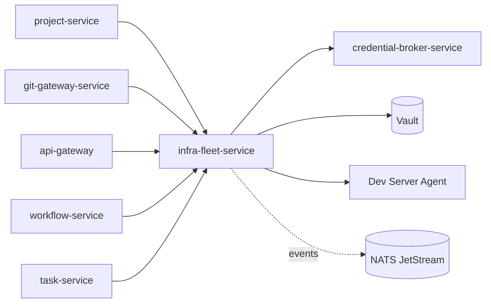
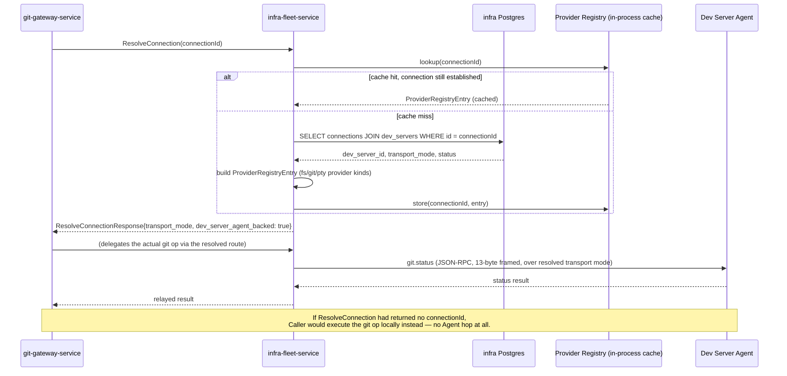

# `infra-fleet-service`

**Category**: Workspace Coordination
**ADR-021 schema**: `infra` (extended — see [§5](#5-data-model))
**Migration phase**: 2
**Replaces (TS)**: `backend/src/main/ssh/*` (`ssh-connection-manager.ts`,
`fleet-health-monitor.ts`, `ssh-relay-deploy*.ts`, `ssh-channel-multiplexer.ts`,
`ssh-port-forward*.ts`), `backend/src/main/providers/*` (provider registry,
`dev-server-*-provider.ts`, `ssh-*-provider.ts`, `local-pty-provider.ts`),
`terminal.*` RPC coordination, `workspacePorts.*`

## 1. Overview & responsibility

`infra-fleet-service` is the system of record for everything needed to
**reach a dev server and know which one owns a given piece of work**. It owns:

- SSH target registration and connection lifecycle (the TS
  `SSHConnectionManager`/`ssh-connection.ts` domain).
- The dev server registry: which hosts exist, how they're reached
  (`direct-websocket` / `relay-websocket` / `relay-ssh`), bootstrap state.
- Fleet health monitoring — periodic polling of CPU/RAM/disk/latency.
- Port-forward CRUD and process lifecycle.
- The **provider registry**: a `connectionId`-keyed dispatch table that
  resolves which host — and which transport — a given piece of work
  (filesystem op, git op, PTY op, port scan) belongs to. This is a direct
  port of TS's `providers/types.ts` registry and
  `dev-server-provider-lifecycle.ts`.
- Terminal/PTY session **routing** — which `ptyId` belongs to which
  connection, and dispatching spawn/write/resize/kill calls to the right
  place. Folded into this service per
  [`02-microservices-decomposition.md`](../architecture/02-microservices-decomposition.md)
  because it is the identical "which host owns this `connectionId`" logic as
  everything else here, not a separate concern.
- Workspace port scanning (`workspacePorts.*`), closing TS Gap 7 (see
  [§10](#10-migration-notes)).

What it does **not** own: any actual execution. It never runs a shell
command, reads a file, or moves PTY bytes itself — see [§2](#2-bounded-context).

### Why this service is architecturally central

Per `business-capabilities.md` and
[`08-inter-service-communication.md`](../architecture/08-inter-service-communication.md),
`infra-fleet-service` is the **reference implementation** of the
coordination/execution split that the whole system depends on:
`project-service` calls it to validate a dev-server binding, and
`git-gateway-service` calls it on every single `git.*` call to resolve a
worktree's owning host before deciding whether to execute locally or relay.
If this service is down, no `connectionId`-bound git operation, terminal
session, filesystem op, or port scan can complete anywhere in the fleet —
see [§8](#8-non-functional-requirements).

## 2. Bounded context

**Hard boundary**: PTY, git, and filesystem **execution** stays on the Dev
Server Agent (`agent/`), a different system entirely, out of scope for this
Go rewrite (per
[`02-microservices-decomposition.md`](../architecture/02-microservices-decomposition.md)
"What's deliberately not a separate service"). `infra-fleet-service` only
**routes and coordinates**:

| Concern | Owned by `infra-fleet-service` | Owned by the Dev Server Agent |
|---|---|---|
| SSH/WS connection establish, teardown, health-check | Yes | — |
| Knowing which `connectionId` maps to which host/transport | Yes | — |
| PTY byte I/O (the actual terminal data stream) | No — routes the request to the right connection, does not touch the bytes | Yes (`node-pty` on the target host) |
| Git command execution | No — `git-gateway-service` calls this service to resolve the host, then dispatches | Yes |
| Filesystem reads/writes | No | Yes |
| Fleet health polling (CPU/RAM/disk/latency) | Yes (SSH exec is a coordination-layer act — establishing/monitoring the connection itself, not doing dev-work on it, per `business-capabilities.md` §"Dev server / fleet management") | N/A |
| Workspace port scan | Yes — routes to local scan or relays to the agent's `ports.*` handler | Executes the scan when relayed |

This mirrors exactly how `business-capabilities.md` classifies "Terminal /
PTY session coordination": backend coordinates connection routing (which
provider a given `ptyId` belongs to); actual PTY I/O always executes on the
target host. The same sentence, with "PTY" swapped for "git"/"fs"/"port
scan", is this service's entire mandate.

## 3. API surface (gRPC sketch)

Proto package `orca.infra.v1`. All RPCs take `tenant_id` via gRPC metadata
per [`08-inter-service-communication.md`](../architecture/08-inter-service-communication.md),
not as a message field.

```protobuf
service InfraFleetService {
  // --- Dev server registry ---
  rpc RegisterDevServer(RegisterDevServerRequest) returns (DevServer);
  rpc GetDevServer(GetDevServerRequest) returns (DevServer);
  rpc ListDevServers(ListDevServersRequest) returns (ListDevServersResponse);
  rpc UpdateDevServer(UpdateDevServerRequest) returns (DevServer);
  rpc DeregisterDevServer(DeregisterDevServerRequest) returns (google.protobuf.Empty);

  // --- SSH target registration ---
  rpc RegisterSshTarget(RegisterSshTargetRequest) returns (SshTarget);
  rpc GetSshTarget(GetSshTargetRequest) returns (SshTarget);
  rpc ListSshTargets(ListSshTargetsRequest) returns (ListSshTargetsResponse);
  rpc UpdateSshTarget(UpdateSshTargetRequest) returns (SshTarget);
  rpc DeleteSshTarget(DeleteSshTargetRequest) returns (google.protobuf.Empty);

  // --- Connection lifecycle ---
  rpc EstablishConnection(EstablishConnectionRequest) returns (Connection);
  rpc TeardownConnection(TeardownConnectionRequest) returns (google.protobuf.Empty);
  rpc CheckConnectionHealth(CheckConnectionHealthRequest) returns (ConnectionHealth);
  rpc ListConnections(ListConnectionsRequest) returns (ListConnectionsResponse);

  // --- Fleet bootstrap ---
  rpc BootstrapFleetTarget(BootstrapFleetTargetRequest) returns (stream BootstrapProgress);
  // Installs Node/git, deploys the relay binary over SFTP+SSH exec,
  // negotiates version (Stack B handshake) — streaming so callers can
  // show live progress, same shape as TS's ssh-relay-deploy*.ts.

  // --- Port forwarding ---
  rpc CreatePortForward(CreatePortForwardRequest) returns (PortForward);
  rpc ListPortForwards(ListPortForwardsRequest) returns (ListPortForwardsResponse);
  rpc DeletePortForward(DeletePortForwardRequest) returns (google.protobuf.Empty);

  // --- Provider registry resolution (called by git-gateway-service, project-service, etc.) ---
  rpc ResolveConnection(ResolveConnectionRequest) returns (ResolveConnectionResponse);
  // Input: connectionId (or none). Output: which transport mode, which
  // host, and whether the caller should execute locally or relay. THE
  // core call of this service — see the sequence diagram below.

  // --- Terminal/PTY session routing (coordination only — no PTY bytes cross this API) ---
  rpc SpawnTerminalSession(SpawnTerminalSessionRequest) returns (TerminalSession);
  rpc RouteTerminalWrite(RouteTerminalWriteRequest) returns (google.protobuf.Empty);
  // Only used to route control-plane metadata (which connection a ptyId
  // belongs to); actual I/O streaming from api-gateway's WS handler goes
  // directly to the Dev Server Agent relay client once resolved, not
  // through this RPC per-byte — see §7.
  rpc ResizeTerminalSession(ResizeTerminalSessionRequest) returns (google.protobuf.Empty);
  rpc KillTerminalSession(KillTerminalSessionRequest) returns (google.protobuf.Empty);
  rpc ListTerminalSessions(ListTerminalSessionsRequest) returns (ListTerminalSessionsResponse);

  // --- Workspace port scanning ---
  rpc ScanWorkspacePorts(ScanWorkspacePortsRequest) returns (ScanWorkspacePortsResponse);
  // Always relays when connectionId is set — closes TS Gap 7, see §10.
}
```

## 4. Domain model

- **`DevServer`** — a registered dev host: id, tenant, display name,
  transport mode (`direct-websocket` / `relay-websocket` / `relay-ssh`),
  bootstrap status, last-seen health snapshot, associated `SshTarget` (if
  the transport requires one).
- **`SshTarget`** — host/port/username, auth method reference (Vault SSH
  cert path or KV v2 key path — never a raw key in this domain object),
  known-hosts fingerprint, jump-host chain if applicable.
- **`Connection`** — a live or recently-live session between this service
  and a `DevServer`: `connectionId` (the logical FK every other service
  passes around), transport mode, underlying multiplexer/socket state,
  established-at, last-activity-at, health status. Invariant: a
  `connectionId` resolves to exactly one `DevServer` at a time.
- **`PortForward`** — local/remote port pair, direction, owning
  `Connection`, process/tunnel handle, status.
- **`ProviderRegistryEntry`** — the resolved dispatch record for a
  `connectionId`: which provider implementation to use
  (`ssh-backed`/`dev-server-agent-backed`/`local`) for filesystem, git, and
  PTY operations respectively. This is the domain object
  `ResolveConnection` returns; it mirrors TS's `providers/types.ts`
  registry entry shape but expressed as an explicit value object instead of
  an in-memory `Map`.
- **`TerminalSession`** — `ptyId`, owning `connectionId`, worktree/cwd
  context, created-at, last-active-at. Holds no PTY bytes.
- **`FleetHealthSample`** — CPU/RAM/disk/latency reading for a `DevServer`
  at a point in time, collected by the health poller.

Domain invariants live in constructors/methods per
[`03-clean-architecture-guidelines.md`](../architecture/03-clean-architecture-guidelines.md):
e.g. a `Connection` cannot transition to `established` without a resolved
`DevServer`; a `PortForward` cannot be created against a `Connection` that
isn't `established`.

## 5. Data model (Postgres schema sketch)

Database: `infra` (own physical Postgres instance/cluster, per
[`05-data-architecture.md`](../architecture/05-data-architecture.md) — this
service is a reasonable candidate for a shared lower-traffic cluster
alongside `annotation`/`usage`, revisit if connection-poll volume argues
otherwise).

> **Note on ADR-021 scope**: ADR-021's `infra` schema only defined
> `ssh_targets` and `port_forwards` — the DB-backed subset of what this
> service owns. This service's actual scope is broader (dev server
> registry, connection lifecycle, fleet health history, provider-registry
> state, terminal session routing), so the schema below extends ADR-021's
> two tables with the additional tables that scope requires. This is a
> deliberate, explicit extension, not a drift from ADR-021.

```sql
CREATE TABLE dev_servers (
  id                UUID PRIMARY KEY DEFAULT gen_random_uuid(),
  tenant_id         UUID NOT NULL,
  display_name      TEXT NOT NULL,
  transport_mode    TEXT NOT NULL CHECK (transport_mode IN
                       ('direct-websocket', 'relay-websocket', 'relay-ssh')),
  ssh_target_id     UUID REFERENCES ssh_targets(id),
  bootstrap_status  TEXT NOT NULL DEFAULT 'pending',
  agent_version     TEXT,
  created_at        TIMESTAMPTZ NOT NULL DEFAULT now(),
  updated_at        TIMESTAMPTZ NOT NULL DEFAULT now()
);

-- ADR-021's original ssh_targets table, carried forward.
CREATE TABLE ssh_targets (
  id                UUID PRIMARY KEY DEFAULT gen_random_uuid(),
  tenant_id         UUID NOT NULL,
  host              TEXT NOT NULL,
  port              INTEGER NOT NULL DEFAULT 22,
  username          TEXT NOT NULL,
  auth_vault_path   TEXT NOT NULL,   -- pointer into Vault (SSH cert role or KV v2 path); never a key
  known_hosts_fingerprint TEXT,
  jump_host_target_id    UUID REFERENCES ssh_targets(id),
  created_at        TIMESTAMPTZ NOT NULL DEFAULT now(),
  updated_at        TIMESTAMPTZ NOT NULL DEFAULT now()
);

CREATE TABLE connections (
  id                UUID PRIMARY KEY DEFAULT gen_random_uuid(),  -- the connectionId
  tenant_id         UUID NOT NULL,
  dev_server_id     UUID NOT NULL REFERENCES dev_servers(id),
  transport_mode    TEXT NOT NULL,
  status            TEXT NOT NULL DEFAULT 'establishing' CHECK (status IN
                       ('establishing', 'established', 'degraded', 'closed')),
  established_at    TIMESTAMPTZ,
  last_activity_at  TIMESTAMPTZ,
  closed_at         TIMESTAMPTZ,
  created_at        TIMESTAMPTZ NOT NULL DEFAULT now()
);
CREATE INDEX idx_connections_dev_server ON connections(dev_server_id) WHERE status = 'established';

-- ADR-021's original port_forwards table, carried forward.
CREATE TABLE port_forwards (
  id                UUID PRIMARY KEY DEFAULT gen_random_uuid(),
  tenant_id         UUID NOT NULL,
  connection_id     UUID NOT NULL REFERENCES connections(id),
  local_port        INTEGER NOT NULL,
  remote_port       INTEGER NOT NULL,
  direction         TEXT NOT NULL CHECK (direction IN ('local-to-remote', 'remote-to-local')),
  status            TEXT NOT NULL DEFAULT 'active',
  created_at        TIMESTAMPTZ NOT NULL DEFAULT now()
);

-- Extension beyond ADR-021: fleet health history.
CREATE TABLE fleet_health_samples (
  id                BIGINT GENERATED ALWAYS AS IDENTITY PRIMARY KEY,
  dev_server_id     UUID NOT NULL REFERENCES dev_servers(id),
  cpu_percent       DOUBLE PRECISION,
  ram_used_bytes    BIGINT,
  ram_total_bytes   BIGINT,
  disk_used_bytes   BIGINT,
  disk_total_bytes  BIGINT,
  latency_ms        DOUBLE PRECISION,
  sampled_at        TIMESTAMPTZ NOT NULL DEFAULT now()
);
CREATE INDEX idx_fleet_health_dev_server_time ON fleet_health_samples(dev_server_id, sampled_at DESC);
-- Retention: pruned by a scheduled job (not golang-migrate) — keep ~7 days
-- of raw samples, matching TS's polling cadence needs, not a permanent log.

-- Extension beyond ADR-021: provider-registry state (durable record of
-- what ResolveConnection would compute; primarily a debugging/audit aid
-- since resolution is cheap to recompute from connections + dev_servers).
CREATE TABLE provider_registry_entries (
  connection_id     UUID PRIMARY KEY REFERENCES connections(id),
  fs_provider_kind  TEXT NOT NULL CHECK (fs_provider_kind IN ('local', 'ssh-backed', 'dev-server-agent-backed')),
  git_provider_kind TEXT NOT NULL CHECK (git_provider_kind IN ('local', 'ssh-backed', 'dev-server-agent-backed')),
  pty_provider_kind TEXT NOT NULL CHECK (pty_provider_kind IN ('local', 'ssh-backed', 'dev-server-agent-backed')),
  resolved_at       TIMESTAMPTZ NOT NULL DEFAULT now()
);

-- Extension beyond ADR-021: terminal/PTY session routing metadata.
CREATE TABLE terminal_sessions (
  pty_id            UUID PRIMARY KEY DEFAULT gen_random_uuid(),
  tenant_id         UUID NOT NULL,
  connection_id     UUID REFERENCES connections(id),  -- NULL = local, connectionless session
  cwd               TEXT,
  created_at        TIMESTAMPTZ NOT NULL DEFAULT now(),
  last_active_at    TIMESTAMPTZ NOT NULL DEFAULT now(),
  closed_at         TIMESTAMPTZ
);
CREATE INDEX idx_terminal_sessions_connection ON terminal_sessions(connection_id) WHERE closed_at IS NULL;
```

All tenant-scoped tables carry `tenant_id` and RLS per
[`05-data-architecture.md`](../architecture/05-data-architecture.md). Every
table above has `tenant_id` except `port_forwards`/`fleet_health_samples`/
`provider_registry_entries`, which inherit tenant scope transitively through
their `connection_id`/`dev_server_id` FK and are queried with an explicit
join-through-tenant check at the repository layer — flagged here rather than
adding a denormalized `tenant_id` column purely for RLS convenience; revisit
if RLS-without-join proves necessary for defense-in-depth.

## 6. Package layout notes

Standard layout per
[`03-clean-architecture-guidelines.md`](../architecture/03-clean-architecture-guidelines.md),
with one addition this service specifically requires:

```
infra-fleet-service/
├── internal/
│   ├── domain/            # DevServer, SshTarget, Connection, PortForward,
│   │                       #   ProviderRegistryEntry, TerminalSession, FleetHealthSample
│   ├── usecase/            # ResolveConnection, EstablishConnection, SpawnTerminalSession,
│   │                       #   PollFleetHealth, ScanWorkspacePorts, ...
│   │                       # defines DevServerAgentClient port here (not adapter/)
│   └── adapter/
│       ├── grpc/            # inbound: InfraFleetService gRPC handlers
│       ├── postgres/        # outbound: repository implementations (sqlc)
│       ├── vault/           # outbound: SSH secrets engine + KV v2 client, dynamic DB creds
│       ├── eventbus/        # outbound: connection.established / connection.lost events
│       └── devserveragent/  # outbound: THIS SERVICE'S DEFINING ADAPTER — see below
```

`adapter/devserveragent/` is the one substantial deviation from the
"typical postgres/vault/eventbus outbound set" every other service has. It
implements the `usecase`-defined `DevServerAgentClient` port against the
**existing** TS wire protocol (Option A, see [§10](#10-migration-notes) and
[`08-inter-service-communication.md`](../architecture/08-inter-service-communication.md)),
not a new gRPC contract:

```
adapter/devserveragent/
├── wire/
│   ├── frame.go             # 13-byte header codec: [TYPE u8][SEQ u32BE][ACK u32BE][LEN u32BE]
│   │                         #   port of agent-wire.ts / protocol.ts (both stacks share this layout)
│   └── jsonrpc.go           # JSON-RPC 2.0 request/response/notification framing over the above
├── directws/                # direct-websocket mode: dial out to the agent's WS listener
├── relayws/                 # relay-websocket mode: accept inbound WS from an agent behind NAT
├── relayssh/                # relay-ssh mode: SSH exec channel + SshChannelMultiplexer port,
│                             #   plus the bootstrap/deploy flow (SFTP relay binary, version handshake)
├── handshake.go             # agent.handshake (Stack A) / version handshake (Stack B)
├── client.go                # DevServerAgentClient implementation — picks a mode's transport,
│                             #   exposes Call(method, params) / Notify(method, params) / Stream(...)
└── methods.go                # typed wrappers for the specific agent RPC methods this service
                              #   calls: pty.spawn/write/resize/kill, ports.scan, preflight.check
```

This package is deliberately isolated from `git-gateway-service`'s own
(smaller) devserveragent client rather than shared via `orca-go-common` —
per the clean-architecture doc's "cross-service shared code policy," a
wire-protocol client is not a business-logic-free cross-cutting concern, and
the two services call different method subsets (this service: `pty.*`,
`ports.*`, health-poll exec commands; `git-gateway-service`: `git.*`,
`fs.*`). If the duplication becomes a real maintenance burden, promote the
`wire/` frame-codec layer only (not the method-specific clients) to a shared
internal module — not `orca-go-common`, since it's still not a general
cross-cutting concern.

## 7. Dependencies

**Called by:**

- `project-service` — validates a `devServerId` exists before committing a
  project↔dev-server binding (synchronous saga, per
  [`05-data-architecture.md`](../architecture/05-data-architecture.md)).
- `git-gateway-service` — calls `ResolveConnection` on every `git.*`
  dispatch to determine local-exec vs. relay, per
  [`08-inter-service-communication.md`](../architecture/08-inter-service-communication.md).
- `api-gateway` — for WS terminal streams: accepts a browser WS connection,
  calls `SpawnTerminalSession`/resolves the connection, then opens the
  actual PTY I/O stream directly against this service's gRPC
  server-streaming terminal-data endpoint (bytes do not round-trip through
  `ResolveConnection` per-keystroke — only the initial spawn/resize/kill
  control calls are unary RPCs; the data stream is a dedicated
  server-streaming RPC once the route is resolved).
- Any other service needing dev-server reachability info (e.g.
  `workflow-service`/`task-service` when a step targets a specific dev
  server) — see the dependency graph in
  [`02-microservices-decomposition.md`](../architecture/02-microservices-decomposition.md).

**Calls:**

- `credential-broker-service` — for any tenant/user-facing SSH credential
  material that isn't a Vault SSH cert issued directly to this service (see
  [§9](#9-security-notes)).
- Vault directly — for its own dynamic Postgres DB credentials (bootstrap
  exception, every service does this) **and** for the SSH secrets engine /
  KV v2 paths that back `ssh_targets.auth_vault_path` (this service is one
  of the few permitted direct Vault callers for infrastructure-adjacent
  secret material, since SSH host credentials are this service's own
  operational concern, not tenant secret material routed through
  `credential-broker-service`'s mediation — confirm this reading against
  [`06-secrets-vault-architecture.md`](../architecture/06-secrets-vault-architecture.md)
  before finalizing Vault ACL policy, since that doc's default is
  "no other service talks to Vault directly for secret material").
- The Dev Server Agent (`agent/`) — via `adapter/devserveragent/`, see §6.
- NATS JetStream — publishes `connection.established` / `connection.lost` /
  `dev_server.health_degraded` events (transactional outbox pattern) that
  `notification-service` and others can subscribe to.



### connectionId resolution + relay dispatch flow

This is the core interaction pattern every dependent service relies on.
Example: `git-gateway-service` handling a `git.status` call for a worktree
bound to a remote dev server.



`ResolveConnection` is the single call every "does this worktree/session
have a `connectionId`" branch in the whole system reduces to — the same
shape `git-gateway-service` and `project-service` both depend on, per
[`02-microservices-decomposition.md`](../architecture/02-microservices-decomposition.md)'s
framing of this service as "the reference implementation of the
coordination/execution split pattern."

## 8. Non-functional requirements

- **Availability is a single point of failure for the entire fleet
  surface.** Every `connectionId`-bound feature in the system — git ops,
  terminal sessions, filesystem access via a dev server, port forwarding,
  port scanning — routes through `ResolveConnection` or an equivalent call
  here first. This service's SLO must be at least as strict as
  `api-gateway`'s own, and its rollout/deploy strategy must avoid any window
  with zero healthy replicas (rolling update with `minReadySeconds` and a
  `PodDisruptionBudget`, per
  [`10-deployment-infrastructure.md`](../architecture/10-deployment-infrastructure.md)).
- **Connection pooling/reuse.** Underlying SSH/WS connections to dev
  servers are expensive to establish (SSH auth handshake, agent handshake)
  and must be reused across requests, not opened per-call. This service
  holds a live in-process pool of `Connection` transports keyed by
  `connectionId`/`dev_server_id`, with idle-timeout eviction — mirrors TS's
  `SSHConnectionManager` connection cache. Because this service is
  horizontally scaled (multiple pods), a given `connectionId`'s live
  transport lives on exactly **one** pod at a time; other pods resolve
  which pod owns it (or re-establish, for `direct-websocket`/`relay-ssh`
  modes where any pod can dial out) rather than assuming shared in-memory
  state. `relay-websocket` mode (agent dials in) requires session affinity
  or connection handoff — flag this as an open design question for the
  Go rewrite's implementation phase, not resolved by this doc.
- **Fleet health polling cadence**: 30s per dev server, matching TS's
  `FleetHealthMonitor`. Polling fans out across replicas — each dev server
  polled by exactly one replica per interval (leader-election-per-target or
  a distributed lock via Postgres advisory locks, not every replica polling
  every target).
- **Backpressure on terminal session count**: cap concurrent
  `TerminalSession`s per `connectionId` (TS enforced `MAX_CONCURRENT_STREAMS
  = 16` at the relay-protocol level for Stack B — carry the same ceiling
  forward as a coordination-layer check, not just a transport-layer one).
- **Deadlines**: every outbound call to the Dev Server Agent has an
  explicit timeout distinct from the default 5s intra-cluster gRPC deadline
  — SSH exec health checks and fleet bootstrap can legitimately take
  longer; document per-call-site overrides per
  [`08-inter-service-communication.md`](../architecture/08-inter-service-communication.md).

## 9. Security notes

- **No long-lived SSH private keys on this service's filesystem or
  database**, ever. `ssh_targets.auth_vault_path` is a pointer, never key
  material. Two backing mechanisms per
  [`06-secrets-vault-architecture.md`](../architecture/06-secrets-vault-architecture.md):
  - **Preferred**: Vault's **SSH secrets engine** signs a short-lived SSH
    certificate for each connection attempt against targets that support
    certificate-based auth. This service requests a fresh signed cert per
    connection (or per lease window), uses it, and never persists it —
    directly replaces the TS system's model of holding a static private
    key on disk for the connection's lifetime.
  - **Fallback**: for targets that only support static key auth, the key
    material lives in Vault **KV v2**, fetched at connection-establish time
    and held in memory only for the duration of the SSH handshake, never
    written to disk or logged.
- **Per-connection isolation**: each `Connection`'s transport (socket, SSH
  channel, multiplexer state) is isolated per `connectionId` — no shared
  mutable state between two tenants' connections even if they happen to
  target the same physical host, matching the domain invariant in
  [§4](#4-domain-model) that a `connectionId` resolves to exactly one
  `DevServer`.
- **Tenant scoping**: every query enforces `tenant_id` at the repository
  layer per [`05-data-architecture.md`](../architecture/05-data-architecture.md);
  RLS is the defense-in-depth backstop, not the primary mechanism. A
  connection resolved for tenant A must never be returned to a caller
  authenticated as tenant B, even if the `connectionId` UUID were guessed —
  `ResolveConnection` must join through `tenant_id` on every lookup.
- **Vault ACL scope**: this service's Vault policy grants access to the SSH
  secrets engine role(s) and the specific KV v2 paths under its own
  `ssh_targets` namespace, plus its own dynamic DB credential lease —
  nothing else. It does not get blanket access to
  `credential-broker-service`'s tenant-secret paths.
- **Agent-side trust boundary unchanged**: this service inherits whatever
  auth model each transport mode already has (`agent.handshake`'s
  short-lived `AgentTokenManager` token for `direct-websocket`, the
  mandatory shared-secret `ORCA_AGENT_TOKEN` for `relay-websocket`, the SSH
  connection itself as the trust boundary for `relay-ssh`) — the Go rewrite
  does not change agent-side auth, per Option A ([§10](#10-migration-notes)).

## 10. Migration notes

- **Phase 2** migration, alongside `project-service`, `ai-provider-service`,
  `workflow-service`, `task-service`, `orchestration-service`,
  `automation-service`, `credential-broker-service` — see
  [`00-service-catalog.md`](./00-service-catalog.md).
- **Closes TS Gap 7** (`workspacePorts.*` silently dropped
  `connectionId`-bound worktrees instead of relaying — `business-capabilities.md`
  §"Workspace port scanning", `backend-hld-c4.md` §"Known architecture
  deviations" #7). `ScanWorkspacePorts` is designed correctly from the
  start: it always calls `ResolveConnection` first, and when a
  `connectionId` is present it relays the scan to the agent's `ports.*`
  handler rather than silently returning an empty result. There is no
  local-only code path that skips relaying when a connection is bound —
  the bug class this closes (an `if (connectionId) return []` shortcut) is
  structurally impossible in this design because relaying is the default,
  not a special case.
- **Protocol decision: Option A** (per
  [`08-inter-service-communication.md`](../architecture/08-inter-service-communication.md)).
  This service implements a Go client for the **existing** TS wire
  protocol — the 3 connection modes (`direct-websocket`, `relay-websocket`,
  `relay-ssh`) and the 13-byte-framed JSON-RPC (`[TYPE u8][SEQ u32BE][ACK
  u32BE][LEN u32BE]`, both Stack A `agent-wire.ts` and Stack B
  `protocol.ts` share this header shape) documented in
  [`specs/agent/api/connection-modes.md`](../../agent/api/connection-modes.md).
  The Dev Server Agent itself (`agent/`) does not change — only this
  service needs a new client implementation of a protocol that already
  exists. Rationale: lowest risk, keeps this redesign scoped to `backend/`
  as requested, defers Option B (gRPC-streaming `orca.agent.v1`,
  modernizing `agent/` itself) to a follow-up effort once the Go backend is
  stable. If the agent protocol is ever redesigned, only
  `adapter/devserveragent/` in this service (and the equivalent package in
  `git-gateway-service`) needs to change — the rest of this service's
  layers are protocol-agnostic by construction (Clean Architecture's
  dependency rule keeps the wire format out of `domain/`/`usecase/`).
- **Known TS drift to account for during porting**: per
  [`specs/agent/api/README.md`](../../agent/api/README.md), the agent
  process runs **two independently-implemented** RPC surfaces (Part A:
  local WS-connected "Dev Server Agent" dispatcher; Part B: the
  SSH-deployed "Orca Relay" `RelayDispatcher`) that frequently diverge in
  method names and param shapes for the same nominal operation (e.g.
  `pty.create` vs. `pty.spawn`, `preflight.check`'s differing param
  contract). `adapter/devserveragent/` must model this as two distinct
  method-call surfaces behind one `DevServerAgentClient` interface, not
  assume a single flat namespace — porting a call site without checking
  which Part actually implements the target method on the relevant
  transport mode is a known source of TS-side bugs
  ([`specs/agent/api/gaps-and-findings.md`](../../agent/api/gaps-and-findings.md)),
  worth avoiding by explicit design rather than repeating in Go.
- **Data migration**: `ssh_targets` and `port_forwards` carry forward from
  ADR-021's `infra` schema with a backfill for the new columns/tables this
  doc adds (`dev_servers`, `connections`, `fleet_health_samples`,
  `provider_registry_entries`, `terminal_sessions`) — none of which existed
  as durable Postgres state in the TS system (dev server registry and
  provider registry were in-memory; terminal sessions were transient). No
  existing row data needs backfilling for those new tables; they start
  empty at cutover.
