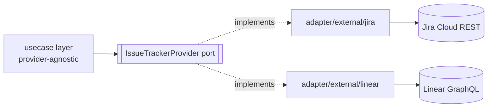

# `issue-tracking-service`

## 1. Overview & responsibility

`issue-tracking-service` is the Go home for Jira and Linear integration. It
replaces the TS `jira.*` RPC namespace (`jira.ts`, 18 methods) and the
combined `linear.*` / `linear-agent-access.*` namespaces (35 methods) — see
[`business-capabilities.md`](../../backend/api/business-capabilities.md)'s
"Jira & Linear integration" entry.

It does one thing: query and mutate issues, projects, and workflow state in
Jira and Linear on the caller's behalf, using per-tenant credentials
resolved from `credential-broker-service`. It owns no PM data itself — Jira
and Linear remain the systems of record.

**Category**: SCM & PM Integration (service #17 in
[`02-microservices-decomposition.md`](../architecture/02-microservices-decomposition.md#service-catalog)).
**Migration phase**: 1 — pilot tier, low risk.

### Why this is low risk, unlike `scm-integration-service`

The decomposition doc groups this next to `scm-integration-service`
(GitHub/GitLab/Bitbucket/Azure DevOps/Gitea), but the migrations read
differently. `scm-integration-service` closes a real TS gap (Gap 1 in
`backend-agent-target-architecture.md`): the GitHub/GitLab code shells out
to CLI tools against a shared keychain, which the Go rewrite redesigns
around per-tenant OAuth HTTP clients. `issue-tracking-service` has no
equivalent gap — per `business-capabilities.md`, `jira.*`/`linear.*` is
already "cleanly backend-local: direct HTTPS REST (Jira) / GraphQL SDK
(Linear) calls," per-user credentials, "not CLI-based, not relayed, not
Postgres-backed for credentials." That's already this whole redesign's
target shape. So this is a faithful port of already-correct architecture,
not a gap-fixing rebuild — worth saying plainly rather than inventing
problems. What actually changes: the implementation language, credential
storage (Vault instead of `WebCredentialStore` files, §9), and one side
effect that becomes an event instead of a direct write (§7).

## 2. Bounded context

Jira and Linear are external systems of record. This service is a
stateless translation/orchestration layer, not a replica: a caller
(`api-gateway`, or `task-service` for issue linking) asks for a
provider-agnostic operation; the domain model (§4) maps it onto the
provider's native shape (Jira REST resources, Linear GraphQL); the call
goes out authenticated with credentials scoped to the calling tenant/user
via `credential-broker-service`; the response is translated back.

No issue/comment/workflow history is cached as a queryable copy — every
read is live against the provider (subject to §8's rate limiting). The only
owned state is thin operational bookkeeping: connection status, sync
cursors, and (if webhooks are added) a delivery log — §5.

## 3. API surface (gRPC service sketch)

Proto package `orca.issuetracking.v1`, one `IssueTrackingService`, with
`provider` (`JIRA` | `LINEAR`) as an explicit field on shared requests
rather than two separate services — keeps provider-agnostic use cases
mapped one-to-one onto RPCs.

```proto
service IssueTrackingService {
  // Connection mgmt — {jira,linear}.connect/disconnect/select{Site,Workspace}/status/testConnection
  rpc Connect(ConnectRequest) returns (ConnectionStatus);
  rpc Disconnect(DisconnectRequest) returns (google.protobuf.Empty);
  rpc SelectWorkspace(SelectWorkspaceRequest) returns (ConnectionStatus); // Jira "site" / Linear "workspace"
  rpc GetConnectionStatus(GetConnectionStatusRequest) returns (ConnectionStatus);
  rpc TestConnection(TestConnectionRequest) returns (TestConnectionResult);

  // Issue querying — {jira,linear}.searchIssues/listIssues/getIssue/issueComments, linear.resolveCurrentIssue
  rpc SearchIssues(SearchIssuesRequest) returns (SearchIssuesResponse);
  rpc ListIssues(ListIssuesRequest) returns (ListIssuesResponse);
  rpc GetIssue(GetIssueRequest) returns (Issue);
  rpc ListIssueComments(ListIssueCommentsRequest) returns (ListIssueCommentsResponse);
  rpc ResolveCurrentIssue(ResolveCurrentIssueRequest) returns (Issue); // Linear: infer from branch/context

  // Issue mutation — {jira,linear}.createIssue/updateIssue/addIssueComment, linear.issueSetState
  rpc CreateIssue(CreateIssueRequest) returns (Issue);
  rpc UpdateIssue(UpdateIssueRequest) returns (Issue);
  rpc AddIssueComment(AddIssueCommentRequest) returns (IssueComment);
  rpc TransitionIssue(TransitionIssueRequest) returns (Issue); // Jira transitions, Linear issueSetState

  // Project & workflow querying — jira.listProjects/listIssueTypes/listCreateFields/
  // listPriorities/listAssignableUsers/listTransitions/getProjectStatusOrder,
  // linear.listTeams/teamLabels/teamMembers/teamStates/getProject
  rpc ListProjects(ListProjectsRequest) returns (ListProjectsResponse); // Jira projects, Linear teams
  rpc GetProject(GetProjectRequest) returns (Project);
  rpc ListWorkflowStates(ListWorkflowStatesRequest) returns (ListWorkflowStatesResponse);
  rpc ListIssueTypes(ListIssueTypesRequest) returns (ListIssueTypesResponse); // Jira only
  rpc ListCreateFields(ListCreateFieldsRequest) returns (ListCreateFieldsResponse);
  rpc ListAssignableUsers(ListAssignableUsersRequest) returns (ListAssignableUsersResponse);

  rpc CreateProject(CreateProjectRequest) returns (Project); // linear.createProject; no Jira equivalent today

  // Issue linking (task-service integration; §7)
  rpc LinkIssueToTask(LinkIssueToTaskRequest) returns (LinkIssueToTaskResponse);
  rpc AttachIssueLink(AttachIssueLinkRequest) returns (google.protobuf.Empty); // Linear issueAttachLink
}
```

Not carried forward as distinct RPCs: Linear's `agentTeamList` /
`agentTeamMembers` / `agentTeamStates` / `agentTeamLabels` /
`agentSearchIssues` / `agentProjectList` — near-duplicates of the
non-`agent` methods that exist in TS because the AI-agent call path and the
human UI path grew separate entry points. They collapse onto the RPCs
above; which caller is invoking is an authorization concern, not a
different RPC.

## 4. Domain model

Provider-agnostic value objects in `internal/domain/` — the same
adapter-per-provider pattern `scm-integration-service` uses for
GitHub/GitLab/Bitbucket, applied to Jira/Linear:

- **`Issue`** — provider-agnostic key/ID, title, description (normalized to
  Markdown — Jira ADF and Linear's native Markdown both translate through
  this), workflow state, assignee, labels, provider URL, raw provider ID
  (for round-tripping mutations).
- **`Project`** — provider-agnostic ID/key, name, provider (Jira "project"
  vs. Linear "team" — different nouns, same concept here).
- **`WorkflowState`** — name + category (`todo`/`in_progress`/`done`/
  `cancelled`); Jira's per-project configurable status graph and Linear's
  per-team ordered state list are structurally different but both answer
  "what states can this issue move through."
- **`IssueComment`**, **`ConnectionStatus`** — supporting value objects.

Each provider implements a common port:

```go
// internal/usecase/ports.go
type IssueTrackerProvider interface {
    SearchIssues(ctx context.Context, tenant TenantID, query IssueQuery) ([]domain.Issue, error)
    GetIssue(ctx context.Context, tenant TenantID, ref domain.IssueRef) (domain.Issue, error)
    CreateIssue(ctx context.Context, tenant TenantID, input domain.NewIssue) (domain.Issue, error)
    UpdateIssue(ctx context.Context, tenant TenantID, ref domain.IssueRef, patch domain.IssuePatch) (domain.Issue, error)
    ListProjects(ctx context.Context, tenant TenantID) ([]domain.Project, error)
    ListWorkflowStates(ctx context.Context, tenant TenantID, project domain.ProjectRef) ([]domain.WorkflowState, error)
    // ... one method per usecase in §3
}
```

`internal/adapter/external/jira/` and `.../linear/` implement this port
against their respective wire protocols; usecases depend only on the port.



**Implementation note — no official Linear Go SDK**: TS uses Linear's
official `@linear/sdk`. Linear publishes no Go SDK, so
`adapter/external/linear/` hand-rolls a GraphQL client (typed
request/response structs over `net/http`; `genqlient`/`gqlgen` codegen is a
reasonable choice at implementation time). This is an implementation-effort
note, not a blocker — Linear's schema is public and stable. Jira's adapter
has no equivalent gap: a plain REST client either way.

## 5. Data model

Two thin operational tables — no cache or copy of provider data:

```sql
CREATE TABLE issuetracking_connections (
    id                 UUID PRIMARY KEY DEFAULT gen_random_uuid(),
    tenant_id          UUID NOT NULL,
    user_id            UUID NOT NULL,
    provider           TEXT NOT NULL CHECK (provider IN ('jira', 'linear')),
    external_site_id   TEXT NOT NULL,   -- Jira site / Linear workspace; credential lives in Vault, not here
    external_site_name TEXT NOT NULL,
    status             TEXT NOT NULL DEFAULT 'connected', -- connected | needs_reauth | error
    last_sync_cursor   TEXT,
    last_verified_at   TIMESTAMPTZ,
    created_at         TIMESTAMPTZ NOT NULL DEFAULT now(),
    updated_at         TIMESTAMPTZ NOT NULL DEFAULT now(),
    UNIQUE (tenant_id, user_id, provider)
);

-- Only if/when webhook ingestion is added
CREATE TABLE issuetracking_webhook_deliveries (
    id                 UUID PRIMARY KEY DEFAULT gen_random_uuid(),
    tenant_id          UUID NOT NULL,
    provider           TEXT NOT NULL CHECK (provider IN ('jira', 'linear')),
    external_event_id  TEXT NOT NULL,
    received_at        TIMESTAMPTZ NOT NULL DEFAULT now(),
    processed_at       TIMESTAMPTZ,
    status             TEXT NOT NULL DEFAULT 'pending', -- pending | processed | failed
    UNIQUE (provider, external_event_id)
);
```

No `issues`/`projects`/`workflow_states` tables — never persisted, per §2.
This service intentionally stays thin.

## 6. Package layout notes

Standard layout from
[`03-clean-architecture-guidelines.md`](../architecture/03-clean-architecture-guidelines.md),
provider adapters under `adapter/external/`:

```
issue-tracking-service/
├── cmd/server/main.go
├── internal/
│   ├── domain/       # Issue, Project, WorkflowState, IssueComment, ConnectionStatus
│   ├── usecase/
│   │   ├── ports.go              # IssueTrackerProvider, ConnectionRepository, CredentialResolver, EventPublisher
│   │   ├── search_issues.go
│   │   ├── link_issue_to_task.go # publishes orca.issuetracking.link.created (§7)
│   │   └── ...                    # one file per RPC in §3
│   ├── adapter/
│   │   ├── grpc/       # IssueTrackingService implementation
│   │   ├── postgres/   # issuetracking_connections, webhook delivery log
│   │   ├── eventbus/   # NATS publisher for link.created / link.removed
│   │   └── external/
│   │       ├── jira/   # REST client, Jira JSON <-> domain, ADF<->Markdown
│   │       └── linear/ # hand-rolled GraphQL client, Linear schema <-> domain
│   └── config/
├── migrations/
├── proto/orca/issuetracking/v1/
└── go.mod
```

No `adapter/vault/` — this service never talks to Vault for tenant secret
material directly; see §9.

## 7. Dependencies

- **Calls `credential-broker-service`** (`ResolveCredential`) for the
  per-tenant Jira/Linear credential before every provider call — never
  resolved or cached locally beyond the request; see §9.
- **Called by `api-gateway`** for direct issue-tracking UI/CLI operations
  (browse, search, create, comment, transition).
- **Called by `task-service`** for issue linking — when a task is linked to
  a Jira or Linear issue, `task-service` calls `LinkIssueToTask`.
- **Publishes `orca.issuetracking.link.created`** (and `link.removed`) via
  the transactional outbox, per
  [`08-inter-service-communication.md`](../architecture/08-inter-service-communication.md).
  `task-service` and `project-service` consume it to update their own
  records of which task/worktree references which external issue.

  This replaces a specific TS side effect: per `business-capabilities.md`,
  Linear issue-linking today "writes a field onto the worktree's Postgres
  blob row" — a same-process write, only "free" because everything lived
  in one `Store`/`persistence.ts` blob. With `issue-tracking-service` and
  `project-service` as separate services with separate databases, that
  direct write is no longer legal (design principle 1 in
  `02-microservices-decomposition.md`: no service reads/writes another
  service's tables). The async event isn't a behavior downgrade — the
  final state converges the same — but the link is no longer guaranteed
  visible to `task-service` the instant `LinkIssueToTask` returns; callers
  accept the same eventual-consistency contract JetStream's at-least-once
  delivery already commits every other cross-service side effect to.

## 8. Non-functional requirements

- **Per-provider rate limiting.** Jira and Linear enforce separate,
  independently-tuned limits (Jira's varies by site tier). Each adapter
  wraps its client with its own token-bucket limiter — not one shared
  across both providers.
- **Circuit breaking, keyed on `(provider, tenant_id)`.** A Jira outage or
  one tenant's expired token must not degrade Linear calls or other
  tenants' Jira calls.
- **Mandatory deadlines** on every outbound call, propagated from the
  inbound gRPC context, per `08-inter-service-communication.md`.
- **Retries** on idempotent reads (`GetIssue`, `ListProjects`) with
  jittered backoff; mutations (`CreateIssue`, `UpdateIssue`) are not
  silently retried on ambiguous failure, to avoid duplicate issue creation.
- **Stateless horizontal scaling** — no per-connection session state; any
  replica serves any tenant's request since credentials are resolved fresh
  per request.

## 9. Security notes

Preserve-what-works, not a security-gap fix. TS already scopes credentials
per-user (Jira: per-user API token; Linear: per-user or per-workspace
token), no shared-keychain shell-out, no relay-based exposure. Go keeps
that isolation exactly; only storage changes: `WebCredentialStore`'s
AES-256-GCM files become Vault KV v2 entries, one path per
`(tenant, service, user)`, mediated through `credential-broker-service` —
see [`06-secrets-vault-architecture.md`](../architecture/06-secrets-vault-architecture.md)'s
"Integration OAuth tokens" row, which names Jira/Linear explicitly.

- **Jira auth**: HTTPS Basic Auth, `base64(email:apiToken)`, unchanged from
  `jira/client.ts`. Not constructed or stored outside the request that
  needs it.
- **Linear auth**: bearer token (personal API key or OAuth access token),
  attached per-request the same way. Hand-rolling the GraphQL client (§4)
  doesn't change the auth model — `@linear/sdk` was just a typed wrapper
  around the same bearer scheme.
- **No direct Vault policy for tenant secrets.** Only
  `credential-broker-service`'s Vault identity can read Jira/Linear KV
  paths; `issue-tracking-service`'s own Vault identity is scoped only to
  its dynamic Postgres credential lease (§5) — a compromised pod cannot
  read any tenant's Jira/Linear token directly from Vault.
- **Tenant isolation on every call**: `tenant_id` comes from gRPC metadata
  (interceptor-enforced), never a request body field.

## 10. Migration notes

- **Phase 1, pilot tier, low risk** — the TS code being ported has no CLI
  shell-out to remove, no relay protocol to replace, no shared-keychain
  model to redesign (contrast `scm-integration-service`, phase-1-but-
  gap-fixing). Worth migrating early precisely because it validates the
  Clean Architecture + Vault + gRPC pattern with no concurrent redesign
  competing for attention.
- **Straightforward, method-for-method port** — every RPC in §3 traces to a
  specific `jira.*`/`linear.*` TS method (or the collapsed `agent*` Linear
  group, §3). List this correspondence exhaustively in
  `migration/domain-capability-service-mapping.md`.
- **Credential re-registration, not re-authentication.** Existing
  `WebCredentialStore` entries hold AES-256-GCM-encrypted Jira/Linear
  tokens on the backend host's filesystem. Migrating to Vault means
  decrypting each entry once and writing the recovered token into Vault KV
  v2 via `credential-broker-service`'s write path — a one-time batch job.
  **Users do not need to reconnect Jira/Linear** — the token itself is
  unchanged, only its storage location changes. Scope this as a backend
  data-migration task in the cutover runbook, not a user-facing
  re-onboarding step.
- **No provider data-model migration needed** beyond the two tables in
  §5 — TS never persisted Jira/Linear issue data in Postgres either (per
  `business-capabilities.md`: "not Postgres-backed for credentials"). The
  connection-status bookkeeping in §5 has no TS predecessor; seed empty and
  populate as users' first calls succeed.
- **Side-effect behavior change to flag in review**: the direct
  worktree-blob write becomes an async event (§7). Code in
  `task-service`/`project-service` that assumes the link is visible
  synchronously after `LinkIssueToTask` returns must be written against
  the eventual-consistency contract from the start — the one place this
  migration isn't bit-for-bit identical to the TS system's runtime
  behavior.
