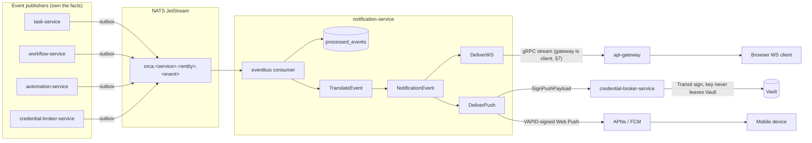

# `notification-service`

**Category:** Supporting
**ADR-021 schema:** `notification`
**Replaces (TS):** `WebPushManager`, `PgWebPushStore`, the WS fan-out side
of the `notifications.*` RPC namespace
**Migration phase:** 1 — pilot tier, low risk, few dependents (same
reasoning ADR-021 used for its own pilot extraction; see
[`00-service-catalog.md`](./00-service-catalog.md))

## 1. Overview & responsibility

`notification-service` turns events that happen elsewhere in the system
into things a user sees: an in-app WebSocket update for a connected browser
client, or a mobile push notification via APNs/FCM. It owns two pieces of
state — **push subscriptions** and **VAPID public-key metadata** — and one
piece of runtime behavior: consuming the async event bus and fanning
translated events out to clients.

It does **not** own the VAPID *private* key. That key never touches this
service's process or database — it lives in Vault, mediated through
`credential-broker-service` (§9). That is the headline difference from TS,
where the private key is plaintext in `orca-data.json` today.

Per [`business-capabilities.md`](../../backend/api/business-capabilities.md),
WS fan-out and mobile push are **two distinct delivery mechanisms**, not one
feature with two names — this doc keeps them separate throughout rather
than collapsing them the way the TS naming (`notifications.*` vs.
`WebPushManager`) invites.

## 2. Bounded context

`notification-service` is a **consumer first, owner second**.
`task-service` owns the fact a task completed; `workflow-service` owns the
fact an execution failed; `credential-broker-service` owns the fact a
credential rotated. This service never republishes or claims authority over
those facts — it consumes them once, idempotently (§8), and produces a
derived, ephemeral artifact: a `NotificationEvent` (§4).

What it owns as system of record: push subscriptions (which
browser/APNs/FCM endpoints a user registered) and VAPID key metadata
(public key + rotation state, never the private key). In-flight WS
fan-out routing is transient, not persisted — a client offline when a WS
event fires gets it via mobile push instead, or not at all on the WS side
(no offline WS replay queue in this design; flag to product if guaranteed
in-app delivery becomes a requirement).

**Explicitly out of scope**: per-user notification preferences (which event
types a user wants, per channel). Nothing in the TS surface models this as
first-class data today, so no table is invented for it here.



## 3. API surface

### gRPC — subscriptions + key distribution

```protobuf
service NotificationService {
  rpc RegisterPushSubscription(RegisterPushSubscriptionRequest) returns (PushSubscription);
  rpc UnregisterPushSubscription(UnregisterPushSubscriptionRequest) returns (google.protobuf.Empty);
  rpc ListPushSubscriptions(ListPushSubscriptionsRequest) returns (ListPushSubscriptionsResponse);

  // The ONLY VAPID material that ever crosses this API — private key never
  // appears in any request or response here (§9).
  rpc GetVapidPublicKey(GetVapidPublicKeyRequest) returns (VapidPublicKeyResponse);

  // WS fan-out. api-gateway is the CLIENT of this streaming RPC (§7), one
  // stream per connected browser session.
  rpc StreamNotifications(StreamNotificationsRequest) returns (stream NotificationFrame);
}
```

### Event-bus consumer surface

The RPC list above is not the whole surface. Per §"Design principles" in
[`02-microservices-decomposition.md`](../architecture/02-microservices-decomposition.md),
this service is the **primary consumer** of the async bus described in
[`08-inter-service-communication.md`](../architecture/08-inter-service-communication.md).
Subjects it subscribes to (`orca.<service>.<entity>.<event>` convention):

| Subject | Published by | Becomes |
|---|---|---|
| `orca.task.task.completed` | `task-service` | "Task completed" notification |
| `orca.workflow.execution.completed` / `.failed` | `workflow-service` | Workflow finished/failed notification |
| `orca.automation.run.completed` | `automation-service` | Automation run finished notification |
| `orca.credential.credential.rotated` | `credential-broker-service` | Security alert, always delivered regardless of preferences (§2) |
| `orca.orchestration.decision_gate.opened` | `orchestration-service` | "Needs your decision" notification |

Illustrative, not exhaustive — a new subject can be added without a schema
change, since `NotificationEvent` is a generic translation target.

## 4. Domain model

- **`PushSubscription`** — `ID`, `TenantID`, `UserID`, `Channel`
  (`web`/`ios`/`android`), `Endpoint`, `P256dhKey *string`, `AuthKey
  *string` (both required iff `Channel == web`, enforced in the
  constructor), `DeviceLabel`, `Status` (`active`/`expired`/`revoked`),
  `LastUsedAt`, `CreatedAt`, `UpdatedAt`. `P256dhKey`/`AuthKey` are the
  *browser's* Web Push encryption keys (RFC 8291) — a different key pair
  from VAPID entirely; user-identifying but not Vault material.
- **`VapidKeyMetadata`** — `KeyID`, `PublicKey` (base64url P-256 point,
  safe to hand to clients), `VaultKeyRef` (Transit key name — a pointer,
  not a value), `Status` (`active`/`rotating`/`revoked`), `CreatedAt`,
  `RevokedAt`. Invariant: exactly one `active` row per tenant, enforced by
  a partial unique index (§5).
- **`NotificationEvent`** — the internal representation after translating a
  domain event into something user-facing: `ID`, `TenantID`,
  `RecipientUserIDs`, `SourceEventID` (dedup/traceability), `SourceSubject`,
  `Type` (`task_completed`/`workflow_failed`/`credential_rotated`/…),
  `Title`, `Body`, `DeepLink`, `Severity` (`info`/`warning`/`critical`),
  `Channels []DeliveryChannel` (`ws`/`push`), `CreatedAt`. `TranslateEvent`
  produces this; `DeliverWS`/`DeliverPush` each consume it independently as
  separate use cases (§7).
- **Domain errors**: `ErrSubscriptionNotFound`, `ErrNoActiveVapidKey`,
  `ErrUnsupportedChannel`.

## 5. Data model (Postgres — `notification` schema)

No private-key column exists in this schema, ever.

```sql
CREATE TABLE notification.push_subscriptions (
    id            UUID PRIMARY KEY DEFAULT gen_random_uuid(),
    tenant_id     UUID NOT NULL,
    user_id       UUID NOT NULL,
    channel       TEXT NOT NULL CHECK (channel IN ('web','ios','android')),
    endpoint      TEXT NOT NULL,       -- Web Push endpoint URL, or device token
    p256dh_key    TEXT,                -- Web Push subscription key (browser-issued, NOT VAPID)
    auth_key      TEXT,                -- Web Push subscription secret (browser-issued, NOT VAPID)
    device_label  TEXT,
    status        TEXT NOT NULL DEFAULT 'active' CHECK (status IN ('active','expired','revoked')),
    last_used_at  TIMESTAMPTZ,
    created_at    TIMESTAMPTZ NOT NULL DEFAULT now(),
    updated_at    TIMESTAMPTZ NOT NULL DEFAULT now(),
    CONSTRAINT web_keys_required CHECK (
        (channel <> 'web') OR (p256dh_key IS NOT NULL AND auth_key IS NOT NULL)
    )
);
CREATE UNIQUE INDEX idx_push_subscriptions_endpoint ON notification.push_subscriptions(endpoint);
CREATE INDEX idx_push_subscriptions_user ON notification.push_subscriptions(tenant_id, user_id, status);

-- Public half of the VAPID keypair only. Private half lives in Vault
-- Transit (§9) and is never a column here or in any backup of this table.
CREATE TABLE notification.vapid_key_metadata (
    key_id        UUID PRIMARY KEY DEFAULT gen_random_uuid(),
    tenant_id     UUID NOT NULL,       -- VAPID identity is per-tenant, not global
    public_key    TEXT NOT NULL,       -- base64url-encoded P-256 public key
    vault_key_ref TEXT NOT NULL,       -- Transit key name, e.g. "vapid-signing-<tenant_id>" — a pointer
    status        TEXT NOT NULL DEFAULT 'active' CHECK (status IN ('active','rotating','revoked')),
    created_at    TIMESTAMPTZ NOT NULL DEFAULT now(),
    revoked_at    TIMESTAMPTZ
);
CREATE UNIQUE INDEX idx_vapid_key_active ON notification.vapid_key_metadata(tenant_id, status)
    WHERE status = 'active';

-- Consumer-side dedup for JetStream's at-least-once delivery, per 08's
-- idempotency rule. Short-retention operational table, not an audit log.
CREATE TABLE notification.processed_events (
    event_id      UUID PRIMARY KEY,
    subject       TEXT NOT NULL,
    processed_at  TIMESTAMPTZ NOT NULL DEFAULT now()
);
CREATE INDEX idx_processed_events_processed_at ON notification.processed_events(processed_at);
```

## 6. Package layout notes

Standard layout per
[`03-clean-architecture-guidelines.md`](../architecture/03-clean-architecture-guidelines.md),
with one asymmetry: `adapter/eventbus/` is unusually central here. Most
services use it for a thin outbox-relay publisher; this service runs N
long-lived JetStream consumers (one per subscribed subject, §3) that dedup
against `processed_events` and invoke `translate_event.go` — closer in
shape to `adapter/grpc/`'s always-on server than to a typical outbound
adapter.

```
internal/
├── domain/{push_subscription,vapid_key_metadata,notification_event}.go
├── usecase/
│   ├── register_push_subscription.go
│   ├── translate_event.go        # domain event -> NotificationEvent
│   ├── deliver_ws.go             # NotificationEvent -> api-gateway stream
│   ├── deliver_push.go           # NotificationEvent -> VAPID-signed Web Push -> APNs/FCM
│   └── ports.go                  # EventSubscriber, GatewayPushPort, PushSigningPort, ...
├── adapter/
│   ├── grpc/                     # subscription CRUD + StreamNotifications server
│   ├── postgres/                 # push_subscriptions, vapid_key_metadata, processed_events
│   ├── eventbus/                 # JetStream consumers, one per subscribed subject (§3)
│   ├── grpc-client/credentialbroker/  # PushSigningPort — the ONLY path to VAPID signing (§9);
│   │                                  #   no adapter/vault/ package in this service, same rule
│   │                                  #   ai-provider-service documents for AI credentials
│   └── external/webpush/         # APNs/FCM clients, Web Push protocol framing
└── config/
```

## 7. Dependencies

| Direction | Service | Why |
|---|---|---|
| Consumes events from | `task-service`, `workflow-service`, `automation-service`, `credential-broker-service` | Subjects listed in §3 |
| Calls | `credential-broker-service` | VAPID payload signing (`SignPushPayload`, §9) — never calls Vault directly |
| Called by | `api-gateway` | `StreamNotifications` (WS fan-out) plus subscription CRUD / `GetVapidPublicKey`, proxied from browser/mobile |

**WS fan-out direction, clarified.** Per §"API Gateway responsibilities" in
[`08-inter-service-communication.md`](../architecture/08-inter-service-communication.md),
`api-gateway` holds the actual browser WebSocket connections — this service
never does. **`api-gateway` is the gRPC client**: when a browser connects,
`api-gateway` opens a `StreamNotifications` call *to* `notification-service`
and pipes frames down to the socket. This service never dials `api-gateway`;
it only serves the stream `api-gateway` opened. Because `api-gateway` is
stateless-by-design, this service needs no session-affinity awareness
either.

**Mobile push is a separate path entirely.** It does not go through
`api-gateway`. `deliver_push.go` calls APNs/FCM directly via the Web Push
protocol, with each payload's VAPID JWT signed through
`credential-broker-service` (§9) — the distinction
`business-capabilities.md` flags explicitly as easy to conflate but not one
mechanism.

## 8. Non-functional requirements

- **Event-consumer lag is its own leading-indicator alert**, per
  [`09-observability-reliability.md`](../architecture/09-observability-reliability.md)'s
  "event-bus consumer lag" dashboard guidance — a lagging consumer here
  signals trouble in this service or an upstream publisher, alerted
  independent of this service's own latency SLOs.
- **Push delivery latency**: target p95 < 2s from `NotificationEvent`
  creation to APNs/FCM accepting the payload (not device receipt, outside
  this system's control).
- **WS delivery latency**: target p95 < 500ms, creation to frame written to
  the `api-gateway` stream — no external network hop, so faster than push.
- **Consumer idempotency overhead**: `processed_events` dedup indexed on
  `event_id`, pruned on a retention window (e.g. 7 days) — only needs to
  cover JetStream's realistic redelivery window, not forever.
- **Availability tier**: lower criticality than `auth-service`/
  `ai-provider-service` — this service being briefly down delays
  notifications, it does not block task/workflow/automation execution
  (JetStream persistence means events are delayed, not lost).

## 9. Security notes

**VAPID private key never leaves Vault — the headline property.** TS today
stores the VAPID private key **plaintext** in `orca-data.json`, a
deliberate call at the time (a push-signing key isn't a per-user
credential), but the TS docs themselves flag rising risk once centralized
in Postgres with more operators holding DB read access. The Go redesign
removes that judgment call: the private key is generated inside Vault's
**Transit engine** and never leaves it — signing a push payload's VAPID JWT
is a `Vault: sign` call, not "read secret, then sign locally." This mirrors
how [`06-secrets-vault-architecture.md`](../architecture/06-secrets-vault-architecture.md)
already treats JWT signing keys ("signing key never leaves Vault"),
applied here to VAPID specifically — a stricter, more precise choice than
that doc's general "VAPID private key → KV v2" line, since Transit's
sign-as-a-service model fits an asymmetric signing key better than static
KV storage fits a value meant to never be retrieved in the clear. Either
way, this service's schema invariant (§5) holds: no private-key column,
ever.

- This service never calls Vault directly — only `credential-broker-service`
  does, the same structural rule `ai-provider-service.md` §6 applies to AI
  provider credentials. No `adapter/vault/` package exists here; the only
  path to a signature is `adapter/grpc-client/credentialbroker/`.
- `vapid_key_metadata.vault_key_ref` is a pointer, not a capability —
  reading this table gives no ability to sign anything; that authority is
  Vault-policy-gated to `credential-broker-service` alone.
- Push subscription `p256dh_key`/`auth_key` are not VAPID material and not
  Vault-mediated — standard Web Push subscription keys, deleted on
  unsubscribe/expiry like any per-user row, but with far smaller blast
  radius than the VAPID private key (one device's channel, not every
  user's).
- `StreamNotifications` is intra-cluster only — `api-gateway` is the sole
  caller, authenticated like any other internal service-to-service call
  (§"Auth & policy" in [`04-tech-stack.md`](../architecture/04-tech-stack.md)).

## 10. Migration notes

- **Phase 1, pilot tier** — low risk, few dependents, alongside
  `usage-service`/`annotation-service`/`issue-tracking-service` in the
  migration strategy's Phase 1 leaf-service group.
- **Data migration is a real shape change, not a table copy.** Per
  `business-capabilities.md`, `WebPushManager`'s subscriptions and VAPID
  keys live in `Store.webPushSubscriptions`/`Store.vapidKeys` — fields
  inside the single TS `orca-data.json` blob, **not** SQL tables today.
  Migrating into `notification.push_subscriptions`/`vapid_key_metadata`
  means writing a one-time parser over that JSON structure and normalizing
  it into rows — the same category of migration work `automation-service`
  faces for its own JSON-blob-shaped TS source data, not a mechanical
  `pg_dump`/restore.
- **VAPID private key migration is a one-time import followed by
  rotation, not a copy.** The plaintext value in `orca-data.json` is
  imported into Vault Transit once (via `credential-broker-service`'s
  bootstrap path), then rotated immediately after import — because it
  existed in plaintext for the system's lifetime up to that point, it
  should not be trusted indefinitely. The old `orca-data.json` field is
  deleted once import is confirmed. `vapid_key_metadata.status` starts the
  new key `active` only after Vault import is confirmed, mirroring
  `ai-provider-service`'s `pending`-until-confirmed pattern for its own
  secret handling.
- **Cutover mechanism**: same as every Phase 1 service — TS
  `notifications.*` (WS side) and `WebPushManager` calls (push side) become
  thin proxies to this service's gRPC API, with a 1–2 week dual-write
  validation window (per
  [`ts-to-go-migration-strategy.md`](../migration/ts-to-go-migration-strategy.md))
  before the TS write path for both is retired.
