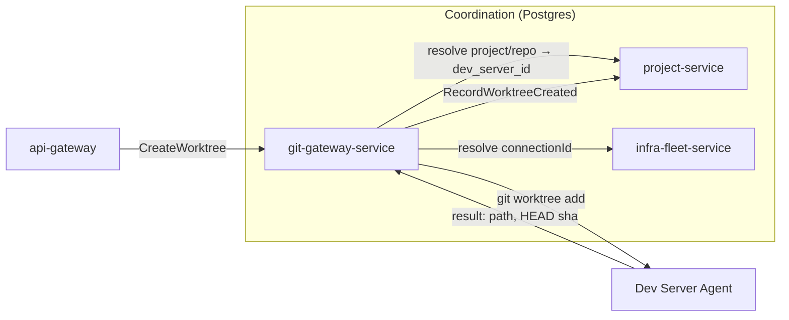
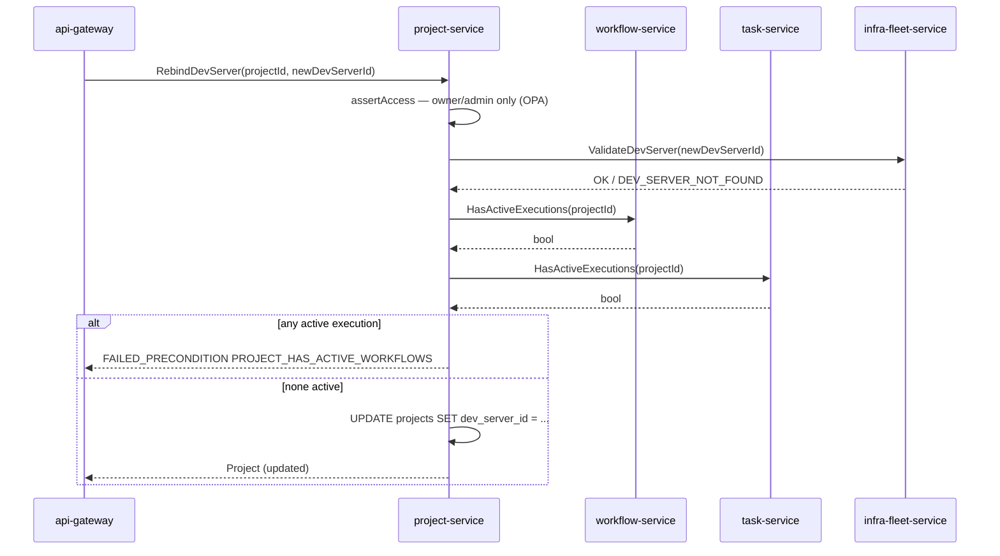

# project-service

Category: Workspace Coordination · ADR-021 schema: `project` · Migration
phase: 2 · Replaces (TS): `ProjectService`, plus the metadata-handling parts
of `repo.ts`/`folderWorkspace.ts`/`projectGroup.ts`/`worktree.ts` RPC
handlers (not their git-touching parts).

## 1. Overview & responsibility

`project-service` is the system of record for **workspace organization
metadata**: which projects exist, who is a member of each, which dev server
a project is bound to, the repo catalog, folder-group organization, and the
metadata half of worktree lifecycle (existence, lineage, activation state).
It owns `projects`, `project_members`, `source_projects` in the `project`
schema per ADR-021, plus the repo/worktree/project-group catalog tables that
[`02-microservices-decomposition.md`](../architecture/02-microservices-decomposition.md)
assigns to it.

It does **not** execute git operations, hold SSH/connection state, or
dispatch AI-agent work — see §2. It is the Go counterpart of TS's
`ProjectService` plus the metadata-only slice of `repo.*`/`folderWorkspace.*`/
`projectGroup.*`/`worktree.*` described in
[`business-capabilities.md`](../../backend/api/business-capabilities.md)'s
"Project management" and "Repo / worktree lifecycle" sections.

## 2. Bounded context — metadata vs. execution

Reference implementation of the coordination/execution split in
[`backend-agent-target-architecture.md`](../../backend/api/backend-agent-target-architecture.md):
resolve target + check access here, relay the actual work elsewhere.

| Concern | Owned here | Delegated |
|---|---|---|
| Project record, membership, dev-server binding | Yes (Postgres) | — |
| Repo catalog entry (path, remote identity, order) | Yes (metadata row) | Git remote validation / clone: `git-gateway-service` |
| Worktree existence, lineage, activation flag | Yes (metadata row) | `git worktree add/remove/list`, branch force-delete: Dev Server Agent via `git-gateway-service` |
| Folder-workspace / project-group tree | Yes (metadata row) | Nested-repo filesystem scan: Dev Server Agent via `git-gateway-service` |
| Source-project sharing (cross-user link) | Yes (pure metadata join) | — |
| Which host a worktree resolves to | Provides the pointer (`dev_server_id`) | `connectionId` resolution + relay: `git-gateway-service` + `infra-fleet-service` |
| AI-agent spawn in project context | **Not this service** — see below | `infra-fleet-service` (or the execution-dispatch owner) |

**Boundary decision — `project.agentSpawn` does not port here.** In TS this
is the one place `project.*` reaches into execution
(`agentSpawner.spawn()` → `agent.exec`). Copying it into Go's
`project-service` would make this a second, inconsistent home for
agent-dispatch logic alongside `git-gateway-service`. Instead:
`project-service` exposes a read-only `GetProjectContext` (project +
membership + dev-server pointer — TS's `ProjectContext` shape); the spawn
RPC itself belongs to `infra-fleet-service` (it already owns "resolve
`connectionId`, reach the Dev Server Agent"). Callers do a two-step saga:
resolve context here, then call the execution-owning service. This service
never calls toward execution.



## 3. API surface (gRPC sketch)

```protobuf
service ProjectService {
  // Project CRUD
  rpc CreateProject(CreateProjectRequest) returns (Project);
  rpc GetProject(GetProjectRequest) returns (Project);
  rpc ListProjects(ListProjectsRequest) returns (ListProjectsResponse);   // scoped to caller's membership
  rpc UpdateProject(UpdateProjectRequest) returns (Project);              // field mask rejects dev_server_id — use RebindDevServer
  rpc DeleteProject(DeleteProjectRequest) returns (google.protobuf.Empty);

  // Membership
  rpc AddMember(AddMemberRequest) returns (ProjectMember);
  rpc RemoveMember(RemoveMemberRequest) returns (google.protobuf.Empty);
  rpc UpdateMemberRole(UpdateMemberRoleRequest) returns (ProjectMember);
  rpc ListMembers(ListMembersRequest) returns (ListMembersResponse);

  // Dev-server binding — the one guarded rebind path (see below)
  rpc RebindDevServer(RebindDevServerRequest) returns (Project);

  // Repo catalog (metadata only)
  rpc AddRepo(AddRepoRequest) returns (Repo);
  rpc ListRepos(ListReposRequest) returns (ListReposResponse);
  rpc ReorderRepos(ReorderReposRequest) returns (google.protobuf.Empty);
  rpc RemoveRepo(RemoveRepoRequest) returns (google.protobuf.Empty);      // caller must detach worktrees via git-gateway-service first

  // Worktree lifecycle metadata — written by git-gateway-service AFTER the
  // real git op succeeds on the host, never a trigger for one
  rpc RecordWorktreeCreated(RecordWorktreeCreatedRequest) returns (Worktree);
  rpc RecordWorktreeRemoved(RecordWorktreeRemovedRequest) returns (google.protobuf.Empty);
  rpc ListWorktrees(ListWorktreesRequest) returns (ListWorktreesResponse);
  rpc SetWorktreeActivation(SetWorktreeActivationRequest) returns (Worktree);
  rpc RenameWorktree(RenameWorktreeRequest) returns (Worktree);

  // Folder-group organization
  rpc CreateProjectGroup(CreateProjectGroupRequest) returns (ProjectGroup);
  rpc UpdateProjectGroup(UpdateProjectGroupRequest) returns (ProjectGroup);
  rpc DeleteProjectGroup(DeleteProjectGroupRequest) returns (google.protobuf.Empty);
  rpc ListProjectGroups(ListProjectGroupsRequest) returns (ListProjectGroupsResponse);

  // Source-project sharing (cross-user; TS's orcaProjects.* — renamed
  // SourceProject here to avoid TS's confusing "OrcaProject" vs "Project" overlap)
  rpc LinkSourceProject(LinkSourceProjectRequest) returns (SourceProject);
  rpc UnlinkSourceProject(UnlinkSourceProjectRequest) returns (google.protobuf.Empty);
  rpc GetSharedProjectData(GetSharedProjectDataRequest) returns (SharedProjectData); // filtered slice only

  // Composition read for execution-dispatch callers (see §2)
  rpc GetProjectContext(GetProjectContextRequest) returns (ProjectContext);
}
```

### `RebindDevServer` — closing the active-execution gap

TS's `project.update` accepts `devServerId` in its patch with no check for
active workflow/task executions — a live worktree mid-execution can be
silently rebound to a different host. `RebindDevServer` closes this with a
synchronous saga:



Both checks are synchronous gRPC calls (saga pattern, per
[`05-data-architecture.md`](../architecture/05-data-architecture.md)) — the
caller cannot know a rebind is safe without both answers. Event-subscription
with a cached count was considered and rejected: a rebind is rare and
latency-insensitive, while a stale cache reintroduces the exact race this
guard exists to close. Each external call carries a short timeout and fails
closed (treated as "has active executions") on timeout. `UpdateProject`'s
field mask rejects `dev_server_id` so there is exactly one code path for
rebinding, not two that can drift.

## 4. Domain model

- **Project** — id, tenant_id, name, description, `dev_server_id` (logical
  FK → `infra-fleet-service`, never empty after create), default_branch,
  visibility (`private`/`team`/`department`/`company`), created_by (logical
  FK → `tenant-service`), timestamps.
- **ProjectMember** — (project_id, user_id), role
  (`owner`/`member`/`viewer`), added_at. Invariant: at least one `owner`
  must remain — `RemoveMember`/`UpdateMemberRole` reject an operation that
  would leave a project ownerless (closes a gap TS itself doesn't guard).
- **Repo** — id, project_id, host-relative absolute path (meaningful only
  combined with the project's `dev_server_id`), remote identity, display
  order, icon ref. Pure metadata, no working-tree state.
- **Worktree** (metadata) — id, repo_id, path, branch, base_ref,
  parent_worktree_id (lineage/rename tracking), activation_state
  (`active`/`asleep`), soft-deleted via `removed_at`. Never authoritative
  for whether the worktree still exists on disk — `git-gateway-service`
  reconciles on demand, same as TS's detect/reconcile behavior.
- **ProjectGroup** — id, project_id (nullable — a group can pre-date any
  linked project during nested-repo import), parent_group_id
  (self-referential tree), name.
- **SourceProject** — join entity linking an owner's `Project` into another
  group's shared view; kept distinct from TS's overloaded "OrcaProject"
  naming.

## 5. Data model (Postgres, schema `project`)

```sql
CREATE TABLE projects (
  id              UUID PRIMARY KEY DEFAULT gen_random_uuid(),
  tenant_id       UUID NOT NULL,
  name            TEXT NOT NULL,
  description     TEXT,
  dev_server_id   UUID NOT NULL,          -- logical FK -> infra-fleet-service.dev_servers
  default_branch  TEXT NOT NULL DEFAULT 'main',
  visibility      TEXT NOT NULL DEFAULT 'private'
                    CHECK (visibility IN ('private','team','department','company')),
  created_by      UUID NOT NULL,          -- logical FK -> tenant-service.users
  created_at      TIMESTAMPTZ NOT NULL DEFAULT now(),
  updated_at      TIMESTAMPTZ NOT NULL DEFAULT now()
);
CREATE INDEX idx_projects_tenant ON projects (tenant_id);
CREATE INDEX idx_projects_dev_server ON projects (dev_server_id);

CREATE TABLE project_members (
  project_id  UUID NOT NULL REFERENCES projects (id) ON DELETE CASCADE,
  user_id     UUID NOT NULL,              -- logical FK -> tenant-service.users
  role        TEXT NOT NULL CHECK (role IN ('owner','member','viewer')),
  added_at    TIMESTAMPTZ NOT NULL DEFAULT now(),
  PRIMARY KEY (project_id, user_id)
);
CREATE INDEX idx_project_members_user ON project_members (user_id);

CREATE TABLE repos (
  id             UUID PRIMARY KEY DEFAULT gen_random_uuid(),
  project_id     UUID NOT NULL REFERENCES projects (id) ON DELETE CASCADE,
  tenant_id      UUID NOT NULL,
  path           TEXT NOT NULL,           -- absolute path on the bound dev server
  remote_url     TEXT,
  display_order  INT NOT NULL DEFAULT 0,
  icon_ref       TEXT,
  created_at     TIMESTAMPTZ NOT NULL DEFAULT now()
);
CREATE INDEX idx_repos_project ON repos (project_id);

CREATE TABLE worktrees (
  id                  UUID PRIMARY KEY DEFAULT gen_random_uuid(),
  repo_id             UUID NOT NULL REFERENCES repos (id) ON DELETE CASCADE,
  tenant_id           UUID NOT NULL,
  path                TEXT NOT NULL,
  branch              TEXT NOT NULL,
  base_ref            TEXT,
  parent_worktree_id  UUID REFERENCES worktrees (id),
  activation_state    TEXT NOT NULL DEFAULT 'active' CHECK (activation_state IN ('active','asleep')),
  created_at          TIMESTAMPTZ NOT NULL DEFAULT now(),
  removed_at          TIMESTAMPTZ          -- soft delete: retained for lineage/history queries
);
CREATE INDEX idx_worktrees_repo ON worktrees (repo_id);

CREATE TABLE project_groups (
  id               UUID PRIMARY KEY DEFAULT gen_random_uuid(),
  tenant_id        UUID NOT NULL,
  project_id       UUID REFERENCES projects (id) ON DELETE SET NULL,
  parent_group_id  UUID REFERENCES project_groups (id) ON DELETE CASCADE,
  name             TEXT NOT NULL,
  created_at       TIMESTAMPTZ NOT NULL DEFAULT now()
);
CREATE INDEX idx_project_groups_parent ON project_groups (parent_group_id);

CREATE TABLE source_projects (
  id                 UUID PRIMARY KEY DEFAULT gen_random_uuid(),
  tenant_id          UUID NOT NULL,
  project_group_id   UUID NOT NULL REFERENCES project_groups (id) ON DELETE CASCADE,
  source_project_id  UUID NOT NULL REFERENCES projects (id) ON DELETE CASCADE,
  linked_by          UUID NOT NULL,       -- logical FK -> tenant-service.users
  linked_at          TIMESTAMPTZ NOT NULL DEFAULT now(),
  UNIQUE (project_group_id, source_project_id)
);
```

RLS is enabled on every table above (`tenant_id`-scoped policy against
`current_setting('app.tenant_id')`) as the defense-in-depth backstop per
[`05-data-architecture.md`](../architecture/05-data-architecture.md);
application-layer `tenant_id` binding in `adapter/postgres/` is primary.

## 6. Package layout notes

Standard layout from
[`03-clean-architecture-guidelines.md`](../architecture/03-clean-architecture-guidelines.md),
no deviation. Notable `usecase/` groupings:

```
internal/
├── domain/
│   ├── project.go, membership.go        # "≥1 owner" invariant lives in membership.go
│   ├── repo.go, worktree.go, project_group.go, source_project.go
├── usecase/
│   ├── rebind_dev_server.go             # the guarded rebind saga
│   ├── ports.go                         # ProjectRepository, DevServerValidator,
│   │                                     # WorkflowExecutionChecker, TaskExecutionChecker
│   ├── create_project.go, update_project.go, ...
│   ├── link_source_project.go, get_shared_project_data.go
├── adapter/
│   ├── grpc/                            # ProjectService server impl
│   ├── postgres/                        # sqlc-generated repository implementations
│   ├── grpcclient/                      # outbound clients: infra-fleet, tenant, workflow, task
│   └── eventbus/                        # outbox: project.created, project.rebound, member.added, ...
```

`WorkflowExecutionChecker`/`TaskExecutionChecker` are two separate ports,
not one merged interface — keeps `rebind_dev_server.go`'s test fakes
independent of whichever of the two services changes its contract first.

## 7. Dependencies

**Calls:**

| Service | Why | Pattern |
|---|---|---|
| `tenant-service` | Validate `created_by`/member `user_id` resolve to real users; resolve `team`/`department` visibility membership | Sync gRPC |
| `infra-fleet-service` | Validate `devServerId` exists on create/rebind — never resolves `connectionId` itself, that's `git-gateway-service`'s job | Sync gRPC (saga step) |
| `workflow-service` | `HasActiveExecutions(projectId)` — rebind guard | Sync gRPC (saga step) |
| `task-service` | `HasActiveExecutions(projectId)` — rebind guard | Sync gRPC (saga step) |

**Called by:**

| Caller | Why |
|---|---|
| `api-gateway` | All CRUD/membership/binding/catalog RPCs |
| `git-gateway-service` | Resolve which host a worktree/repo belongs to before dispatching a git op; writes back `RecordWorktreeCreated`/`RecordWorktreeRemoved` after success |
| `infra-fleet-service` (occasional) | Cross-check which projects reference a `devServerId` before fleet-wide deregistration |

`project-service` never calls `git-gateway-service` — dependency direction
is `git → proj`, matching
[`02-microservices-decomposition.md`](../architecture/02-microservices-decomposition.md)'s
dependency graph.

## 8. Non-functional requirements

- **Latency**: `GetProject`/`ListProjects`/`ListWorktrees` are read-heavy
  (every workspace-switch UI action) — p99 < 50ms, indexed single-table
  lookups, no cross-service joins.
- **`RebindDevServer` budget**: bounded by three sequential external gRPC
  calls — p99 target < 300ms; each call carries a short timeout (~2s) and
  fails closed on timeout (treated as "active"/"not validated"), never open.
- **Availability**: no dependency on `git-gateway-service`/Dev Server Agent
  reachability for any RPC owned here — CRUD/membership/catalog metadata
  stays available even when the entire fleet is unreachable. This is the
  point of the metadata/execution split.
- **Consistency**: `dev_server_id`/`user_id`/`created_by` are logical FKs
  with no cross-database referential integrity — a dangling reference is
  handled at read time (resolve-or-omit), not prevented at write time, same
  posture as every other service.

## 9. Security notes

- Membership/role checks are enforced via OPA policy evaluated in-process
  (Go OPA SDK), replacing TS's ad hoc `requireOwnerOrAdmin` — one Rego
  policy takes `(callerRole, callerGlobalRole, action)`, not a duplicated
  per-handler check. Closes the class of bug TS hit in
  `BUG-BE-HLD-002-project-rpc-requireowneroradmin-no-admin-check`, where a
  global-admin override was silently missing from one call site.
- `UpdateProject`/`DeleteProject`/`AddMember`/`RemoveMember`/
  `UpdateMemberRole`/`RebindDevServer` require `owner` role or global admin.
  `GetProject`/`ListMembers`/`ListWorktrees`/`ListRepos` require any
  membership including `viewer`. `CreateProject` requires only
  authentication (creator becomes `owner`).
- `GetSharedProjectData` must never return an owner's full project set —
  only the exact `Project` (+ repos/worktree metadata) linked via
  `source_projects`, matching TS's `filterOwnerProjectData` guarantee; a
  unit-tested invariant, not a docstring.
- `LinkSourceProject`/`UnlinkSourceProject` responses for "group doesn't
  exist" and "caller isn't a member" are identical
  (`PERMISSION_DENIED`, no detail) — preserves TS's enumeration-resistance
  property for `orcaProjectId` probing.
- Tenant isolation: every query is tenant-scoped per
  [`05-data-architecture.md`](../architecture/05-data-architecture.md); RLS
  is the backstop, application-layer binding is primary.

## 10. Migration notes

- **Phase 2**, after phase-1 pilot services and identity groundwork
  (`auth`/`tenant`/`infra`-equivalent), before workflow/task/AI services
  that depend on project membership for their own authorization checks.
- **Backfill**: `orca_v5_projects` → `projects`, `orca_v5_project_members`
  → `project_members` — mechanical, TS's `OrcaProject`/`ProjectMember`
  types map 1:1 to §4's model. The only shape change is `visibility`
  becoming a Postgres `CHECK` instead of app-layer-only `zod` validation,
  and `dev_server_id`/`created_by`/`user_id` becoming explicit `UUID`
  columns (a type-tightening, not a shape change).
- Repo/worktree/project-group/source-project tables have **no single TS
  source table** — TS holds this data inside each user's per-user
  `core.orca_data_state_blob` JSON document (see
  [`business-capabilities.md`](../../backend/api/business-capabilities.md)'s
  storage-model summary). Backfill requires a one-time ETL walking every
  user's `orca-data.json`, extracting `repos`/`worktreeMeta`/
  `projectGroups`/`sourceRepoIds` per project into normalized rows — the
  one non-mechanical part of this service's migration. Needs its own
  backfill script plus a dry-run reconciliation pass (row counts and
  per-project repo counts compared against the JSON source) before cutover.
- **Closes the rebind-guard gap**: TS's `project.update` has no equivalent
  of `RebindDevServer`'s active-execution check (§3) — a genuine behavior
  change, not a straight port. Document in the cutover runbook: a rebind
  that used to silently succeed during a running workflow will now fail
  with `PROJECT_HAS_ACTIVE_WORKFLOWS`. Any UI/automation relying on the old
  permissive behavior must handle that error path before cutover.
- **Expand/contract**: per
  [`05-data-architecture.md`](../architecture/05-data-architecture.md), the
  initial migration ships `NOT NULL` constraints matching TS's effective
  invariants from day one — this is a new database, not an in-place ALTER
  of a live one; expand/contract applies to *later* schema changes, not
  this initial backfill-and-cutover.
