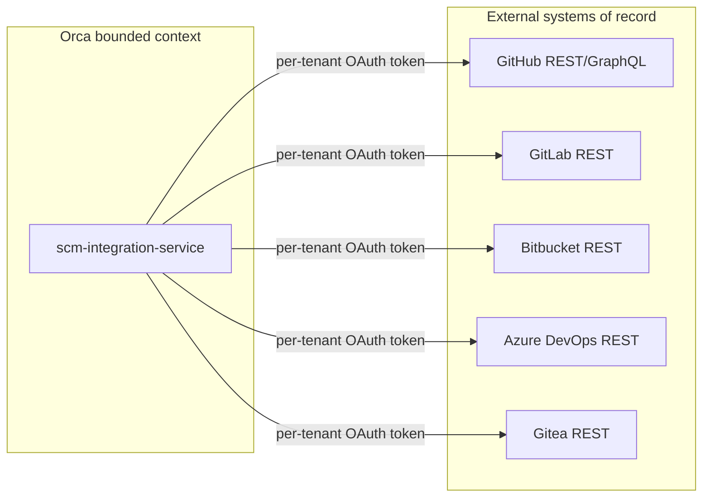
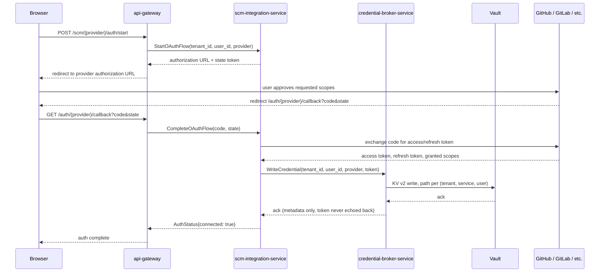

# `scm-integration-service`

**Category**: Integration | **Migration phase**: 3 | **Owns**: nothing beyond
thin operational bookkeeping (§5) | **Replaces (TS)**: `github.ts` (46
methods), `gitlab.ts` (18 methods), `hosted-review.ts` (3 methods,
GitHub/GitLab branches) — and the `gh`/`glab` CLI shell-out mechanism those
files use, which this service does **not** carry forward, in any form, even
provisionally.

## 1. Overview & responsibility

`scm-integration-service` is the Go backend's single point of contact with
source-code-hosting platforms — GitHub, GitLab, Bitbucket, Azure DevOps, and
Gitea — for everything that isn't raw git object transfer (`git clone`/
`fetch`/`push` stays with `git-gateway-service`). It owns: issue and
pull-request/merge-request CRUD, comments, reviewers, labels, check/status
reporting, project-board read views, cross-provider hosted-review creation
and eligibility checks, and rate-limit status tracking.

This document exists mainly to close **TS Gap 1** (§10) — a real
multi-tenancy security gap in the current production system, and the reason
§§3, 7, and 9 below are designed the way they are.

## 2. Bounded context

GitHub, GitLab, Bitbucket, Azure DevOps, and Gitea are the systems of record
for every issue, PR, MR, comment, label, and review this service touches.
`scm-integration-service` is a translation/orchestration layer: it converts
Orca's provider-agnostic domain model (§4) to and from each provider's native
API shape **on every call**, and does not keep a local copy of that data.



The only state kept is operational (rate-limit counters, webhook delivery
records, §5) — never business data that could drift from the provider's own
copy. That's what "stateless-ish" means here: no handler needs a local
read-model of "what this issue currently looks like."

## 3. API surface (gRPC)

Internal gRPC per [`04-tech-stack.md`](../architecture/04-tech-stack.md);
`api-gateway` exposes a REST facade via `grpc-gateway` from the same proto.
Method names mirror the TS RPC methods being replaced, grouped by capability:

```proto
service ScmIntegrationService {
  // Issues
  rpc ListIssues(ListIssuesRequest) returns (ListIssuesResponse);
  rpc GetIssue(GetIssueRequest) returns (Issue);
  rpc CreateIssue(CreateIssueRequest) returns (Issue);
  rpc UpdateIssue(UpdateIssueRequest) returns (Issue);
  rpc CloseIssue(CloseIssueRequest) returns (Issue);
  // Pull requests / merge requests
  rpc ListPullRequests(ListPullRequestsRequest) returns (ListPullRequestsResponse);
  rpc GetPullRequest(GetPullRequestRequest) returns (PullRequest);
  rpc CreatePullRequest(CreatePullRequestRequest) returns (PullRequest);
  rpc UpdatePullRequest(UpdatePullRequestRequest) returns (PullRequest);
  rpc MergePullRequest(MergePullRequestRequest) returns (PullRequest);
  // Comments (issue + PR/MR)
  rpc ListComments(ListCommentsRequest) returns (ListCommentsResponse);
  rpc CreateComment(CreateCommentRequest) returns (Comment);
  rpc UpdateComment(UpdateCommentRequest) returns (Comment);
  rpc DeleteComment(DeleteCommentRequest) returns (google.protobuf.Empty);
  // Reviewers & reviews
  rpc RequestReviewers(RequestReviewersRequest) returns (PullRequest);
  rpc SubmitReview(SubmitReviewRequest) returns (Review);
  rpc ListReviews(ListReviewsRequest) returns (ListReviewsResponse);
  // Labels, checks, boards
  rpc ListLabels(ListLabelsRequest) returns (ListLabelsResponse);
  rpc ApplyLabels(ApplyLabelsRequest) returns (Issue);
  rpc GetCheckStatus(GetCheckStatusRequest) returns (CheckStatusList);
  rpc GetBoardView(GetBoardViewRequest) returns (BoardView);
  // Rate limits
  rpc GetRateLimitStatus(GetRateLimitStatusRequest) returns (RateLimitStatus);
  // Hosted review (spans all 5 providers — see §6)
  rpc CheckHostedReviewEligibility(CheckHostedReviewEligibilityRequest) returns (HostedReviewEligibility);
  rpc CreateHostedReview(CreateHostedReviewRequest) returns (PullRequest);
  // Auth (see §9.1)
  rpc GetAuthStatus(GetAuthStatusRequest) returns (AuthStatus);
  rpc StartOAuthFlow(StartOAuthFlowRequest) returns (StartOAuthFlowResponse);
  rpc RevokeAuth(RevokeAuthRequest) returns (google.protobuf.Empty);
}
```

Every request carries a `provider` enum (`GITHUB`, `GITLAB`, `BITBUCKET`,
`AZURE_DEVOPS`, `GITEA`) plus a `tenant_id`/`user_id` resolved by
`api-gateway` from the validated session/JWT — never a client-supplied
credential. `CreateHostedReview`/`CheckHostedReviewEligibility` replace
`hosted-review.ts`'s 3 methods, which today only cleanly handle
Bitbucket/Azure/Gitea and share GitHub/GitLab's CLI problem (§10) for the
rest.

## 4. Domain model

Provider-agnostic value objects in `internal/domain/`, with zero knowledge of
any provider's wire format:

- **`Issue`** — id, provider, repo ref, number, title, body, state, labels,
  assignees, timestamps.
- **`PullRequest`** — everything `Issue` has, plus source/target branch,
  merge status, draft flag, required-check summary. One type covers both
  "pull request" (GitHub) and "merge request" (GitLab/Bitbucket) — same
  concept, provider-specific name only.
- **`Review`** — reviewer identity, state (approved / changes-requested /
  commented), submitted-at, comments.
- **`Label`** — name, color, description (where supported).
- **`RateLimitStatus`** — remaining/limit/reset-at, keyed by provider +
  bucket (GitHub has separate REST/GraphQL/search buckets; GitLab exposes one
  bucket per token) — see §8.

Each provider implements a common port, one adapter per provider (§6):

```go
type ScmProvider interface {
    ListIssues(ctx context.Context, repo RepoRef, filter IssueFilter) ([]domain.Issue, error)
    CreatePullRequest(ctx context.Context, repo RepoRef, input CreatePRInput) (domain.PullRequest, error)
    // one method per domain operation this provider supports
    RateLimitStatus(ctx context.Context) (domain.RateLimitStatus, error)
}
```

A provider that doesn't support an operation (e.g. Gitea has no
project-board equivalent) returns typed `ErrCapabilityUnsupported` — checked
explicitly by `usecase/` code so `GetBoardView`/hosted-review fan-out can
degrade per provider instead of failing uniformly.

## 5. Data model

This service's own Postgres database
([principle 2](../architecture/02-microservices-decomposition.md)) holds
**operational bookkeeping only** — explicitly not a copy, cache, or mirror of
provider data. Every read of an issue, PR, MR, comment, label, or review
hits the provider's live API on every call.

| Table | Purpose |
|-------|---------|
| `rate_limit_cache` | Last-known snapshot per `(tenant_id, provider, bucket)`: remaining, limit, reset_at, last_checked_at. Populated from response headers on every call; read before dispatching a burst of new calls to decide whether to back off (§8). Not a source of truth — a hot local read to avoid a round trip purely to check quota. |
| `webhook_delivery_log` | Append-only record of inbound webhook deliveries processed (event id, provider, delivery id, received_at, outcome) — makes delivery idempotent against provider retries and gives operators a debugging trail. |

No table has an `issue_id`/`pr_id` column meant to be queried as "the current
list of PRs" — that query always goes to the provider. A future cross-repo
search/cache requirement is a new, explicitly-scoped feature with its own
staleness semantics, not an incidental side effect of this table set.

## 6. Package layout notes

Standard layout per
[`03-clean-architecture-guidelines.md`](../architecture/03-clean-architecture-guidelines.md).
The service-specific decision: `adapter/external/` gets **one sub-package per
provider**, each a standalone `ScmProvider` implementation with no shared
base class — its own HTTP client, pagination, rate-limit-header parsing, and
error translation.

```
scm-integration-service/
├── internal/
│   ├── domain/            # Issue, PullRequest, Review, Label, RateLimitStatus
│   ├── usecase/
│   │   ├── ports.go       # ScmProvider, CredentialResolver, RateLimitTracker
│   │   ├── create_pull_request.go
│   │   ├── check_hosted_review_eligibility.go   # fans out across configured providers
│   │   └── ...
│   └── adapter/
│       ├── grpc/          # inbound: proto <-> domain mapping
│       ├── postgres/      # rate_limit_cache, webhook_delivery_log repositories
│       ├── external/{github,gitlab,bitbucket,azuredevops,gitea}/  # one ScmProvider impl each
│       └── credentialbroker/   # gRPC client to credential-broker-service
```

`usecase/` code never imports a provider package directly — it depends only
on the `ScmProvider` interface, handed the right implementation by
`cmd/server/main.go`'s composition root keyed on the request's `provider`
field. That's what turns `CheckHostedReviewEligibility`/`CreateHostedReview`
into a fan-out loop over one interface, instead of five hand-copied branches
(closer to what `hosted-review.ts` does today).

## 7. Dependencies

- **`credential-broker-service`** (calls) — resolves the per-tenant OAuth
  token before every provider call; never cached beyond one request's
  in-memory lifetime, per
  [`06-secrets-vault-architecture.md`](../architecture/06-secrets-vault-architecture.md).
- **`tenant-service`** (calls) — validates the acting user/tenant where
  `api-gateway`'s JWT-derived context needs a second check.
- **`api-gateway`** (called by) — all client traffic arrives through the
  gateway; this service accepts no direct external connection.
- **`workflow-service`, `task-service`** (called by) — hosted-review creation
  is frequently triggered programmatically (e.g. "open a PR when this task's
  changes are ready"), calling `CreateHostedReview` through the same gRPC API
  a browser-initiated request uses — no service-to-service bypass path.
- **Provider APIs** (calls, external) — GitHub REST/GraphQL, GitLab REST,
  Bitbucket REST, Azure DevOps REST, Gitea REST — outside Orca's trust
  boundary; credentialed per-tenant (§9), circuit-broken per provider (§8).

## 8. Non-functional requirements

- **External rate limits are a first-class constraint on this service's own
  throughput**, not an after-the-fact error case. Each adapter parses
  rate-limit headers (`X-RateLimit-*` GitHub, `RateLimit-*` GitLab) on every
  response, writes to `rate_limit_cache` (§5), and `usecase/` code checks the
  cached status before a burst of calls (e.g. a board view needing N issue
  fetches), throttling proactively instead of handling 429s reactively.
  `GetRateLimitStatus` surfaces this to clients ("GitHub: 340/5000, resets in
  12m") instead of a failed request.
- **Per-provider circuit-breaking.** Each `ScmProvider` adapter has its own
  breaker (open/half-open/closed) keyed by provider — a GitHub outage trips
  only the GitHub circuit; GitLab/Bitbucket/Azure DevOps/Gitea traffic
  continues. Matters concretely for `CheckHostedReviewEligibility`'s
  fan-out: one down provider degrades that provider's result, not the whole
  eligibility check.
- **Secondary-rate-limit backoff.** GitHub's GraphQL/abuse-detection signals
  are distinct from the primary REST limit; the GitHub adapter treats them
  as a separate backoff trigger, not folded into the same counter.
- **No local caching of issue/PR/MR content** beyond a single request's
  lifetime — freshness beats latency here, and caching would reintroduce the
  drift problem §5 avoids by design.

## 9. Security notes

**Per-tenant OAuth token isolation is the core security property this
service exists to guarantee** — the direct fix for TS Gap 1 (§10):

- Every provider call resolves its token through `credential-broker-service`
  scoped to `(tenant_id, provider, user_id)`. There is no shared,
  service-wide, or process-wide credential — a structural guarantee, not a
  runtime check: the `ScmProvider` interface has no notion of a credential
  that isn't passed in per-call from the resolved-per-request token.
- **Minimum-necessary OAuth scopes per provider**, requested at
  authorization time (§9.1) — e.g. GitHub `repo` (or the finer-grained PAT/
  GitHub-App equivalent) rather than blanket `admin:org`; GitLab `api`
  scoped to the project where the token model allows it. Scopes are
  reviewed on every new method — a new capability must not silently require
  broadening an already-granted scope for existing users.
- **Tokens are never logged.** Structured logging (`slog`) at every layer
  treats the resolved token as a value that must not reach a log field,
  error message, trace attribute, or metric label — enforced by keeping it
  out of any struct that reaches a logging call site; it exists only in the
  HTTP client's auth-header construction, immediately before dispatch.
- **No CLI, no shared filesystem/keychain, no PTY, no shell-out** anywhere in
  this service, at any migration stage — see §10 for why this is an
  absolute, not a preference.

### 9.1 Auth flow — OAuth web flow (recommended default; product decision)

TS's `github.startAuthLogin`/`gitlab.startAuthLogin` today drives an
interactive `gh auth login`/`glab auth login` session over a PTY relayed to
the Dev Server Agent. That mechanism is per-user-isolated (confirmed in
`specs/agent/api/gaps-and-findings.md` finding #5) but requires a live PTY
and an agent connection to complete login.

**Recommended default here**: a standard OAuth authorization-code web flow
terminating at an `api-gateway`-hosted `/auth/{provider}/callback` — no CLI,
no PTY, no agent involvement in authentication at all.



This is a **product decision, not a unilateral engineering call**: the OAuth
web flow is lower-friction than PTY-based CLI login for most users (no
interactive terminal wait, works regardless of dev-server connection state),
but changes the UX from what TS users see today — confirm with product
before it becomes the shipped default rather than assuming it. If PTY-based
CLI login is kept for a transitional reason, it must still resolve into the
same per-tenant `credential-broker-service` storage — never back into a
shared keychain.

## 10. Migration notes

**Phase 3.** Unlike `git-gateway-service` (phase-3 sibling, "port
faithfully" — the git-dispatch logic it replaces is already structurally
correct), `scm-integration-service` is a **"fix while porting" service**:
the TS code it replaces has a genuine multi-tenancy security gap, and this
service must not reproduce it even as a temporary intermediate step.

**TS Gap 1, in full** (see
[`backend-agent-target-architecture.md`](../../backend/api/backend-agent-target-architecture.md),
"Gap 1 — GitHub/GitLab: wrong mechanism, not just wrong location"): the
current TS backend shells out to the `gh`/`glab` CLI in-process for ~64
methods across `github.ts`/`gitlab.ts`, authenticating through a **shared OS
keychain with no per-user isolation** — any user of the process can reach
any other user's GitHub/GitLab session through it, a real defect in the
current production system. The gap analysis is explicit that "relay the CLI
call to the agent instead" is not the fix — that only relocates the problem.
The ~55 of 64 methods that are pure API interaction (issue/PR/MR CRUD,
comments, labels, reviewers, checks, rate limits, board views) are
structurally identical in shape to what Jira/Linear already do correctly in
TS today (direct REST/GraphQL, per-user credentials, zero CLI) — see
`issue-tracking-service`'s doc, this service's sibling, for the pattern being
matched.

This Go service is built from day one as direct HTTP REST/GraphQL clients —
no `gh`/`glab` CLI, no shared keychain, no shell-out, at any point in its
history including initial rollout. Per-tenant OAuth tokens are stored via
`credential-broker-service` (Vault-backed, §7/§9), the same mechanism
`issue-tracking-service` already uses correctly for Jira/Linear.

**Known prior art, not a starting point**: `agent/src/relay/external-api-connector.ts`
contains a correct, per-user-isolated (`buildGhEnv(userId, ...)`/
`buildGlabEnv(userId, ...)`) CLI-based implementation of roughly 10 of these
methods (PR create/merge, issue list/create, auth status, MR create/list,
pipeline status) — validated prior art for what "correct per-user isolation"
looks like, but never wired into the RPC dispatcher; it remains dead code.
It's referenced for one reason: "per-user isolation" and "CLI-based" are not
the same requirement — that file solves isolation but is still CLI-based,
which this service explicitly is not. Nothing from it is ported; it stays
dead code (or gets deleted, per the gap doc's own recommendation) with no Go
equivalent.

**Data migration is not a data problem.** Because this service owns no copy
of provider data (§5), there are no rows to backfill — the concern is
entirely about **re-establishing trust**: every existing user with a working
`gh`/`glab` CLI session under the old shared-keychain model has to go through
the new per-tenant OAuth flow (§9.1) once, explicitly, before this service
can act on their behalf. That affects every active GitHub/GitLab integration
user simultaneously (not a gradual per-row backfill), needs its own rollout
plan (in-app prompt, grace period, fallback for a not-yet-reauthenticated
user), and should be sequenced from the main migration strategy document
rather than treated as this service's private implementation detail.
