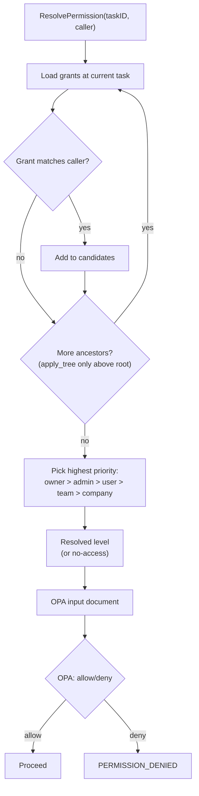
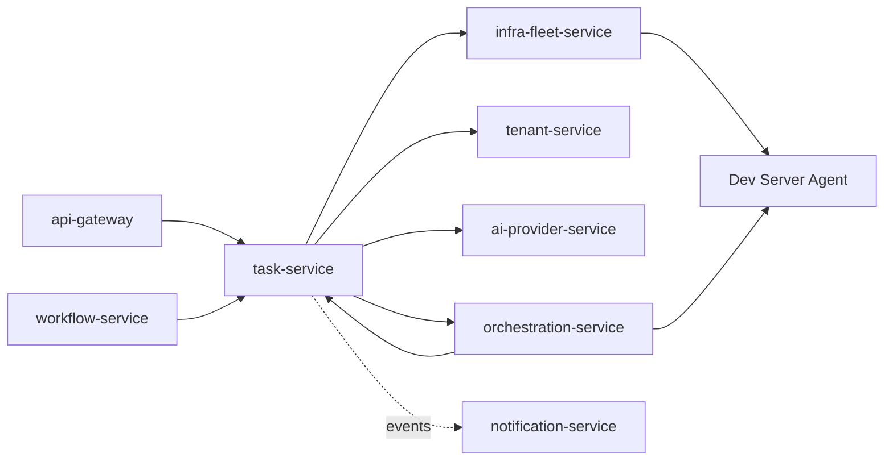

# task-service

Category: AI & Orchestration · Owns: `tasks`, `task_edges`, `task_grants`,
`task_comments` (ADR-021 schema `task`) · Migration phase: 2 · Replaces:
`TaskService`, `TaskDAGValidator`, `TaskGrantService`, `TaskAIPlanner`,
`TaskAgentExecutor` (per [`00-service-catalog.md`](./00-service-catalog.md)).

## 1. Overview & responsibility

`task-service` owns the hierarchical task graph: task CRUD, the DAG of
parent-child and depends-on edges, permission grants, and comments. It
decides *how* a task should run (§3.1's complexity branch) and *that* it
should be AI-decomposed (§3.2), but does not itself execute work or run
inference.

Per `business-capabilities.md`'s "Task management & AI decomposition"
section: "Task CRUD (hierarchical, with dependency edges), comments,
grant-based permissions, AI-assisted decomposition into subtasks,
execution dispatch." This is a faithful Go port of that domain, not a
redesign — see §10.

## 2. Bounded context

Owns tasks, both edge kinds, grants, and comments. Does **not** own:

- **Team membership.** Per ADR-021 the `task` schema has no
  `team_members` table — that's `tenant-service`'s. Grant resolution
  (§4.1) calls `tenant-service`'s API for team scope rather than joining
  locally, per `02-microservices-decomposition.md`'s "no service reads
  another service's tables directly."
- **Execution.** `Execute` (§3.1) picks a path; the work runs on
  `infra-fleet-service` (simple → Dev Server Agent's `agent.exec`) or
  `orchestration-service` (complex → coordinator → Dev Server Agent).
- **AI inference.** `AIDecompose` (§3.2) packages context and relays the
  completion call; it runs no inference itself.

## 3. API surface (gRPC, sketch)

```protobuf
service TaskService {
  rpc CreateTask(CreateTaskRequest) returns (CreateTaskResponse);
  rpc GetTask(GetTaskRequest) returns (GetTaskResponse);
  rpc UpdateTask(UpdateTaskRequest) returns (UpdateTaskResponse);
  rpc DeleteTask(DeleteTaskRequest) returns (DeleteTaskResponse);
  rpc ListTasks(ListTasksRequest) returns (ListTasksResponse);

  rpc GetChildren(GetChildrenRequest) returns (GetChildrenResponse);
  rpc GetAncestors(GetAncestorsRequest) returns (GetAncestorsResponse);
  rpc GetSubtree(GetSubtreeRequest) returns (GetSubtreeResponse);

  rpc AddEdge(AddEdgeRequest) returns (AddEdgeResponse);   // parent_child | depends_on
  rpc RemoveEdge(RemoveEdgeRequest) returns (RemoveEdgeResponse);
  rpc GetDependencies(GetDependenciesRequest) returns (GetDependenciesResponse);

  rpc RecalculateProgress(RecalculateProgressRequest) returns (RecalculateProgressResponse);
  rpc AddComment(AddCommentRequest) returns (AddCommentResponse);
  rpc ListComments(ListCommentsRequest) returns (ListCommentsResponse);

  rpc Grant(GrantRequest) returns (GrantResponse);
  rpc RevokeGrant(RevokeGrantRequest) returns (RevokeGrantResponse);
  rpc ResolvePermission(ResolvePermissionRequest) returns (ResolvePermissionResponse);

  rpc AIDecompose(AIDecomposeRequest) returns (AIDecomposeResponse);
  rpc AIApply(AIApplyRequest) returns (AIApplyResponse);

  rpc Execute(ExecuteRequest) returns (ExecuteResponse);
}
```

`AddEdge` runs cycle detection (§4) before commit. Every mutating RPC
calls `ResolvePermission` internally first (§8); the standalone RPC exists
for callers that just need the answer.

### 3.1 Execution dispatch (`Execute`)

Preserves TS `task.execute`'s complexity branch: a **simple** task (no
subtasks, no pending dependencies) relays directly to
`infra-fleet-service` → Dev Server Agent `agent.exec`; a **complex** task
(has subtasks and/or dependency edges) hands off to
`orchestration-service`'s coordinator, which sequences
subtask/dependency execution and itself reaches the Dev Server Agent for
worker dispatch. `task-service` records a logical FK
(`active_execution_id`), mirroring the
`orca_tasks.active_execution_task_id` precedent — it does not track live
execution state itself.

### 3.2 AI decomposition (`AIDecompose` / `AIApply`)

Gathers task context, calls `ai-provider-service` to resolve
provider/account context, then relays completion to the Dev Server
Agent's `ai.complete` — the same AI-inference-off-backend principle
already applied to `git-gateway-service`'s commit-message generation
(`services/git-gateway-service.md` §3.1) and named for this service in
`business-capabilities.md`. `AIDecompose` returns a proposed breakdown;
`AIApply` is a separate write RPC that commits it, matching TS's two-step
review-before-commit shape.

## 4. Domain model

`internal/domain/` — pure Go, per `03-clean-architecture-guidelines.md`:
**`Task`** (id, project scope, title, status, complexity marker, assignee;
status transitions enforced in methods); **`TaskEdge`**
(`fromTaskID, toTaskID, kind ∈ {ParentChild, DependsOn}` — one parent edge
per task, many depends-on edges; `GetSubtree`/`GetAncestors` walk
parent-child, `GetDependencies` and the complex-execution coordinator walk
depends-on); **`CycleDetector`** (pure domain service: given the edge set
and a proposed depends-on edge, walks the subgraph reachable from the
edge's target for the edge's source, rejecting with `ErrCyclicDependency`
if found — same algorithm as TS `TaskDAGValidator`, carried forward as-is
per §10, unit-testable against an in-memory edge list, no DB);
**`TaskGrant`** (`taskID, granteeType ∈ {user, team, company}, granteeID,
level ∈ {owner, admin, user}, applyTree` — `applyTree = true` means the
grant is inherited by the descendant subtree); **`GrantResolution`**
(domain service — the BFS ancestor walk in §4.1, a pure function of
`(taskID, callerIdentity, edges, grants) → resolved level`, no SQL, no
gRPC, no `context.Context`).

### 4.1 Grant resolution — the BFS ancestor walk

Carried forward faithfully from TS `TaskGrantService.resolvePermission()`
— not a bug to fix, an algorithm to re-implement as a pure domain
function:

1. Collect grants at the target task matching the caller's identity
   (user ID, team memberships resolved via `tenant-service`, or company).
2. If none match, walk to the parent via the `ParentChild` edge and
   repeat — at ancestors, only `applyTree = true` grants count.
3. Continue (breadth-first over the parent chain — linear in practice,
   expressed as BFS to match TS and stay correct if multi-parent is ever
   allowed) until a grant is found or the root is reached.
4. Resolve the highest-priority match across the whole walk:
   `owner > admin > user > team > company` — priority wins over
   proximity, matching TS semantics.
5. No match anywhere → default-deny.



`tenant-service` resolves team membership during the walk —
`task-service` never reads `team_members` rows itself (§2, §9).

## 5. Data model

Postgres schema `task`, own database
(`02-microservices-decomposition.md`'s database-per-service rule):

```sql
CREATE TABLE tasks (
  id                   UUID PRIMARY KEY DEFAULT gen_random_uuid(),
  project_id           UUID NOT NULL,            -- logical FK -> project-service
  title                TEXT NOT NULL,
  description          TEXT,
  status               TEXT NOT NULL,
  complexity           TEXT NOT NULL DEFAULT 'simple', -- simple|complex, drives §3.1
  assignee_id          UUID,                     -- logical FK -> tenant-service
  active_execution_id  UUID,                     -- logical FK -> orchestration/infra-fleet run
  created_at           TIMESTAMPTZ NOT NULL DEFAULT now(),
  updated_at           TIMESTAMPTZ NOT NULL DEFAULT now()
);

-- kind: 'parent_child' (hierarchy, walked by GetSubtree/GetAncestors) or
-- 'depends_on' (ordering, walked by GetDependencies + the complex-Execute path)
CREATE TABLE task_edges (
  id           UUID PRIMARY KEY DEFAULT gen_random_uuid(),
  from_task_id UUID NOT NULL REFERENCES tasks(id) ON DELETE CASCADE,
  to_task_id   UUID NOT NULL REFERENCES tasks(id) ON DELETE CASCADE,
  kind         TEXT NOT NULL CHECK (kind IN ('parent_child', 'depends_on')),
  created_at   TIMESTAMPTZ NOT NULL DEFAULT now(),
  UNIQUE (from_task_id, to_task_id, kind)
);
-- one parent_child edge per child; both directions indexed for ancestor/descendant CTEs
CREATE UNIQUE INDEX task_edges_single_parent ON task_edges (to_task_id) WHERE kind = 'parent_child';
CREATE INDEX task_edges_from_idx ON task_edges (from_task_id, kind);
CREATE INDEX task_edges_to_idx   ON task_edges (to_task_id, kind);

-- grantee_type='team' -> grantee_id is a bare UUID, validated via tenant-service at
-- write time (no local team_members table to FK against, per ADR-021).
CREATE TABLE task_grants (
  id           UUID PRIMARY KEY DEFAULT gen_random_uuid(),
  task_id      UUID NOT NULL REFERENCES tasks(id) ON DELETE CASCADE,
  grantee_type TEXT NOT NULL CHECK (grantee_type IN ('user', 'team', 'company')),
  grantee_id   UUID NOT NULL,
  level        TEXT NOT NULL CHECK (level IN ('owner', 'admin', 'user')),
  apply_tree   BOOLEAN NOT NULL DEFAULT false,
  created_at   TIMESTAMPTZ NOT NULL DEFAULT now()
);
CREATE INDEX task_grants_task_idx ON task_grants (task_id);

CREATE TABLE task_comments (
  id         UUID PRIMARY KEY DEFAULT gen_random_uuid(),
  task_id    UUID NOT NULL REFERENCES tasks(id) ON DELETE CASCADE,
  author_id  UUID NOT NULL,               -- logical FK -> tenant-service
  body       TEXT NOT NULL,
  created_at TIMESTAMPTZ NOT NULL DEFAULT now()
);
```

Both edge kinds share one table with a `kind` discriminator so
`GetSubtree`/`GetAncestors`/`GetDependencies` reuse one recursive-CTE
shape, parameterized by `kind`, instead of duplicating it per relation.

## 6. Package layout notes

`04-tech-stack.md` names `task-service` (with `workflow-service`) as
permitted to use `ent` instead of `sqlc` "where the graph-traversal
codegen pays for itself." Decision: **`sqlc` with hand-written recursive
CTEs, not `ent`.** The graph queries needed —
`GetAncestors`/`GetSubtree`/`GetDependencies` — are a small, fixed set of
`WITH RECURSIVE` queries, the canonical Postgres case, not a large enough
surface of ad hoc dynamic graph queries to justify `ent`'s query DSL.
Staying on `sqlc` also keeps SQL visible and reviewable, the project-wide
default. `workflow-service`'s `ent`-eligibility is a separate decision.

**Grant resolution (§4.1) is not a query decision at all** — the BFS walk
operates on data a repository port already fetched. `domain/grant_resolution.go`
has zero awareness of whether the data came from `sqlc`, `ent`, or an
in-memory test fixture — Clean Architecture's dependency rule in action.

```
task-service/
├── cmd/server/main.go
├── internal/
│   ├── domain/     # task.go, task_edge.go, cycle_detector.go, task_grant.go,
│   │                 grant_resolution.go (§4.1) + *_test.go (in-memory fixtures, no mocks)
│   ├── usecase/    # create_task.go, add_edge.go, get_subtree.go,
│   │                 resolve_permission.go (domain GrantResolution, then OPA §9),
│   │                 ai_decompose.go, execute_task.go (§3.1 branch),
│   │                 ports.go (TaskRepository, TenantClient, AIProviderClient,
│   │                 InfraFleetClient, OrchestrationClient, OPAClient, EventPublisher)
│   │                 + *_test.go (fakes for all ports)
│   └── adapter/
│       ├── grpc/                # orca.task.v1 server
│       ├── postgres/            # sqlc + recursive CTEs
│       ├── tenantclient/ aiproviderclient/ infraclient/ orchestrationclient/
│       ├── opaclient/           # embedded OPA eval (§9)
│       └── eventbus/            # task.created/task.completed/... via outbox
├── migrations/
├── proto/
└── go.mod
```

## 7. Dependencies



- **`tenant-service`** — team-scope resolution for grants (§4.1);
  validates `assignee_id`/`grantee_id`. Never joins `team_members` locally.
- **`ai-provider-service`** — provider/account/credential context for
  `AIDecompose`; no direct LLM client.
- **`infra-fleet-service`** — simple-path `Execute` relay.
- **`orchestration-service`** — complex-path `Execute` handoff. It also
  calls back into `task-service` (the `orch --> task` edge in
  `02-microservices-decomposition.md`) to read/update task state as it
  progresses subtasks; `task-service` never calls back for the same
  request, avoiding a synchronous cycle.
- **Called by** `workflow-service` (task-linked steps) and `api-gateway`
  (direct task management traffic).
- **Emits events** via the outbox pattern; `notification-service`
  consumes them asynchronously.

## 8. Non-functional requirements

**Grant resolution is hot-path** — checked on most mutating operations,
not just the explicit RPC — so target p99 well under the 5s gRPC deadline
and p50 in the low single digits of ms for the common case; add a
configurable max-depth guard so a malformed hierarchy can't turn a check
into an unbounded walk. **Progress recalculation** at depth/fan-out
scale: `RecalculateProgress` aggregates status up a subtree where depth
and fan-out matter independently, so use one `WITH RECURSIVE` aggregate
query rather than N+1 fetches, and benchmark against realistic fan-out
(dozens of subtasks/task), not just depth. **Cycle detection** is
bounded, one-time cost per `AddEdge` — a single query or in-memory walk,
not N+1 per hop, and unlike grant resolution not a read-path concern.
**Edge-mutation consistency** — `AddEdge`'s cycle check and the write
must happen in one transaction so a concurrent `AddEdge` can't slip a
cycle in between check and write.

## 9. Security notes

Grant resolution is this service's core security surface — TS's
`TaskGrantService.resolvePermission()` is one of the two fragmented
permission mechanisms `07-security-architecture.md` names as exactly what
OPA-centralization fixes. The split this service implements:

**`task-service` computes the grant resolution result itself.** The BFS
walk (§4.1) — priority ordering, `apply_tree` inheritance, parent-chain
traversal — is task-graph-specific domain logic that doesn't translate
cleanly into generic Rego: re-encoding it in policy would mean either
giving OPA direct query access to `task_edges`/`task_grants` (breaking
"one place owns this data") or duplicating the algorithm in two
languages. It stays in Go, in `domain/`, as a pure, unit-testable
function. **The resolved result becomes OPA's input, not OPA's
derivation** — `task-service` calls OPA in-process with an input document
containing the resolved level, caller identity, requested action, and
tenant context; OPA's job is the generic "does this level authorize this
action" decision, not the graph walk. This keeps one place (the Rego
bundle) as the record of every final allow/deny decision, while keeping
the domain-specific walk in the service that owns the data it walks.

`Grant`/`RevokeGrant` emit structured audit events per
`07-security-architecture.md`'s audit-logging section. `task-service`
holds no secrets and has no `adapter/vault/` — `AIDecompose`'s downstream
credential resolution is `ai-provider-service`'s/
`credential-broker-service`'s concern, mirroring `git-gateway-service`'s
posture.

## 10. Migration notes

Phase 2. The task-graph logic — grant resolution BFS and cycle detection
— is already correct in TS; this is a **faithful port**, not a
gap-fixing rebuild, the same framing used for `git-gateway-service`
("not to improve on it") and `issue-tracking-service` ("already the
correct shape in TS... carried forward as-is").

`TaskDAGValidator` and `TaskGrantService.resolvePermission()` translate
directly into `domain/cycle_detector.go` and `domain/grant_resolution.go`
with unchanged logic, restructured only for Go's layering — port the TS
test suite's cases as Go fixtures to confirm behavioral equivalence, not
just structural similarity. `TaskService`'s CRUD and
`TaskAgentExecutor`'s complexity branch (§3.1) become `usecase/` files
with the same shape as today's handlers; the branch doesn't change, only
that its two targets are separate Go services rather than in-process TS
modules.

**One prescribed behavior change**, consistent with `git-gateway-service`:
`TaskAIPlanner`'s decomposition call moves to the relay-to-execution-plane
pattern (§3.2) rather than a direct backend LLM call — flag this
explicitly during review as a deviation from pure port-as-is. Risk
concentrates in the grant-resolution boundary change (§9): TS's
`resolvePermission()` returned a final allow/deny itself; Go returns a
resolved level that OPA then decides on. The BFS algorithm is unchanged,
but how its result is *used* is a real architectural change — test the
OPA policy bundle's task-grant rules with the same rigor as the BFS unit
tests, since a bug in either half can silently produce a wrong access
decision.
