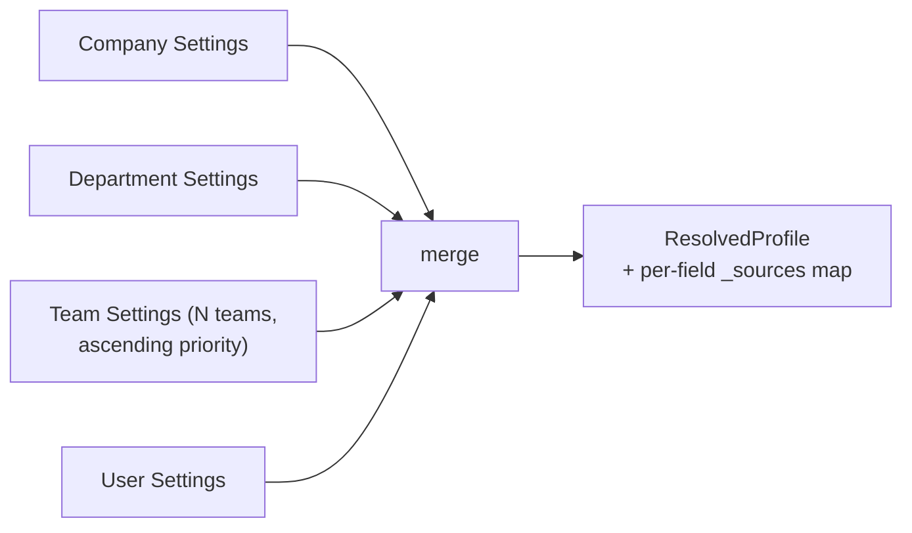

# `tenant-service`

**Category:** Identity | **ADR-021 schema:** `tenant` | **Migration phase:** 4
(alongside `auth-service` — see [Migration notes](#10-migration-notes))

**Replaces (TS):** `ProfileResolver`, `ProfileService`, the
company/department logic in `profile-rpc-handler.ts`, `TeamService`,
`team-rpc-handler.ts`.

## 1. Overview & responsibility

`tenant-service` owns the identity hierarchy above the individual user:
companies, departments, per-user profile overrides, teams, and team
membership — five tables (§5) plus one piece of derived, non-persisted
logic: **3-layer profile resolution**, merging company defaults, department
overrides, team overrides, and user overrides into the `ResolvedProfile`
every agent-spawn and editor session runs with.

It is also, per ADR-021, **the service that originates `tenant_id`**:
`tenant.companies.id` is the value every other service's `tenant_id UUID
NOT NULL` column logically references. No other service schema has a
`companies` table or a substitute for one. That makes `tenant-service`
foundational and high-blast-radius, in the same tier as `auth-service` —
see [Dependencies](#7-dependencies) and [Migration notes](#10-migration-notes).

## 2. Bounded context

**Owns:** company CRUD (`companies`, the tenant root); department CRUD and
hierarchy (`departments`, self-referencing tree); user-to-department
assignment; per-user profile overrides (`user_profiles`); team CRUD
(`teams`) and membership (`team_members`, including the `priority`
tiebreaker used by resolution); the profile-resolution algorithm and its
cache (a `usecase/` concern, not a table — §4, §6).

**Explicitly does NOT own:**
- **User identity** (`users`, credentials, sessions) — `auth-service`.
  `tenant-service` references `user_id` as a logical FK, validated by
  calling `auth-service`; it trusts the `tenant_id`/`user_id` already
  validated by `api-gateway` and never authenticates a request itself.
- **Project membership.** `orca_v5_project_members` is `project-service`'s
  table and API, even though it is structurally "membership"-shaped like
  `team_members`. The two are different concepts: team membership is an
  organizational grouping feeding profile cascade (and, in the TS system,
  grant-scope resolution); project membership is an authorization grant on
  one project. Merging them would violate "a service owns exactly the data
  it's system of record for" (`02-microservices-decomposition.md` #3) — a
  team's members and the projects they can see are independent facts.
- **Authorization policy evaluation** — `tenant-service` supplies data
  (department, team memberships) OPA policies consume; it doesn't decide
  permissions itself (`api-gateway`/OPA, per `04-tech-stack.md`).
- **Task-grant BFS resolution** (`TaskGrantService` in the TS system) —
  lives in `task-service`, which calls this service to resolve a user's
  team memberships as one input but owns the grant graph itself.

## 3. API surface (gRPC service sketch)

```protobuf
service TenantService {
  // Companies
  rpc CreateCompany(CreateCompanyRequest) returns (Company);
  rpc GetCompany(GetCompanyRequest) returns (Company);
  rpc UpdateCompany(UpdateCompanyRequest) returns (Company);
  rpc ValidateTenant(ValidateTenantRequest) returns (ValidateTenantResponse); // logical-FK check for every other service

  // Departments
  rpc CreateDepartment(CreateDepartmentRequest) returns (Department);
  rpc UpdateDepartment(UpdateDepartmentRequest) returns (Department);
  rpc ListDepartments(ListDepartmentsRequest) returns (ListDepartmentsResponse);
  rpc AssignUserDepartment(AssignUserDepartmentRequest) returns (google.protobuf.Empty);

  // User profile overrides
  rpc GetUserProfile(GetUserProfileRequest) returns (UserProfile);
  rpc UpdateUserProfile(UpdateUserProfileRequest) returns (UserProfile);

  // Profile resolution — hot path, called on every agent spawn / editor session start
  rpc GetResolvedProfile(GetResolvedProfileRequest) returns (ResolvedProfile);
  rpc InvalidateProfileCache(InvalidateProfileCacheRequest) returns (google.protobuf.Empty); // one userId, or all

  // Teams
  rpc CreateTeam(CreateTeamRequest) returns (Team);
  rpc UpdateTeam(UpdateTeamRequest) returns (Team);
  rpc ListTeams(ListTeamsRequest) returns (ListTeamsResponse);
  rpc AddTeamMember(AddTeamMemberRequest) returns (TeamMembership);   // upsert: role + priority
  rpc RemoveTeamMember(RemoveTeamMemberRequest) returns (google.protobuf.Empty);
  rpc ListTeamMembers(ListTeamMembersRequest) returns (ListTeamMembersResponse);
}
```

Every request carries `tenant_id` explicitly (from the validated
JWT/session, forwarded via gRPC metadata and a bound field — never inferred
from a nested resource ID; see [Security notes](#9-security-notes)).
`ValidateTenant` is what every other service calls to confirm a `tenant_id`
it received is real — the concrete mechanism behind "logical FK, validated
by calling the owning service's API" in `05-data-architecture.md`.

Method count mirrors the TS system's `profile.*` (11 methods) and `team.*`
(5 methods) namespaces from
[`business-capabilities.md`](../../backend/api/business-capabilities.md),
kept traceable per `03-clean-architecture-guidelines.md`.

## 4. Domain model

**Entities:** `Company` (tenant root, holds `Settings` value object) ·
`Department` (belongs to a `Company`, optionally a parent `Department` —
tree) · `UserProfile` (1:1 with a user, logical FK to `auth-service`, holds
its own `Settings` override and `department_id`) · `Team` (belongs to a
`Company`; deliberately **no** `department_id` — not scoped to one
department by design, carried forward from
`docs/guides/user-profile-team-department-rbac.md` §5.2) · `TeamMembership`
(join of `Team` and a user, with `role` and `priority int` — introduced by
the TS system's migration `0016`, carried forward unchanged). A user may
belong to zero, one, or many teams.

**The deep-merge resolution algorithm** (`ResolveProfile`, behind
`GetResolvedProfile`) is the one real piece of business logic here, and it
lives as a pure domain function — no I/O, fully unit-testable — over four
already-fetched `Settings` layers:



Merge rules, ported from the TS reference implementation
(`backend/src/main/profile/ProfileResolver.ts`):

- **`security` section**: company-locked; department, team, and user layers
  can never override it — enforced in the domain function, not by
  convention.
- **Scalar sections** (`agent`, `editor`, `envVars`, `shell.defaultShell`):
  per key, the highest-priority layer that defines it wins. Layer order,
  lowest to highest: `company < department < teams (ascending
  TeamMembership.priority) < user`. Conflicting teams resolve by higher
  `priority`.
- **`shell.pathAdditions`**: concatenated across all layers (company
  first, user last) — additive, not overridden.
- **`mcp.servers`**: deduplicated by name; on collision the
  highest-priority layer wins, same ordering as scalar sections.
- Every resolved field's winning layer is recorded in a `_sources` map
  (e.g. `agent.model → "team:<teamId>"`) — preserved from the TS
  implementation so a debugging session can answer "why did this user get
  this setting" without re-deriving the cascade by hand.

Fetching the four layers is a `usecase/` concern (parallel repository
calls); the merge takes plain `Settings` structs and has zero
repository/cache awareness, per `03-clean-architecture-guidelines.md`.

## 5. Data model (Postgres schema sketch)

Database: `tenant` (own physical instance/cluster — one of the three
services `05-data-architecture.md` calls out for dedicated-cluster
treatment, alongside `auth` and `credential`).

| Table | Key columns | Indexes |
|---|---|---|
| `companies` | `id UUID PK`, `name`, `settings JSONB DEFAULT '{}'`, `admin_user_id UUID NULL` (logical FK → `auth.users`), `created_at/updated_at`, `updated_by UUID NULL` | — (no `tenant_id`: this table *is* the tenant root) |
| `departments` | `id UUID PK`, `company_id UUID NOT NULL` (FK → `companies.id`, real FK — same DB), `name`, `parent_department_id UUID NULL` (self FK, `ON DELETE SET NULL`), `settings JSONB DEFAULT '{}'`, `created_at/updated_at`, `updated_by UUID NULL` | `idx_departments_company(company_id)`, `idx_departments_parent(parent_department_id)` |
| `user_profiles` | `user_id UUID PK` (logical FK → `auth.users` — different DB), `company_id UUID NOT NULL` (FK → `companies.id`), `department_id UUID NULL` (FK → `departments.id`, `SET NULL` — unset means company-only inheritance), `settings JSONB DEFAULT '{}'`, `updated_at` | `idx_user_profiles_company(company_id)`, `idx_user_profiles_department(department_id)` |
| `teams` | `id UUID PK`, `company_id UUID NOT NULL` (FK → `companies.id`), `name`, `settings JSONB DEFAULT '{}'`, `created_at/updated_at` | `idx_teams_company(company_id)` |
| `team_members` | `team_id UUID NOT NULL` (FK → `teams.id`, `CASCADE`), `user_id UUID NOT NULL` (logical FK → `auth.users`), `role TEXT DEFAULT 'member'`, `priority INT DEFAULT 0`, `added_at`, `PRIMARY KEY(team_id, user_id)` | `idx_team_members_user(user_id)` — used for cascade team-layer resolution |

- `companies` has no `tenant_id` column — it *defines* the value, matching
  `05-data-architecture.md`'s carve-out for non-tenant-scoped tables
  (inverted here: every other table is implicitly tenant-scoped via
  `company_id`, so a redundant `tenant_id` alias isn't added — the two are
  the same value by definition in this schema only).
- `company_id` FKs are real SQL FKs within this database (same
  physical DB); `user_id`/`admin_user_id` are logical FKs to
  `auth-service`, validated via its API at write time, never joined in SQL.
- RLS is enabled on `departments`, `user_profiles`, `teams`,
  `team_members`, keyed on `current_setting('app.tenant_id')` compared
  against `company_id` (secondary defense-in-depth, per
  `05-data-architecture.md`). `companies` has no RLS policy — a request
  either has a validated `company_id` and looks up exactly that row, or it
  doesn't.

## 6. Package layout notes

Standard layout from `03-clean-architecture-guidelines.md`, with one
service-specific detail: **profile-resolution caching is a `usecase/`
concern, expressed as a port, not baked into `adapter/postgres/`.**

```
tenant-service/internal/
├── domain/
│   ├── company.go / department.go / user_profile.go / team.go
│   └── profile_resolution.go   # pure merge algorithm, no I/O
├── usecase/
│   ├── get_resolved_profile.go # cache lookup -> parallel repo fetch -> domain merge -> cache store
│   ├── ports.go                # CompanyRepository, DepartmentRepository, UserProfileRepository,
│   │                            # TeamRepository, ProfileCache
│   └── get_resolved_profile_test.go # in-memory fakes, no real Postgres
└── adapter/
    ├── grpc/                   # TenantService implementation
    ├── postgres/                # sqlc-generated repositories, one per aggregate
    └── vault/                  # DB credential rotation only (§7)
```

`ProfileCache` is a `usecase/`-defined port:

```go
type ProfileCache interface {
    Get(ctx context.Context, userID uuid.UUID) (domain.ResolvedProfile, bool)
    Set(ctx context.Context, userID uuid.UUID, profile domain.ResolvedProfile, ttl time.Duration)
    Invalidate(ctx context.Context, userID uuid.UUID)
}
```

**Design choice: in-process LRU-with-TTL, not a shared read-through cache
(Redis).** The cached object is small, per-user, and its invalidation set
is always known exactly at write time (`UpdateCompany`/`UpdateDepartment`/
`UpdateUserProfile`/`AddTeamMember` each know exactly which `user_id`s they
affect) — the same case the TS system's process-local `Map`-based 60s TTL
cache already handled correctly; the Go design keeps the same TTL for
behavioral continuity. Go services are horizontally replicated, so each
replica has its own cache — an update on replica A doesn't invalidate
replica B within the TTL window. This is an accepted staleness bound (max
60s), the same bound the TS system operated under; a distributed
invalidation broadcast (publish `Invalidate` on this service's own
outbox/NATS subject, consumed by every replica) is the documented upgrade
path if 60s staleness proves unacceptable — not built by default. A
read-through Redis cache would add an operational hop to the hottest read
path in the system for entries that are cheap to recompute (four indexed
point-reads + an in-memory merge) — not justified at this data volume.

## 7. Dependencies

**Who calls this service:** almost everyone, for two reasons —
**`tenant_id` validation** (`ValidateTenant`, called by any service
confirming an incoming `tenant_id` is real) and **profile injection into
agent-spawn environment** (`task-service`/`workflow-service` call
`GetResolvedProfile` before dispatching an agent-spawn step, building the
same shell/MCP/editor/agent environment `ProfileAwareAgentSpawner` builds
today). `project-service` calls `ValidateTenant` when creating a project
under a company; `api-gateway` calls this service directly for
company/department/team administration UI. Per
`02-microservices-decomposition.md`'s dependency graph, `tenant-service`
(with `auth-service`) is called by nearly everything — one of the two
highest-risk services to get wrong.

**Who this service calls:** **Vault only, for database credentials**
(dynamic Postgres secrets engine, per `04-tech-stack.md`/
`06-secrets-vault-architecture.md`). No synchronous calls to any other Orca
service — this service is foundational and must not depend on a service
that transitively depends on it (e.g. it must never call `auth-service` in
the request path of `GetResolvedProfile`, since `auth-service` may itself
call `tenant-service` for tenant validation). User IDs passed into mutating
calls (`AssignUserDepartment`, `AddTeamMember`) are trusted as already
validated by the caller, not re-validated against `auth-service`
synchronously — keeping this service at zero outbound service calls.

## 8. Non-functional requirements

- **SLO tier: same as `auth-service`.** Both sit on the critical path of
  every agent spawn and authenticated request — an outage here degrades
  the whole system, not just tenant-administration features. Target: p99
  `GetResolvedProfile`/`ValidateTenant` in single-digit ms on cache hit,
  low tens of ms on cache miss (four indexed point-reads); availability
  target matching `auth-service`'s.
- **Cache invalidation correctness:** any mutation to `companies.settings`,
  `departments.settings`, `user_profiles.settings`, or `team_members`
  (add/remove/priority change) MUST invalidate every cached
  `ResolvedProfile` for transitively affected users, on the serving
  replica, before the write's RPC returns success. Cross-replica
  invalidation is bounded by the 60s TTL (§6) — a documented staleness
  window, not a bug budget. A production-readiness check must verify every
  mutating usecase touching `Settings` calls `ProfileCache.Invalidate` for
  the correct scope: one user for a `UserProfile` edit; every user in the
  department for a `Department` edit; every user in the company for a
  `Company` edit; every team member for a `Team`/`TeamMembership` edit.
- **Read/write ratio:** heavily read-skewed (`GetResolvedProfile`/
  `ValidateTenant` dwarf CRUD calls) — the cache design in §6 targets this.

## 9. Security notes

Tenant isolation is this service's core responsibility, not a
cross-cutting concern delegated elsewhere, since it *defines* what a
tenant is:

- Every RPC resolving a `Department`, `UserProfile`, `Team`, or
  `TeamMembership` requires a `company_id`/`tenant_id` bound from the
  validated request context, and every `adapter/postgres/` query filters
  on it explicitly — never inferred from a nested resource ID. A request
  for company A holding a `department_id` from company B must be rejected
  as not-found (not "wrong company", which would leak existence). Enforced
  twice: application-layer scoping (primary), Postgres RLS on
  `current_setting('app.tenant_id')` (secondary — not relied on alone, per
  `05-data-architecture.md`).
- `departments.parent_department_id` and team/membership lookups must
  never traverse outside the bound `company_id` — ancestry queries are
  scoped by `company_id` in the same query, not filtered after the fact.
- `ValidateTenant` and `GetResolvedProfile` are the two RPCs every other
  service's own tenant-isolation correctness ultimately rests on: if this
  service validates a `tenant_id`/`company_id` pair incorrectly, every
  downstream application-layer check passes on bad data. This is why the
  service is do-last (Phase 4) and why its test suite must treat
  adversarial cross-company ID cases as first-class, not an afterthought.
- `security` profile-section values (company-locked, §4) are the kind of
  setting an org uses to pin disallowed MCP servers or forced agent
  policy — the merge algorithm's refusal to let department/team/user
  override that section is a security control, enforced in the domain
  layer, not an adapter-level check that could be bypassed.

## 10. Migration notes

- **Phase 4**, alongside `auth-service` — per ADR-021's phase ordering and
  the dependency graph in `02-microservices-decomposition.md`, these two
  are the highest-risk, do-last services in any incremental rollout, since
  every already-migrated service depends on both being correct.
- **Prior art:** the TS system already retrofitted `tenant_id` once —
  ADR-021 migrations `0019`–`0022` added it to pre-existing tables:
  nullable first, backfilled, then tightened to `NOT NULL`, the same
  expand/contract pattern `05-data-architecture.md` mandates here. That
  effort is direct evidence that (1) real company/department/user-profile
  data does not backfill in one step — expect a nullable-column window —
  and (2) the TS `orca_companies` table was already plural (not the
  singleton `id='default'` shape ADR-016 once proposed), so this schema's
  `companies` table has real multi-tenant data to migrate, not one row to
  special-case.
- **Data mapping:** `companies`/`departments`/`user_profiles`/`teams`/
  `team_members` map 1:1 from `orca_companies`/`orca_departments`/
  `orca_user_profiles`/`orca_teams`/`orca_team_members`
  (`specs/backend/models/02-sql-schema-catalog.md`). `profile_json`/
  `settings` JSON blobs carry over as-is (JSONB both sides). The TS
  system's migration-`0016` `priority` column on `orca_team_members`
  carries forward as `priority INT` from day one here — no "add it later"
  step needed on a ground-up schema.
- **Cutover ordering:** `tenant-service` must be reachable
  (`ValidateTenant`/`GetResolvedProfile` serving) before any earlier-phase
  service that depends on it can cut over for real traffic — in practice
  this likely means running it against migrated data in shadow/read-only
  mode ahead of its official Phase 4 slot, validated against the live TS
  `ProfileResolver`'s output for a sample of real users before it becomes
  system of record.
