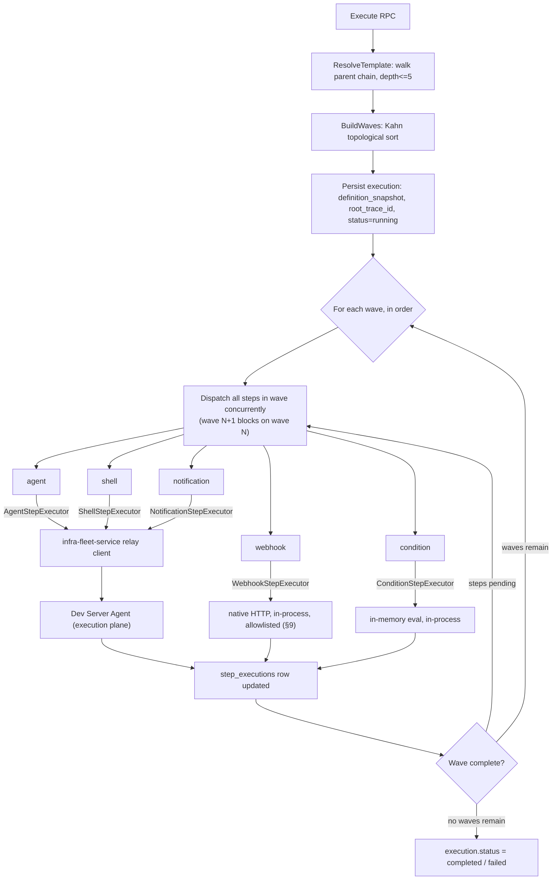

# workflow-service

Category: AI & Orchestration · Owns: workflow templates, executions, step
executions (DAG build + topological wave-based dispatch) · ADR-021 schema:
`workflow` · Migration phase: 2 · Replaces: `WorkflowOrchestrator`,
`DAGBuilder`, `TemplateResolver`, `StepExecutors` (per
[`00-service-catalog.md`](./00-service-catalog.md),
[`02-microservices-decomposition.md`](../architecture/02-microservices-decomposition.md)).

## 1. Overview & responsibility

`workflow-service` owns definition, resolution, and orchestration of
multi-step workflows: reusable templates (company/team/personal
inheritance), executions built from a template or inline definition, and
per-step results. It computes execution order from a flat step list with
`dependsOn` edges (topological "waves" — steps in a wave run concurrently,
each wave gates the next) and dispatches each step to the right place: two
step types run in-process, three relay to the execution plane via
`infra-fleet-service` (§2). It never talks to the Dev Server Agent directly
and never runs AI inference itself.

Two TS properties carry forward as **hard requirements**, not aspirations:
resumability across a process restart (TS's `root_trace_id`, migration
`0013_workflow_trace_correlation.ts` — one of the better-designed corners
of the TS system, not to be regressed, §8) and user-triggered pause/resume,
not just crash recovery (TS `paused_at`, migration
`0014_workflow_pause_state.ts`, §4–§5). This service is also where **TS
Gap 4 gets fixed at the source**, not ported forward broken — §3.2.

## 2. Bounded context

Owns: DAG construction/validation (Kahn's-algorithm wave computation, cycle
detection), template inheritance resolution (company → team → personal
chain, depth-bounded at 5, root-to-leaf merge), and execution/step
state including resumability and pause state. `webhook` (native HTTP call)
and `condition` (in-memory expression evaluator) run entirely in-process.

Does **not** own: `agent`/`shell`/`notification` step *execution* —
dispatched here but executed on the Dev Server Agent execution plane,
reached only through `infra-fleet-service`'s relay client (the "only two
Go services talk to the execution plane" rule in
[`08-inter-service-communication.md`](../architecture/08-inter-service-communication.md)
names `infra-fleet-service` and `git-gateway-service`; `workflow-service`
is a third-hop caller of `infra-fleet-service`, never a direct
execution-plane client). AI provider selection is `ai-provider-service`'s
job (§7); host/connection resolution is `infra-fleet-service`'s job.

## 3. API surface (gRPC, sketch)

Proto package `orca.workflow.v1`:

```protobuf
service WorkflowService {
  rpc CreateTemplate(CreateTemplateRequest) returns (CreateTemplateResponse);
  rpc GetTemplate(GetTemplateRequest) returns (GetTemplateResponse);
  rpc UpdateTemplate(UpdateTemplateRequest) returns (UpdateTemplateResponse);
  rpc DeleteTemplate(DeleteTemplateRequest) returns (DeleteTemplateResponse);
  rpc ListTemplates(ListTemplatesRequest) returns (ListTemplatesResponse);
  rpc ResolveTemplate(ResolveTemplateRequest) returns (ResolveTemplateResponse); // walks parent chain, depth<=5

  rpc Execute(ExecuteRequest) returns (ExecuteResponse);
  rpc GetExecution(GetExecutionRequest) returns (GetExecutionResponse);
  rpc ListExecutions(ListExecutionsRequest) returns (ListExecutionsResponse);
  rpc CancelExecution(CancelExecutionRequest) returns (CancelExecutionResponse);
  rpc PauseExecution(PauseExecutionRequest) returns (PauseExecutionResponse);
  rpc ResumeExecution(ResumeExecutionRequest) returns (ResumeExecutionResponse);
  rpc StreamExecutionEvents(StreamExecutionEventsRequest) returns (stream ExecutionEvent); // -> api-gateway WS

  // Reusable single-step port (§3.1) — automation-service's route to closing Gap 3.
  rpc ExecuteAdHocStep(ExecuteAdHocStepRequest) returns (ExecuteAdHocStepResponse);
}
```

### 3.1 `ExecuteAdHocStep` — a reusable port, not an indirection

Per `backend-agent-target-architecture.md` Gap 3, `automation.runNow`
should not gain execution by "create a throwaway template, then `Execute`
it" — that couples automation's request shape to template-authoring
concerns for no reason. `ExecuteAdHocStep` takes one step definition (type
+ config, no `dependsOn`, no template) plus the caller's tenant/user/trace
context, creates a synthetic one-step execution (one `executions` row, one
`step_executions` row, wave 0), and runs it through the same `StepExecutor`
dispatch path (§4) as a step inside a real workflow, so ad hoc runs get the
same observability/resumability/history as template-driven ones.
`automation-service` is this RPC's primary caller (§7) — nothing requires
a template to exist for automation to gain execution.

### 3.2 Correcting TS Gap 4 — param-building responsibility

`StepExecutors.executeAgent()` in TS sends
`{stepId, prompt, worktreePath, trustPreset, traceId, accountId?, model?}`
to the agent's execution RPC — a shape that doesn't match the execution
plane's real spawn contract (`backend-agent-target-architecture.md` Gap 4).
**Every `agent`-type workflow step fails today** because of this — a live
P0 bug in TS, not a design to inherit.

The Go `AgentStepExecutor` (§4) is **not a port of
`StepExecutors.executeAgent()`**: it's built from scratch against whatever
`infra-fleet-service`'s real relay contract to the execution plane actually
is at implementation time (confirmed against that service's own doc and
the live Dev Server Agent handlers, not TS's buggy caller). It owns turning
a step's domain config (`prompt`, `worktreePath`, `trustPreset`, resolved
`accountId`/`model`) into whatever concrete params the relay client
requires — never assumed, and built in exactly one place, not duplicated
per call site the way TS had `StepExecutors` and `ProfileAwareAgentSpawner`
independently guessing at the same contract and landing on different
answers. If the relay contract changes, this is the one file that changes.

## 4. Domain model

- **`WorkflowTemplate`** — `ID`, `TenantID`, `Name`, `Version`,
  `ParentTemplateID *ID`, `Scope` (`company|team|personal`), `OwnerID`,
  `Definition`. Constructor rejects a template naming itself as its own
  parent, directly or (checked at resolve time, §6) transitively.
- **`WorkflowExecution`** — `ID`, `TenantID`, `TemplateID *ID`,
  `DefinitionSnapshot` (resolved, post-inheritance steps, frozen at
  `Execute` time so a mid-run template edit never changes a running
  execution), `Status` (`pending|running|paused|completed|failed|cancelled`),
  `CurrentWave`, `RootTraceID`, `PausedAt *time.Time`, `TriggeredBy`, `ProjectID *ID`.
- **`StepExecution`** — `ID`, `ExecutionID`, `StepID`, `Wave`, `Status`,
  `DispatchToken` (idempotency key, §8), `Output`, `Error`.
- **`DAG`** — not persisted, computed on demand via
  `BuildWaves(steps []Step) ([][]Step, error)`: Kahn's-algorithm
  topological sort (in-degree map, BFS by wave), identical to TS's
  `DAGBuilder.buildWaves()`, carried forward since it isn't a gap.
  Validates every `dependsOn` resolves within the definition
  (`ErrStepNotFound`) and the graph is acyclic (`ErrCyclicDependency` with
  the offending node set — same as TS's `WorkflowCycleError`).
- **`StepExecutor`** — domain-level strategy interface, defined in
  `usecase/` per
  [`03-clean-architecture-guidelines.md`](../architecture/03-clean-architecture-guidelines.md)'s
  "interface lives with its consumer" rule:
  `Execute(ctx, step Step, execCtx ExecutionContext) (StepOutput, error)`.
  Five implementations (§7's diagram): `AgentStepExecutor`/`ShellStepExecutor`
  (both call `infra-fleet-service`'s relay port, different RPC/params),
  `NotificationStepExecutor` (same relay port, matches TS's
  `notification.send`), `WebhookStepExecutor` (native `net/http`,
  in-process, §9 covers SSRF hardening), `ConditionStepExecutor` (pure
  function over accumulated step outputs, no I/O — ported from TS's
  already-sandboxed `evaluateSafeCondition`: restricted comparison
  grammar, no `eval`/`Function`-equivalent, fail-safe-false on
  unparseable input).

## 5. Data model

Postgres schema `workflow`, one database per
[`05-data-architecture.md`](../architecture/05-data-architecture.md):

```sql
CREATE TABLE templates (
  id UUID PRIMARY KEY DEFAULT gen_random_uuid(),
  tenant_id UUID NOT NULL,
  name TEXT NOT NULL,
  version INT NOT NULL DEFAULT 1,
  parent_template_id UUID REFERENCES templates(id) ON DELETE SET NULL,
  description TEXT,
  definition JSONB NOT NULL DEFAULT '{"steps":[]}',
  scope TEXT NOT NULL DEFAULT 'personal', -- company | team | personal
  owner_id UUID NOT NULL,
  created_at TIMESTAMPTZ NOT NULL DEFAULT now(),
  updated_at TIMESTAMPTZ NOT NULL DEFAULT now()
);
CREATE INDEX idx_templates_parent      ON templates(parent_template_id);
CREATE INDEX idx_templates_scope_owner ON templates(tenant_id, scope, owner_id);

CREATE TABLE executions (
  id UUID PRIMARY KEY DEFAULT gen_random_uuid(),
  tenant_id UUID NOT NULL,
  template_id UUID REFERENCES templates(id) ON DELETE SET NULL,
  definition_snapshot JSONB NOT NULL,  -- resolved DAG, frozen at Execute() time
  status TEXT NOT NULL DEFAULT 'pending',
  inputs JSONB NOT NULL DEFAULT '{}',
  current_wave INT NOT NULL DEFAULT 0,
  root_trace_id TEXT,       -- restart correlation; Go equiv. of TS 0013 root_trace_id (§8, hard requirement)
  triggered_by UUID NOT NULL,
  project_id UUID,
  started_at TIMESTAMPTZ,
  completed_at TIMESTAMPTZ,
  paused_at TIMESTAMPTZ,    -- user-triggered pause, from TS 0014; NULL = not paused, cleared on resume
  error_message TEXT,
  created_at TIMESTAMPTZ NOT NULL DEFAULT now()
);
CREATE INDEX idx_executions_status         ON executions(status, created_at DESC);
CREATE INDEX idx_executions_tenant_project ON executions(tenant_id, project_id, status);
CREATE INDEX idx_executions_resumable ON executions(status) WHERE status IN ('running', 'paused'); -- §8 boot scan

CREATE TABLE step_executions (
  id UUID PRIMARY KEY DEFAULT gen_random_uuid(),
  execution_id UUID NOT NULL REFERENCES executions(id) ON DELETE CASCADE,
  step_id TEXT NOT NULL,    -- references definition_snapshot's step id; steps aren't rows, not an FK
  wave INT NOT NULL,
  status TEXT NOT NULL DEFAULT 'pending',
  dispatch_token UUID NOT NULL DEFAULT gen_random_uuid(), -- idempotency key, §8
  started_at TIMESTAMPTZ,
  completed_at TIMESTAMPTZ,
  output JSONB,
  error_message TEXT,
  UNIQUE (execution_id, step_id)
);
CREATE INDEX idx_step_executions_execution ON step_executions(execution_id, wave);
```

RLS on all three tables (`step_executions` via `execution_id` join) keyed
on `current_setting('app.tenant_id')`, per `05-data-architecture.md`'s
defense-in-depth policy — application-layer `tenant_id` scoping in
`adapter/postgres/` queries remains primary. Outbox rows
(`workflow.execution.completed`, `workflow.step_failed`, …) are written in
the same transaction as the triggering state change and published by the
standard polling relay — no pattern beyond what `05-data-architecture.md`
already specifies.

## 6. Package layout notes: sqlc vs. ent

**Decision: `sqlc`, not `ent`**, despite `workflow-service` being named in
[`04-tech-stack.md`](../architecture/04-tech-stack.md) as one of two
candidate services (with `task-service`) for `ent`'s graph-traversal
codegen.

`ent`'s value is for *persistent* graph data traversed relationally,
repeatedly — `task-service`'s shape: dependency edges are rows queried on
every promotion check, grant resolution, ready-task scan.
`workflow-service`'s DAG isn't that: step `dependsOn` edges live inside
`definition`/`definition_snapshot` JSONB, walked once per `Execute()` call,
in-process, by `BuildWaves` (§4) — no repeated relational graph query to
optimize with codegen. Exploding a transient, execution-scoped structure
into persistent `ent` edges for a once-in-memory traversal would add
generation overhead with no query it actually amortizes.

The one genuine recursive-SQL need — template inheritance — is shallow and
depth-bounded (5): a single hand-written `sqlc` query,
`WITH RECURSIVE chain AS (SELECT ... WHERE id = $1 UNION ALL SELECT t.*
FROM templates t JOIN chain c ON t.id = c.parent_template_id WHERE
c.depth < 5) SELECT ... ORDER BY depth DESC`, with the depth guard inline
in the `WHERE` clause. A five-hop bounded chain resolved by one query
doesn't carry the surface area `ent`'s codegen amortizes — a depth cap
visible directly in reviewable SQL beats one buried in generated traversal
code, matching
[`03-clean-architecture-guidelines.md`](../architecture/03-clean-architecture-guidelines.md)'s
"SQL should be visible to a reviewer" principle. `ent` earns its place in
`task-service`'s doc, not here — the two services named together in
`04-tech-stack.md` means "both are candidates," not "both land the same
way."

## 7. Dependencies



- **Calls `infra-fleet-service`** — sole path to the execution plane for
  `agent`/`shell`/`notification` steps (`wf --> infra` edge).
- **Calls `ai-provider-service`** — resolves provider/model for `agent`
  steps (`wf --> aiprov` edge). Priority mirrors TS's
  `resolveAgentProvider`: explicit `step.config.provider.accountId` pin
  (validated active) beats `ai-provider-service`'s priority-chain
  resolution (user > project > server), which beats omitting provider
  params and letting the execution plane apply its own default.
- **Called by `automation-service`** — via `ExecuteAdHocStep` (§3.1) to
  close TS Gap 3; synchronous, since automation needs the result before
  reporting a run's outcome.
- **Called by `task-service`** — `task.execute` may route a complex
  multi-step task through a full `Execute` (not `ExecuteAdHocStep`) when
  the task decomposes into a multi-step, DAG-shaped plan.
- **Called by `api-gateway`** — the only inbound edge for direct
  template/execution CRUD and control from end users.
- **Publishes** `workflow.execution.started`/`completed`,
  `workflow.step_failed` (async, NATS) — consumed by `notification-service`
  per the dotted `notif -.events.-> wf` edge.

## 8. Non-functional requirements

- **Resumability after restart is a hard requirement, not best-effort.**
  On startup, before accepting new `Execute` calls, a recovery scan
  (`idx_executions_resumable`) covers every `running`/`paused` execution:
  `paused` rows are left alone (a deliberate user action must not be
  silently resumed by a restart); `running` rows re-attach to
  `root_trace_id` (child span, matching TS's `resumeRunningExecutions()`)
  and re-dispatch any `step_executions` row still `pending`/`dispatched`
  in the current wave. **Idempotency is the part TS left implicit and Go
  must make explicit**: a crash can land between "step dispatched to
  `infra-fleet-service`" and "row marked `dispatched`." `dispatch_token`
  (§5) exists so the relay call itself is idempotent — either
  `infra-fleet-service`'s relay contract accepts a client-supplied
  dispatch token and de-dupes on it, or this service must query the
  execution plane for an in-flight step with that token before
  re-dispatching. Resolve this against `infra-fleet-service`'s own design,
  do not assume it away.
- **Wave-dispatch concurrency**: steps within a wave dispatch concurrently
  via a bounded worker pool per execution (default cap: 10 in-flight
  steps, tunable), not one unbounded goroutine per step, which would let a
  pathological fan-out exhaust the outbound connection budget to
  `infra-fleet-service`. Cross-execution concurrency is bounded by
  `infra-fleet-service`'s and the execution plane's own capacity.
- **Deadlines**: outbound calls to `infra-fleet-service`/`ai-provider-service`
  carry an explicit `context.WithTimeout` per
  `08-inter-service-communication.md`; a step's own timeout (default 30
  minutes, matching TS) is enforced independently via
  `context.WithDeadline` from the step's start — the 5s intra-cluster
  default is for control-plane calls only, not long-running step execution.

## 9. Security notes

- **Step execution inherits the acting user's OPA-evaluated permissions.**
  `Execute`/`ExecuteAdHocStep` carry the triggering user's validated
  tenant/user context (from `api-gateway`, or `automation-service`'s
  configured acting identity) through to every
  `AgentStepExecutor`/`ShellStepExecutor` call — never this service's own
  identity. `infra-fleet-service`/the execution plane must re-validate
  that identity has access to the target project/dev-server, not trust
  this service's say-so alone (same defense-in-depth posture as
  `git-gateway-service`'s §9).
- **`webhook` step targets must be allowlisted/validated to prevent SSRF.**
  `WebhookStepExecutor` is the one step type making a native HTTP call
  from this service's own network position — an unvalidated user-supplied
  URL is a direct SSRF vector against internal services/cluster metadata
  endpoints. Required: reject private/link-local/loopback IP ranges
  (re-validated after every redirect hop, not just the initial URL),
  enforce a per-tenant domain allowlist where configured, bound response
  size/request time, never forward this service's own service-to-service
  credentials into the outbound request.
- **`condition`'s evaluator stays sandboxed** — a fixed, closed grammar of
  comparison operators over already-fetched step outputs, no
  `eval`/reflection-based evaluation, matching TS's fix for the
  code-injection risk a `new Function()`-based evaluator would carry.

## 10. Migration notes

Phase 2. Two things this service must get right that TS did not:

- **Closes Gap 4 by construction, not by porting a fix.** §3.2's
  `AgentStepExecutor` is written from the execution plane's real contract,
  confirmed at implementation time — not a translation of
  `StepExecutors.executeAgent()`'s buggy call. Flag in review: if a
  reviewer can point to a TS `StepExecutors.ts` line as the source of the
  Go param-building logic, the port copied the bug instead of fixing it.
- **Enables `automation-service` to close Gap 3.** §3.1's
  `ExecuteAdHocStep` ships as part of this service's *initial* API
  surface, not added later — `automation-service`'s phase-2 work depends
  on this RPC existing from day one, not on `runNow` shipping unwired with
  a follow-up integration ticket.
- **Data backfill**: `orca_workflow_templates`, `orca_workflow_executions`,
  `orca_workflow_step_executions` rows — including the already-present
  `root_trace_id`/`paused_at` columns from TS migrations 0013/0014, no new
  column invented — are backfilled into this service's own Postgres
  database as one-time jobs, per
  [`05-data-architecture.md`](../architecture/05-data-architecture.md)'s
  general TS-schema mapping. Executions `running`/`paused` at cutover are
  the highest-risk rows: validate the boot-time recovery scan (§8) against
  real in-flight executions carried over from TS, not only freshly-created
  Go-side ones, before cutover is considered complete.
