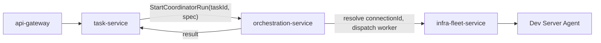
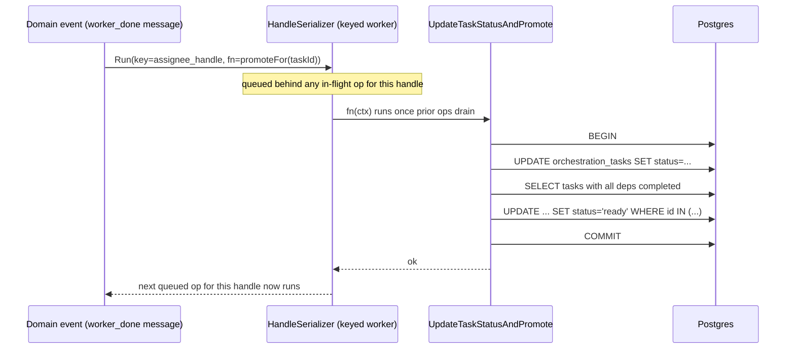

# orchestration-service

Category: AI & Orchestration · ADR-021 schema: `orchestration` · Migration
phase: 2 · Replaces (TS): `PgOrchestrationDb`,
`runtime/orchestration/{coordinator.ts, db.ts, pg-db.ts,
lifecycle-reconciliation.ts, keyed-async-queue.ts}`.

## 1. Overview & responsibility

`orchestration-service` is the system of record for the multi-agent
coordination "complex path" pipeline: **Source → Plan → Execute**
(`docs/guides/task-automation/task-automation-orchestration-integration.md §9.2/§9.4.2/§9.4.4`).
It owns `messages`, `dispatch_contexts`, `decision_gates`,
`coordinator_runs`, and `orchestration_tasks` (its own DAG-node table, the
Go/Postgres equivalent of TS's `TaskRow`), per
[`02-microservices-decomposition.md`](../architecture/02-microservices-decomposition.md)
and [`business-capabilities.md`](../../backend/api/business-capabilities.md)'s
"Agent-team orchestration" capability.

It expands one `task-service` "complex path" task into a DAG of sub-tasks,
dispatches ready sub-tasks to terminal-hosted AI-agent workers via a
mailbox, tracks dispatch liveness/failure (with circuit-breaking), resolves
human decision checkpoints, promotes dependents as dependencies complete,
and reports the aggregate result back to `task-service`. It does not own
kanban DAG/grant/comment bookkeeping (`task-service`), does not execute
AI-CLI processes itself (the Dev Server Agent, via `infra-fleet-service`),
and does not decide decomposition strategy (`task-service`'s AI-decomposition
concern).

## 2. Bounded context

### 2.1 Distinct id space from `task-service`

TS's own comment on this seam: `OrcaTask.id` and `TaskRow.id` are
"different id spaces in different SQLite databases" — no SQL FK, only a
logical link via `orca_tasks.active_execution_task_id`. Preserved
deliberately:

- `task-service` owns `tasks.id` — the user-visible kanban id space.
- `orchestration-service` owns `orchestration_tasks.id` — the coordinator's
  internal DAG-node id space, minted fresh per complex-path expansion.
- The two link only via opaque-string logical FKs (`task-service` stores
  this service's `coordinator_run_id`; this service's DAG root stores the
  originating `task-service` task id). Neither enforces a cross-database
  SQL FK, per database-per-service. **Do not merge these id spaces** — the
  name collision is coincidental, not structural.

### 2.2 Why not fold into `task-service`

Both are "task-shaped," but differ in consistency/latency profile:

| | `task-service` | `orchestration-service` |
|---|---|---|
| Concern | DAG/grant/comment bookkeeping, user-visible | Real-time multi-agent dispatch coordination |
| Write pattern | User-driven, bursty | Agent-driven state-machine ticks, continuous during a run |
| Consistency | Eventually-consistent edges tolerable | Promotion/gate-resolution must be atomic (§8) — a torn promote can double-dispatch or stall |
| Latency | UI-interactive (100s of ms fine) | Dispatch-loop-interactive — a slow gate/promote blocks a running worker |

`task-service` calls in to *start* a run and *read* its terminal result; it
never touches this service's tables directly.



## 3. API surface (gRPC service sketch)

```protobuf
service OrchestrationService {
  rpc StartCoordinatorRun(StartCoordinatorRunRequest) returns (CoordinatorRun);
  rpc GetCoordinatorRun(GetCoordinatorRunRequest) returns (CoordinatorRun);
  rpc CompleteCoordinatorRun(CompleteCoordinatorRunRequest) returns (CoordinatorRun);
  rpc FailCoordinatorRun(FailCoordinatorRunRequest) returns (CoordinatorRun);

  rpc CreateDispatchContext(CreateDispatchContextRequest) returns (DispatchContext);  // atomic, §8
  rpc RecordHeartbeat(RecordHeartbeatRequest) returns (DispatchContext);
  rpc FailDispatch(FailDispatchRequest) returns (DispatchContext);                    // atomic, §8

  rpc CreateDecisionGate(CreateDecisionGateRequest) returns (DecisionGate);           // atomic, §8
  rpc ResolveDecisionGate(ResolveDecisionGateRequest) returns (DecisionGate);         // atomic, §8
  rpc ListPendingDecisionGates(ListPendingDecisionGatesRequest) returns (ListPendingDecisionGatesResponse);

  // Collapses TS's updateTaskStatus -> promoteReadyTasks into one RPC so the
  // atomicity requirement is structural, not a convention callers must remember.
  rpc UpdateTaskStatusAndPromote(UpdateTaskStatusAndPromoteRequest) returns (UpdateTaskStatusAndPromoteResponse);

  rpc PostMessage(PostMessageRequest) returns (Message);
  rpc ListMessages(ListMessagesRequest) returns (ListMessagesResponse);
  rpc MarkMessageRead(MarkMessageReadRequest) returns (google.protobuf.Empty);

  // Terminal-pane "what's running next to me" read — known gap, §10.
  rpc GetAgentStatusForHandle(GetAgentStatusForHandleRequest) returns (GetAgentStatusForHandleResponse);
}
```

## 4. Domain model

- **`OrchestrationTask`** — Go/Postgres equivalent of TS's `TaskRow`, not
  named `Task` to avoid conflation with `task-service`'s entity (same
  discipline `project-service` applied to `SourceProject` vs. TS's
  overloaded "OrcaProject"). Fields: id, `coordinator_run_id`, `parent_id`,
  `origin_task_id` (logical FK → `task-service.Task.id`, root row only),
  title/spec, status (`pending|ready|dispatched|completed|failed|blocked`),
  `deps` (sibling ids, drives promotion), `result`. Invariant: `deps` may
  only reference ids within the same `coordinator_run_id`.
- **`DispatchContext`** — id, `orchestration_task_id`, `assignee_handle`,
  status (`pending|dispatched|completed|failed|circuit_broken`),
  `failure_count`, `last_heartbeat_at`. Invariant: `failure_count >= 3`
  forces `circuit_broken`, blocking dispatch without manual reset.
- **`DecisionGate`** — id, `orchestration_task_id`, `question`, `options`,
  status (`pending|resolved|timeout`), `resolution`. Invariant: a task with
  an unresolved gate cannot reach `dispatched`/`completed`.
- **`CoordinatorRun`** — id, `origin_task_id`, `spec`, status
  (`idle|running|completed|failed`), `coordinator_handle`,
  `poll_interval_ms`. One row per top-level session; the DAG root and every
  descendant share its id.
- **`Message`** — `sequence` (autoincrement PK, preserves TS's mailbox
  replay ordering), `from_handle`/`to_handle`, `subject`, `body`, type
  (`status|dispatch|worker_done|merge_ready|escalation|handoff|decision_gate|heartbeat`),
  `thread_id`, `payload`, `read`.

## 5. Data model (Postgres, schema `orchestration`)

```sql
CREATE TABLE coordinator_runs (
  id UUID PRIMARY KEY DEFAULT gen_random_uuid(), tenant_id UUID NOT NULL,
  origin_task_id TEXT NOT NULL,  -- logical FK -> task-service.tasks.id (different id space, §2.1)
  spec JSONB NOT NULL,
  status TEXT NOT NULL DEFAULT 'idle' CHECK (status IN ('idle','running','completed','failed')),
  coordinator_handle TEXT NOT NULL, poll_interval_ms INT NOT NULL DEFAULT 2000,
  created_at TIMESTAMPTZ NOT NULL DEFAULT now(), completed_at TIMESTAMPTZ
);

CREATE TABLE orchestration_tasks (
  id UUID PRIMARY KEY DEFAULT gen_random_uuid(), tenant_id UUID NOT NULL,
  coordinator_run_id UUID NOT NULL REFERENCES coordinator_runs (id) ON DELETE CASCADE,
  parent_id UUID REFERENCES orchestration_tasks (id),
  origin_task_id TEXT,  -- root row only; logical FK -> task-service.tasks.id
  task_title TEXT NOT NULL, spec JSONB NOT NULL,
  status TEXT NOT NULL DEFAULT 'pending'
    CHECK (status IN ('pending','ready','dispatched','completed','failed','blocked')),
  deps JSONB NOT NULL DEFAULT '[]',  -- sibling ids, same coordinator_run_id only
  result JSONB, created_at TIMESTAMPTZ NOT NULL DEFAULT now(), completed_at TIMESTAMPTZ
);
CREATE INDEX idx_otasks_run_status ON orchestration_tasks (coordinator_run_id, status);

CREATE TABLE dispatch_contexts (
  id UUID PRIMARY KEY DEFAULT gen_random_uuid(), tenant_id UUID NOT NULL,
  orchestration_task_id UUID NOT NULL REFERENCES orchestration_tasks (id) ON DELETE CASCADE,
  assignee_handle TEXT NOT NULL,
  status TEXT NOT NULL DEFAULT 'pending'
    CHECK (status IN ('pending','dispatched','completed','failed','circuit_broken')),
  failure_count INT NOT NULL DEFAULT 0, last_failure TEXT,
  dispatched_at TIMESTAMPTZ, completed_at TIMESTAMPTZ, last_heartbeat_at TIMESTAMPTZ
);
CREATE INDEX idx_dispatch_task ON dispatch_contexts (orchestration_task_id);

CREATE TABLE decision_gates (
  id UUID PRIMARY KEY DEFAULT gen_random_uuid(), tenant_id UUID NOT NULL,
  orchestration_task_id UUID NOT NULL REFERENCES orchestration_tasks (id) ON DELETE CASCADE,
  question TEXT NOT NULL, options JSONB NOT NULL DEFAULT '[]',
  status TEXT NOT NULL DEFAULT 'pending' CHECK (status IN ('pending','resolved','timeout')),
  resolution TEXT, resolved_at TIMESTAMPTZ, created_at TIMESTAMPTZ NOT NULL DEFAULT now()
);
CREATE INDEX idx_gates_pending ON decision_gates (tenant_id, status) WHERE status = 'pending';

CREATE TABLE messages (
  sequence BIGSERIAL PRIMARY KEY,  -- preserves TS's replay-order guarantee
  tenant_id UUID NOT NULL, from_handle TEXT NOT NULL, to_handle TEXT NOT NULL,
  subject TEXT, body TEXT,
  type TEXT NOT NULL CHECK (type IN
    ('status','dispatch','worker_done','merge_ready','escalation','handoff','decision_gate','heartbeat')),
  thread_id TEXT, payload JSONB, read BOOLEAN NOT NULL DEFAULT false,
  delivered_at TIMESTAMPTZ, created_at TIMESTAMPTZ NOT NULL DEFAULT now()
);
CREATE INDEX idx_messages_to_handle ON messages (tenant_id, to_handle, read);
```

RLS is enabled on every table (`tenant_id`-scoped), consistent with every
other service's posture per
[`05-data-architecture.md`](../architecture/05-data-architecture.md).

## 6. Package layout — the `KeyedAsyncQueue` equivalent

TS's `KeyedAsyncQueue` serializes operations by a `handle` key to close a
real race: a synchronous domain-event handler firing an async fire-and-forget
DB call could otherwise interleave with another write on the same handle.
Carried forward explicitly:

```
internal/
├── domain/        # OrchestrationTask, DispatchContext, DecisionGate, CoordinatorRun, Message
├── usecase/
│   ├── update_task_status_and_promote.go   # the atomic promote saga, §8
│   ├── create_dispatch_context.go, create_decision_gate.go, resolve_decision_gate.go, fail_dispatch.go
│   └── ports.go   # OrchestrationRepository (txn-capable), EventPublisher,
│                  # HandleSerializer{ Run(ctx, key string, fn func(ctx) error) error }
├── adapter/
│   ├── grpc/         # OrchestrationService server impl
│   ├── postgres/     # sqlc repos + txn boundary helper (pool.WithTransaction equivalent)
│   ├── keyedqueue/   # HandleSerializer impl — the KeyedAsyncQueue port, worker-per-key
│   └── eventbus/     # outbox: orchestration.gate.resolved, orchestration.run.completed, ...
```

`HandleSerializer` is defined in `usecase/ports.go`; a usecase needing
handle-serialized execution (dispatch creation, heartbeat, gate resolution)
calls `Run(handle, fn)` and only sees the interface. `adapter/keyedqueue/`
implements it as a worker-per-key goroutine pool (`sync.Map` of `handle` →
buffered job channel + draining goroutine, spun up lazily, torn down after
an idle timeout) — chosen over a plain `map[string]*sync.Mutex` because a
mutex only guarantees exclusion, not ordering: two goroutines racing for
lock acquisition can still commit out of order. A worker-per-key channel
enforces strict FIFO per key, matching TS's queue semantics. Unit tests
substitute a synchronous fake (`Run` calls `fn` immediately) — no
goroutines needed to test business logic.



## 7. Dependencies

**Calls:** `infra-fleet-service` (resolve `connectionId` for
`assignee_handle`, reaching the Dev Server Agent for worker dispatch — sync
gRPC per dispatch); `task-service` (report run completion/failure back to
`origin_task_id` — sync gRPC on terminal state).

**Called by:** `task-service` (`StartCoordinatorRun` — the only entry
point into this DAG); `api-gateway` (read-only mailbox/gate/run-status
surfaces for the UI).

`orchestration-service` never resolves `task-service`'s own DAG — matching
[`02-microservices-decomposition.md`](../architecture/02-microservices-decomposition.md)'s
one-directional `orch --> task` arrow.

## 8. Non-functional requirements

Correctness under concurrent access is this service's primary quality bar
— writes are driven by concurrent agent-worker activity, not single-user
UI interaction. Each row below is a **hard NFR**, mirroring a TS chain
wrapped in `pool.withTransaction()`, with an explicit Go transaction
boundary in the named usecase:

| Chain | Usecase | Why atomic |
|---|---|---|
| `updateTaskStatus` → `promoteReadyTasks` | `UpdateTaskStatusAndPromote` | A torn read between marking complete and re-scanning dependents can double-dispatch a task or leave a ready task stuck `pending` |
| `createDispatchContext` | `CreateDispatchContext` | Dispatch row and `dispatched` transition must commit together — an orphaned pairing breaks the heartbeat/liveness check, which assumes lockstep |
| `createGate` | `CreateDecisionGate` | Gate creation and the task's `blocked` transition must commit together, or the task can be dispatched past a checkpoint meant to stop it |
| `resolveGate` | `ResolveDecisionGate` | Resolution, unblock, and the promotion pass must commit together, or an unblocked task can be left stuck |
| `failDispatch` | `FailDispatch` | `failure_count` increment, possible circuit-break, and task-status transition must commit together, or the task can look dispatchable despite a tripped breaker |

Each usecase wraps its body in one Postgres transaction, and is
additionally routed through the `HandleSerializer` (§6) keyed by the
triggering `assignee_handle`/`coordinator_handle` where the caller is a
synchronous domain-event handler that would otherwise fire an async DB
call outside its own control flow. The transaction guarantees atomicity of
the writes; the serializer guarantees ordering across concurrent attempts
for the same handle — both are required, neither substitutes for the other.

Additional NFRs: `PostMessage`/`RecordHeartbeat`/`ListMessages` sit in the
coordinator's tight poll loop — p99 < 30ms, no cross-service calls on that
path. This service's own tables must stay writable even when
`infra-fleet-service`/the execution plane is unreachable — an unreachable
dispatch target is recorded via `FailDispatch`, not left unresolved.
Throughput target: one active `coordinator_run` per project on average,
bursting to several per tenant; the keyed-worker pool scales with distinct
handles in flight, not total message volume.

## 9. Security notes

Standard tenant isolation, nothing unusual beyond the rest of the system:
every table is `tenant_id`-scoped with RLS as backstop and application-layer
scoping as primary enforcement, per
[`05-data-architecture.md`](../architecture/05-data-architecture.md).
`ResolveDecisionGate` requires the caller to be a member of the project
owning the originating `task-service` task, enforced via in-process OPA
policy. No secret material passes through this service — `spec`/`payload`
JSONB may carry task-authoring content but never credentials; credential
resolution for the agent-worker process happens downstream of
`infra-fleet-service`/the Dev Server Agent.

## 10. Migration notes

- **Phase 2**, alongside `task-service`, after project/infra identity
  groundwork — `StartCoordinatorRun` requires `task-service`; the dispatch
  path requires `infra-fleet-service`.
- **Not a fresh migration of already-migrated data — a database split.**
  Per ADR-021 Phase 2, TS already moved `OrchestrationDb` off standalone
  SQLite into an `orchestration` schema inside the shared TS Postgres
  instance. This Go service is a fresh implementation of the same domain
  (new code, explicit atomicity/serialization per §6/§8) — but the
  underlying rows still need copying, from that TS `orchestration` schema
  into this service's own dedicated database (schema-per-service →
  database-per-service, per
  [`02-microservices-decomposition.md`](../architecture/02-microservices-decomposition.md)
  principle 2). Column mapping is close to 1:1; TS's `tasks` table renames
  to `orchestration_tasks` here only to avoid the naming collision with
  `task-service.tasks`, not because the row shape changes.
- **Backfill**: dump-and-load per table, preserving primary keys
  (`messages.sequence` must stay monotonic — restart the Postgres sequence
  at `MAX(sequence) + 1` post-load, not reset to 1), followed by a
  per-table row-count reconciliation before cutover.
- **Flagged gap — `GetAgentStatusForHandle`** (TS:
  `getAgentStatusOrchestrationContextForHandle`): in TS server mode this
  returns a fixed `undefined` because its sync-call chain
  (`syncWindowGraph()`) was never reviewed for safe async cascading.
  Effect is narrow — it only loses "which task is running next to this
  terminal" in the UI, not dispatch/promotion/gate correctness, which don't
  depend on this read. This is a **known limitation carried forward,
  flagged as a decision point, not silently dropped**: before shipping this
  RPC, either (a) implement it properly against
  `orchestration_tasks`/`dispatch_contexts` — the original TS blocker (an
  unreviewed sync/async cascade) does not obviously apply to a stateless Go
  gRPC read — or (b) consciously carry the limitation forward (explicit
  "not implemented" response, documented reason) for a defined follow-up
  phase. Record whichever choice is made in this service's implementation
  tracking.
