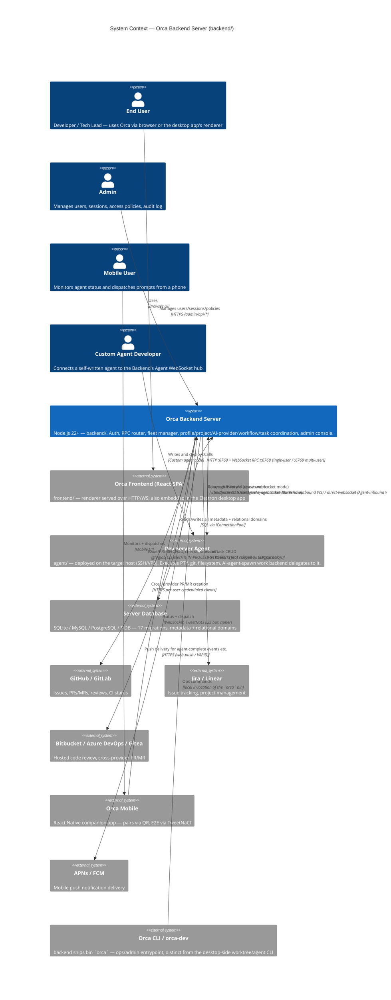
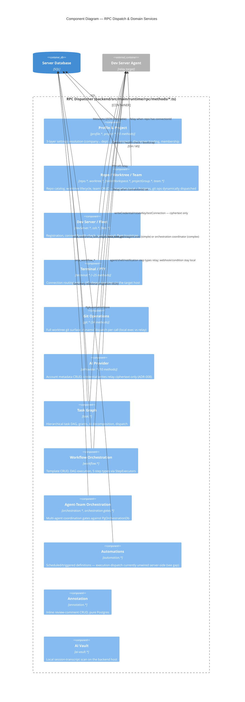
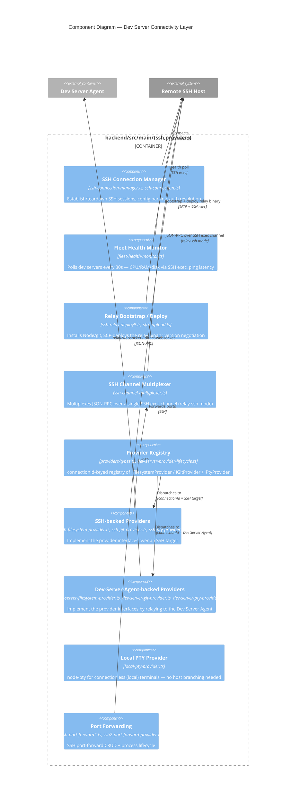

# Backend HLD — C4 Model

**Model:** C4 Architecture (Simon Brown) — Context, Container, Component
**Scope:** `backend/` only — the Orca Backend Server package (per
`backend/package.json`: *"Orca Backend Server (Node/Web mode, isolated copy,
split from monorepo)"*). This is **not** a whole-system HLD — `agent/`
(Dev Server Agent), `desktop/` (Electron shell), `frontend/` (shared React
renderer), and `mobile/` are separate packages with their own lifecycle,
covered only here as external containers/systems `backend/` talks to.
**Updated:** 2026-08-17
**Primary source:** `docs/hld/backend-server-architecture.md` (code-verified
against `backend/src/**` as of commit `72ace6187`, 2026-08-14 audit pass) —
this document re-organizes that source's findings into C4 levels rather than
re-deriving them; treat that file as the fact source for wire-level detail
(exact ports, header formats, migration numbers) and re-verify file:line
citations before relying on either for an implementation decision, per that
document's own convention.

## How this differs from `docs/hld/v1/`

`docs/hld/v1/C1-C4` models the **pre-split monorepo** (paths like
`src/main/`, `src/relay/`) and blends in an unimplemented "v6.0 Proposed"
vision (`ADR-017/018/019`) alongside the real system. This document:

- Scopes to the **post-split `backend/` package only** (paths are
  `backend/src/main/…`, `backend/src/server/…`, `backend/src/platform/…`).
- Describes **only what's implemented today** — no proposed/aspirational
  layers. Where the codebase's own stated target differs from current
  behavior (see [`backend-agent-target-architecture.md`](./backend-agent-target-architecture.md)),
  it's called out as a gap, not drawn as if already built.

---

## C1 — System Context

`backend/` is the **coordination/control-plane** system: it authenticates
users, holds metadata in a relational database, and routes work either to
itself (pure metadata/API operations) or out to a Dev Server Agent that
performs the actual filesystem/git/terminal/AI-agent execution on a target
host. See [`backend-agent-target-architecture.md`](./backend-agent-target-architecture.md)
for the precise coordination-vs-execution split, including where the real
code doesn't yet match that split (GitHub/GitLab being the largest gap).

### Actors

| Actor | Interacts via | Notes |
|-------|---------------|-------|
| End User | `frontend` SPA → backend HTTP/WS | Same renderer code serves browser (web mode) and Electron desktop — desktop mode itself does **not** route through `backend/`, it's a separate deployment (`desktop/` package) |
| Admin | `/admin/api/*`, `requireAdmin`-gated | RBAC here is not a single unified policy table — see [Cross-Cutting Concerns](#cross-cutting-concerns) |
| Mobile User | Orca Mobile app | Pairs via QR (`PairingOfferSchema`: `{v, endpoint, deviceToken, publicKeyB64, scope?}`), then E2E WebSocket |
| Custom Agent Developer | Agent WebSocket hub (`direct-websocket` mode) | Same wire contract any Dev Server Agent uses — not a distinct protocol |

### External systems

| System | Relationship to `backend/` | Protocol |
|--------|----------------------------|----------|
| Dev Server Agent (`agent/`) | The execution side of the coordination/execution split — 3 connection modes (§ [C2](#c2--container)) | SSH exec / outbound WS / inbound WS, all carrying a 13-byte-framed JSON-RPC wire protocol |
| Server Database | Sole persistence layer for backend | SQL, dialect-abstracted (`IConnectionPool`) |
| GitHub / GitLab | **Currently backend self-executes** `gh`/`glab` CLI in-process, shared OS keychain — not per-user isolated, not relayed. Flagged as a target-architecture gap (Gap 1) | CLI `execFile` |
| Jira / Linear | Direct HTTPS calls, per-user encrypted credentials — matches target architecture already | REST / GraphQL |
| Bitbucket / Azure DevOps / Gitea | Per-user HTTP clients, `WebCredentialStore`-backed | HTTPS |
| Orca Mobile | Companion app; backend is its only server dependency | WebSocket, TweetNaCl box cipher |
| APNs / FCM | Push delivery only, `PgWebPushStore`-backed, distinct mechanism from WS fan-out | HTTPS |

---

## C2 — Container

Containers below are process/module boundaries **within** `backend/`'s
runtime, plus the peer systems it talks to. Two deployment shapes exist for
the same codebase (`docs/hld/backend-server-architecture.md` §1) — this
document covers the **Web Server mode** entry point
(`backend/src/server/index.ts`); the Electron Desktop entry point lives in
`desktop/`, outside this package's scope.

```mermaid
C4Container
  title Container Diagram — Orca Backend Server (backend/)

  Person(user, "User / Admin", "Browser or Admin SPA")

  Container_Boundary(backend_proc, "Orca Backend Server process (backend/src/server/index.ts)") {
    Container(http, "HTTP Server", "Express 5 :6769", "POST /auth/local, GET /admin/api/*, /health/ready, /health/metrics, static SPA shell")
    Container(ws_rpc, "WebSocket RPC Server", "ws :6768 (single-user) / :6769 via WsSessionRouter (multi-user, ORCA_MULTI_USER=1)", "Browser JSON-RPC 2.0 over WS text frames")
    Container(agent_ws, "Agent WebSocket Server", "ws, attached to httpPort :6769/agent", "direct-websocket mode: Dev Server Agent connects inbound, agentToken handshake (SHA-256 hashed at rest)")
    Container(auth, "Auth Layer", "AuthManager / bcrypt 12r", "Session cookie orca_session, sameSite=strict, secure only in NODE_ENV=production")
    Container(session_mgr, "Session Manager", "fork(), multi-user only", "getOrSpawnUserProcess() — per-user Node child, Unix socket ~/.orca/users/<userId>/orca.sock, heap-limited, idle-timeout + max-3 auto-respawn")
    Container(dispatcher, "RPC Dispatcher", "backend/src/main/runtime/rpc/*", "Routes ~60 method namespaces (profile.*, project.*, git.*, workflow.*, task.* …) to domain services")
    Container(domain_svcs, "Domain Services", "TypeScript, in-process", "Profile/Project, AI Provider, Workflow, Task Graph, Team, Automations, Orchestration Coordinator — see C3")
    Container(scm_integration, "Source-Control & PM Integration", "backend/src/main/{git,github,gitlab,jira,linear,hosted-review}", "git.* dynamic dispatch + direct external-API clients (see C3)")
    Container(dev_server_conn, "Dev Server Connectivity Layer", "backend/src/main/{ssh,providers}", "SSH connection mgmt, fleet health, provider registry (IFilesystemProvider/IGitProvider/IPtyProvider), 3-mode relay dispatch")
    Container(cred_store, "Credential Store", "WebCredentialStore, AES-256-GCM files", "Per-user encrypted tokens: Bitbucket/Azure DevOps/Gitea/Linear/Jira — NOT GitHub/GitLab (OS keychain instead)")
    Container(db_layer, "Multi-DB Access Layer", "IConnectionPool + MigrationRunner", "SQLite / MySQL / PostgreSQL / TiDB adapters, migrations 0001–0017")
    Container(platform, "Platform Abstraction", "IPlatformServices → NodeAdapter", "~/.orca app data root, no-op window manager, NodeSecureStorage")
    Container(admin_router, "Admin Router", "backend/src/main/admin", "Users CRUD, session force-revoke, access-policy CRUD, audit log query, first-run setup")
    Container(notif, "Notification / Push", "backend/src/main/notifications", "WS event fan-out + WebPushManager/PgWebPushStore (VAPID)")
  }

  Container_Ext(frontend, "Orca Frontend (SPA)", "React 19 / Vite", "Browser client")
  Container_Ext(devagent, "Dev Server Agent", "Node.js (agent/)", "Executes relayed work on the target host")
  ContainerDb(server_db, "Server Database", "SQLite/MySQL/PostgreSQL/TiDB", "orca_users, orca_sessions, orca_v5_projects, orca_ai_provider_accounts, orca_workflow_*, orca_tasks, PgOrchestrationDb, PgAutomationStore, PgWebPushStore …")
  System_Ext(scm_ext, "GitHub / GitLab / Jira / Linear / Bitbucket / Azure DevOps / Gitea", "External APIs")
  System_Ext(push_ext, "APNs / FCM", "Push infrastructure")

  Rel(user, http, "Login, admin ops", "HTTPS")
  Rel(frontend, ws_rpc, "RPC calls", "JSON-RPC 2.0 / WS")
  Rel(devagent, agent_ws, "Inbound connect (direct-websocket mode)", "WS + agentToken")
  Rel(ws_rpc, auth, "Validates session on upgrade", "")
  Rel(ws_rpc, session_mgr, "Routes to per-user process (multi-user)", "Unix socket")
  Rel(http, auth, "Authenticates", "bcrypt + cookie")
  Rel(http, admin_router, "Admin REST", "requireAdmin guard")
  Rel(session_mgr, dispatcher, "Forwards RPC calls", "IPC / in-process")
  Rel(dispatcher, domain_svcs, "Routes by method namespace", "")
  Rel(dispatcher, scm_integration, "git.*/github.*/gitlab.*/jira.*/linear.*", "")
  Rel(domain_svcs, dev_server_conn, "Delegates worktree-owning-host work", "connectionId-keyed dispatch")
  Rel(scm_integration, dev_server_conn, "git.* dynamic dispatch when worktree has a connectionId", "")
  Rel(dev_server_conn, devagent, "relay-ssh / relay-websocket / direct-websocket", "13-byte-framed JSON-RPC")
  Rel(scm_integration, scm_ext, "gh/glab CLI execFile (GitHub/GitLab) or direct HTTPS (Jira/Linear/Bitbucket/Azure/Gitea)", "")
  Rel(scm_integration, cred_store, "Reads per-user tokens (not GitHub/GitLab)", "")
  Rel(domain_svcs, db_layer, "Persists metadata + relational state", "SQL")
  Rel(auth, db_layer, "Users/sessions/audit", "SQL")
  Rel(admin_router, db_layer, "CRUD", "SQL")
  Rel(db_layer, server_db, "Executes queries", "IConnectionPool")
  Rel(platform, http, "App data root, secure storage", "")
  Rel(notif, push_ext, "Push delivery", "HTTPS VAPID")
  Rel(domain_svcs, notif, "Emits events (agent-task-complete, etc.)", "")
```

### Container catalog

| Container | Tech | Responsibility | Source |
|-----------|------|-----------------|--------|
| HTTP Server | Express 5, `:6769` | Auth routes, admin REST, health checks, SPA static serving | `backend/src/server/http-server.ts`, `index.ts` |
| WebSocket RPC Server | `ws`, `:6768`/`:6769` | Browser-facing JSON-RPC 2.0 transport | `backend/src/main/runtime/rpc/{ws-transport,dispatcher}.ts` |
| Agent WebSocket Server | `ws`, attached to httpPort `:6769/agent` | Inbound Dev Server Agent connections (`direct-websocket` mode) | `backend/src/main/dev-server/agent-ws-server.ts` |
| Auth Layer | `bcrypt`, cookie session | Login, session issuance/revocation, audit log | `backend/src/main/auth/` |
| Session Manager | `fork()`, Unix sockets | Per-user process isolation in multi-user mode | `backend/src/main/session/{session-manager,ws-session-router}.ts` |
| RPC Dispatcher | TypeScript | Method-namespace routing, ~60 namespace files | `backend/src/main/runtime/rpc/methods/*.ts` |
| Domain Services | TypeScript, in-process | See [C3](#c3--component) | `backend/src/main/{profile,project,ai-providers*,workflow,task,team,automations,runtime/orchestration}` |
| Source-Control & PM Integration | TypeScript | `git.*` dynamic dispatch, GitHub/GitLab CLI, Jira/Linear/Bitbucket/Azure/Gitea HTTP clients | `backend/src/main/{git,github,gitlab,jira,linear,bitbucket,azure-devops,gitea,hermes}` |
| Dev Server Connectivity Layer | `ssh2`, TypeScript | SSH connection mgmt, fleet health polling, provider registry, relay dispatch | `backend/src/main/{ssh,providers}` |
| Credential Store | AES-256-GCM files | Per-user encrypted external-service tokens | `backend/src/main/credentials/` |
| Multi-DB Access Layer | `pg`, `mysql2`, `better-sqlite3` | Dialect-abstracted persistence, migration runner | `backend/src/main/db/` |
| Platform Abstraction | `IPlatformServices` → `NodeAdapter` | App-data root (`~/.orca`), secure storage, no-op window manager | `backend/src/platform/` — note: the interface's own comment names an `ElectronAdapter` counterpart that doesn't exist; only `NodeAdapter` is real (see [Cross-Cutting Concerns](#cross-cutting-concerns)) |
| Admin Router | Express sub-router | Users/sessions/policies/audit-log CRUD | `backend/src/main/admin/` |
| Notification / Push | `web-push`, WS fan-out | In-app events + mobile push delivery | `backend/src/main/notifications/` |

**Connection modes to the Dev Server Agent** (all 3 share a 13-byte
TYPE/SEQ/ACK/LEN frame header):

1. **`relay-ssh`** — `ssh2` exec channel → `SshChannelMultiplexer` → JSON-RPC.
2. **`relay-websocket`** — Backend connects outbound to
   `ws://agent:PORT/<config.wsUrl>` with `Authorization: Bearer <agentToken>`;
   exponential-backoff reconnect (2s→60s, jitter).
3. **`direct-websocket`** — Agent connects inbound to `wss://backend:6769/agent`;
   handshake `{agentToken}` → `{sessionId}`; no Backend-side reconnect (relies
   on the agent's own reconnect, typically via systemd).

---

## C3 — Component

### 3.1 RPC Dispatch & Domain Services

### 3.2 Dev Server Connectivity Layer

### Component summary

| Domain (business-capability grouping) | Key components | Storage | Detail |
|----------------------------------------|-----------------|---------|--------|
| Identity & access | Auth, Admin console, Profile hierarchy, Team | Postgres (`orca_users`, `orca_companies`, …) | [`business-capabilities.md`](./business-capabilities.md#identity--access) |
| Project & workspace coordination | Project mgmt, Repo/worktree lifecycle, Dev server/fleet, Terminal/PTY coordination | Postgres (mostly one JSON blob) | [`business-capabilities.md`](./business-capabilities.md#project--workspace-coordination) |
| Source control | Git ops, GitHub/GitLab, Hosted review, Jira/Linear, Annotation | Mostly no Postgres — GitHub/GitLab self-executed CLI is the flagged gap | [`business-capabilities.md`](./business-capabilities.md#source-control) |
| AI capability | AI provider accounts, Task graph, Workflow orchestration, Agent-team orchestration, AI vault | Postgres (metadata) + `PgOrchestrationDb` (genuinely relational) | [`business-capabilities.md`](./business-capabilities.md#ai-capability) |
| Automation & scheduling | Automations | `PgAutomationStore` — execution dispatch unwired server-side | [`business-capabilities.md`](./business-capabilities.md#automation--scheduling) |
| Cross-cutting | Credentials, Notifications, Browser/computer/emulator automation, Workspace port scanning, Client state sync, Diagnostics, Skills | Mixed — see source | [`business-capabilities.md`](./business-capabilities.md#cross-cutting--infrastructure-adjacent) |

---

## Cross-cutting concerns

- **Coordination-vs-execution dispatch pattern** — the reference
  implementation is `git.*`/`files.*`/`worktree.*`: an RPC handler resolves
  the worktree's owning host (`connectionId` or none), executes locally for
  the no-connection case, and relays through a typed provider interface
  (§3.2) otherwise. Every new domain touching a dev server should follow this
  shape rather than invent a fourth relay mechanism. See
  [`backend-agent-target-architecture.md`](./backend-agent-target-architecture.md).
- **RBAC is fragmented, not a single policy table.** Two independent
  mechanisms coexist: `resolveUserPermissions()` (fleet/server-level) and
  `TaskGrantService.resolvePermission()` (task-graph BFS ancestor
  resolution). `requireAdmin`/`requireOwnerOrAdmin` were previously
  login-only checks (a real security gap) — patched to check `role` via
  `AuthUserStore.getUser()`; re-verify before treating this as current.
- **Credential handling** — `WebCredentialStore` (AES-256-GCM, per-user
  files) covers Bitbucket/Azure DevOps/Gitea/Linear/Jira. GitHub/GitLab
  deliberately don't go through it — they use the `gh`/`glab` CLI's own OS
  keychain, shared across all users in Web Server multi-user mode (the
  isolation gap referenced above). AI provider credentials relay
  ciphertext-only to the Dev Server Agent per ADR-008, with one documented
  deviation at agent-spawn time (Gap 2 in the target-architecture doc).
- **Platform abstraction is asymmetric.** `IPlatformServices` exists as an
  interface with only one real implementation, `NodeAdapter` (used by
  `backend/`'s Web Server mode). No `ElectronAdapter` exists — `desktop/`
  uses the `electron` SDK directly rather than going through this interface,
  despite the interface's own comments describing both as implementations.
- **Per-user isolation (multi-user mode)** — each user gets its own forked
  Node process (`~/.orca/users/<userId>/orca.sock`, `--max-old-space-size=512`),
  idle-timeout + max-3-respawn. Dev Server connections themselves live in the
  parent process regardless of which user process initiated them; child
  processes reach them via IPC (`GatewayDevServerManagerProxy` forwarding
  provider calls, `devServer:event`/`devServer:proxyNotification` broadcasts
  back).

---

## Data & storage model

With confirmed exceptions (`orca_ai_provider_accounts`, `orca_annotations`,
the v5 project/team/task/workflow tables, `PgOrchestrationDb`,
`PgAutomationStore`, `PgWebPushStore` — all genuinely relational), most
domains persist through **one JSON blob table**,
`core.orca_data_state_blob`, keyed by `(tenant_id, user_id)`, loaded at boot
and persisted on mutation. Full table-by-table detail:
[`business-capabilities.md` § Storage model summary](./business-capabilities.md#storage-model-summary)
and [`docs/hld/backend-server-architecture.md` § 10](../../../docs/hld/backend-server-architecture.md)
(migrations 0001–0017, dialect adapters).

---

## Known architecture deviations

Summarized here for orientation; full detail, sequencing, and fixes live in
[`backend-agent-target-architecture.md`](./backend-agent-target-architecture.md):

1. **GitHub/GitLab self-executes CLI in-process**, shared keychain, no
   per-user isolation — should be direct HTTP API calls (Jira/Linear's
   pattern) instead of relaying to the agent or staying CLI-based.
2. **AI credential spawn path forwards plaintext** to the agent when
   resolving a key at spawn time — should resolve entirely agent-side.
3. **`automation.runNow` has no execution path** server-side — should reuse
   `workflow.*`'s `StepExecutors`, not build a second engine.
4. **`agent.exec` param-shape mismatch** between `StepExecutors` (workflow)
   and the agent's real handler contract — breaks every `agent`-type
   workflow step currently.
5. **Two independently-maintained relay implementations** (`agent/src/relay/`
   and `desktop/src/relay/`) drift out of sync with no CI check.
6. **Browser/computer/emulator automation** automate the backend host itself
   — fits neither "coordination" nor "dev-server execution"; needs a product
   decision for the multi-user deployment.
7. **`workspacePorts.*` silently drops** worktrees with a `connectionId`
   instead of relaying the scan.

---

## Related documents

- [`business-capabilities.md`](./business-capabilities.md) — every business
  capability, domain-by-domain, with dispatch/storage detail this document
  doesn't repeat.
- [`backend-agent-target-architecture.md`](./backend-agent-target-architecture.md) —
  the coordination/execution target model and its 7 concrete gaps.
- [`desktop-only-rpc-parity-gaps.md`](./desktop-only-rpc-parity-gaps.md) —
  RPC methods desktop mode has that `backend/` doesn't yet.
- `docs/hld/backend-server-architecture.md` — the code-verified narrative
  this document's diagrams are structured from.
- `docs/hld/dev-server-architecture.md` — the Dev Server Agent's own HLD
  (execution side of this system's boundary).
- `docs/hld/v1/` — the pre-split, whole-system C1–C4 set; superseded for
  backend-specific detail by this document and by
  `docs/hld/backend-server-architecture.md`.
- [`specs/agent/api/`](../../agent/api/) — the backend↔agent wire-level RPC
  contract this document's Dev Server Connectivity components implement
  against.

## Methodology

Built from: `backend/src/{main,server,platform,shared}` directory structure
(this session), `backend/package.json`, `docs/hld/backend-server-architecture.md`
(2026-08-14 code-verified audit), and this directory's existing
`business-capabilities.md`/`backend-agent-target-architecture.md`. Not a
fresh line-by-line read of every file — component boundaries reflect
directory/module structure, not an exhaustive call-graph trace; re-verify
specific file:line claims against the cited source documents before treating
them as current.
